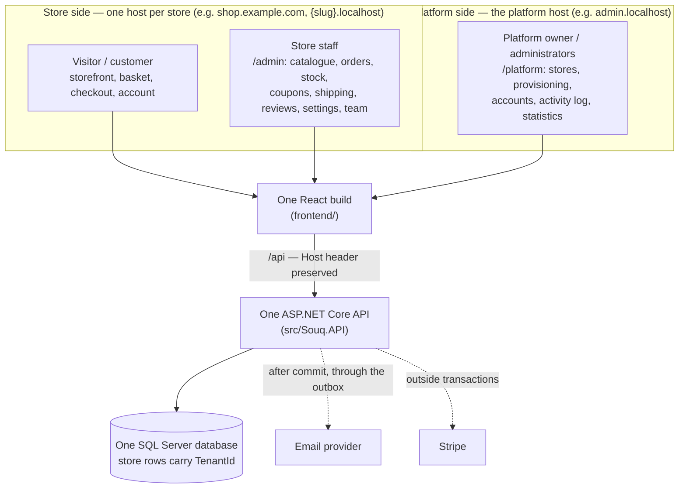
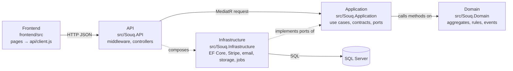
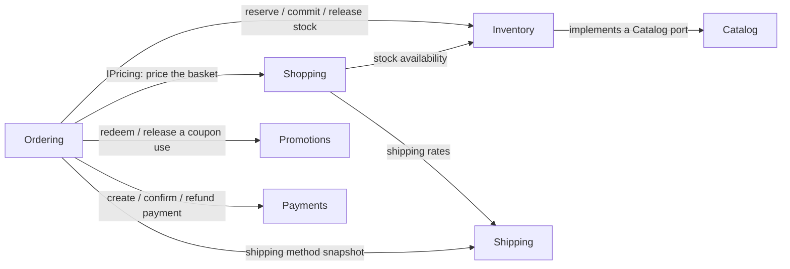
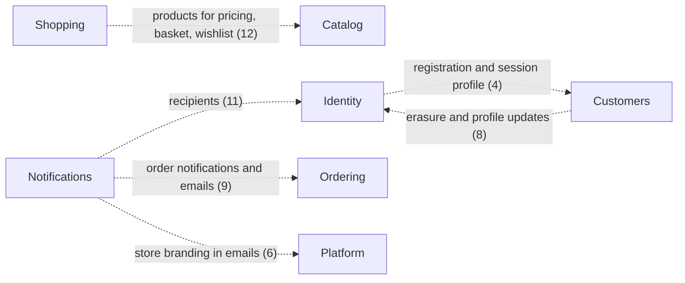

# Project map

> **What this page is:** the whole system on one page. Who reaches it and through which host, how a request crosses the layers, and how the thirteen business modules depend on each other, including the dependencies the target architecture doesn't want.
> **Level:** L0. **Read with:** [SystemOverview.md](SystemOverview.md) (what happens at runtime) and [RepositoryMap.md](RepositoryMap.md) (which folder holds what).
> **Last verified against the code:** 2026-09-17, branch `phase/17-production-hardening`.

## 1. Who uses Souq, and where the boundary is

One deployment serves many stores and one platform. Which side a request is on is decided by its **host name**, on the server, before any business code runs.

**The boundary, in four sentences:**
- A **store host** resolves to exactly one store. Every store query is filtered to it, and a token issued on it works nowhere else.
- The **platform host** has no store. Platform endpoints exist only there, need a `platform.*` permission, and are all audited.
- The platform may create, configure, suspend or archive a store and invite its administrator, but it **cannot act as a store user**.
- A store that isn't active serves only its own configuration and sign-in.

Details: [MultiTenancy.md](../02-ARCHITECTURE/MultiTenancy.md); the store-status gate: `src/Souq.API/Tenancy/TenantAvailability.cs`.

## 2. The layers a request crosses

**Source dependencies point inwards:** API → Infrastructure → Application → Domain, and the Domain references nothing. `tests/Souq.ArchitectureTests/DependencyRuleTests.cs` enforces it. At runtime the call goes the other way through interfaces: a handler calls `IOrderRepository`, and Infrastructure's `OrderRepository` answers.

One request walked through every box: [RequestLifecycle.md](RequestLifecycle.md).

## 3. The thirteen modules

| Module | Owns | Where users meet it |
|---|---|---|
| **Platform** | Stores, domains, settings and branding, module flags, the audit log | Platform console; store settings |
| **Identity** | Accounts, sessions, roles and permissions, invitations | Sign-in, team, platform accounts |
| **Catalog** | Products, variants, categories, translations, media | Storefront; admin catalogue |
| **Inventory** | Stock, reservations, the movement ledger | Admin stock; checkout availability |
| **Customers** | Commerce profiles, addresses, export and erasure | Account area; admin customers |
| **Shopping** | Baskets, the pricing pipeline, wishlists | Cart, wishlist, checkout totals |
| **Ordering** | Orders, numbers, tracking tokens, the status machine | Checkout, my orders, tracking, admin orders |
| **Payments** | Payments, refunds, per-store gateway accounts | Checkout payment; admin payments and refunds |
| **Promotions** | Coupons and their uses | Checkout coupon; admin coupons |
| **Shipping** | Shipping methods and rates | Checkout shipping; admin shipping |
| **Reviews** | Reviews and moderation | Product page; admin reviews |
| **Notifications** | The outbox, in-app notifications, email | Notification bell; emails |
| **Reporting** | Read-only statistics | Store dashboards; platform overview |

The authoritative lists: [Modules.md](../04-MODULES/Modules.md) (ownership and screens) and `tests/Souq.ArchitectureTests/ModuleMap.cs` (which code folder belongs to which module).

## 4. How modules depend on each other: the target and the reality

**The target:** a module reaches another only through the other's `Contracts` folder, along arrows the architecture test allows, with no cycles. These are the allowed contract arrows today (`AllowedContracts` in `tests/Souq.ArchitectureTests/ModuleAndContractRuleTests.cs`):

**Checkout is where modules meet:** Ordering coordinates Shopping (price), Inventory (reserve), Promotions (coupon), Payments (intent) and Shipping (method) in one use case. That is why it is the richest path to study ([FeatureMaps.md](../04-MODULES/FeatureMaps.md)).

**The reality:** the contract rule is enforced inside `Souq.Application/Features`, but use cases also reach Domain types that another module owns: entities and repositories shared through `Souq.Domain`. These **domain crossings** exist today, are counted by a generated ratchet, and a new one fails the build until someone decides it.

At the last verification there were 74 crossings across 15 module pairs. The largest:

- **Current numbers:** the generated [ModuleDomainDependencies.md](../02-ARCHITECTURE/ModuleDomainDependencies.md).
- **Every crossing, classified** (acceptable, to be replaced by a contract, or a real leak): [ModuleBoundaryAudit.md](../02-ARCHITECTURE/ModuleBoundaryAudit.md).

The honest summary: the modules are separated well enough that each has a clear owner and the arrows are known, **not** well enough to extract a module tomorrow without first replacing its crossings with contracts.

**Cross-store reads** are a separate, single exception. The platform's store list, activity log and statistics read across stores through one reviewed class, `src/Souq.Infrastructure/Persistence/Queries/PlatformQueries.cs`, which is the only place `IgnoreQueryFilters` is allowed.

## 5. What runs outside a request

| Background service | What it does | Code |
|---|---|---|
| Outbox dispatcher | Leases due outbox messages and delivers each inside its own store's scope (or the platform's), with bounded retries | `src/Souq.Infrastructure/BackgroundJobs/OutboxDispatcherService.cs` |
| Reservation expiry | Releases stock held by checkouts that were never paid | `src/Souq.Infrastructure/BackgroundJobs/ReservationExpiryService.cs` |
| Basket cleanup | Deletes expired guest and customer baskets | `src/Souq.Infrastructure/BackgroundJobs/BasketCleanupService.cs` |

The two per-store sweeps share `StoreSweepService`, which runs each store's work inside that store's scope.

## 6. Where to go from here

| You want | Read |
|---|---|
| The numbered reading order | [LearningPath.md](LearningPath.md) |
| One request through every layer | [RequestLifecycle.md](RequestLifecycle.md) |
| What must not be broken | [CriticalInvariants.md](CriticalInvariants.md) |
| Why it is built like this | [WhyItIsBuiltThisWay.md](WhyItIsBuiltThisWay.md) |
