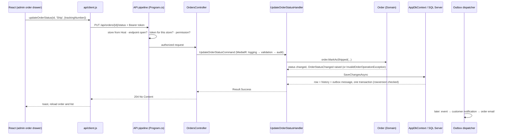

# The life of one request, end to end

> **What this page is:** one real Souq request followed through every layer, from a button in the browser to SQL Server and back to the screen, with the file that implements each step. It teaches the architecture by walking it, not by describing it.
> **Level:** L1. **Read after:** [SystemOverview.md](SystemOverview.md) and [EngineeringMentalModel.md](EngineeringMentalModel.md) §1–§2. **Read next:** [HowToReadTheCode.md](HowToReadTheCode.md), which teaches the method with three more requests.
> **Last verified against the code:** 2026-09-17, branch `phase/17-production-hardening`.

## The request

A member of a store's staff opens an order that has been paid, enters a tracking number and presses **Ship**. The order becomes *Shipped*, the history records who did it, and the customer receives an email.

It is a good first request because it touches every layer without being checkout. It has:
- a permission;
- a store boundary;
- a business rule that can refuse;
- a database write under concurrency control;
- a side effect that must leave the system only after the commit.

## 1. The browser: what the screen may and may not decide

| Step | File | What happens |
|---|---|---|
| The admin opens an order | `frontend/src/pages/admin/Orders.jsx` → `frontend/src/pages/admin/OrderDetailDrawer.jsx` | The drawer loads the order through `api.getOrder`. The buttons it shows come from the order's `AllowedActions`, which the **server** computed from the transition table. The screen doesn't know the rules; it displays the server's answer. |
| Ship is pressed | `frontend/src/pages/admin/ShipOrderDrawer.jsx` | A small form collects the tracking number, carrier and note, then calls `api.updateOrderStatus(order.id, 'Ship', { trackingNumber, shippingCarrier, note })`. |
| The request is sent | `frontend/src/api/client.js` (`updateOrderStatus`, `send`) | `PUT /api/orders/{id}/status` with the access token held **in memory** (never in storage). On a `401` it refreshes the session once through the `HttpOnly` refresh cookie and retries. Any failure becomes an error carrying the server's stable `code`, translated in `frontend/src/api/problem.js`. |

**What the frontend never sends:** a store id. Which store this is gets decided by the server from the host name.

In development, `frontend/vite.config.js` proxies `/api` with the original `Host` header. In production, `frontend/nginx.conf` does the same.

**Don't:** hide a button and treat that as security. A user can call the endpoint directly, and step 2 is what stops them.

## 2. The API pipeline: three decisions before any business code

The middleware order in `src/Souq.API/Program.cs` is deliberate. The steps that matter for this request:

| Order | Component | Decision |
|---|---|---|
| 1 | `CorrelationHeaderMiddleware`, `SecurityHeadersMiddleware` | Every response, including errors, carries a correlation id and the security headers |
| 2 | `TenantResolutionMiddleware` (`src/Souq.API/Tenancy/TenantResolutionMiddleware.cs`) | **Which store?** From the `Host` header only. An unknown host gets `404 StoreNotFound`, and there is no fallback store in production. |
| 3 | `TenantAvailabilityMiddleware` (`src/Souq.API/Tenancy/TenantAvailability.cs`) | **Does this endpoint exist here?** A platform endpoint on a store host answers `404`. A store that isn't active answers `503 StoreUnavailable`. A module the store turned off answers `404 ModuleDisabled`. |
| 4 | Rate limiter, CORS | Per-endpoint policies ([SecurityControls.md](../07-SECURITY/SecurityControls.md)) |
| 5 | Authentication + `AccessTokenValidation` (`src/Souq.API/Security/AccessTokenValidation.cs`) | **Who is calling, and was the token issued for this store?** A token from another store, or a session invalidated by a password change or account disable, gets `401`. |
| 6 | `RequestLoggingMiddleware` | One log line per request, scoped with correlation, store and user |
| 7 | Authorization: `HasPermissionAttribute` (`src/Souq.API/Security/PermissionAuthorization.cs`) | **May this user do it?** The action carries `[HasPermission(Permissions.Orders.Manage)]`. Which roles grant that permission is defined once, in `src/Souq.Application/Common/Security/Permissions.cs`. |

**Why this order:** the store must be known before the token can be checked against it, and the endpoint must be matched (routing) before its availability and rate limit can be read. The full rationale is in the Arabic comments beside each line of `Program.cs`, and in [MultiTenancy.md](../02-ARCHITECTURE/MultiTenancy.md).

**Proven by:** `tests/Souq.IntegrationTests/TenantResolutionTests.cs` and `tests/Souq.IntegrationTests/AuthorizationBoundaryTests.cs`. `tests/Souq.ArchitectureTests/EndpointRuleTests.cs` fails the build if any endpoint lacks an explicit access decision.

## 3. The controller: HTTP translation, nothing else

`src/Souq.API/Controllers/OrdersController.cs`, action `UpdateStatus`:

- binds `UpdateOrderStatusRequest` (the action is a nullable `[Required]` enum, so an empty body is a `400`, not a silent *Ship*: the comment above the record explains the defect this prevents);
- sends one `UpdateOrderStatusCommand` through MediatR;
- maps the result: `204` on success, otherwise the error's status and code (`src/Souq.API/Http/ResultHttpExtensions.cs`).

It holds no rule, no database access and no claims parsing. `tests/Souq.ArchitectureTests/DependencyRuleTests.cs` enforces this.

## 4. The Application layer: orchestration

The MediatR pipeline (`src/Souq.Application/DependencyInjection.cs`) wraps every request in three behaviours, in this order:

1. `UseCaseLoggingBehavior`: timing and slow use-case warnings.
2. `ValidationBehavior`: runs `UpdateOrderStatusValidator` (lengths, a known action). Failures become `400 ValidationFailed` with field errors.
3. `AuditBehavior`: for requests that implement `IAuditable`, stages an audit line inside the same unit of work. This command doesn't: the order's own status history records which staff member changed it. Store-side commands missing from the audit log is recorded debt (TD-12 in [TechnicalDebt.md](../12-ROADMAP/TechnicalDebt.md)).

Then `UpdateOrderStatusHandler` (`src/Souq.Application/Features/Orders/Commands/UpdateOrderStatusCommand.cs`) runs:

1. Load the order through `IOrderRepository.GetWithItemsAsync`. The repository is filtered to this store, so another store's order id finds nothing and answers `404`, never `403`.
2. Identify the staff member (`ICurrentUser`) and wrap them as `OrderActor.Staff`.
3. Call **one domain method**: `order.MarkAsShipped(trackingNumber, carrier, note, by)`.
4. `IUnitOfWork.SaveChangesAsync`.

The handler decides **nothing about whether shipping is allowed**. That is the Domain's job.

**Proven by:** `tests/Souq.Application.Tests/Orders/UpdateOrderStatusHandlerTests.cs`.

## 5. The Domain: the rule lives with the state

`src/Souq.Domain/Entities/Order.cs`:

- `MarkAsShipped` calls the private `MoveTo`, which asks `OrderTransitions.CanMove(from, to, actor)` (`src/Souq.Domain/Entities/OrderTransitions.cs`). The table allows *Paid → Shipped*, but not *Pending → Shipped*, and a customer may never ship.
- A refused move throws `InvalidOrderOperationException` **before anything changes**. `GlobalExceptionHandler` (`src/Souq.API/Middleware/GlobalExceptionHandler.cs`) turns any `DomainException` into `422` with the exception's stable code.
- An allowed move sets the status, appends a history line naming the actor, and raises the domain event `OrderStatusChanged`.

**Why here:** "an unpaid order cannot ship" is true regardless of screen, database or provider, so it lives in the aggregate that owns the status ([EngineeringMentalModel.md](EngineeringMentalModel.md) §2). The same transition table also produces the admin's button list (step 1), so the UI and the rule cannot drift apart.

**Proven by:** `tests/Souq.Domain.Tests/OrderLifecycleTests.cs`, which tries every allowed transition and every forbidden one.

## 6. Infrastructure: one transaction, guarded

`src/Souq.Infrastructure/Persistence/AppDbContext.cs`, during `SaveChangesAsync`:

- **The tenant query filter** already restricted the load in step 4 to this store's rows.
- **`TenantWriteGuardInterceptor`** (`src/Souq.Infrastructure/Persistence/Interceptors/TenantWriteGuardInterceptor.cs`) refuses any write whose `TenantId` isn't the current store's, before any SQL runs.
- **Domain events become outbox rows:** `OrderStatusChanged` is serialized into an `OutboxMessage` and saved **in the same transaction** as the order. If the save rolls back, no email is ever sent.
- **Optimistic concurrency:** `Orders` has a `rowversion` (`src/Souq.Infrastructure/Persistence/Configurations/OrderConfiguration.cs`). If someone else changed the order since it was loaded, the save fails and the client receives `409 ConcurrencyConflict` instead of silently overwriting.

**Proven by:** `tests/Souq.IntegrationTests/OrderLifecycleTests.cs` (real API, real SQL Server) and `tests/Souq.IntegrationTests/TenantIsolationTests.cs`, which tries this endpoint with another store's order.

## 7. Back to the browser

The API answers `204 No Content`. `OrderDetailDrawer` shows a success toast, reloads the order (new status, history line, tracking number), and asks the list to reload.

If the server refused, `send` threw an error with the server's code and message, and the drawer shows it as an error toast. The screen never assumes the change happened.

These admin order screens still fetch with `useEffect`. Newer screens use TanStack Query ([FrontendGuide.md](../08-FRONTEND/FrontendGuide.md) has the recipe), but the flow is the same.

## 8. After the commit: the outbox

Nothing in the request waited for an email provider.

1. `OutboxDispatcherService` (`src/Souq.Infrastructure/BackgroundJobs/OutboxDispatcherService.cs`) runs `OutboxProcessor`, which leases due messages and dispatches each inside its own store's scope.
2. `OrderStatusChangedHandler` (`src/Souq.Application/Features/Notifications/OrderAndStockHandlers.cs`) adds the customer's in-app notification and, for *Shipped*, enqueues an `OrderEmailRequested` message.
3. On a later pass, `OrderEmailHandler` renders the store-branded email and sends it through `IEmailSender`.
4. A failure is retried with bounded backoff. The details are in [Events.md](../02-ARCHITECTURE/Events.md).

**Proven by:** `tests/Souq.IntegrationTests/NotificationTests.cs`.

## 9. The same request, pressing Cancel instead

Cancelling a **paid** order shows what the handler does when several modules must change together:

- The order moves to *Cancelled*, then inside **one transaction** (`IUnitOfWork.InTransactionAsync`):
  - the stock goes back through the Inventory contract `IInventoryReservations`;
  - the coupon use goes back through `ICouponRedemptions`.
- The **refund** goes to the payment gateway through `IOrderPayments` **after** the transaction commits. A network call is never made while a database transaction is open ([ADR-0021](../11-ADR/0021-transaction-boundaries.md)). A refused or timed-out refund doesn't undo the cancellation; it shows on the order's payment and can be retried.
- Cancelling a paid order refunds money with `orders.manage` alone, even without `store.payments.manage`. That is an open owner decision (R-03 in [RiskRegister.md](../02-ARCHITECTURE/RiskRegister.md), [OwnerDecisions.md](../09-OPERATIONS/OwnerDecisions.md)).
- An **unpaid** order is cancelled through `OrderPaymentConfirmation.CancelUnpaidAsync`, which asks the gateway first. An order its customer is paying for at that same moment must not be cancelled underneath them ([ADR-0036](../11-ADR/0036-payment-intent-state-machine.md)).

## What this request teaches

| Concept | Where you saw it |
|---|---|
| The server is authoritative | Buttons come from `AllowedActions`; the endpoint checks again |
| Tenant isolation is layered | Host resolution → token bound to the host → filtered repository → write guard |
| Business rules live in the Domain | `OrderTransitions` + `Order.MoveTo`, not the handler or React |
| Handlers orchestrate | Load → one domain call → save; contracts for other modules |
| Stable error codes | `422` with the exception's code, `404` for another store's id, `409` on a concurrent edit |
| Side effects after the commit | Domain event → outbox row in the same transaction → dispatcher |
| No network call inside a transaction | The refund in the Cancel path |

**Next:** [HowToReadTheCode.md](HowToReadTheCode.md), to trace a request yourself.
