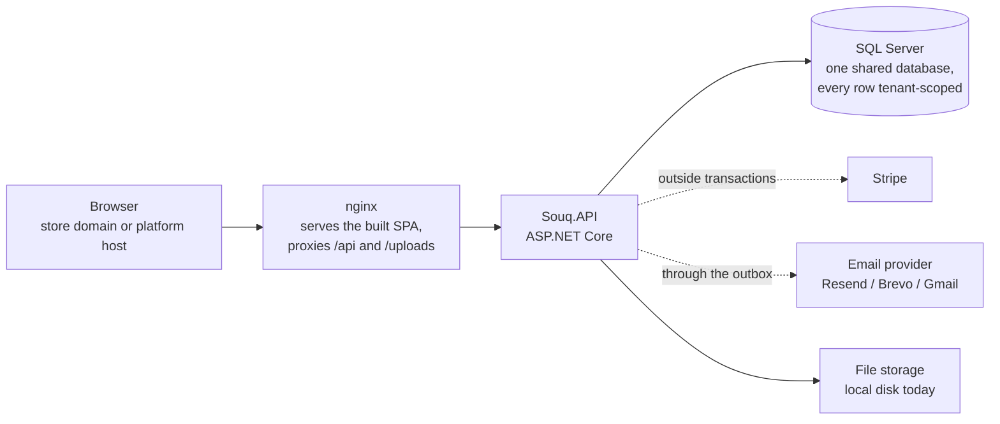
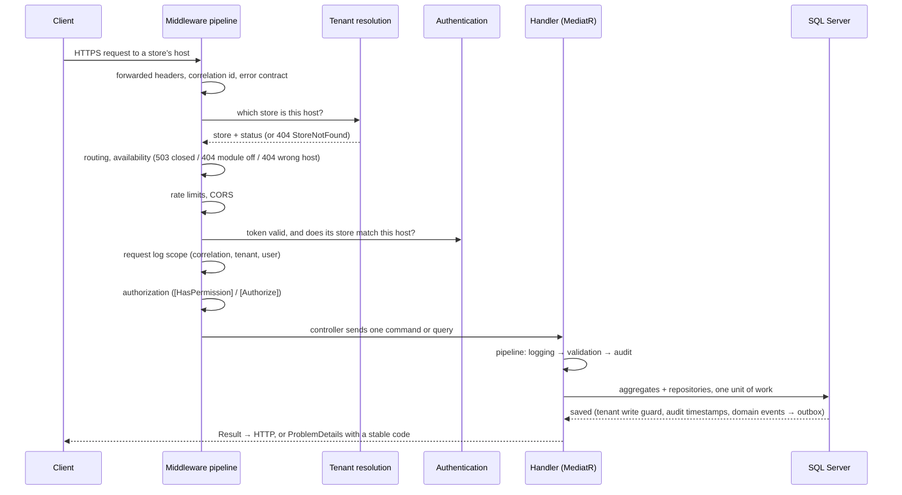

# System overview

> **Read this first.** It explains what Souq is, who uses it, and what actually happens when a request arrives — the runtime behaviour, not the folder names. Everything else in `docs/` is a zoom-in on something here.
> **Next:** [ProjectMap.md](ProjectMap.md) for the system on one page · [LearningPath.md](LearningPath.md) for the numbered reading order · [RequestLifecycle.md](RequestLifecycle.md) for one request through every layer · [AGENTS.md](../../AGENTS.md) for the rules.
> **Level:** L0. **Last verified against the code:** 2026-09-17, branch `phase/17-production-hardening`.

## 1. What Souq is

Souq is a **white-label, multi-tenant e-commerce platform**. One deployment — one ASP.NET Core API, one SQL Server database, one React build — serves many independent online stores. Each store has its own domain, branding, currency, languages, catalog, customers and orders, and sees nothing of any other store.

The business model it supports: a platform owner sells and operates stores for clients. A client gets *their* shop at *their* domain, with their identity, not a shop that mentions Souq.

**The problem it solves:** running many small shops without running many codebases. The alternative — a copy of the code per client — dies under maintenance: a bug fix must be applied *n* times and the versions drift within months.

## 2. Who uses it

| Actor | Where they work | What they can do |
|---|---|---|
| **Visitor / customer** | A store's own domain | Browse, search, basket, checkout, pay, track orders, review, wishlist, manage their account |
| **Store staff / admin** | `/admin` on their store's domain | Catalog, inventory, orders, customers, coupons, shipping, reviews, store settings, payment account — each behind a permission |
| **Platform owner / admin** | `/platform` on the platform host | Create and provision stores (domains, branding, modules, first administrator), suspend or archive them, platform statistics, the activity log; the owner alone manages platform accounts |

Identity and commerce are separate on purpose: a `User` signs in; a `Customer` is the commercial profile in one store. A platform account belongs to no store.

## 3. The shape of the system



One process, one database, four layers, fourteen business modules. It is a **modular monolith**: modules own their data and talk through explicit contracts, so the system stays separable without paying for distribution ([ADR-0001](../11-ADR/0001-target-architecture.md), [ExplicitNonGoals.md](../02-ARCHITECTURE/ExplicitNonGoals.md)).

```
src/Souq.API             HTTP: controllers, middleware, auth policies, composition root
src/Souq.Infrastructure  adapters: EF Core, Stripe, email, storage, hosted services
src/Souq.Application     use cases: commands, queries, handlers, validators, ports
src/Souq.Domain          the business model: aggregates, value objects, domain events
```

Dependencies point inwards only, enforced by tests ([DependencyRules.md](../02-ARCHITECTURE/DependencyRules.md)).

## 4. The life of a request

This is the sequence a request passes through, in the real order from `src/Souq.API/Program.cs`:



Three things are decided **before** any business code runs:

1. **Which store** this is, from the Host header alone. The client never chooses ([MultiTenancy.md](../02-ARCHITECTURE/MultiTenancy.md)).
2. **Whether this endpoint exists here**: platform endpoints answer only on the platform host, store endpoints only on store hosts, and an endpoint of a module the store disabled answers 404 `ModuleDisabled`. A store that is not active answers 503 `StoreUnavailable`.
3. **Who the caller is**, and that their token was issued for *this* store — a token from another store fails authentication.

## 5. How tenant isolation actually works

Four layers, each of which would be enough to stop the common mistake, and all four are present because one of them will eventually be bypassed:

1. **Resolution from the host**, server-side. No request type may carry a `TenantId` (a test enforces this).
2. **A global EF query filter** on every tenant-owned entity: a query cannot see another store's rows.
3. **A write guard** in `SaveChanges`: a row cannot be written into another store.
4. **Composite foreign keys** `(TenantId, Id)`: the database itself refuses a cross-store reference.

On top: another owner's id answers **404**, never 403, so ids leak nothing. Background jobs run inside an explicit tenant scope. The one audited exception — the platform's cross-store read — is a single reviewed type.

## 6. The modules

| Module | Owns |
|---|---|
| Platform | Stores, domains, settings and branding, module flags, audit |
| Identity | Accounts, sessions, roles and permissions, invitations |
| Catalog | Products, variants, categories, translations, media |
| Inventory | Stock, reservations, the movement ledger, low-stock thresholds |
| Customers | Commerce profiles, addresses, account status, export and erasure |
| Shopping | Baskets, the pricing pipeline, wishlists |
| Ordering | Orders, numbers, tracking tokens, the status machine |
| Payments | Payments, refunds, per-store gateway accounts |
| Promotions | Coupons and their redemptions |
| Shipping | Shipping methods and rates |
| Reviews | Reviews and moderation |
| Notifications | The outbox, in-app notifications, email |
| Reporting | Read-only statistics |
| Billing | The commercial control plane: plans, subscriptions and entitlements |

Who may call whom, and what is actually enforced: [ModuleBoundaries.md](../02-ARCHITECTURE/ModuleBoundaries.md). Per-module detail: [docs/04-MODULES/](../04-MODULES/Modules.md).

## 7. The paths worth knowing

**Checkout** is where most of the system meets. One command, one transaction: price the basket through the pricing pipeline (subtotal → discount → shipping → tax, which is zero today), reserve stock, reserve the coupon use, create and place the order with frozen totals. The payment intent is created **outside** the transaction, and a failure compensates by cancelling the order and releasing the hold ([FeatureMaps.md](../04-MODULES/FeatureMaps.md)).

**Payment confirmation** arrives twice, on purpose: the browser confirms after Stripe Elements, and Stripe's webhook confirms independently. Both paths are idempotent, and the webhook is routed to the store that created the intent.

**Anything that leaves the system after a commit** — email, notifications — goes through the **outbox**: a row written in the same transaction, delivered by a background dispatcher with a lease and bounded retries. No request ever waits on a provider, and nothing is sent for a transaction that rolled back ([Events.md](../02-ARCHITECTURE/Events.md)).

**Stock** is never decremented directly. Checkout reserves, payment commits, cancellation or expiry releases, and every change writes a ledger entry.

## 8. The frontend

One build renders any store. At boot the SPA asks `GET /api/storefront/config` for the host it was served from, and the answer decides everything visible: name and logo, colours and fonts, languages, currency, enabled modules, SEO text. A store that is closed, or a host with no store, gets an explicit screen instead of a broken page.

The frontend is **never** authoritative: guards, hidden menus and disabled buttons are user experience. Every decision — price, stock, permission, tenancy — is the server's ([FrontendGuide.md](../08-FRONTEND/FrontendGuide.md), [WhiteLabel.md](../08-FRONTEND/WhiteLabel.md)).

## 9. Data and time

- **One database**, code-first migrations as the only schema source, applied at startup ([Migrations.md](../06-DATABASE/Migrations.md)).
- **Money** is a value object carrying its currency, stored at fixed precision, rounded to the currency's minor units.
- **Optimistic concurrency** (`rowversion`) on contended rows: stock, coupons, orders, payments, products, users, stores. Conflicts retry or surface as 409.
- **Time** is stored in UTC and injected (`TimeProvider`); no code reads the clock directly, so expiry, lockout and validity windows are testable. Every instant in an API response ends in `Z`, so browsers display it correctly in the store's time zone ([ApiDocumentation.md](../05-API/ApiDocumentation.md) §1).
- Who owns which table: [OwnershipMap.md](../06-DATABASE/OwnershipMap.md).

## 10. Failure, safety and operations

- Every failure is RFC 7807 with a **stable `code`** clients branch on, plus a correlation id present on every response and every log line.
- The API **refuses to start** when something that must be configured is missing: a weak JWT key, no payment provider (unless the fake is explicitly chosen), no email provider (unless logging is explicitly chosen), an invalid secrets key.
- Secrets never live in committed configuration; store payment keys are encrypted in the database.
- Background services: outbox dispatch, checkout expiry, basket cleanup.
- What to do when something breaks: [Troubleshooting.md](../09-OPERATIONS/Troubleshooting.md). How it is deployed, and what is still missing before production (TLS, scheduled off-site backups, merge-blocking CI, external monitoring): [Deployment.md](../09-OPERATIONS/Deployment.md) and [ReleaseReadiness.md](../09-OPERATIONS/ReleaseReadiness.md).

## 11. What is deliberately not here

No microservices, no event sourcing, no message broker, no per-tenant database, no Kubernetes, no custom per-client code. Each of those has a written reason and the evidence that would change the answer: [ExplicitNonGoals.md](../02-ARCHITECTURE/ExplicitNonGoals.md). Growth happens in a documented order: [ScalingStrategy.md](../09-OPERATIONS/ScalingStrategy.md).

## 12. Where to go next

| You want to | Read |
|---|---|
| Learn the codebase in order | [HowToReadThisRepository.md](HowToReadThisRepository.md) |
| Understand a module | [docs/04-MODULES/](../04-MODULES/Modules.md) |
| Follow one feature end to end | [FeatureMaps.md](../04-MODULES/FeatureMaps.md) |
| Know the rules before changing code | [AGENTS.md](../../AGENTS.md), [DependencyRules.md](../02-ARCHITECTURE/DependencyRules.md) |
| See what the business actually enforces | [BusinessRules.md](../01-REQUIREMENTS/BusinessRules.md) |
| Run it | [DevelopmentGuide.md](../09-OPERATIONS/DevelopmentGuide.md) |
| Know what is incomplete | [TechnicalDebt.md](../12-ROADMAP/TechnicalDebt.md), [RiskRegister.md](../02-ARCHITECTURE/RiskRegister.md), [ProductRoadmap.md](../12-ROADMAP/ProductRoadmap.md) |
