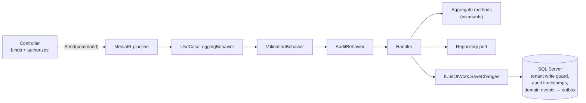
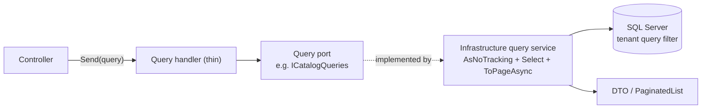

# CQRS in Souq: what it means here, and what it does not

> **In one sentence:** commands and queries are separate code paths over **one** database — writes go through aggregates, reads go through projection services — and nothing heavier is used until a measurement demands it.
> **Related:** [ADR-0008](../11-ADR/0008-cqrs-strategy.md) (the decision) · [Architecture.md](Architecture.md) · [Events.md](Events.md) · [ExplicitNonGoals.md](ExplicitNonGoals.md) · generated inventory: [UseCases.md](../04-MODULES/UseCases.md)

## 1. The words, separated

CQRS is routinely confused with three other ideas. In Souq they are separate decisions, and only the first is adopted:

| Idea | Adopted? | What it would mean here |
|---|---|---|
| **CQRS** (separate command and query paths) | **Yes**, selectively | Different code for writing and reading, over the same tables |
| Separate read **store** | No | A second database or denormalized tables kept in sync ([ExplicitNonGoals.md §6](ExplicitNonGoals.md#6-cqrs-with-separate-read-stores-everywhere)) |
| **Event sourcing** | No | Aggregate state rebuilt from an event log ([ExplicitNonGoals.md §2](ExplicitNonGoals.md#2-event-sourcing)) |
| **A broker** (Kafka) | No | Events published outside the process ([ExplicitNonGoals.md §3](ExplicitNonGoals.md#3-kafka-or-any-message-broker)) |

So: reads in Souq are **never stale**. They hit the same rows the last command wrote, in the same transaction boundary, with the same tenant filter.

## 2. The command path

- **The pipeline is why MediatR earns its place.** It runs for every request, in this order: `UseCaseLoggingBehavior` (a log scope with the use-case name and duration), `ValidationBehavior` (FluentValidation, async, fails before the handler), `AuditBehavior` (writes an audit entry for `IAuditable` requests inside the same unit of work).
- **The handler orchestrates; it does not decide.** It loads aggregates, calls their guarded methods, calls other modules' contracts, and saves. A rule that belongs to one aggregate lives in the aggregate ([DDD.md](../03-DOMAIN/DDD.md)).
- **One unit of work per use case.** The handler owns the transaction boundary; no transaction is held across a network call ([ADR-0021](../11-ADR/0021-transaction-boundaries.md)).
- **Commands return a `Result`, an id, or a small DTO** — never an entity ([ADR-0017](../11-ADR/0017-error-contract.md) for how failures become HTTP).

## 3. The query path

- **Reads project straight into DTOs.** Query services (`src/Souq.Infrastructure/Persistence/Queries/`) use `AsNoTracking` and `Select`, so a list page fetches the columns it shows — not whole aggregates mapped in memory.
- **The Application layer stays EF-free.** Each module declares a port and Infrastructure implements it. The implementations are **internal**: reachable through the port only, enforced by `ModuleAndContractRuleTests`.
- **`IQueryable` never crosses a layer boundary.** If it did, the caller would compose SQL outside Infrastructure and bypass the paging rules and the tenant filter. Also enforced by a test.

| Module | Query port | Implementation |
|---|---|---|
| Catalog | `ICatalogQueries` | `CatalogQueries` |
| Inventory | `IInventoryQueries` | `InventoryQueries` |
| Ordering | `IOrderQueries` | `OrderQueries` |
| Payments | `IPaymentQueries` | `PaymentQueries` |
| Promotions | `ICouponQueries` | `CouponQueries` |
| Customers | `ICustomerQueries` | `CustomerQueries` |
| Reviews | `IReviewQueries` | `ReviewQueries` |
| Shopping | `IWishlistQueries` | `WishlistQueries` |
| Notifications | `INotificationQueries` | `NotificationQueries` |
| Platform | `IPlatformQueries` | `PlatformQueries` |
| Identity / accounts | `IAccountQueries` | `AccountQueries` |

## 4. Listing conventions (every paged read)

- A list query implements `IPagedQuery`; its validator derives from `PagedQueryValidator<T>`, so page ≥ 1 and size within `PagingRules.MaxPageSize` (100) are enforced once, for every list, before the handler runs.
- The query service orders explicitly, then projects, then calls `ToPageAsync`, returning a `PaginatedList<T>` with the total count.
- **Sorting is an allowlist per resource**, with `Id` as the final tiebreaker so paging is deterministic; an unknown sort key falls back to the default instead of being passed to SQL.
- Filters are typed criteria, not free-form strings.

`QueryServiceTests` (integration) covers projection correctness, paging, ordering and N+1 behaviour against real SQL Server.

## 5. Where CQRS is deliberately *not* used

- **Inside a command handler**, loading an aggregate is a repository call, not a query service: the write path needs tracked entities with their invariants.
- **Dashboards and reports** are query services over indexed tables today. They move to pre-aggregated read models only when they miss a latency budget — with an ADR ([Reporting](../04-MODULES/Reporting/README.md)).
- **No command returns a projection** just to save a round trip; the client reads afterwards if it needs the full shape.

## 6. Adding a use case

1. Decide: does it change state (command) or answer a question (query)?
2. Put it in the owning module's feature folder: `src/Souq.Application/Features/<Folder>/Commands` or `/Queries`.
3. Command: write the rule in the aggregate first, then the handler, then a validator; add `IAuditable` if it is a platform-area request (a test enforces that).
4. Query: add the method to the module's query port and implement it in the module's query service; page it if it can return many rows.
5. Add the endpoint, then regenerate the inventories (`AGENTS.md` §7). [UseCases.md](../04-MODULES/UseCases.md) then shows the use case, its handler, its validator and its endpoint.
6. Tests: Application tests for the handler with doubles; an integration test for the query projection or the full flow.

## 7. When to revisit

Adopt a read model (materialized table) or a second store only with evidence: a report or dashboard that misses its latency budget with correct indexes, or read traffic measurably competing with checkout. Then write an ADR that names the read model, its freshness guarantee and its rebuild path. Until then, the fastest read is a good index and a narrow projection.
