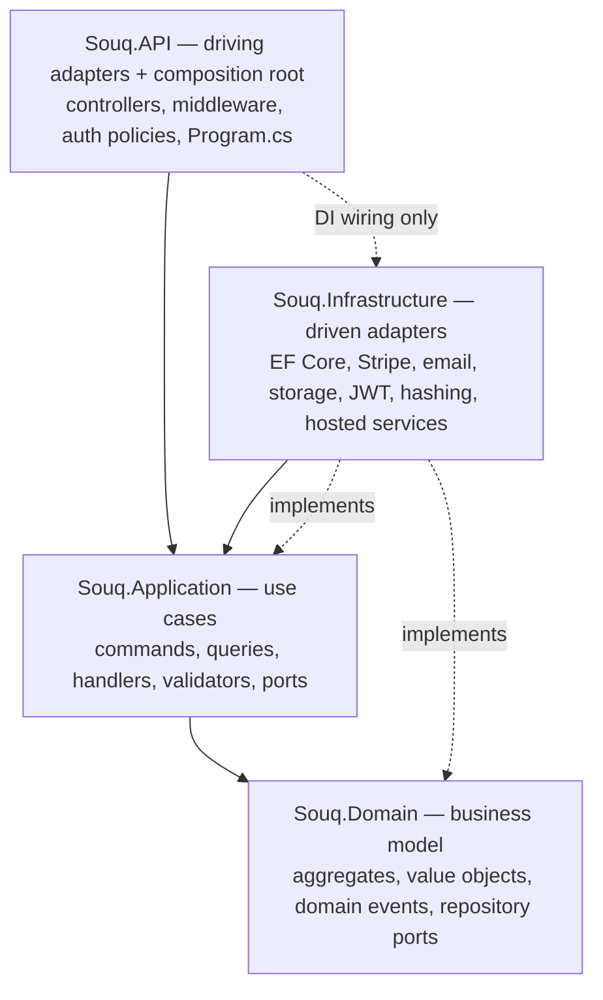

# Dependency rules

> **What this page is:** every dependency rule Souq lives by, what enforces it, and what to do when you need an exception. If you are about to add a `using`, a project reference, an npm package or a call from one module to another, this is the page that tells you whether you may.
> **Related:** [Architecture.md](Architecture.md) (why the architecture looks like this) · [ModuleBoundaries.md](ModuleBoundaries.md) (who owns what) · [ADR-0001](../11-ADR/0001-target-architecture.md), [ADR-0002](../11-ADR/0002-modular-monolith-structure.md), [ADR-0003](../11-ADR/0003-clean-hexagonal-boundaries.md), [ADR-0004](../11-ADR/0004-module-boundaries.md)

## 1. The two independent rules

Souq has **two** dependency rules that are often confused. A change can satisfy one and break the other.

| Rule | Question it answers | Direction | Enforced by |
|---|---|---|---|
| **The layer rule** (Clean Architecture) | May this *layer* reference that one? | `Souq.API` → `Souq.Infrastructure` → `Souq.Application` → `Souq.Domain` | Project references **and** `DependencyRuleTests` |
| **The module rule** (modular monolith) | May this *business module* call that one, and how? | Only through the other module's `Contracts`, following the graph in [ModuleBoundaries.md](ModuleBoundaries.md) | `ModuleAndContractRuleTests` |

Project references alone cannot enforce either rule: `Souq.API` references `Souq.Infrastructure` (to wire dependency injection in `Program.cs`), so nothing but a test stops a controller from calling Stripe. That is why the rules are tests that read the compiled IL, not conventions in a wiki.

## 2. The layer rule



### Allowed

| Layer | May depend on |
|---|---|
| `Souq.Domain` | The .NET base library only |
| `Souq.Application` | `Souq.Domain`, MediatR (pinned 12.x), FluentValidation, `Microsoft.Extensions.*.Abstractions` |
| `Souq.Infrastructure` | `Souq.Application`, `Souq.Domain`, EF Core, provider SDKs (Stripe, email, …), `Microsoft.Extensions.*` |
| `Souq.API` | `Souq.Application`; `Souq.Infrastructure` **only in composition code** (`Program.cs`) |
| Frontend | The HTTP API only |

### Forbidden

| Rule | Why it exists | Enforced by |
|---|---|---|
| Domain → Application, Infrastructure, API, EF Core, ASP.NET, MediatR, FluentValidation, Stripe | The business model must be framework-free, unit-testable, and readable without knowing any technology | `DependencyRuleTests` |
| Application → Infrastructure, API, EF Core, ASP.NET, `Microsoft.Data.SqlClient`, Stripe, MailKit, BCrypt, JWT types | A use case describes *what* happens; how it is stored or sent is an adapter's business | `DependencyRuleTests` |
| Infrastructure → API | An adapter must not know the delivery mechanism | `DependencyRuleTests` |
| Controllers → `Souq.Infrastructure`, `Souq.Domain.Interfaces`, EF Core, provider SDKs | Controllers translate HTTP and nothing else | `DependencyRuleTests` |
| Controllers → `System.Security.Claims`, `Souq.Domain.Common` | Identity comes from `ICurrentUser`; ownership is a use-case decision, not a controller `if` | `DependencyRuleTests` |
| Controllers taking a domain entity as a parameter | Entities are not request contracts | `DependencyRuleTests` |
| `IRequestHandler` implementations outside `Souq.Application` | Use cases live in one layer, so there is one place to look | `DependencyRuleTests` |
| Public setters on domain entities | State changes go through guarded methods, so an invariant cannot be bypassed | `DependencyRuleTests` |
| A domain entity reachable from any request or response contract | Exposing entities leaks internals (password hashes, `RowVersion`) and freezes the model | `ModuleAndContractRuleTests` |
| `IQueryable` in an Application or Domain signature | SQL would be composed outside Infrastructure, escaping paging limits and the tenant filter | `ModuleAndContractRuleTests` |
| Infrastructure query services being public | Reads are reached through their port, not by type | `ModuleAndContractRuleTests` |
| `DateTime.UtcNow` / `DateTime.Now` / `DateTimeOffset.UtcNow` anywhere | Time-dependent rules (expiry, lockout, validity windows) must be testable with a fixed clock; inject `TimeProvider` | `ClockRuleTests` (IL scan) |

## 3. The module rule

Modules are **namespaces inside the four layer projects** (ADR-0002), not separate projects:

```
src/Souq.Domain/…                                  the model (see §5 for the current namespace layout)
src/Souq.Application/Features/<Folder>/…           the module's use cases
src/Souq.Application/Features/<Folder>/Contracts/  the module's public, in-process API
src/Souq.Infrastructure/<Area>/…                   its adapters and EF configurations
src/Souq.API/Controllers/…                         its HTTP surface
```

Feature folders map to modules in `ModuleMap` (`tests/Souq.ArchitectureTests/ModuleMap.cs`), which is the single source shared by the boundary tests and the generated inventories. A new feature folder that no module claims fails the build — the module is named in [Modules.md](../04-MODULES/Modules.md) first.

**The rule:** a module's types may reference another module's types **only** inside `Features/<Folder>/Contracts`, and only when the graph in [ModuleBoundaries.md](ModuleBoundaries.md) allows that arrow. Contracts are a door, not a hole: the other module's commands, queries, handlers and internal types stay off-limits even when the arrow exists. Cycles are rejected outright.

The allowed arrows are listed in `ModuleAndContractRuleTests` (`AllowedContracts`). Today:

| From | May call the contracts of | Because |
|---|---|---|
| Ordering | Inventory, Shopping, Promotions, Payments, Shipping | Checkout reserves stock, reads the basket, redeems a coupon, takes payment, and snapshots the shipping choice |
| Inventory | Catalog | Inventory implements Catalog's `IVariantStockInitializer`, so the arrow points Inventory → Catalog and no cycle exists |
| Shopping | Inventory, Shipping | The basket shows availability without reserving, and prices the shipping stage |

Everything else between feature folders is a build failure.

## 4. Communication patterns between modules

1. **Synchronous in-process contract (the default).** Module B exposes an interface in `Features/B/Contracts`; module A calls it; B's implementation touches only B's tables.
2. **One transaction across several modules is allowed** ([ADR-0021](../11-ADR/0021-transaction-boundaries.md)). Checkout reserves stock, creates the order and redeems the coupon in one unit of work. This is the deliberate advantage of a modular monolith over microservices. No transaction is ever held across a network call.
3. **Reference by id, snapshot what you need.** An order line stores the product id plus a snapshot of name, SKU and unit price; it never navigates to `Product`. Cross-module foreign keys are avoided; the exception is `TenantId`, the shared kernel.
4. **Events for facts with more than one consumer.** Aggregates raise domain events; `AppDbContext` writes them to the outbox in the same save; handlers react ([Events.md](Events.md)).
5. **Shared kernel, minimal:** `Money`, `TenantId`, entity base types, `Result`/`Error`, paging primitives. Nothing business-specific.

## 5. What is *not* enforced, and why it matters

Being honest about the gaps is part of the contract.

- **The Domain layer has no module namespaces.** Most entities live in `Souq.Domain.Entities`; only `Souq.Domain.Identity` and `Souq.Domain.Platform` are separate, and repository ports share `Souq.Domain.Interfaces`. The module test only polices `Souq.Application.Features.*`, so **a handler in one module can use another module's aggregate or repository directly** and no test complains. Where that happens today is listed per module (each module document's *Dependencies* section) and in [TechnicalDebt.md](../12-ROADMAP/TechnicalDebt.md). Prefer a contract; if you must use another module's repository, record it there.
- **"No business rule in a controller"** is reviewed by humans, not tested. The structural half (no data access, no claims, no entity parameters) is tested.
- **Frontend rules** (no business decisions in React, no brand or currency literals) are covered by `whiteLabel.test.js` and code review, not by a dependency test.
- **New generic abstractions** (`IRepository<T>`, `IService<T>`) are a review decision: a second real use case justifies them, fashion does not.

## 6. Exceptions

An exception is a written, reviewed list — never a quiet call.

- `TenancyRuleTests.ReviewedFilterBypasses` is the only place where `IgnoreQueryFilters` is allowed (`PlatformQueries`, the audited platform read path).
- `TenancyRuleTests.ReviewedBulkWrites` is the equivalent list for `ExecuteUpdate`/`ExecuteDelete`. Those translate to a single UPDATE or DELETE and never pass through `SaveChanges`, so neither `TenantWriteGuardInterceptor` nor `AuditTimestampsInterceptor` runs: the tenant query filter is the only thing isolating them. Three types are listed today (`OrderNumbers`, `NotificationRepository`, `OutboxProcessor`); a fourth fails the build until it is reviewed.
- `WhiteLabelSourceTests.Allowed` lists the two files that may name the demo store or a currency (`DbSeeder`, `CurrencyInfo`).
- Raw SQL is allowed only inside migrations.

To add an exception: add it to the test's list **in the same commit** as the code, with a comment saying why it is safe, and mention it in the module document. If the exception is architectural, write an ADR.

## 7. Adding or changing a rule

1. Write the rule as a test in `tests/Souq.ArchitectureTests` (NetArchTest for type references, reflection for shapes, Mono.Cecil when you need call sites).
2. Make it fail first against the violation you have in mind.
3. Name the test after the rule in plain language, and comment *why* the rule exists — the comment is what stops a future engineer from deleting it.
4. Document it here and in [AGENTS.md](../../AGENTS.md) §3.
5. Never make a rule so tight that a legitimate refactor has to fight it. Rules protect invariants, not personal taste.
