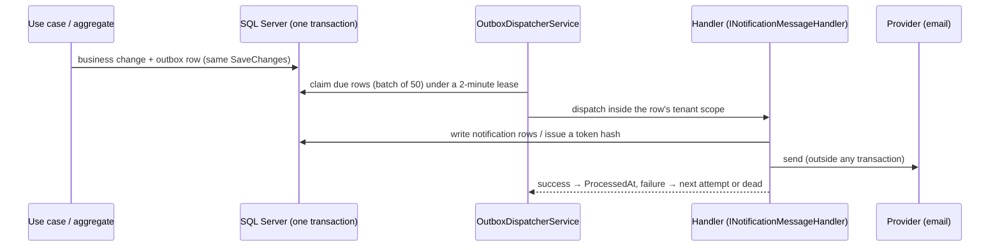

# Events: what Souq uses, and what it deliberately does not

> **In one sentence:** aggregates raise **domain events**, those events and a few explicit **messages** are written to a **transactional outbox** in the same database transaction as the change that caused them, and a background dispatcher delivers them at least once inside the right store's scope.
> **Related:** [ADR-0034](../11-ADR/0034-notifications-outbox.md) (the decision) · [ADR-0021](../11-ADR/0021-transaction-boundaries.md) (no transaction across a network call) · [Notifications module](../04-MODULES/Notifications/README.md) · [ExplicitNonGoals.md](ExplicitNonGoals.md)

## 1. Five words that are not synonyms

Mixing these up leads to architectures nobody needs. In Souq they are separate decisions:

| Term | What it actually means | In Souq |
|---|---|---|
| **Domain event** | A fact inside the model: "this order became Paid". In-process, part of the same transaction. | **Used**, sparingly: two events today |
| **Integration event** | A fact published *outside* the application for other systems to consume. | **Not used** — there is no other system yet |
| **Outbox** | A table that stores messages written in the business transaction, delivered afterwards by a separate process. | **Used** — it is the delivery mechanism |
| **Event streaming** (Kafka, a broker) | Durable transport between processes, with replay and independent consumers. | **Not used** ([ExplicitNonGoals.md §3](ExplicitNonGoals.md#3-kafka-or-any-message-broker)) |
| **Event sourcing** | Rebuilding an aggregate's state by replaying its events; the log *is* the data. | **Not used** ([ExplicitNonGoals.md §2](ExplicitNonGoals.md#2-event-sourcing)) |

Consequences of that: an outbox does **not** make this an event-sourced system; adding a broker would not change the model; and the domain events here are an implementation detail of *notification*, not the source of truth for any state.

## 2. Why an outbox at all

Before Phase 14, email was sent inline after the commit: the request waited on the provider, and a provider failure was logged and swallowed — the message was simply lost. The outbox fixes both halves of that problem:

- **Nothing is lost:** the message row is written in the *same* `SaveChanges` as the business change. If the transaction rolls back, the message was never there. If it commits, the message will be delivered.
- **Nothing waits:** the HTTP request returns as soon as the transaction commits. The provider call happens later, in a background dispatcher, outside any transaction ([ADR-0021](../11-ADR/0021-transaction-boundaries.md)).

An architecture test keeps it that way: only the Notifications module may depend on `IEmailSender`, so no request path can start waiting on a provider again.

## 3. Domain events today

| Event | Raised by | Carries | Consumed for |
|---|---|---|---|
| `OrderStatusChanged` | `Order` when a transition is applied (only for an order that has been persisted) | order id, customer id, previous and new status, the kind of actor that caused it | the customer's in-app notification, the customer email for paid/shipped/delivered/cancelled, the staff alert for a new paid order |
| `StockBecameLow` | `InventoryItem` when available stock crosses the store's threshold (on reservation and on adjustment) | product id, variant id, available quantity, threshold | the staff low-stock notification |

Mechanics:

1. An aggregate calls `Raise(...)` (`BaseEntity`), which collects the event in memory — it does not publish anything.
2. `AppDbContext.SaveChangesAsync` collects `PendingDomainEvents()` from every tracked entity, turns each into an outbox row, and saves them **in the same transaction**.
3. If the save fails, the added rows are detached and the entities' events cleared, so a retry does not duplicate them (`ClearDomainEvents`).

**When to raise a domain event instead of calling something directly:** only when a fact has more than one consumer, or when the consumer must not affect the transaction that produced it. One consumer and a required outcome is a direct call — simpler to read and to test.

## 4. Messages that are not domain events

Some things are requested explicitly by a use case rather than derived from a state change. They are plain records enqueued through `INotificationOutbox`:

| Message | Enqueued by | Delivered as |
|---|---|---|
| `PasswordResetRequested` | the forgot-password use case | the reset email |
| `EmailVerificationRequested` | registration and "resend verification" | the verification email |
| `AccountInvited` | staff and platform invitations | the invitation email |
| `OrderEmailRequested` | the order/stock handlers, after they write the in-app rows | the customer's order email |

The last one exists so that a failing email is retried **alone**: writing the notification rows and sending the email are separate messages, so a retry cannot duplicate the notifications.

## 5. What an outbox row contains, and what it must never contain

`OutboxMessage` (in Infrastructure, not a tenant-owned entity: it carries a nullable `TenantId` because platform-scoped messages exist):

| Field | Rule |
|---|---|
| Type | The message type name, from a fixed allow-list (`NotificationMessageTypes`), at most 100 characters. An unknown type is dead on arrival — a renamed type cannot silently stop being delivered. |
| Payload | JSON, **references only** — ids, enum names, the request origin for links — at most 4000 characters. Enums are written as names, not numbers, so a reordered enum cannot change the meaning of an old row. |
| TenantId | The store whose scope the handler must run in; null for platform-scoped messages. |
| Attempts, LockedUntil, ProcessedAt, FailedAt, Error | Delivery state; `Error` is truncated to 500 characters. |

**Never in a payload:** a password-reset, verification or invitation token; an email body; personal data beyond the ids needed to load it. Tokens are generated **at dispatch** by the handler, which stores the hash and sends the plaintext once — so a database dump of the outbox contains no usable secret.

## 6. Delivery

- **Interval:** every 5 seconds by default (`Notifications:DispatchIntervalSeconds`). Setting it to `0` disables the background loop — that is how the integration tests stay deterministic; they call the processing cycle directly (`DispatchNotificationsAsync`).
- **Lease:** each row is claimed with a conditional update that sets `LockedUntil` two minutes ahead, so two instances never process the same row and a crashed worker's rows come back automatically.
- **Tenant scope:** handlers run inside `TenantScopes.RunAsync` for a store's message, or `RunPlatformAsync` for a platform one. A handler therefore sees exactly the data its store may see — the tenant filter applies to background work too.
- **Retries:** `OutboxRetryPolicy` allows 8 attempts with growing delays — 30 seconds, 2 minutes, 10 minutes, 30 minutes, 1 hour, 3 hours, 6 hours — after which the row is **dead**: `FailedAt` and the error are kept for diagnosis and never retried automatically.
- **Purge:** processed rows older than `Notifications:RetentionDays` (14) are deleted hourly. Dead rows are kept.

## 7. Guarantees, and what they demand of handlers

- **At least once.** A handler can run twice for the same row (a crash after the provider call but before the row is marked processed). Handlers must be **idempotent**, or their side effect must be harmless twice.
- **No ordering guarantee** between rows. Do not encode a sequence across messages; put what the handler needs in one message.
- **No transactional coupling to the producer.** By the time a handler runs, the business transaction is long committed; a handler failure never rolls back the order.
- **Tokens at dispatch**, so a retry issues a fresh token that supersedes the previous one.

## 8. Failure modes

| Situation | What happens | Where to look |
|---|---|---|
| Provider is down | Attempts retry with backoff; the row stays pending | The row's `Attempts` and `Error` |
| Provider keeps failing | Row is dead after 8 attempts; nothing is lost, nothing is sent | Rows with `FailedAt` set |
| Message type renamed or removed | Row dies immediately (unknown type) | Keep the allow-list and the type name stable, or migrate rows deliberately |
| Payload too large | The enqueue **throws** at write time (4000-character cap), failing the business transaction rather than storing a message that can never be delivered | `OutboxMessage` |
| Two instances running | Safe: the lease makes double processing impossible | — |
| Store suspended between enqueue and dispatch | The handler runs in that store's scope and sees its data; delivery still happens | Business decision, not a technical one |

## 9. Adding a new event or message

1. **Decide which it is.** A fact the model produces → a domain event on the aggregate. An explicit request by a use case → a message record.
2. Add the type and register it in the allow-list (`NotificationMessageTypes`); the name is now part of the contract with existing rows.
3. Keep the payload to references, well under 4000 characters.
4. Write a handler (`INotificationMessageHandler<T>`) in the Notifications module — it is the only module that may touch `IEmailSender`.
5. Make the handler idempotent, and issue any token inside it.
6. Register the handler in the Application dependency injection.
7. Tests: an Application test for the handler, and an integration test that enqueues, dispatches and asserts the effect (and, where it matters, the retry and dead paths).
8. Document it in the Notifications module document and, if it is a domain event, in the raising module's document.

## 10. When this design should change

Move to a broker when there is a **second** consumer of the same facts — an extracted service, a data platform, a partner integration — or when dispatch volume outgrows a database-backed queue. The payloads are already reference-only and type-registered, so the dispatcher publishes instead of handling; see [ScalingStrategy.md](../09-OPERATIONS/ScalingStrategy.md) Stage 5. That change needs an ADR.
