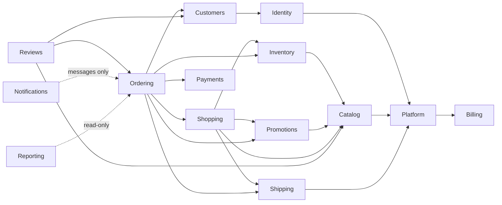

# Module boundaries: who owns what

> **What this page is:** the ownership map — which module owns which business concept and which tables — plus the rules for reaching across a boundary, an honest account of what is **enforced** versus what is only **convention**, and how to change a boundary deliberately.
> **Related:** [Modules.md](../04-MODULES/Modules.md) (the catalog) · [DependencyRules.md](DependencyRules.md) (the mechanics and the tests) · [ModuleDomainDependencies.md](ModuleDomainDependencies.md) (every crossing that exists today, generated) · [ADR-0004](../11-ADR/0004-module-boundaries.md)

## 1. Ownership: one concept, one owner

A concept has exactly one owning module. Everyone else references it by id and keeps a snapshot of what they need.

| Concept | Owner | Everyone else |
|---|---|---|
| A store, its domains, settings, branding, enabled modules | **Platform** | reads the resolved store from the tenant context; never writes store rows |
| Accounts, credentials, sessions, roles, invitations | **Identity** | asks who the caller is through `ICurrentUser` |
| What is for sale: products, variants, categories, media, translations | **Catalog** | references a product or variant id, snapshots name, SKU and price |
| How many units exist and who holds them | **Inventory** | asks through the reservation contract; never writes stock |
| The shopper as a commercial relationship | **Customers** | references a customer id |
| What a shopper intends to buy: basket, wishlist, pricing | **Shopping** | asks for the basket's lines through a contract |
| The commercial record of a purchase | **Ordering** | references an order id; reads status through Ordering |
| Money movements: payments, refunds, gateway accounts | **Payments** | Ordering asks through the payments contract; nothing else touches money |
| Discount rules and their consumption | **Promotions** | asks for a discount through the pricing pipeline, and reserves a use through the contract |
| Delivery options and their prices | **Shipping** | asks for rates through the rate provider |
| Opinions about products | **Reviews** | reads aggregates only |
| Telling people what happened | **Notifications** | enqueues a message; never calls a provider itself |
| Cross-store statistics | **Reporting** | reads across stores only through the platform read path (Platform and Reporting): the single reviewed filter bypass is `PlatformQueries`, which implements both `IPlatformQueries` and `IPlatformReports`, and every platform request is audited. A store's own dashboard (`IStoreReports`) reads inside its store like any other query |
| What a store is entitled to use, and on what terms: plans, subscriptions, entitlement overrides | **Billing** | never asks: what a plan grants reaches everyone else already intersected into the request's store snapshot, and provisioning subscribes a new store through the `IStoreEntitlements` contract |

Table-level ownership, including the infrastructure tables: [OwnershipMap.md](../06-DATABASE/OwnershipMap.md).

**Two ownership facts worth stating plainly, because the code contradicts the tidy version:**

- The **store-side payment-account** use cases live in the Platform feature folder (`src/Souq.Application/Features/Stores`) although Payments owns the concept. Same for the **review-settings** policy, which Reviews owns. Recorded in [TechnicalDebt.md](../12-ROADMAP/TechnicalDebt.md).
- The **review publication policy** is a Reviews rule stored on the Platform aggregate (a store setting). That is deliberate: it is a store's choice, and Platform owns store settings.

## 2. How a module reaches another

In order of preference:

1. **A contract** — an interface in `Features/<Folder>/Contracts`, implemented by the owning module, touching only its own tables. The default and the only mechanism the tests enforce.
2. **Reference by id plus a snapshot.** An order line stores the product id *and* the name, SKU and unit price as they were. History must not change when the catalog does.
3. **One transaction across modules** is allowed, because this is a monolith and checkout must be atomic ([ADR-0021](../11-ADR/0021-transaction-boundaries.md)). Each module still writes only its own tables.
4. **A domain event through the outbox**, for facts with more than one consumer, or when the consumer must not affect the producer's transaction ([Events.md](Events.md)).
5. **Never:** writing another module's tables, or calling its handlers.

## 3. The target graph

Arrows mean "may call the contracts of". Cycles are never allowed.

This is the **target**. Payments → Ordering is forbidden in both the target and the code: Ordering owns the order, and a payment result reaches it either by Ordering asking, or by a webhook that an Ordering use case handles through the payments port.

**Billing has no outgoing arrow, and that is the whole reason the contract exists.** At the Domain level Billing reads Platform's `Tenant` and `ITenantRepository`; if provisioning had reached back by naming `Plan` and `Subscription` directly, the pair would have been a cycle in both directions at once. Instead the single Application-layer edge runs Platform → Billing, through `IStoreEntitlements` ([ADR-0047](../11-ADR/0047-commercial-control-plane.md)). Everything else Billing produces reaches the rest of the system not as a call but as data: the effective module set composed into the request's tenant snapshot.

## 4. What is actually enforced today

`ModuleAndContractRuleTests` enforces, **within `Souq.Application.Features` only**, that a module references another module's namespace solely through an allowed `Contracts` namespace:

| From | May call the contracts of |
|---|---|
| Ordering | Inventory, Shopping, Promotions, Payments, Shipping |
| Inventory | Catalog (it implements Catalog's `IVariantStockInitializer`, so the arrow points this way and no cycle exists) |
| Shopping | Inventory, Shipping |
| Platform | Payments (`IStorePaymentAccountEditor` — the platform admin path reaches the store's payment-account editor this way; closed in the M1 architecture audit, TD-04/R-04) · Billing (`IStoreEntitlements` — provisioning subscribes a new store to the foundation plan, and the store detail screen reads which plan it is on; C1) |

Everything else between feature folders fails the build, and a separate test rejects cycles in that map.

## 5. What is *not* enforced — and the ratchet that keeps it honest

Repository ports live in `Souq.Domain.Interfaces` and most entities in `Souq.Domain.Entities`. Those namespaces are outside the test's scope, so **a handler in one module can load another module's aggregate directly and no test objects.** That is how the system actually works today in several places, for reasons that were often deliberate.

Rather than pretend otherwise, every such crossing is generated into [ModuleDomainDependencies.md](ModuleDomainDependencies.md) from the compiled code: **69 crossings across 14 module pairs** at the time of writing, all but the four newest classified in [ModuleBoundaryAudit.md](ModuleBoundaryAudit.md) — the Billing → Platform rows arrived with C1 and are described in the table below. That file is committed, so:

- a **new** crossing changes it and fails `GeneratedDocsTests` — it becomes a decision made in review, not a quiet import;
- **removing** one also changes it, and the count goes down.

The largest clusters, and what each is waiting for. The contract names are proposals — none exists yet, so they are in italics — and [ModuleBoundaryAudit.md](ModuleBoundaryAudit.md) is canonical for them, with the per-pair counts and a ranked fix order; this table is a summary of it:

| Crossing | Why it exists | The contract that would close it |
|---|---|---|
| Shopping → Catalog | Pricing and the basket load `Product` for price, name and status | *ISellableItems* (deferred in ADR-0028) |
| Notifications → Identity | Reset, verification and invitation tokens are **issued at dispatch**, so the handler writes `User` ([ADR-0034](../11-ADR/0034-notifications-outbox.md)) | *IAccountTokens*, plus *IStaffRecipients* for the role lookups |
| Customers → Identity | ~~Registration creates a customer; erasure and profile updates write the user and revoke sessions~~ **Resolved in M9** | `IAccountProfiles` (declared by Identity, implemented by Customers) and `IAccountLifecycle` (declared and implemented by Identity) — both declared in Identity, so the pair is no longer a **cycle**: one arrow, in the direction the target graph keeps |
| Customers → Shopping | Erasure deletes the basket and wishlist | *IForgetsCustomer*, or an erasure event |
| Notifications → Ordering, Customers, Catalog | Handlers load the order, the customer and the product name to compose a message | *IOrderNotificationView*, or carry the fields on the event |
| Ordering → Customers | Checkout checks the block status and reads the address book | *ICustomerDirectory* (named in the docs since Phase 7, still deferred) |
| Shopping → Promotions | Pricing loads the coupon and counts its uses | *IDiscountQuote* |
| Reviews → Ordering, Customers | Eligibility ("did this customer receive this product?") and block status | *IOrderHistory* and *ICustomerDirectory* (deferred); Reviews → Platform (the auto-approve policy) is deliberate and needs none |
| Billing → Platform | Assigning a plan checks that the store exists; granting an override also reads its module switch, to refuse an exception that would grant nothing | None — deliberate, and the direction the target graph keeps. The contract runs the other way (`IStoreEntitlements`), which is what stops the pair being a cycle |

Read-side joins are a second, narrower exception: the query services in `src/Souq.Infrastructure/Persistence/Queries` join across module tables to build screens (a customer list with order counts, a catalog list with stock). They are read-only, they live behind their module's port, and they are how the UI stays fast. Treat them as a documented exception, not a licence to write.

## 6. Rules of thumb when you are unsure

- **"Which module owns this?"** Whoever would still need the concept if every other module disappeared.
- **A rule that reads another module's data to decide** belongs to the module that owns the *decision*, and asks the other for a fact through a contract.
- **A snapshot is not a duplicate.** Copying a price into an order line is correct; keeping a second product catalog is not.
- **If two modules must change together for every feature**, they are one module. Say so and merge them, with an ADR.
- **If a contract would have exactly one method used once**, consider whether the concept is in the wrong module instead.

## 7. Changing a boundary

1. Decide the target: which module should own the concept, and which arrow you need.
2. Check the graph in §3 for a cycle. A cycle is a design error, not an inconvenience.
3. Add the contract to the **owning** module's `Contracts` folder, in its own language (ids, snapshots, `Money` — never another module's entity).
4. Update `AllowedContracts` in `tests/Souq.ArchitectureTests/ModuleAndContractRuleTests.cs` in the same commit.
5. If the crossing goes away, regenerate [ModuleDomainDependencies.md](ModuleDomainDependencies.md) and watch the count drop.
6. Update this page, the two module documents, and write an ADR if the ownership itself moved.
