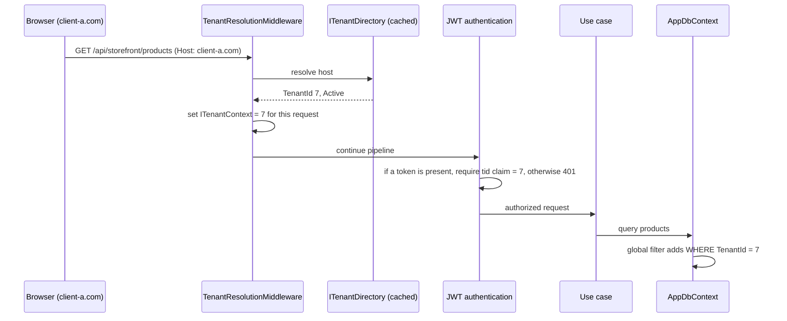

# Souq: Multi-Tenancy Architecture

> **Status:** Design adopted 2026-09-11 ([ADR-0005](../11-ADR/0005-multi-tenancy-model.md), [ADR-0006](../11-ADR/0006-tenant-resolution.md)). **Implemented in Phase 2** (2026-09-11). The implementation details are in [ADR-0022](../11-ADR/0022-tenancy-enforcement.md), and the component map is in §8.

## 1. Decision

**Shared application + shared database + `TenantId` column**, with isolation enforced **centrally** by the data-access layer and proven by automated tests. There is also a designed seam that lets a specific tenant move to a dedicated database later.

### Re-evaluation: is this still the right start?

| Question | Answer |
|---|---|
| How many tenants, and how big? | Many small stores. Cost per tenant must be near zero, which favours a shared database. |
| Compliance that demands physical separation? | None known today. If an enterprise client needs it, the hybrid path (§6) covers it. |
| Cross-tenant platform dashboards? | Required. In a shared database they are trivial; with one database per tenant they need pipelines. |
| Operational capacity? | One developer: one migration run, one backup, one connection string. |
| Biggest risk? | A forgotten filter leaking data between tenants. It is mitigated by making the filter **automatic** (not per query), plus a write guard, plus tests. |

**Conclusion: yes.** Shared database with `TenantId` remains the right starting architecture.

## 2. Principles

1. **The server decides the tenant.**
   - It is resolved from the request host. An authenticated principal must also carry a matching `tid` claim.
   - A `TenantId` in a body, query string, or header from the browser is **never** trusted. The only exception is the dev-only `X-Tenant` header (with the other local conveniences in the table below). It is not compiled out: `Program.cs` sets `TenancyOptions.AllowDevelopmentResolution` from the runtime environment — true only in Development or Testing, whatever configuration says — and `TenantResolutionMiddleware` ignores the header everywhere else.
2. **Isolation is the default, not an effort.**
   - Every tenant-owned entity implements `ITenantOwned`.
   - EF Core applies the filter to every query automatically.
   - The unit of work stamps and validates `TenantId` on every write.
3. **Crossing tenants is explicit.** Only platform use cases may do it, through a dedicated, audited path. There are no ad-hoc `IgnoreQueryFilters()` calls.
4. **A resource from another tenant does not exist** from the caller's point of view: the answer is 404, never 403. That avoids leaking its existence.
5. **Tests prove it.** Every tenant-owned endpoint appears in the isolation suite.

## 3. Tenant context resolution

The diagram shows only the tenant-relevant steps. The full order is in the request pipeline of `src/Souq.API/Program.cs`, and each position has a reason:

1. **Forwarded headers** first, so the client address and scheme come from the trusted proxy before any decision uses them.
2. **Correlation id and security headers**, before the exception handler, so error responses carry them too.
3. **Exception handler and status-code pages**, which turn failures and empty 401/403/404 bodies into ProblemDetails.
4. **Health checks** (`/health/live`, `/health/ready`) before tenant resolution: the orchestrator's probe arrives on the container's host, not a store's, and liveness must answer even when the store directory or the database is down.
5. **Tenant resolution** (`TenantResolutionMiddleware`): host → store, and an unknown host is a 404 before any logic.
6. **Uploads** (`/uploads` static files) after resolution, so a file is served only through its store's host.
7. **Routing**, then **availability** (`TenantAvailabilityMiddleware`) and **rate limiting**: both read endpoint metadata (the area attributes, `[RequiresModule]`, `[EnableRateLimiting]`), which exists only after routing.
8. **CORS**, then **authentication**, which validates the token and matches its `tid` to the host.
9. **Request logging** between authentication and authorization, so the log scope has the user and the store, and a refused request is still logged.
10. **Authorization**, then the controllers.

| Host kind | Tenant context | Allowed endpoints |
|---|---|---|
| Platform host (e.g. `admin.souq.app`) | **None** | `/api/platform/*`, platform auth |
| Tenant custom domain or `{slug}.souq.app` | That tenant | storefront, account, admin, tenant auth |
| Unknown host | — | 404 (no fallback tenant in Production) |
| `localhost` in Development | From the `{slug}.localhost` subdomain, or a dev `X-Tenant` header | all (dev convenience only) |

**Additional rules:**
- A suspended or archived tenant answers `503 StoreUnavailable` for every endpoint except the five marked `AvailableWhenStoreClosedAttribute`: `GET /api/storefront/config`, so the store can serve its own branded "closed" page, and sign-in, session refresh, sign-out and "who am I", so its administrators can sign in and see why it was closed. Everything behind a permission stays `503` — signing in does not reopen the store. A `Provisioning` store additionally serves permission-protected administration. Platform users are unaffected.
- `ITenantContext` (an Application port) is scoped per request, and is also set explicitly for background jobs.
- Tokens are bound to their area by the **`tid` claim**, not by a separate audience: a store token carries the store's id and is rejected on any other host or on a platform host; a platform token carries no `tid` and is rejected on store hosts ([ADR-0023](../11-ADR/0023-sessions-and-credentials.md) chose this over per-area audiences). Enforced in `AccessTokenValidation`.

## 4. Enforcement mechanics (Phase 2 implementation)

| Mechanism | What it does | Where |
|---|---|---|
| `ITenantOwned { int TenantId }` | Marks tenant-owned entities; `TenantId` is set once and never changes | Domain |
| `ITenantOrPlatformOwned { int? TenantId }` (Phase 3) | Accounts and their refresh tokens: a store account, or a platform account (`NULL`). The same named filter shows the store's accounts in a store scope and platform accounts in the platform scope. A store host can't reach a platform account, or the reverse | Domain + `AppDbContext` |
| **Global query filter** | `e => e.TenantId == _tenant.Id` on every `ITenantOwned` entity, applied by reflection at model build (no per-entity copy-paste) | Infrastructure (`AppDbContext`) |
| **Write guard** (`SaveChanges` interceptor) | Added entity → stamp `TenantId`. Modified or deleted entity whose `TenantId` ≠ current → throw `CrossTenantWriteException` (a 500 **and** a security log entry, since it indicates a bug) | Infrastructure |
| **No tenant context** | Querying an `ITenantOwned` set without a resolved tenant throws. It must not return all rows. | Infrastructure |
| **Platform access** (Phase 4 ✅) | Cross-store reads run through `PlatformQueries`, the only `IgnoreQueryFilters` caller (architecture test), with an explicit `TenantId` predicate or aggregate counts. Every platform request is audited (architecture test). Platform *writes* into a store run in that store's own scope (`ITenantScopeRunner`), so the write guard and the storage prefix still apply. | Infrastructure + Audit |
| **Optional modules** (Phase 4) | The enabled modules travel in the cached `TenantInfo`. `[RequiresModule]` endpoints answer `404 ModuleDisabled`, and use cases that touch a module check it | API middleware + use cases |
| **Raw SQL** | Forbidden everywhere except migrations: EF's raw-SQL methods (`FromSql`, `SqlQuery`, `ExecuteSql` and their variants) fail the build in any other Infrastructure type, and the Application layer cannot reference EF at all. **Blind spot:** the test scans EF calls only, so plain ADO.NET is invisible to it — `DatabasePrivileges` (`src/Souq.Infrastructure/Persistence/DatabasePrivileges.cs`) runs a `DbCommand` directly, deliberately, because it reads server and database role membership and touches no store data. Any new ADO.NET call is a review item | `TenancyRuleTests` (IL scan) + code review for ADO.NET |
| **Uniqueness** | `(TenantId, Slug)`, `(TenantId, Code)`, `(TenantId, NormalizedEmail)`, `(TenantId, Sku)`, `(TenantId, OrderNumber)` | Database |
| **Indexes** | Hot-path indexes lead with `TenantId` | Database |
| **Cache keys** | Always identify the store, and carry a generation prefix that `Invalidate()` bumps, so a settings change cannot serve a stale entry: `host:`, `slug:`, `id:` and `storefront:{id}` in `TenantDirectoryCache` | Infrastructure |
| **File storage** | Keys prefixed `tenants/{id}/…`; served only through the tenant's host | Infrastructure |
| **Background jobs** | Iterate tenants explicitly and run each store's work in a fresh service scope set to that store: the per-store sweeps derive from `StoreSweepService`, which lists active stores and calls `TenantScopes.RunAsync`; the outbox enters each message's store (or the platform scope) the same way; platform use cases that write into a store go through `ITenantScopeRunner` | Infrastructure (`src/Souq.Infrastructure/BackgroundJobs`, `src/Souq.Infrastructure/Tenancy`) |
| **Logs** | Every log scope carries `TenantId` | API middleware |

### Who can see what

| Actor | Tenant-owned data | Platform data |
|---|---|---|
| Visitor | Public catalog and config of the host's tenant only | none |
| Customer | Their own orders, profile, addresses, basket in that tenant (ownership checks on top of the tenant filter) | none |
| Tenant Staff | Their tenant, limited by permissions | none |
| Tenant Admin | Everything in their tenant | their tenant's settings (the subset a tenant may edit) |
| Platform Admin / Owner | Through platform use cases only (audited): aggregates, support views | all tenants, domains, modules |

## 5. Isolation test suite (Phase 2 onward)

- **Generic endpoint test:**
  - Seed tenants A and B.
  - For every tenant-owned endpoint (discovered from routing metadata), authenticate as tenant B's admin on B's host and request A's resource ids.
  - Expect 404 for reads, updates, and deletes, and expect listings to exclude A's rows.
- **Token/host mismatch:** a token for A used on B's host → 401.
- **Write guard:** attempt to modify an A entity while the context is B → exception, nothing saved.
- **Missing context:** querying tenant-owned data with no tenant resolved → exception.
- **Uniqueness per tenant:** the same slug, coupon code, email, or SKU succeeds in A and B but fails twice in A.
- **Platform bypass:** a platform aggregate query sees both tenants; the same query from a tenant context sees one.
- These tests run against **real SQL Server** (Testcontainers), because query filters and unique indexes are provider behaviour ([ADR-0015](../11-ADR/0015-testing-strategy.md)).

The harness exists since Phase 1A. It already proves **user-level** isolation: customer A can't read customer B's orders.

## 6. Migration paths (designed, not built)

| Model | When | How Souq gets there |
|---|---|---|
| **Shared DB** (start) | Default for all tenants | Phase 2 |
| **Hybrid** | An enterprise tenant needs a dedicated database (compliance, noisy neighbour, data residency) | **FUTURE, not built:** a *DatabaseMode* column (Shared/Dedicated) plus a connection reference, and an *ITenantDatabaseResolver* that picks the connection when the `DbContext` is created. The seam that makes it possible today is `ITenantDirectory`, which resolves the store before any data access. The same schema and migrations run against each dedicated database. |
| **Database per tenant** (all) | Only if most tenants need it, which is unlikely for this market | The same resolver. The platform database keeps `Tenants`/`TenantDomains`/`Users`(platform); tenant databases keep the rest. |

**What keeps these paths open (decisions taken now):**
1. `TenantId` is on **every** tenant-owned row, so a tenant's data can be exported with `WHERE TenantId = @id`.
2. No foreign keys between tenant-owned data and other tenants' data.
3. Platform tables (`Tenants`, `TenantDomains`, platform users) are separable from tenant tables.
4. Features never build connection strings. Only the resolver seam does.
5. Moving a tenant keeps its `int` ids (the dedicated database is empty, so `IDENTITY_INSERT` is safe). Merging tenants is *not* supported, and that is intentional ([ADR-0007](../11-ADR/0007-database-strategy.md)).

**Revisit conditions:**
- A contract requires physical isolation.
- One tenant uses more than about 30% of database resources.
- Data-residency law requires a region-specific database.

## 7. Failure modes and mitigations

| Failure | Mitigation |
|---|---|
| A new entity forgets `ITenantOwned` | Architecture test (`TenancyRuleTests`): every concrete `Entity` subclass outside `Souq.Domain.Platform` must implement `ITenantOwned` or `ITenantOrPlatformOwned` (the latter only in `Souq.Domain.Identity`), and platform entities must implement neither. The rule is by namespace, not a list of modules. The isolation suite fails too. |
| Someone uses `IgnoreQueryFilters()` in a feature | Architecture test (IL scan): only the class `PlatformQueries` may call it (`TenancyRuleTests.ReviewedFilterBypasses`); it implements both `IPlatformQueries` and `IPlatformReports` |
| Someone adds a bulk `ExecuteUpdate()` / `ExecuteDelete()` | Architecture test: only the types in `ReviewedBulkWrites`. These never reach `SaveChanges`, so the write guard cannot catch a mistake at runtime — the build has to |
| A background job runs without a tenant | Querying tenant data without context throws, so the failure is loud |
| A cache entry is served to the wrong tenant | Tenant-prefixed keys; the cache wrapper requires a tenant id |
| A URL to another tenant's upload is shared | Storage keys are unguessable; storefronts reference only their own tenant prefix |
| The platform owner acts inside a tenant | Today: platform writes into a store are specific audited use cases run in the store's scope, and a platform token is refused on every store host. An explicit "support mode" is **FUTURE** — not in any scheduled phase |

## 8. Implementation (Phase 2)

| Mechanism | Code | Proof |
|---|---|---|
| `Tenant` aggregate (status transitions, one primary domain, host normalization, reserved slugs, currency locked after activity) | `Souq.Domain.Platform.Tenant` / `TenantDomain` | `TenantTests` |
| `ITenantOwned` on every business entity, including aggregate children — the rule is by namespace, not a fixed list, so a new entity that forgets it fails the build | `Souq.Domain.Common.ITenantOwned` | `TenancyRuleTests` (every business entity; platform entities excluded) |
| Request context, set once per scope; features read `ITenantContext` only | `Application/Common/Tenancy` (`TenantContext`, `TenantScope`, `RequireTenant`) | `TenantContextTests`, `TenancyRuleTests` |
| Host resolution, dev conveniences, platform hosts, upload host check | `API/Tenancy/TenantResolutionMiddleware` + `TenancyOptions` | `TenantResolutionMiddlewareTests` (Production vs Development), `TenantResolutionTests` |
| Store status and endpoint-area gating | `TenantAvailabilityMiddleware` + `PlatformEndpointAttribute`, `AvailableDuringProvisioningAttribute`, `AvailableOnAllHostsAttribute`, `AvailableWhenStoreClosedAttribute` (the storefront configuration and the four session endpoints) | `TenantResolutionTests` (suspended, provisioning, platform host) |
| Token ↔ host binding (`tid`) | `AccessTokenValidation` (`src/Souq.API/Security/AccessTokenValidation.cs`), on token validation | `TenantIsolationTests` (A's token on B's host → 401, both ways) |
| Named query filter `"Tenant"` that throws without a tenant | `AppDbContext.ConfigureTenantOwned` (reflection) | `TenancyRuleTests` (every entity has it), `TenantIsolationTests` (no-tenant and platform scope throw) |
| Bulk writes (`ExecuteUpdate` / `ExecuteDelete`) only in reviewed places — they skip `SaveChanges`, so the write guard and the timestamp interceptor never see them and the filter is the only isolation | `TenancyRuleTests.ReviewedBulkWrites` (three types today) | `TenancyRuleTests` (IL scan; a new call site fails the build) |
| Write guard: stamp, reject cross-tenant writes, Critical log | `Persistence/Interceptors/TenantWriteGuardInterceptor` | `TenantIsolationTests` (modify foreign row; add with an explicit foreign tenant) |
| Tenant-scoped composite FKs `(TenantId, XId) → (TenantId, Id)` | Entity configurations + migration | `TenancyRuleTests`; `TenantIsolationTests` (foreign category, parent, product, coupon, review rejected) |
| Per-tenant uniqueness, `TenantId`-leading indexes | Configurations + `Phase2MultiTenancy` | `TenantIsolationTests` (same slug, code and email in two stores) |
| Backfill to the default store "Marka Demo" (id 1) | `Phase2MultiTenancy` | `MigrationRehearsalTests` (Phase 1 data, no loss, no leftover default) |
| Cached tenant directory (bounded, 60 s, generation invalidation) | `Infrastructure/Tenancy/TenantDirectory` | exercised by every integration test |
| Background and seeding work inside one store | `Infrastructure/Tenancy/TenantScopes.RunAsync` | `DbSeeder` (default store) |
| Tenant-prefixed storage `tenants/{id}/…` | `LocalFileStorage` | `LocalFileStorageTests`, `TenantIsolationTests` (A's file on B's host → 404) |
| `TenantId` in every request log scope | `RequestLoggingMiddleware` | `TenantResolutionTests` |
| Explicit store currency (`Money` has no default); `Order.Currency` snapshot | Domain + handlers | `PricingServiceTests`, `CreateProductHandlerTests` |

**Left for later phases, by design:**
- ✅ Platform read use cases through a reviewed and audited `PlatformQueries` (done in Phase 4, [ADR-0024](../11-ADR/0024-platform-administration.md)).
- ✅ Identity split, so that platform users have `TenantId NULL` (done in Phase 3, [ADR-0023](../11-ADR/0023-sessions-and-credentials.md)).
- Distributed cache invalidation when the app scales out (ADR-0022 §8).
- Optional SQL Server Row-Level Security (Phase 20).

### Phase 2 readiness (historical, written after Phase 1B)

**Already in place — Phase 2 builds on these instead of inventing them:**

| Foundation | Where | What Phase 2 adds |
|---|---|---|
| Request identity port `ICurrentUser` | `Application/Common/Security`; adapter in `API/Security` | `TenantId` from the `tid` claim, checked against the host |
| One request log scope (`CorrelationId`, `UserId`) | `RequestLoggingMiddleware` | `TenantId` in the same scope, so every log line knows its tenant |
| A SaveChanges interceptor seam | `AuditTimestampsInterceptor` | `TenantWriteGuardInterceptor` next to it: stamp on insert, reject cross-tenant writes |
| Reads only through query services (internal to Infrastructure) | `Infrastructure/Persistence/Queries` | Global query filters apply automatically; no feature builds its own `IQueryable` (architecture test) |
| No `TenantId` in client-bindable requests | Architecture test (tripwire) | Stays green: the tenant never comes from a body or query string |
| A foreign resource is 404 | Ownership checks + ProblemDetails | The same rule for another tenant's rows |
| An explicit auth decision per endpoint, and a reviewed public list | `AuthorizationBoundaryTests` | Platform endpoints get their own list and host |
| SQL Server test harness and authorization matrix | `Souq.IntegrationTests` | The two-tenant isolation suite (§5) |

**Deliberately not built in 1B** (no fake tenant behaviour): `ITenantContext`, `Tenant`/`TenantDomain`, `ITenantOwned`, `TenantId` columns, global query filters, the resolution middleware, tenant-aware cache keys and storage paths.

**Phase 2 prerequisites (exact):**
1. Approve decisions D-01, D-02, D-03, D-06, and P-04 (naming of the default tenant).
2. A copy of the development database, to rehearse the `TenantId` backfill migration (risk R4).
3. A Development host strategy: `*.localhost` subdomains, or the dev-only `X-Tenant` header.
4. Work order: `Tenant` + `TenantDomain` → resolution middleware + `ITenantContext` → `ITenantOwned`, global filters and the write guard → backfill migration to the default tenant → composite unique indexes and `TenantId`-leading indexes → the isolation suite → tenant-aware storage keys and cache keys.
