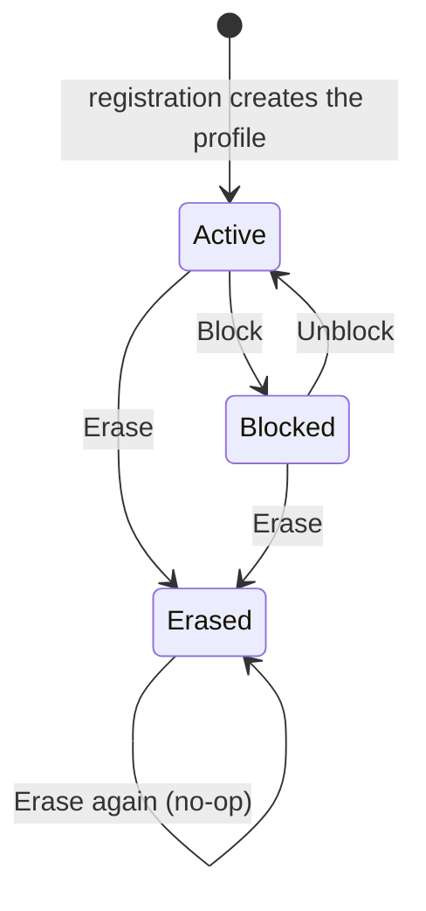

# Customers module

> **Code:** `src/Souq.Application/Features/Customers/`, `src/Souq.Domain/Entities/Customer.cs`, `src/Souq.Domain/ValueObjects/PostalAddress.cs`, `src/Souq.Infrastructure/Persistence/Queries/CustomerQueries.cs`, `src/Souq.API/Controllers/AccountController.cs`, `src/Souq.API/Controllers/AdminCustomersController.cs` · **Decisions:** [ADR-0027](../../11-ADR/0027-customer-profile-and-erasure.md), [ADR-0023](../../11-ADR/0023-sessions-and-credentials.md), [ADR-0033](../../11-ADR/0033-review-moderation-and-wishlist.md) (the wishlist is deleted on erasure) · **Change guide:** [ChangeGuide.md](ChangeGuide.md)

## Purpose

A shopper's commercial relationship with **one** store: their display name, contact details, address book, commercial standing, and their data rights. It is a module of its own because it is not login identity. Identity owns credentials, roles and sessions; Customers owns the commerce side of the same person. The split is what lets a store block someone from buying while they keep signing in to read their orders and download their data — and lets a staff account exist with no commerce profile at all.

## Responsibilities

- One `Customer` profile per login account per store, with the display name, contact email and phone.
- The address book: structured addresses, at most 20, with exactly one default shipping and one default billing address while any address exists.
- Commercial status: Active or Blocked.
- Data rights: a JSON export and an erasure that anonymizes in place, both available to the customer and to store staff, both audited.
- The admin customer list and detail, including order count, spend and last order date.

## Not this module's job

| Concern | Owner |
|---|---|
| Credentials, email confirmation, roles, sessions, disabling a login | Identity (`src/Souq.Domain/Identity/User.cs`, `Features/Auth`, `Features/Staff`) |
| Creating the profile at registration | Identity's `RegisterHandler` constructs the `Customer` |
| Orders, order history, the shipping-address snapshot on an order | Ordering (`GET /api/orders?customerId=`) |
| Reviews written by the customer | Reviews |
| Basket and wishlist rows | Shopping (erasure deletes them through Shopping's repositories) |
| Any email or in-app message about the customer | Notifications |
| Blocking or closing the whole store | Platform |

## Business concepts

- **Customer profile** — the store's record of a shopper; one per account per store, never shared between stores.
- **Contact email** — a copy of the login email taken at registration, used for order email. It is not an identity and is not unique.
- **Address book entry** — a saved postal address with an optional label.
- **Default shipping / default billing address** — the ones checkout uses without asking.
- **Blocked customer** — cannot place orders or write reviews, but can still sign in, read their orders, and export or erase their data.
- **Erased customer** — a profile stripped of personal data but still present, because orders and reviews point at it.
- **Data export** — everything the store holds about the person in one JSON file, with no credential material.

## Domain model

| Type | Kind | Path | Invariants it guards |
|---|---|---|---|
| `Customer` | aggregate root | `src/Souq.Domain/Entities/Customer.cs` | needs a saved `UserId` and a contact email; name 1–`Customer.FullNameMaxLength` (150); at most `Customer.MaxAddresses` (20) addresses; the first address becomes both defaults; exactly one default of each kind; removing a default moves it to the oldest remaining address; nothing may change after erasure; `Customer.Erase` is idempotent |
| `CustomerAddress` | entity in the aggregate | `src/Souq.Domain/Entities/Customer.cs` | created and changed only through `Customer` (internal constructor and mutators); label ≤ `CustomerAddress.LabelMaxLength` (50) |
| `PostalAddress` | value object | `src/Souq.Domain/ValueObjects/PostalAddress.cs` | recipient, phone, country and city and line 1 required; country is ISO 3166-1 alpha-2, upper-cased; every field trimmed and length-checked; phone accepts digits, spaces, `+`, `-` and parentheses, 6–20 characters; `ToSingleLine` produces the order's snapshot, cut to the caller's limit |
| `CustomerStatus` | enum | `src/Souq.Domain/Enums/CustomerStatus.cs` | Active = 0, Blocked = 1 |
| `InvalidCustomerDataException` | domain exception | `src/Souq.Domain/Exceptions/CustomerExceptions.cs` | code `InvalidCustomerData` |

**Aggregate boundary.** The address book is inside the aggregate, because "exactly one default" and "at most 20" are rules about the whole book. `CustomerRepository.GetByIdAsync` and `GetByUserIdAsync` therefore always `Include` the addresses; a handler that loads a customer another way would break those rules silently.

**Concurrency.** There is **no** `rowversion` on `Customers` (unlike `Orders`, `Products`, `Coupons`, `InventoryItem`, `Payment` and `User`). Two writes to the same profile are last-writer-wins per column, and the 20-address limit and single-default rule are checked in memory only, so two simultaneous requests from the same person could in principle both pass. In practice that means one customer with two tabs; nothing money-related depends on it.

**Lifecycle.**

Erased is terminal: every mutator calls the aggregate's erasure guard first, so even `Unblock` on an erased profile is a 422.

## Use cases

| Use case | Command or query | Handler | Who may call it | Endpoint |
|---|---|---|---|---|
| Read own profile | `GetMyProfileQuery` | `GetMyProfileHandler` | signed-in customer | `GET /api/account/profile` |
| Update own name and phone | `UpdateMyProfileCommand` | `UpdateMyProfileHandler` | signed-in customer | `PUT /api/account/profile` |
| List own addresses | `ListMyAddressesQuery` | `ListMyAddressesHandler` | signed-in customer | `GET /api/account/addresses` |
| Add an address | `AddMyAddressCommand` | `AddMyAddressHandler` | signed-in customer | `POST /api/account/addresses` (201) |
| Edit an address | `UpdateMyAddressCommand` | `UpdateMyAddressHandler` | signed-in customer | `PUT /api/account/addresses/{id}` |
| Delete an address | `RemoveMyAddressCommand` | `RemoveMyAddressHandler` | signed-in customer | `DELETE /api/account/addresses/{id}` |
| Set a default | `SetMyDefaultAddressCommand` (`AddressUse`) | `SetMyDefaultAddressHandler` | signed-in customer | `PUT /api/account/addresses/{id}/default-shipping`, `PUT /api/account/addresses/{id}/default-billing` |
| Export own data | `ExportMyDataQuery` (audited) | `ExportMyDataHandler` | signed-in customer | `GET /api/account/export` |
| Erase own account | `EraseMyAccountCommand` (audited, needs the password) | `EraseMyAccountHandler` | signed-in customer | `POST /api/account/erase` |
| List store customers | `ListCustomersQuery` | `ListCustomersHandler` | `customers.view` | `GET /api/admin/customers` |
| Customer detail | `GetCustomerQuery` | `GetCustomerHandler` | `customers.view` | `GET /api/admin/customers/{id}` |
| Block or unblock | `SetCustomerStatusCommand` (audited) | `SetCustomerStatusHandler` | `customers.manage` | `PUT /api/admin/customers/{id}/status` |
| Export a customer's data | `ExportCustomerDataQuery` (audited) | `ExportCustomerDataHandler` | `customers.manage` | `GET /api/admin/customers/{id}/export` |
| Erase a customer | `EraseCustomerCommand` (audited) | `EraseCustomerHandler` | `customers.manage` | `POST /api/admin/customers/{id}/erase` |

`CustomerErasure` is the single erasure path behind the last row and the self-service one. Validators: `AddressInputValidator`, `UpdateMyProfileValidator`, `AddMyAddressValidator`, `UpdateMyAddressValidator`, `EraseMyAccountValidator`, `ListCustomersQueryValidator`, `SetCustomerStatusValidator`.

## Public contracts

There is **no** `Features/Customers/Contracts` folder. Other modules reach this one through the domain port `ICustomerRepository` (`src/Souq.Domain/Interfaces/ICustomerRepository.cs`), which is a boundary leak rather than a contract — see Dependencies.

- `ICustomerQueries` (`src/Souq.Application/Features/Customers/ICustomerQueries.cs`) — this module's own read port (`ListAsync`, `FindDetailAsync`, `ExportAsync`), implemented by `CustomerQueries` in Infrastructure. Nothing outside Customers calls it.
- `CustomerErasure` — an Application service registered in `src/Souq.Application/DependencyInjection.cs`, used by both erase handlers.
- *ICustomerDirectory* (profile, status, default addresses) — **DEFERRED** by ADR-0027 until a second consumer or an extraction needs it. It is the intended replacement for the repository leak.

## Dependencies

**Uses**

| What | Why | Note |
|---|---|---|
| Identity's `IUserRepository` | `UpdateMyProfileHandler` calls `User.Rename` so the account name follows the profile name; `CustomerErasure` calls `User.Erase` | Customers writes the Identity aggregate — a boundary leak |
| Identity's `IRefreshTokenRepository`, `IPasswordHasher`, `ISessionValidator` | erasure revokes tokens and forgets the cached security stamp; self-erasure verifies the password | shared kernel (`Common.Security`) plus a domain port |
| Shopping's `IBasketRepository`, `IWishlistRepository` | erasure deletes buying intent | a boundary leak: Customers deletes another module's rows directly |
| Shared kernel | `ICurrentUser`, `IUnitOfWork`, `Result`/`Error`, `PaginatedList`/`PageRequest`, `IAuditable`, `TimeProvider` | |
| Other modules' **tables**, read-only in Infrastructure | `CustomerQueries` reads `Orders`, `OrderItems`, `Reviews` and `Users` for the admin stats, the export and the account facts on the detail | the deliberate ADR-0027 choice: read coupling in Infrastructure instead of a Customers → Ordering dependency in Application |

**Used by**

| Module | Where | What it takes |
|---|---|---|
| Identity | `RegisterHandler`, `AuthSessionIssuer`, `GetCurrentUserHandler` | creates the profile; resolves the `cid` claim through `FindIdByUserIdAsync` |
| Ordering | `CreateOrderHandler` | block check, the chosen address and the default billing address, the shipping country |
| Reviews | `CreateReviewHandler` | block check |
| Notifications | `OrderStatusChangedHandler`, `OrderEmailHandler` | the recipient account id, the contact email, and whether the profile is erased |

**Enforced vs convention.** `ModuleAndContractRuleTests` maps Customers to the `Customers` feature folder and forbids it from referencing any other feature folder's namespace — Customers is not in the allowed-contract map, and it needs no entry, because it references only Domain ports and shared kernel. The same suite forbids domain entities in request or response contracts and `TenantId` in a non-platform request. **Nothing enforces the domain-repository leaks in either direction:** neither Customers reaching into Identity and Shopping, nor Ordering, Reviews, Notifications and Identity loading the `Customer` aggregate.

## Data ownership

| Table | EF configuration | Tenant | Concurrency | Indexes that encode rules |
|---|---|---|---|---|
| `Customers` | `CustomerConfiguration` | `ITenantOwned` | none | unique `(TenantId, UserId)` — one profile per account per store, and the database is the last guard against two simultaneous registrations; `(TenantId, Email)` **not** unique (the contact email is not an identity); `(TenantId, Status)` for the admin filter; FK to `Users` with `Restrict` |
| `CustomerAddresses` | `CustomerAddressConfiguration` | `ITenantOwned` | none | shadow FK `CustomerId` with cascade delete and orphan removal; index on `CustomerId` |

`Reviews`, `Orders` and `CouponRedemptions` hold composite foreign keys to `(TenantId, Id)` of `Customers` with `Restrict` — the structural reason erasure anonymizes instead of deleting.

Data of other modules that this module reads (all in `CustomerQueries`, `AsNoTracking`): `Orders` and `OrderItems` for order count, spend (Paid, Shipped and Delivered lines minus those orders' discounts, in the store currency) and last order date; `Reviews` for the export; `Users` for `EmailConfirmed` and `LastLoginAt` on the detail.

Migration: `Phase7Customers`, additive (the profile columns and the `CustomerAddresses` table).

## API

| Method | Route | Authorization | Module flag | Use case |
|---|---|---|---|---|
| GET | `/api/account/profile` | `[Authorize]` + commerce profile | — | read own profile |
| PUT | `/api/account/profile` | `[Authorize]` + commerce profile | — | update name and phone |
| GET | `/api/account/addresses` | `[Authorize]` + commerce profile | — | list addresses |
| POST | `/api/account/addresses` | `[Authorize]` + commerce profile | — | add (201) |
| PUT | `/api/account/addresses/{id}` | `[Authorize]` + commerce profile | — | edit |
| DELETE | `/api/account/addresses/{id}` | `[Authorize]` + commerce profile | — | remove |
| PUT | `/api/account/addresses/{id}/default-shipping` | `[Authorize]` + commerce profile | — | set default shipping |
| PUT | `/api/account/addresses/{id}/default-billing` | `[Authorize]` + commerce profile | — | set default billing |
| GET | `/api/account/export` | `[Authorize]` + commerce profile | — | export (attachment) |
| POST | `/api/account/erase` | `[Authorize]` + commerce profile + password | — | erase own account |
| GET | `/api/admin/customers` | `customers.view` | — | list |
| GET | `/api/admin/customers/{id}` | `customers.view` | — | detail |
| PUT | `/api/admin/customers/{id}/status` | `customers.manage` | — | block / unblock |
| GET | `/api/admin/customers/{id}/export` | `customers.manage` | — | export (attachment) |
| POST | `/api/admin/customers/{id}/erase` | `customers.manage` | — | erase |

Customers is not an optional module: `StoreModules` deliberately has no flag for it.

**Frontend.** The account shell `frontend/src/pages/account/AccountLayout.jsx` holds `frontend/src/pages/account/Profile.jsx` (with `frontend/src/pages/account/ProfileForm.jsx` and `frontend/src/pages/account/PrivacyPanel.jsx`) and `frontend/src/pages/account/Addresses.jsx` (with `frontend/src/pages/account/AddressBook.jsx` and `frontend/src/pages/account/AddressFormDrawer.jsx`); pure logic in `frontend/src/features/account/addressForm.js` and `frontend/src/features/account/download.js`. Admin: `frontend/src/pages/admin/Customers.jsx` and `frontend/src/pages/admin/CustomerDetailDrawer.jsx`, with `frontend/src/features/admin/customers/customerActions.js` mirroring the entity rules (an erased customer offers no actions). Checkout picks a saved address in `frontend/src/pages/checkout/AddressStep.jsx`.

## Security and permissions

- **No customer id in any account request.** The caller is always `ICurrentUser.CustomerId` (the `cid` claim) via `RequireCustomerId`: a guest gets 401 `Unauthenticated`, a staff account without a commerce profile gets 403 `CustomerAccountRequired`. Ownership of an address is decided by looking it up inside the loaded aggregate, so another customer's address id is a 404, never a 403.
- **Two permissions, on purpose** (`Permissions.Customers`): `customers.view` for looking people up, `customers.manage` for blocking, exporting and erasing. `RolePermissions` gives TenantAdmin both and TenantStaff only `customers.view`, so support staff can help without being able to delete.
- **Self-erasure needs the current password**, so a stolen access token alone cannot destroy an account.
- **Audited** (`AuditBehavior`, written in the same unit of work and discarded if the use case fails): `customer.status-changed` with the new status, `customer.data-exported` and `customer.erased`. The self-service variants carry `self = true` and no target id. Export is a query and is audited anyway, because it discloses a complete personal record.
- **Erasure ends sessions**: the security stamp rotates, refresh tokens are revoked, and `ISessionValidator.Forget` clears this instance's cache. The stamp cache lives 30 seconds, so another instance can still accept an old access token for up to that long.
- The export contains no password hash and no tokens.

## Tenant behaviour

`Customer` and `CustomerAddress` are `ITenantOwned`: the named query filter scopes every read, `TenantWriteGuardInterceptor` stamps `TenantId` on insert and refuses cross-store writes. Another store's customer id is a 404 on every admin route (`TenantIsolationTests`). The same person registering in two stores gets two `User` rows and two `Customer` rows with different `TenantId`s and no link between them. The admin list reports spend in `ITenantContext`'s store currency.

## Events and background work

This module raises no domain events, enqueues no outbox messages and has no hosted service. Registration (Identity) enqueues `EmailVerificationRequested` in the same transaction that creates the profile. Notifications reads the profile at dispatch time — which is why an erasure that lands between an order change and its dispatch silently suppresses that customer's notification and email.

## External integrations

None.

## Tests

| Level | Class (file) | Coverage |
|---|---|---|
| Domain | `CustomerProfileTests` | address normalization and the single-line snapshot, defaults and their transfer on delete, the 20-address and label limits, profile update and phone validation, block/unblock, erasure (including `User.Erase`), the order's address guard |
| Domain | `DomainExceptionCodeTests` | `InvalidCustomerData` code stability |
| Application | `CustomerAccountHandlersTests` (`tests/Souq.Application.Tests/Customers/CustomerHandlersTests.cs`) | profile update renames the account too, the first address becomes the default, a foreign address id is not found, erasure with the wrong and the right password, admin block/unblock and an unknown customer |
| Application | `CreateOrderCustomerRulesTests` (same file) | a blocked customer cannot order, the chosen address becomes the order snapshot, a foreign address is rejected |
| Application | `CreateReviewHandlerTests` | a blocked customer cannot review |
| Integration | `CustomerAccountTests` | profile and address book, cross-customer 404s, an order keeping its snapshot after the address changes, the admin list/detail/blocking, export and self-erasure, admin export and erasure |
| Integration | `TenantIsolationTests` | every admin customer route and every account address route across stores, plus a state check that nothing changed |
| Integration | `WishlistTests` | erasure deletes the wishlist |
| Integration | `AuthorizationMatrixTests` | every endpoint's authorization |
| Architecture | `ModuleAndContractRuleTests`, `TenancyRuleTests` | module mapping, no entity in contracts, no tenant-filter bypass |
| Frontend | `frontend/src/features/admin/customers/customerActions.test.js`, `frontend/src/features/account/addressForm.test.js` | admin actions per state, query building, address trimming and required-field reporting |

**Test gaps worth knowing:** nothing asserts what erasure leaves behind besides orders and the wishlist (in-app notifications and audit rows are untested), the export's review section is not asserted, and there is no concurrency test on the address book.

## Failure modes

| Situation | Exception or error | HTTP | Handling |
|---|---|---|---|
| Guest on an account route | `[Authorize]` | 401 `Unauthenticated` | sign in |
| Staff account on an account route | `CustomerAccountRequiredException` | 403 `CustomerAccountRequired` | mapped in `GlobalExceptionHandler` |
| Profile missing for the `cid` claim | `Error.NotFound` | 404 `NotFound` | the token outlived the profile |
| Address id outside the caller's book | `Error.NotFound` | 404 `NotFound` | existence of others' rows is never revealed |
| Invalid input shape (name, phone, country length…) | FluentValidation | 400 `ValidationFailed` | field errors in the problem document |
| 21st address, invalid country code, changing an erased profile | `InvalidCustomerDataException` | 422 `InvalidCustomerData` | domain rule |
| Empty or over-long name at the domain level | `InvalidIdentityOperationException` | 422 `InvalidIdentityOperation` | `Customer.Rename` shares Identity's exception |
| Wrong password on self-erasure | `Error.Validation("CurrentPasswordIncorrect")` | 400 | nothing is written |
| Another store's customer on an admin route | tenant filter ⇒ null ⇒ `Error.NotFound` | 404 `NotFound` | |
| Blocked customer ordering or reviewing | `Error.Forbidden("CustomerBlocked")` raised in Ordering / Reviews | 403 | |
| Old access token after erasure | session validation | 401 | immediate on this instance, ≤ 30 s elsewhere |
| Race creating two profiles for one account | unique `(TenantId, UserId)` ⇒ `UniqueConstraintViolationException` | 409 `DuplicateValue` | |
| Checkout with an address id from another book | `Error.Validation("AddressNotFound")` in `CreateOrderHandler` | 400 | |

## Common change scenarios

Add a profile field · change what erasure removes or keeps · add marketing preferences · extend the admin list or detail · move the block check · change address validation · replace the repository leak with a narrow contract. Details in [ChangeGuide.md](ChangeGuide.md).

## Known limitations

- **The contact email is a copy.** Changing the login email is not self-service (it needs a verification flow), and no flow keeps `Customers.Email` in step with `Users.Email`. Order email goes to the profile's copy.
- **No concurrency token.** See Domain model.
- **Erasure keeps the order's address snapshot** — the recipient's name, phone and address stay in `Orders` as part of the invoice. A retention purge is PLANNED (Phase 20 in [ProductRoadmap.md](../../12-ROADMAP/ProductRoadmap.md)).
- **Erasure leaves in-app `Notifications` rows** addressed to that account (they hold an order number and status, no personal data) and every earlier audit row.
- **The export is narrower than the store's holdings**: no in-app notifications, wishlist, basket, coupon redemptions, payments, or the login metadata that the admin detail shows.
- **Blocking stops only ordering and reviewing.** Only `CreateOrderHandler` and `CreateReviewHandler` load the profile and check `IsBlocked`; a blocked customer can still fill a basket and a wishlist.
- **Erasure does not cancel a Pending order**; it expires through the checkout sweep.
- **Admin list cost**: order count, spend and last order date are correlated subqueries evaluated per row, and keyword search is a `LIKE '%…%'` over name, email and phone — neither is index-assisted.
- **Boundary leaks in both directions**, listed under Dependencies. The intended fix is *ICustomerDirectory*.

## Future evolution

- *ICustomerDirectory*, replacing `ICustomerRepository` for Ordering, Reviews and Notifications — **DEFERRED** (ADR-0027: waiting for a second consumer or an extraction).
- Marketing preferences — **PLANNED** in the roadmap's Phase 7 entry, which points at Phase 14; Phase 14 shipped without them, so they currently have no phase. Modules.md is explicit that they belong here, not in Identity.
- Self-service email change — **DEFERRED** (needs a verification flow).
- A retention policy purging erased customers' old order snapshots — **PLANNED** (Phase 20, compliance).
- A customer language preference for email — **DEFERRED** (ADR-0034); the field would most naturally live on `Customer`.
