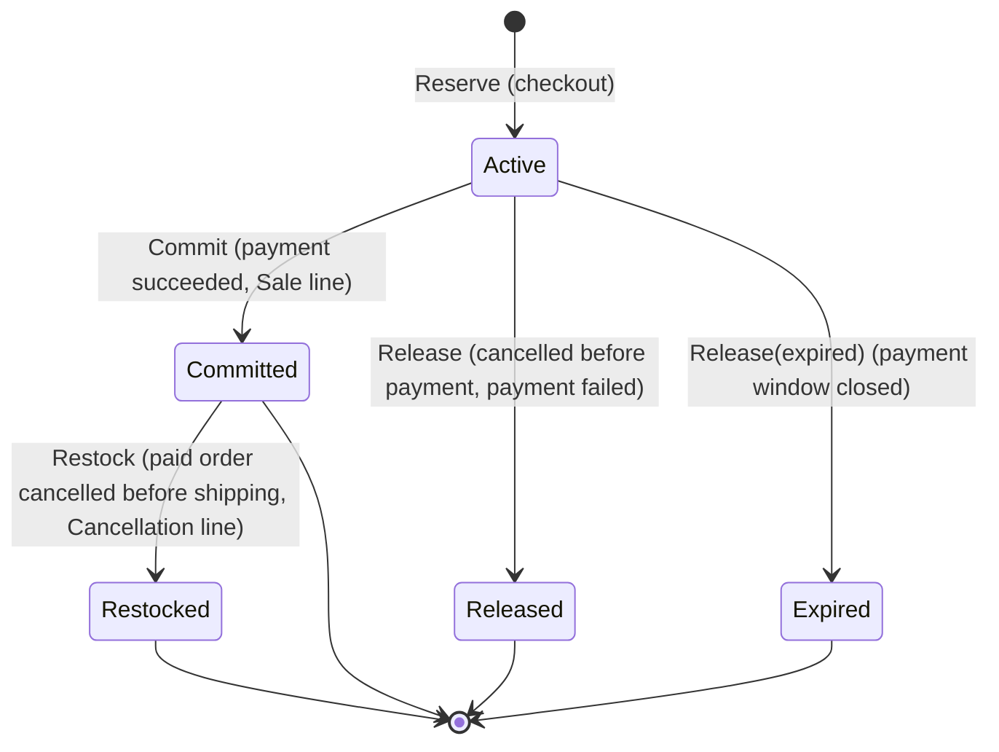

# Inventory module

> **Code:** `src/Souq.Application/Features/Inventory`, `src/Souq.Domain/Entities/InventoryItem.cs`, `src/Souq.Domain/Entities/StockMovement.cs`, `src/Souq.Infrastructure/Persistence/Repositories/InventoryRepository.cs`, `src/Souq.Infrastructure/Persistence/Queries/InventoryQueries.cs`, `src/Souq.Infrastructure/BackgroundJobs/ReservationExpiryService.cs` · **Decisions:** [ADR-0026](../../11-ADR/0026-inventory-reservations.md), [ADR-0013](../../11-ADR/0013-optimistic-concurrency.md), [ADR-0021](../../11-ADR/0021-transaction-boundaries.md), [ADR-0034](../../11-ADR/0034-notifications-outbox.md) · **Change guide:** [ChangeGuide.md](ChangeGuide.md)

## Purpose

Inventory answers two questions: how many units of a sellable variant exist, and who is currently holding them. It is a separate module from [Catalog](../Catalog/README.md) because its invariants, its change rate and its failure modes are different: a product description is edited a few times a year by one person, while a stock row is written by every checkout, every payment, every cancellation and every correction, and must never be wrong. That combination — a hot row, an audit-grade ledger, and a hold that expires — is why [Modules.md](../Modules.md) marks Inventory as an extraction candidate and why its contract has been reserve → commit/release from the first day.

## Responsibilities

- Stock per sellable variant: `OnHand`, `Reserved`, `Available = OnHand − Reserved`, and a low-stock threshold.
- The ledger: one `StockMovement` for every change of `OnHand`, created only by the entity that made the change.
- Holds for unpaid orders: create, commit, release, expire and restock `StockReservation` rows, idempotently.
- Surviving concurrency: an optimistic token on the item plus a bounded retry from a fresh read.
- Admin operations: the stock list, the low-stock list, a product's movement ledger, delta corrections and the threshold.
- Opening stock for a newly created variant, by implementing Catalog's `IVariantStockInitializer`.
- Raising `StockBecameLow` when available stock crosses the threshold downwards.

## Not this module's job

| Concern | Owner |
|---|---|
| Deciding that an order is abandoned, cancelling it, or confirming a payment | Ordering (`ExpireStaleCheckoutsHandler`, `OrderPaymentConfirmation`, `UpdateOrderStatusHandler`) |
| Running the periodic sweep | Infrastructure (`ReservationExpiryService`, which sends Ordering's command per store) |
| Sending the low-stock alert | Notifications (`StockBecameLowHandler`) |
| Product names, prices, images, status | Catalog |
| Showing availability in a basket, and reserving from a basket (it never does) | Shopping, through `IStockAvailability` |
| Money, refunds, payment intents | Payments |
| What a reservation reference means (`order:{id}`) | Ordering owns the format (`OrderStockReference`); Inventory stores an opaque string |

## Business concepts

- **On hand** — units physically in the warehouse, including units held for unpaid orders.
- **Reserved** — units held by open, unpaid orders.
- **Available** — `OnHand − Reserved`; what can still be sold. Never negative.
- **Reservation** — an explicit row holding a quantity for a reference until an expiry instant.
- **Commit** — payment succeeded: the held units leave `OnHand`. This is the only place a `Sale` is recorded.
- **Release** — the hold ends without a sale (cancelled before payment, payment failed).
- **Expire** — the hold ended because the payment window closed.
- **Restock** — a *paid* order was cancelled before shipping: the sold units come back.
- **Movement (ledger line)** — an append-only record of one change of on hand, with a reason, a signed quantity and the resulting on-hand value.
- **Adjustment** — an administrative correction expressed as a delta plus a reason, never as an absolute value.
- **Low-stock threshold** — the level at which the store wants to be warned; "low" is measured on *available*, because reserved units can no longer be sold.

## Domain model

| Type | Kind | Path | Invariants it guards |
|---|---|---|---|
| `InventoryItem` | aggregate root | `src/Souq.Domain/Entities/InventoryItem.cs` | Opened only for a saved product and variant (both ids > 0); `Receive` accepts only `Purchase` or `Return` and a positive quantity; `Adjust` needs a non-zero delta and a reason ≤ `ReasonMaxLength`, and refuses to push `OnHand` below `Reserved`; `Reserve` refuses a quantity above `Available` (`InsufficientStockException`) and refuses non-positive quantities; `Commit`, `Release` and `Restock` only act on a reservation of this item and only once (status-driven); threshold ≥ 0; **every change of `OnHand` returns exactly one `StockMovement`**, so Σ movements = `OnHand`; raises `StockBecameLow` on a downward crossing of the threshold |
| `StockReservation` | entity, created only by `InventoryItem.Reserve` and closed only by the item's methods | `src/Souq.Domain/Entities/InventoryItem.cs` | Reference required and ≤ `ReferenceMaxLength`; quantity positive (also a database check); each transition out of `Active` happens once and is final |
| `StockMovement` | append-only ledger entity, `internal` constructor | `src/Souq.Domain/Entities/StockMovement.cs` | Quantity change never zero and signed; `NewQuantity` is the on-hand value after the change; the note is truncated to `NoteMaxLength` rather than failing a real movement |
| `ReservationStatus` | enum | `src/Souq.Domain/Enums/ReservationStatus.cs` | `Active` 0, `Committed` 1, `Released` 2, `Expired` 3, `Restocked` 4 |
| `StockMovementType` | enum | `src/Souq.Domain/Enums/StockMovementType.cs` | `Purchase` 0, `Sale` 1, `Adjustment` 2, `Return` 3, `Cancellation` 4 |
| `StockBecameLow` | domain event | `src/Souq.Domain/Events/DomainEvents.cs` | Carries `ProductId`, `VariantId`, `Available`, `Threshold` — ids and numbers only, no personal data |
| `InvalidInventoryOperationException` | domain exception | `src/Souq.Domain/Exceptions/InventoryExceptions.cs` | Code `InvalidInventoryOperation` → 422 |
| `InsufficientStockException` | domain exception | `src/Souq.Domain/Exceptions/DomainException.cs` | Code `InsufficientStock` → 422, message carries the requested and available quantities |

**What each operation does**

| Operation | On hand | Reserved | Available | Ledger line | Event |
|---|---|---|---|---|---|
| `Receive(q, Purchase\|Return)` | +q | — | +q | `Purchase` or `Return`, +q | none |
| `Adjust(δ, reason)` | +δ | — | +δ | `Adjustment`, δ | `StockBecameLow` when available crosses down |
| `Reserve(q, …)` | — | +q | −q | none — the reservation row *is* the record of the hold | `StockBecameLow` when available crosses down |
| `Commit(reservation)` | −q | −q | unchanged | `Sale`, −q | none |
| `Release(reservation, expired)` | — | −q | +q | none | none |
| `Restock(reservation)` | +q | — | +q | `Cancellation`, +q | none |

Two invariants follow and are asserted end to end by `InventoryAndOrderTests`: Σ ledger = `OnHand`, and Σ active reservations = `Reserved`.

**Reservation lifecycle**

Every transition is guarded by the current status, so replaying an operation does nothing — which is what makes `CommitAsync` and `CancelAsync` safe to call twice (a client confirmation racing a gateway webhook, or the expiry sweep meeting a late payment).

**Concurrency.** `InventoryItems` carries a shadow `RowVersion` ([ADR-0013](../../11-ADR/0013-optimistic-concurrency.md)). `StockReservations` and `StockMovements` have no token and need none: every reservation transition also changes the item's `OnHand` or `Reserved`, so the item's token covers the whole operation. `InventoryWriter.SaveAsync` wraps "load → apply through the entity → save": on `ConcurrencyConflictException` it calls `IInventoryRepository.Reset()` (detaching items, reservations and movements from the failed attempt) and runs the work again from a fresh read, up to `InventoryWriter.MaxAttempts` (5). Inside a caller's transaction EF creates a savepoint before each save and rolls back to it, so a failed attempt leaves no rows. The result is the behaviour [ADR-0026](../../11-ADR/0026-inventory-reservations.md) wanted: the loser of a race for the last unit gets a truthful `422 InsufficientStock` instead of a transient 409, and the last unit is sold exactly once.

## Use cases

| Use case | Command or query | Handler | Who may call it | Endpoint |
|---|---|---|---|---|
| Stock list (lowest available first) | `GetInventoryQuery` | `GetInventoryHandler` | `inventory.view` | `GET /api/admin/inventory` |
| Low-stock list and badge count | `GetLowStockQuery` | `GetLowStockHandler` | `inventory.view` | `GET /api/admin/inventory/low-stock` |
| A product's ledger | `GetStockMovementsQuery` | `GetStockMovementsHandler` | `inventory.view` | `GET /api/admin/inventory/{productId}/movements` |
| Correct stock by a delta with a reason | `AdjustStockCommand` | `AdjustStockHandler` | `inventory.view` **and** `inventory.manage` | `POST /api/admin/inventory/{productId}/adjustments` |
| Change the low-stock threshold | `SetLowStockThresholdCommand` | `SetLowStockThresholdHandler` | `inventory.view` **and** `inventory.manage` | `PUT /api/admin/inventory/{productId}/threshold` |
| Hold stock for an order | `IInventoryReservations.ReserveAsync` | `InventoryReservations` | Ordering (`CreateOrderHandler`) | no endpoint of its own |
| Turn a hold into a sale | `IInventoryReservations.CommitAsync` | `InventoryReservations` | Ordering (`OrderPaymentConfirmation`, `ExpireStaleCheckoutsHandler`) | — |
| Release, expire or restock | `IInventoryReservations.CancelAsync` | `InventoryReservations` | Ordering (`OrderPaymentConfirmation`, `UpdateOrderStatusHandler`, `ExpireStaleCheckoutsHandler`) | — |
| Find references whose hold has expired | `IInventoryReservations.FindExpiredAsync` | `InventoryReservations` | Ordering's expiry use case | — |
| Read availability without holding it | `IStockAvailability.AvailableAsync` | `InventoryReservations` | Ordering (pre-check), Shopping (basket and views) | — |
| Open stock for a new variant | `IVariantStockInitializer.InitializeAsync` | `VariantStockInitializer` | Catalog (`CreateProductHandler`) | — |

Both commands are `IAuditable`; both, and the three queries, are validated (`AdjustStockValidator`, `SetLowStockThresholdValidator`, `GetInventoryQueryValidator`, `GetLowStockQueryValidator`, `GetStockMovementsQueryValidator`).

**Frontend.** `/admin/inventory` (`frontend/src/pages/admin/Inventory.jsx`) lists stock server-paged with on hand, reserved and available, shows a low-stock banner from `GET /api/admin/inventory/low-stock`, and opens the adjustment and ledger drawers (`AdjustStockDrawer`, `StockMovementDrawer`, in the same file). The store dashboard (`frontend/src/pages/admin/Dashboard.jsx`) shows healthy, low and out-of-stock counts, but those come from [Reporting](../Reporting/README.md)'s `GetStoreDashboardQuery`, not from this module's endpoints.

## Public contracts

Declared in `src/Souq.Application/Features/Inventory/Contracts/InventoryContracts.cs` and implemented by `InventoryReservations` (one scoped instance serves both interfaces, wired in `src/Souq.Application/DependencyInjection.cs`):

- **`IInventoryReservations`** — `ReserveAsync(reference, lines, ct)` (all lines or nothing; two lines for the same variant become one hold for their sum), `CommitAsync(reference, ct)`, `CancelAsync(reference, reason, expired, ct)`, `FindExpiredAsync(max, ct)`. Callers: `CreateOrderHandler`, `OrderPaymentConfirmation`, `UpdateOrderStatusHandler`, `ExpireStaleCheckoutsHandler`.
- **`IStockAvailability`** — `AvailableAsync(variantIds, ct)`, a read used for an early, friendly rejection; it is explicitly *not* a hold. Callers: `CreateOrderHandler`, `BasketStock.ShortageAsync` (add and change quantity), `BasketViews`.
- **`ReservationLine(VariantId, Quantity, DisplayName)`** — the display name travels with the line because Inventory does not read the catalog to build an out-of-stock message.
- Each operation saves its own changes and retries on conflict, so a caller who needs atomicity with its own writes saves first and wraps both in `IUnitOfWork.InTransactionAsync` — exactly what `CreateOrderHandler` and `OrderPaymentConfirmation` do. No network call happens inside ([ADR-0021](../../11-ADR/0021-transaction-boundaries.md)).

Implemented for another module: **`IVariantStockInitializer`** (Catalog's port) by `VariantStockInitializer`, which creates the item, saves to get its id, and records the opening quantity as a `Purchase` movement.

Read port for its own screens: **`IInventoryQueries`**, implemented by `InventoryQueries`.

## Dependencies

**Uses**

- Catalog's contracts folder — the only allowed cross-module reference for Inventory, and only to *implement* `IVariantStockInitializer`.
- Domain ports `IInventoryRepository`, `IStockMovementRepository`, `IUnitOfWork`.
- `TimeProvider` for every "now" (expiry instants and closing timestamps are testable with a fixed clock).
- `InventorySettings` (`Inventory:ReservationMinutes`, `Inventory:SweepIntervalSeconds`), bound and validated at startup in `AddInventory` in `src/Souq.Infrastructure/DependencyInjection.cs`.

**Boundary leaks**

| Leak | Where | Note |
|---|---|---|
| Inventory reads Catalog tables directly | `InventoryQueries.StockedItems` and `PageAsync` (join `Products`, `ProductVariants`, `ProductTranslations`, `ProductImages`, `Categories`) | The direction Inventory → Catalog is allowed, but it happens by reading tables, not through a contract. The write side no longer does: since ADR-0039 `InventoryRepository.ListForProductAsync` counts the product's own stock rows instead of joining the variant's `IsDefault` flag. The admin API still accepts a **product** id, a Catalog identity, beside the variant id |
| Catalog and Shopping read Inventory tables directly | `CatalogQueries`, `WishlistQueries` (`OnHand − Reserved`) | Accepted in [ADR-0026](../../11-ADR/0026-inventory-reservations.md) to keep list queries to one statement |
| Infrastructure references an Ordering use case | `ReservationExpiryService` sends `ExpireStaleCheckoutsCommand` | Deliberate: only Ordering may decide what happens to an order. Infrastructure is not scanned by the module tests |

**Used by:** Ordering (reservations and availability), Shopping (availability only — baskets never reserve, which is the answer Phase 8 gave to Phase 6's open question), Catalog (opening stock, through its own port), Notifications (consumes `StockBecameLow`).

**Enforced vs convention.** `ModuleAndContractRuleTests` maps Inventory to the `Inventory` feature folder, allows Inventory → `Features.Products.Contracts` only, allows Ordering and Shopping to reach `Features.Inventory.Contracts`, and fails on any cycle. Everything in Infrastructure, and any use of `Souq.Domain` types, is convention only.

## Data ownership

| Table | EF configuration | Tenant-owned | Concurrency token | Constraints and indexes that encode business rules |
|---|---|---|---|---|
| `InventoryItems` | `InventoryItemConfiguration` (`src/Souq.Infrastructure/Persistence/Configurations/InventoryConfiguration.cs`) | yes | `RowVersion` | `CK_InventoryItems_Quantities` (`OnHand >= 0 AND Reserved >= 0 AND Reserved <= OnHand`), `CK_InventoryItems_Threshold`; unique `(TenantId, VariantId)` — one row per variant; `(TenantId, ProductId)`; alternate key `(TenantId, Id)`; composite `Restrict` FKs to `ProductVariants` and `Products` |
| `StockReservations` | `StockReservationConfiguration` (same file) | yes | none (covered by its item's token) | `CK_StockReservations_Quantity` (`Quantity > 0`); `(TenantId, Reference)` for the order operations; `(TenantId, ExpiresAt)` filtered `[Status] = 0` so the expiry sweep scans only live holds; composite `Restrict` FK to the item |
| `StockMovements` | `StockMovementConfiguration` | yes | none (append-only) | `(ProductId, CreatedAt)` for the ledger screen, `(InventoryItemId, CreatedAt)` for reconciliation; composite `Restrict` FKs to `Products` and `InventoryItems` |

The module reads two Catalog tables it does not own (`Products`, `ProductVariants`) plus catalog child tables for display. Migration: `20260911141732_Phase6Inventory`, hand-ordered to copy data before dropping `Products.StockQuantity` and `Products.LowStockThreshold`; it opened one item per default variant, recreated holds for `Pending` and `Paid` orders, attached historical movements to their item, and wrote an opening-balance `Adjustment` wherever the ledger did not add up. `Down()` restores the available quantity to `Products` (development only).

## API

All routes sit under `api/admin/inventory` with `[HasPermission(Permissions.Inventory.View)]` on the controller; the write endpoints add `[HasPermission(Permissions.Inventory.Manage)]`, so a caller needs both policies. No module flag applies. Every list is paged and capped at `PagingRules.MaxPageSize`.

| Method | Route | Authorization | Module flag | Use case |
|---|---|---|---|---|
| GET | `/api/admin/inventory` | `inventory.view` | — | One row per variant of every non-archived product, lowest available first, then product and variant id (default page size 50) |
| GET | `/api/admin/inventory/low-stock` | `inventory.view` | — | Same list filtered to `available <= threshold`; the Inventory page's low-stock banner reads `totalCount` with `pageSize=1` (default 20) |
| GET | `/api/admin/inventory/{productId}/movements` | `inventory.view` | — | The ledger of all the product's variants, newest first, id as tie-breaker (default 50); each line carries its `VariantId` |
| POST | `/api/admin/inventory/{productId}/adjustments` | `inventory.view` + `inventory.manage` | — | `{ "delta": -2, "reason": "…" }` → 200 `StockLevelDto`; `422 VariantRequired` when the product has more than one stock row |
| PUT | `/api/admin/inventory/{productId}/threshold` | `inventory.view` + `inventory.manage` | — | `{ "lowStockThreshold": 3 }` → 200 `StockLevelDto`; `422 VariantRequired` as above |
| GET | `/api/admin/inventory/variants/{variantId}/movements` | `inventory.view` | — | One variant's ledger, newest first (default 50) |
| POST | `/api/admin/inventory/variants/{variantId}/adjustments` | `inventory.view` + `inventory.manage` | — | Same body and rules as the product route, for that variant's row; audited with target `ProductVariant` |
| PUT | `/api/admin/inventory/variants/{variantId}/threshold` | `inventory.view` + `inventory.manage` | — | Same body and rules as the product route, for that variant's row |

`InventoryItemDto.Id` is the **product** id and `InventoryItemDto.VariantId` the variant's: the product routes stay valid for a product with one variant, and the variant routes address any row ([ADR-0039](../../11-ADR/0039-product-variants-order-identity.md)). Each row also carries `VariantLabel` (the option values, composed with Catalog's `VariantLabels`; null for a simple product) and `VariantIsActive` ([ADR-0040](../../11-ADR/0040-product-option-model.md), BR-INV-13). The admin screen uses the variant routes only, through `frontend/src/pages/admin/StockDrawers.jsx`, which the product variants page shares. `StockLevelDto` returns `OnHand`, `Reserved`, `Available`, `LowStockThreshold`, `IsLowStock` and `VariantId` so the UI can update its row without a second request. The inventory list shows `Draft` and `Active` products (stock is real for both) and excludes `Archived` ones.

## Security and permissions

- `inventory.view` and `inventory.manage` (`Permissions.Inventory`), both granted to `TenantAdmin` and `TenantStaff` (`RolePermissions`). Nothing here is public: customers never see on hand or reserved, which is why `InventoryItemDto` is deliberately separate from `ProductDto` — though `ProductDto.StockQuantity` does expose the available quantity (see Catalog's limitations).
- Audit: `inventory.adjusted` (metadata `delta`, `reason`) and `inventory.threshold-changed` (metadata `threshold`), written in the same unit of work as the change. The adjustment reason is free text supplied by staff and ends up both in the audit metadata and in the ledger note.
- Tenant isolation: the repository and the query service are tenant-filtered, so another store's product id is simply "not found" (404). Reservation references are opaque strings, scoped per store by the same filter.
- No secrets, no personal data: `StockBecameLow` carries ids and quantities only ([ADR-0034](../../11-ADR/0034-notifications-outbox.md)).

## Tenant behaviour

- All three tables are `ITenantOwned` with composite foreign keys, so an item, a hold and a ledger line can never cross stores.
- The expiry sweep runs **per store**: `StoreSweepService` lists active **and suspended** stores (`ITenantDirectory.ListForBackgroundSweepsAsync`) and runs the work inside each store's scope via `TenantScopes.RunAsync`, so the query filter and the write guard behave exactly as in an HTTP request. Suspended stores are swept deliberately (M5, closing R-24): their shoppers cannot complete a payment, so nothing else would ever release those holds, and the store would return from suspension with stock reserved against orders that can never complete. Provisioning stores have nothing to expire and archived stores are closed records, so neither is swept — `BackgroundSweepScopeTests` pins all four cases.
- The reservation window is a platform-wide setting today (`Inventory:ReservationMinutes`), not a per-store one.

## Events and background work

- **`StockBecameLow`** is raised by `InventoryItem.RaiseIfBecameLow`, and only when: the item is already persisted (`Id > 0`), available was **above** the threshold before the operation, and is at or below it after. It therefore fires on `Adjust` (a downward correction) and on `Reserve` (a checkout), once per crossing — not once per sale afterwards. It does **not** fire on `Receive`, `Release` or `Restock` (those raise availability), nor on `Commit` (available does not change), nor on `SetLowStockThreshold` (raising the threshold above current availability never alerts), nor for a product created with an opening quantity already below its threshold.
- The event is written to `OutboxMessages` in the same `SaveChanges` as the stock change (`AppDbContext.CaptureDomainEvents`) and discarded if that save fails; a retry that re-applies the change raises it again.
- **Consumer:** `StockBecameLowHandler` (Notifications) loads the product name through `IProductRepository` and creates an in-app `NotificationKinds.LowStock` notification for every active account whose role grants `inventory.view`. There is no low-stock email.
- **Hosted service:** `ReservationExpiryService` (a `StoreSweepService`) ticks every `Inventory:SweepIntervalSeconds` (default 60; `0` disables it, which is how tests avoid racing it) and sends `ExpireStaleCheckoutsCommand(Max = 50)` for each active store. It assumes a single instance; two instances are safe but redundant.

## External integrations

None directly. The gateway call that decides whether an expired checkout may be cancelled lives in Ordering's `ExpireStaleCheckoutsHandler`, outside any transaction ([ADR-0021](../../11-ADR/0021-transaction-boundaries.md)).

## Tests

| Layer | Classes | What they pin |
|---|---|---|
| Domain | `InventoryItemTests` | A new item is empty and low at the default threshold; only saved variants get stock; receive, adjust (delta, reason, never below reserved), reserve (available only), commit once with a `Sale` line, release once without a line, restock only a committed hold, a foreign reservation rejected, the ledger matching on hand across every operation, the threshold rule |
| Domain | `DomainEventTests`, `DomainExceptionCodeTests` | One event per downward crossing, no event from an unsaved item; the codes `InvalidInventoryOperation` and `InsufficientStock` |
| Application | `InventoryReservationsTests` | Reserving with the configured lifetime and one save; two lines for one variant merged; a shortage in one line rejects the whole reservation and forgets partial changes; a conflict re-reads and then succeeds; repeated conflicts surface after the attempt limit; commit converts active holds once; cancel releases active holds and restocks committed ones with a `Cancellation` line; expiry marks the hold `Expired`; availability per variant |
| Application | `InventoryCommandsTests` | A product without stock is 404; the delta is applied to the *current* value with its reason recorded; a correction below reserved is rejected without saving; the threshold is set from the inventory module; the product routes refuse a product with several stock rows (`VariantRequired`) and change nothing; the variant routes change only their row, with their audit records and validators |
| Application | `CreateProductHandlerTests`, `CreateOrderHandlerTests`, `ExpireStaleCheckoutsHandlerTests`, `ConfirmOrderPaymentHandlerTests`, `CancelMyOrderHandlerTests`, `UpdateOrderStatusHandlerTests`, `ProcessPaymentWebhookHandlerTests`, `OrderNotificationHandlersTests` | Opening stock inside the creation transaction; the reserve/commit/cancel calls on every order path; the low-stock notification handler |
| Integration | `InventoryAndOrderTests` | Two contexts reserving the last unit — the database rejects the second; parallel checkouts sell the last unit exactly once and never over-reserve; Σ ledger = on hand and Σ active holds = reserved after every step of the order lifecycle; cancelling a pending order releases its hold once; a correction neither erases a sale nor drops below reserved, and editing the product does not touch stock; the expiry sweep cancels an abandoned order and frees its hold |
| Integration | `ProductVariantTests` | Variant-keyed adjustment and threshold change only their row; the product routes answer `VariantRequired` for a two-variant product; per-variant and per-product ledgers; one inventory row per variant with its own SKU; the audit target; the last unit of one variant sold once under concurrency while the other variant is untouched |
| Integration | `QueryServiceTests`, `TenantIsolationTests`, `AuthorizationMatrixTests`, `NotificationTests`, `MigrationRehearsalTests`, `BasketTests` | Paged ledger newest first and paged low-stock with a usable `totalCount`; per-store isolation of every inventory endpoint; the role matrix for `GET /api/admin/inventory`; staff receiving the low-stock notification during an order lifecycle; the Phase 6 data copy; baskets checking availability without reserving |
| Architecture | `ModuleAndContractRuleTests` | Only Catalog contracts inbound, only Ordering and Shopping outbound, no cycles |

**Not covered today:** the database check constraints firing (they are a last line of defence), a suspended store's holds outliving their expiry, and the frontend inventory page (no Vitest file; only `productPayload.test.js` pins that the product form never sends stock on edit).

## Failure modes

| Situation | Exception or code | HTTP | How it is handled |
|---|---|---|---|
| Requested quantity above available, at reserve time | `InsufficientStock` | 422 | `InventoryItem.Reserve`; the whole multi-line reservation is abandoned and the caller's transaction rolls back — no order without a hold |
| A variant has no inventory row at all | `InsufficientStock` (available 0) | 422 | `InventoryReservations.ReserveAsync` treats missing stock as nothing available |
| Early availability check before writing anything | `InsufficientStock` | 422 | `CreateOrderHandler` and `BasketStock.ShortageAsync` return `Error.BusinessRule` for a friendlier message; the real guard is still the reservation |
| Correction that would push on hand below reserved | `InvalidInventoryOperation` | 422 | `InventoryItem.Adjust`; nothing is saved |
| Delta of zero, missing reason, reason too long, delta beyond ±1,000,000, threshold outside 0–1,000,000 | `ValidationFailed` | 400 | `AdjustStockValidator`, `SetLowStockThresholdValidator`, `AdjustVariantStockValidator`, `SetVariantLowStockThresholdValidator` |
| Product or variant not found, or another store's | `NotFound` | 404 | `IInventoryRepository.ListForProductAsync` returns no row, or `GetForVariantAsync` returns null |
| A product route for a product with more than one stock row | `VariantRequired` | 422 | `StockTarget.Product`; nothing is changed |
| Another writer changed the same item first | retried up to `InventoryWriter.MaxAttempts` from a fresh read; after that `ConcurrencyConflict` | 409 | `InventoryWriter.SaveAsync` → `ConcurrencyConflictException` |
| A check constraint is violated despite the entity rules | `ReferenceConflict` | 409 | SQL Server reports CHECK and FOREIGN KEY conflicts with the same error number, which `AppDbContext` maps to `ReferenceConstraintViolationException` (not exercised by a test) |
| A reservation handed to the wrong item | `InvalidInventoryOperation` | 422 | `EnsureOwns` — a programming-error path |
| Repeated commit, release or cancel for one reference | none | 200 | Status guards make every transition a no-op the second time |
| One reference cannot be settled during a sweep | none (logged warning) | — | `ExpireStaleCheckoutsHandler` continues with the other references and retries next tick |
| Opening stock fails while creating a product | the underlying exception | 422/409/500 | `CreateProductHandler`'s transaction rolls back: no product, no stock |

## Common change scenarios

Change the reservation window or policy · change low-stock alerting · record customer returns · add multi-warehouse stock · tune the retry and contention behaviour · change the expiry sweep · add a new consumer of stock. Step-by-step in [ChangeGuide.md](ChangeGuide.md).

## Known limitations

1. ~~The admin screen is still product-keyed.~~ **Resolved in V2 ([ADR-0040](../../11-ADR/0040-product-option-model.md)):** `frontend/src/pages/admin/Inventory.jsx` shows one labelled row per variant and uses the variant routes. The product-keyed routes remain for older clients and refuse a product with more than one stock row. The low-stock counts on the inventory page count variant rows, and the dashboard's stock figures do too until V4 relabels them.
2. **Low-stock alerting is thin.** Only a downward crossing during an adjustment or a reservation raises the event; a product created below its threshold, a threshold raised above current stock, and a product that simply stays low never produce one. Delivery is an in-app notification only — the low-stock email deferred in Phase 6 did not arrive with the outbox in Phase 14.
3. **The stock row is a hot row.** Every checkout writes it; a flash sale on one SKU serialises on it, and after five conflicting attempts the customer gets a 409 ([ADR-0026](../../11-ADR/0026-inventory-reservations.md) records this cost).
4. **The sweep assumes one instance** (a distributed lock is DEFERRED to Phase 23 — the roadmap's Phase 6 entry defers it there, though Phase 23's scope list does not yet name it) and skips stores that are not `Active`, so a suspended store keeps its holds.
5. **`StockMovementType.Return` is never written.** Nothing calls `Receive` with it; the only caller of `Receive` is `VariantStockInitializer` (and `DbSeeder`), both with `Purchase`. Customer returns as a stock flow do not exist yet.
6. **The ledger records no actor.** Who made an adjustment is only in `AuditEntries`; [DatabaseDesign.md](../../06-DATABASE/DatabaseDesign.md) notes the user column as later work.
7. **Adjustment reasons are free text** with no reason codes, so they cannot be aggregated (shrinkage vs damage vs stock-take).
8. **A failed adjustment still writes its audit row.** `AuditBehavior` stages the entry into the unit of work before the handler runs, and `InventoryWriter.SaveAsync` saves unconditionally — even when the product was not found — so the later `Discard()` finds the row already committed. The variant-keyed commands share that path (`StockTarget.ChangeAsync`), so the same applies to them. Analysis of `AuditTrail` plus `InventoryWriter`; not covered by a test.
9. **`StockMovements` indexes do not lead with `TenantId`,** unlike the rest of the schema; index review is Phase 21 work.
10. **The reservation window is fixed at reservation time** and platform-wide. A slow payment (3-D Secure, a bank app) is not extended; the expiry path protects the customer by asking the gateway first, but the hold may already have been released for someone else to buy.
11. **The reference is an opaque string Inventory never validates.** An unknown or malformed reference is simply released by the sweep.

## Future evolution

- **DEFERRED** ([ADR-0026](../../11-ADR/0026-inventory-reservations.md), [ProductRoadmap.md](../../12-ROADMAP/ProductRoadmap.md)): a distributed lock for the sweep when several instances run (Phase 23); basket-level reservations (Phase 8 decided against them deliberately).
- Delivered: low-stock and out-of-stock counts on the store dashboard (Phase 17, through Reporting).
- **PLANNED:** index and query-plan review (Phase 21).
- **FUTURE** (the revisit triggers written into [ADR-0026](../../11-ADR/0026-inventory-reservations.md)): several warehouses; splitting or queueing a contended SKU when latency shows it; extracting Inventory as a service — the reserve → commit/release contract exists precisely so that step can become a saga; a low-stock email or digest; per-store reservation windows.
