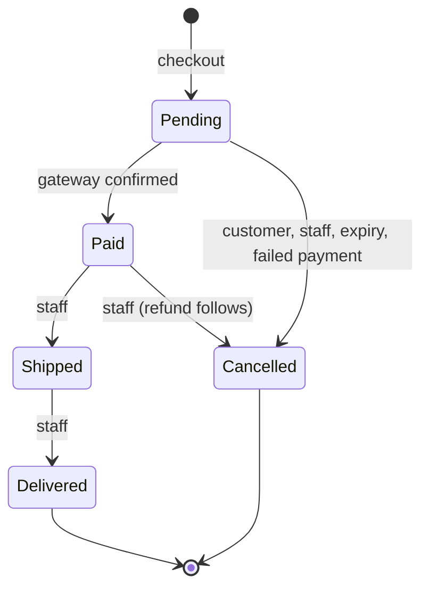

# Ordering module

> **Code:** `src/Souq.Application/Features/Orders`, `src/Souq.Domain/Entities/Order.cs`, `src/Souq.Domain/Entities/OrderTransitions.cs`, `src/Souq.API/Controllers/OrdersController.cs`, `src/Souq.Infrastructure/Persistence/Queries/OrderQueries.cs` · **Decisions:** [ADR-0029](../../11-ADR/0029-orders-lifecycle.md), [ADR-0021](../../11-ADR/0021-transaction-boundaries.md), [ADR-0026](../../11-ADR/0026-inventory-reservations.md), [ADR-0030](../../11-ADR/0030-coupon-redemptions.md), [ADR-0031](../../11-ADR/0031-payments-and-refunds.md), [ADR-0013](../../11-ADR/0013-optimistic-concurrency.md), [ADR-0014](../../11-ADR/0014-money-precision.md) · **Change guide:** [ChangeGuide.md](ChangeGuide.md)

## Purpose

Ordering turns a purchase decision into an immutable commercial record and moves it through a fixed lifecycle. It is the only module that decides anything about an order: it freezes what was bought and at what price, and it coordinates the other modules at the three moments that matter — checkout (stock and a coupon use are *reserved*), payment (they are *committed*), cancellation (they are *released*, and money goes back). The other modules deliberately do not know what an order is: Inventory sees an opaque reference string, Promotions sees an order id on a redemption row, Payments sees an order id on a payment row.

## Responsibilities

- **Checkout** (`CreateOrderCommand`): identity and block checks, address snapshots, pricing through Shopping's `IPricing`, an early availability check, the store's next order number, placement, the stock reservation, the coupon reservation, the payment intent, and compensation if the gateway fails.
- **Payment confirmation**, with one implementation (`OrderPaymentConfirmation`) shared by three entry points with different authorization: the customer's browser, the gateway's webhook, and the expiry sweep.
- **Lifecycle transitions**: ship, deliver and cancel for staff; cancel for the customer while unpaid. Every transition is recorded with its actor.
- **Checkout expiry** (`ExpireStaleCheckoutsCommand`): an Ordering use case, run per store by an Infrastructure hosted service, because the decision it makes is about orders.
- **Order numbers** per store, **tracking tokens**, and the anonymous tracking view.
- **Read side**: the admin list with filters, "my orders", the detail shaped per viewer, the public tracking projection.
- **Triggering the refund** when a paid order is cancelled (through Payments' `IOrderPayments`).
- **Owning the reservation reference format** `order:{id}` (`OrderStockReference`).

The payment **webhook use case lives here**, not in Payments: Ordering depends on Payments, so a payment result must reach Ordering by Ordering calling the payment port, never by Payments calling Ordering (no cycles — [ModuleBoundaries.md](../../02-ARCHITECTURE/ModuleBoundaries.md)).

## Not this module's job

| Not Ordering's | Owner | How Ordering reaches it |
|---|---|---|
| Stock quantities, reservations, movements | [Inventory](../Inventory/README.md) | `IInventoryReservations`, `IStockAvailability` |
| Basket contents, prices, discount amount, totals pipeline | [Shopping](../Shopping/README.md) | `IBasketCheckout`, `IPricing` |
| Shipping methods and rates | [Shipping](../Shipping/README.md) | the `ShippingOption` inside the price quote |
| Coupon rules and use counting | [Promotions](../Promotions/README.md) | `ICouponRedemptions` |
| Payment records, refunds, gateway accounts | [Payments](../Payments/README.md) | `IOrderPayments`, `IPaymentQueries`, and the `IPaymentService` port |
| Customer profile, address book, block status | [Customers](../Customers/README.md) | `ICustomerRepository` — a boundary leak, see Dependencies |
| Emails and in-app notifications | [Notifications](../Notifications/README.md) | raises `OrderStatusChanged`; Notifications consumes it |
| Store payment account configuration | [Platform](../Platform/README.md) | not used by Ordering |
| Whether a product may be reviewed | [Reviews](../Reviews/README.md) | Reviews asks `IOrderRepository` |

## Business concepts

- **Order** — one customer's purchase in one store, in the store's currency, frozen at placement.
- **Order line** — a product with the name and unit price it had when bought.
- **Order number** — a per-store integer starting at 1001; unique inside the store, deliberately not contiguous.
- **Tracking token** — 32 lowercase hex characters (128 random bits) that make the public tracking link unguessable.
- **Placement** — the moment the invoice becomes fixed; the subtotal and total are stored as they were.
- **Status** — Pending (awaiting payment), Paid, Shipped, Delivered, Cancelled.
- **Status history entry** — the status reached, an optional note, and who caused it.
- **Actor** — System, Customer, Staff (with the account id) or PaymentGateway.
- **Snapshots** — shipping address, billing address, shipping method with its cost and carrier, coupon code and discount, currency.
- **Reservation reference** — `order:{id}`: Ordering owns the format, Inventory stores it as opaque text.
- **Checkout expiry** — the time an unpaid order may hold stock (30 minutes by default).

## Domain model

| Type | Kind | Path | Invariants it guards |
|---|---|---|---|
| `Order` | aggregate root | `src/Souq.Domain/Entities/Order.cs` | Total = lines − discount + shipping, always; lines, coupon and shipping change only while Pending **and** before placement; currency is fixed at creation and every amount must match it; discount ≤ subtotal; the number is assigned once and must be positive; `Place` needs lines and a number and runs once; a payment intent binds only while Pending; every status change goes through `OrderTransitions` and writes a history row; cancelling a cancelled order is refused (stock can't be released twice); an empty order can't be paid; addresses are 1–500 characters; the shipping country is two ASCII letters |
| `OrderItem` | entity in the aggregate | `src/Souq.Domain/Entities/OrderItem.cs` | Created only by `Order.AddItem` (internal constructor); name and unit price are frozen copies; the same product twice increases the quantity instead of duplicating the line |
| `OrderStatusHistory` | entity in the aggregate | `src/Souq.Domain/Entities/OrderStatusHistory.cs` | Created only by `Order.RecordStatusChange` (private), so a status cannot be reached without a record; the change time is `CreatedAt` |
| `OrderTransitions` | policy (static) | `src/Souq.Domain/Entities/OrderTransitions.cs` | The only table of allowed transitions; a customer may only cancel a pending order |
| `OrderNumberSequence` | aggregate root (one row per store) | `src/Souq.Domain/Entities/OrderNumberSequence.cs` | Numbering starts at `FirstNumber` (1001) so a new store's volume isn't visible |
| `OrderActor` | value object | `src/Souq.Domain/ValueObjects/OrderActor.cs` | `Staff` requires a positive account id |
| `OrderStatus`, `OrderActorKind` | enums | `src/Souq.Domain/Enums` | Stored as integers; the numeric order is part of the stored data |
| `OrderStatusChanged` | domain event | `src/Souq.Domain/Events/DomainEvents.cs` | Raised by `Order.MoveTo` **only for a saved order** (`Id > 0`), so creating an order raises nothing |
| `Money`, `CurrencyInfo` | value object / policy | `src/Souq.Domain/ValueObjects` | Shared kernel: amounts must be representable in their currency's minor units ([ADR-0014](../../11-ADR/0014-money-precision.md)) |
| `InvalidOrderOperationException` | exception | `src/Souq.Domain/Exceptions/DomainException.cs` | Carries the code `InvalidOrderOperation` (HTTP 422) |

**Aggregate boundary.** `Order` owns its lines and its history. `IOrderRepository.GetWithItemsAsync` loads all three, and every transition path must use it: a new history row is added to the in-memory collection, and EF only notices it if the collection was loaded.

**Concurrency.** `Orders` carries a `RowVersion` shadow column ([ADR-0013](../../11-ADR/0013-optimistic-concurrency.md)). It exists for the client-confirm/webhook race: the loser gets a `ConcurrencyConflictException`, re-reads the status with `GetStatusAsync` (untracked), and returns an idempotent success if the order is no longer Pending — otherwise it rethrows and the caller sees 409. Lines and history rows have no token; they are append-only children.

### State machine

| Transition | Who may trigger it | Use case | Side effects |
|---|---|---|---|
| → Pending | the customer (recorded as Customer) | `CreateOrderHandler` | number issued, order placed, stock reserved, coupon use reserved, payment intent created, `Payment` row recorded |
| Pending → Paid | anyone except a customer; always recorded as PaymentGateway | `OrderPaymentConfirmation.ConfirmAsync`, reached from the client confirm, the webhook, a cancel attempt that finds the payment already succeeded, or the expiry sweep | coupon redemption Confirmed, `Payment` Succeeded, purchased quantities removed from the basket, reservations committed (Sale movements), `OrderStatusChanged` raised |
| Pending → Cancelled | Customer (owner), Staff, System, PaymentGateway | `CancelMyOrderHandler`, `UpdateOrderStatusHandler`, `ExpireStaleCheckoutsHandler`, checkout compensation, failed confirmation | payment closed (Failed when the actor is the gateway, otherwise Cancelled), reservations released, coupon use released, event raised |
| Paid → Shipped | Staff (`orders.manage`) | `UpdateOrderStatusHandler` with `OrderStatusAction.Ship` | tracking number stored; carrier falls back to the shipping method's carrier; event raised |
| Paid → Cancelled | Staff (`orders.manage`) | `UpdateOrderStatusHandler` with `OrderStatusAction.Cancel` | committed reservations restocked, coupon use released, then a **full refund** after the commit; event raised |
| Shipped → Delivered | Staff (`orders.manage`) | `UpdateOrderStatusHandler` with `OrderStatusAction.Deliver` | event raised; the products become reviewable |
| from Delivered or Cancelled | nobody | — | terminal |

The domain table restricts only the customer. Nothing in the table stops System or PaymentGateway from shipping an order; what prevents it is that no use case offers it. Staff cannot mark an order Paid because `OrderStatusAction` has no such action — payment is the gateway's verdict.

## Use cases

| Use case | Command or query | Handler | Who may call it | Endpoint |
|---|---|---|---|---|
| Check out | `CreateOrderCommand` | `CreateOrderHandler` | signed-in customer with a profile in this store; blocked customers refused | `POST /api/orders` |
| Confirm payment (browser) | `ConfirmOrderPaymentCommand` | `ConfirmOrderPaymentHandler` | the owner, or `orders.manage`; anyone else gets 404 | `POST /api/orders/{id}/confirm-payment` |
| Cancel my order | `CancelMyOrderCommand` | `CancelMyOrderHandler` | the owner only, while Pending | `POST /api/orders/{id}/cancel` |
| Ship / deliver / cancel | `UpdateOrderStatusCommand` | `UpdateOrderStatusHandler` | `orders.manage` | `PUT /api/orders/{id}/status` |
| Process a gateway webhook | `ProcessPaymentWebhookCommand` | `ProcessPaymentWebhookHandler` | anonymous; the signature is the authorization | `POST /api/payments/webhook` |
| Apply a payment event in a store's scope | `ApplyPaymentEventCommand` | `ApplyPaymentEventHandler` | internal only — no route reaches it | — |
| Expire stale checkouts | `ExpireStaleCheckoutsCommand` | `ExpireStaleCheckoutsHandler` | the hosted service, per active store | — |
| Order detail | `GetOrderByIdQuery` | `GetOrderByIdHandler` | the owner, or `orders.view`; anyone else 404 | `GET /api/orders/{id}` |
| My orders | `GetMyOrdersQuery` | `GetMyOrdersHandler` | signed-in customer | `GET /api/orders/mine` |
| Store orders | `GetOrdersQuery` | `GetOrdersHandler` | `orders.view` | `GET /api/orders` |
| Public tracking | `GetOrderTrackingQuery` | `GetOrderTrackingHandler` | anonymous, by token | `GET /api/orders/track/{token}` |

## Public contracts

Ordering has **no *Features/Orders/Contracts* folder**. What other modules actually use:

| Surface | Kind | Callers |
|---|---|---|
| `IOrderRepository` | Domain repository port | [Reviews](../Reviews/README.md) (`CreateReviewHandler` → `FindDeliveredOrderIdContainingAsync`) and [Notifications](../Notifications/README.md) (`OrderStatusChangedHandler`, `OrderEmailHandler` → `GetByIdAsync`). Both are reaches into Ordering's aggregate, not contracts, and no test forbids them |
| `OrderStatusChanged` | domain event through the outbox | Notifications |
| `OrderStockReference` | reference format | Ordering writes it; Inventory stores it without parsing it |
| `IOrderQueries` | Ordering's own read port | Ordering handlers only |
| `IOrderNumbers` | Ordering's port, implemented in Infrastructure by `OrderNumbers` | `CreateOrderHandler` |

*IOrderHistory* — a narrow "did this customer receive product X?" contract for Reviews — is named in [Modules.md](../Modules.md) but does not exist. **FUTURE:** not scheduled in [ProductRoadmap.md](../../12-ROADMAP/ProductRoadmap.md).

## Dependencies

**Uses (allowed contracts, enforced by `ModuleAndContractRuleTests`):**

| Module | Types |
|---|---|
| Inventory | `IInventoryReservations`, `IStockAvailability`, `ReservationLine` |
| Shopping | `IPricing`, `IBasketCheckout`, `PricingLine`, `ShippingRequest`, `PriceQuote`, `PricedLine`, `CouponOutcome` |
| Promotions | `ICouponRedemptions` |
| Payments | `IOrderPayments`, `IPaymentQueries`, `OrderPaymentDto` |
| Shipping | `ShippingOption`, reached through `PriceQuote.ShippingOutcome` when the order takes its shipping snapshot |

**Uses (shared kernel, invisible to the module test):** `IPaymentService` and its result types live in `Souq.Application.Common.Interfaces`, so Ordering's direct gateway calls — create intent, confirm, cancel intent, parse webhook — are not counted as a cross-module reference at all. Also `ICurrentUser`, `ITenantContext`, `ITenantDirectory`, `ITenantScopeRunner`, `IUnitOfWork`, `TimeProvider`, `Money`.

**Boundary leaks (real, and caught by nothing):**

1. `CreateOrderHandler` loads the Customers aggregate through `ICustomerRepository` and reads `Customer.IsBlocked`, `Customer.Addresses`, `IsDefaultBilling` and `ToPostalAddress`. The roadmap defers the narrower *ICustomerDirectory* contract until a second consumer needs it.
2. `Order` (Domain) uses Shipping's entity statics `ShippingMethod.NameMaxLength` and `ShippingMethod.TrackingUrl`; `OrderConfiguration` uses `ShippingMethod.TrackingUrlMaxLength`. The architecture tests cover the Application layer only, so Domain-level coupling like this is invisible to them.
3. `CreateOrderValidator` reads Shopping's `Basket.MaxLines`.
4. `OrderQueries` (Infrastructure) joins `Customers` for names and search and `Users` for staff names.
5. Persistence-level coupling by design: `Orders` has a composite foreign key to `Customers`, `OrderItems` to `Products`, both `Restrict` so financial history can't be deleted away.

**Used by:**

| Consumer | How |
|---|---|
| Reviews | `IOrderRepository.FindDeliveredOrderIdContainingAsync` |
| Notifications | `OrderStatusChanged`; both handlers also load the order through `IOrderRepository` |
| Customers | `CustomerQueries` reads `Orders`/`OrderItems` in SQL for order count, spend, last order and the data export |
| Catalog | `CatalogQueries` sorts by best-selling from delivered orders |
| Promotions | `CouponQueries` reads each redemption's order number |
| Platform / Reporting | `PlatformQueries` reads `Orders` across stores (filter bypassed on the reviewed platform path) |
| Frontend | `frontend/src/pages/checkout/Checkout.jsx`, `frontend/src/pages/MyOrders.jsx`, `frontend/src/pages/OrderDetail.jsx`, `frontend/src/pages/OrderTracking.jsx`, `frontend/src/pages/admin/Orders.jsx`, `frontend/src/pages/admin/OrderDetailDrawer.jsx` |

**Enforced vs convention.** Enforced: the allowed contract list and the absence of cycles (`ModuleAndContractRuleTests`); no domain entity in a request or response type; no `TenantId` on a non-platform request; no `IQueryable` across the Application boundary; controllers that neither read claims nor decide ownership (`DependencyRuleTests`); tenant ownership, query filter and tenant-carrying foreign keys (`TenancyRuleTests`, which exempts a single shadow key from an aggregate child to its root — that is why `OrderItems.OrderId` is allowed to be a single column). Convention only: the domain-repository reaches listed above, the `order:{id}` format, and the rule that no transaction stays open across a network call — that one is checked by handler unit tests, not by a structural test.

## Data ownership

| Table | EF configuration | Tenant | Concurrency | Indexes and rules that encode business rules |
|---|---|---|---|---|
| `Orders` | `OrderConfiguration` | `ITenantOwned` | `RowVersion` | unique (TenantId, OrderNumber); unique (TenantId, TrackingToken); (TenantId, CreatedAt) and (TenantId, Status, CreatedAt) for the admin list; FK (TenantId, CustomerId) → `Customers`, Restrict; money columns `decimal(19,4)`; discount stored as an optional owned pair of columns; token `char(32)`, non-Unicode |
| `OrderItems` | `OrderItemConfiguration` | `ITenantOwned` | — | required cascade FK to the order; FK (TenantId, ProductId) → `Products`, Restrict; unit price stored as an owned money pair; the line total is computed, never stored |
| `OrderStatusHistories` | `OrderStatusHistoryConfiguration` | `ITenantOwned` | — | required cascade FK to the order; note ≤ 300 characters; the actor's account id is stored **without** a foreign key, so deactivating a staff account cannot break history |
| `OrderNumberSequences` | `OrderNumberSequenceConfiguration` | `ITenantOwned` | — | unique TenantId: exactly one counter row per store |

Other modules' data that Ordering reads: the Customers aggregate (repository), `Customers` and `Users` in the read model, basket lines and prices through contracts, availability through `IStockAvailability`. Everything the invoice must not lose is copied onto the order instead: product name (in the store's default culture) and unit price, both addresses, the shipping method with cost, carrier, estimate and tracking URL template, the coupon code and its discount, and the currency.

Migrations that shaped these tables: `src/Souq.Infrastructure/Migrations/20260911162641_Phase9Orders.cs` (numbers, tokens, billing snapshot, placement, with a backfill), `src/Souq.Infrastructure/Migrations/20260911174818_Phase11Payments.cs`, `src/Souq.Infrastructure/Migrations/20260911183736_Phase12Shipping.cs`.

## API

| Method | Route | Authorization | Module flag | Use case |
|---|---|---|---|---|
| POST | `/api/orders` | signed-in customer | — | `CreateOrderCommand` → 201 with `OrderCreatedDto` |
| POST | `/api/orders/{id}/confirm-payment` | owner or `orders.manage` | — | `ConfirmOrderPaymentCommand` → 200 `OrderConfirmedDto` |
| POST | `/api/orders/{id}/cancel` | owner | — | `CancelMyOrderCommand` → 204 |
| GET | `/api/orders/{id}` | owner or `orders.view` | — | `GetOrderByIdQuery` |
| GET | `/api/orders/mine` | signed-in customer | — | `GetMyOrdersQuery` |
| GET | `/api/orders/track/{token}` | anonymous | — | `GetOrderTrackingQuery` |
| GET | `/api/orders` | `orders.view` | — | `GetOrdersQuery` (page, pageSize, customerId, status, search, from, to) |
| PUT | `/api/orders/{id}/status` | `orders.manage` | — | `UpdateOrderStatusCommand` → 204 |
| POST | `/api/payments/webhook` | anonymous, signature-verified | — | `ProcessPaymentWebhookCommand` (hosted on `PaymentsController`) |

No order route carries `RequiresModule`: ordering is not an optional store module. None carries `AvailableWhenStoreClosed` either, so every route answers `503 StoreUnavailable` unless the store is Active — except that routes with `HasPermission` also work while the store is Provisioning. No rate-limit policy is applied to order routes.

## Security and permissions

- The identity always comes from `ICurrentUser`; no command carries a customer id (Phase 0 finding B7 in [ArchitectureAssessment.md](../../archive/ArchitectureAssessment.md)).
- Ownership is decided in Application, and a resource you don't own answers **404, not 403**, so orders can't be probed.
- Permissions: `orders.view` (list and any detail), `orders.manage` (transitions, confirming any order, and the `allowedActions` in the detail), `store.payments.manage` (refund form and refund list in the detail).
- **A staff member with `orders.manage` but without `store.payments.manage` can still cause a full refund**, by cancelling a paid order: `UpdateOrderStatusHandler` refunds the remainder without checking the payments permission. `TenantStaff` has exactly that combination.
- The detail is shaped for the viewer: customers never receive notes, actor names, the refundable amount or the refund list.
- Public tracking exposes only number, status, timeline, carrier and tracking number — no identity, address, amount or line. A malformed token is a 404, with no hint that the shape was wrong.
- Blocked customers get `403 CustomerBlocked` at checkout.
- Card data never reaches the server: the browser talks to Stripe directly.
- `UseCaseLoggingBehavior` never logs request contents — order commands carry addresses.

## Tenant behaviour

- Every table is `ITenantOwned`: the named query filter and the write guard in `AppDbContext` apply, and cross-row foreign keys carry the tenant.
- Order numbers are per store. The counter row is locked for the length of the checkout transaction, which serializes **one store's** checkouts for a few milliseconds and never touches another store.
- A tracking token is looked up inside the host store, so a token from another store is a 404.
- Webhooks may arrive on any store's host when stores share the deployment account; the intent's metadata names the store and `ITenantScopeRunner` re-runs the work inside it. A store-signed event is never applied to another store.
- The expiry sweep enumerates **active** stores only, each in its own scope.
- The order's currency is a snapshot of the store's currency at creation.

## Events and background work

- `OrderStatusChanged(OrderId, CustomerId, From, To, By)` is raised by `Order.MoveTo` for saved orders and written to `OutboxMessages` **in the same `SaveChangesAsync`** as the status change ([ADR-0034](../../11-ADR/0034-notifications-outbox.md)); if that save fails — for instance the loser of a rowversion race — the message is discarded with it.
- Consumer: `OrderStatusChangedHandler` writes the customer's in-app notification, notifies staff holding `orders.view` when an order becomes Paid, and enqueues `OrderEmailRequested` for Paid, Shipped, Delivered, and for Cancelled only when the order had been paid or staff did it. A customer cancelling an unpaid order, or an expiry, produces no email.
- Creating an order raises nothing: the order has no id yet when its first history row is written, and the "new order" signal for staff is the Paid transition.
- `ReservationExpiryService` (a `StoreSweepService`) sends `ExpireStaleCheckoutsCommand` — at most 50 references per store per pass — every `Inventory:SweepIntervalSeconds` (default 60; `0` disables it, which is what the integration tests do).

## External integrations

Only the payment gateway, and only through `IPaymentService`: `CreateIntentAsync` at checkout, `ConfirmAsync` when confirming, `CancelIntentAsync` before cancelling an unpaid order or expiring it, `ParseWebhookAsync` for the webhook. Refunds go through Payments' `IOrderPayments`. Which provider and which account answer is decided by `PaymentGatewayRouter` — see the [Payments module](../Payments/README.md).

## Tests

| Level | Classes | What they cover |
|---|---|---|
| Domain | `OrderLifecycleTests` | the full 5×5 transition matrix, the customer rule, actor recording, placement immutability, numbers, tokens, the billing snapshot |
| Domain | `OrderTests`, `OrderShippingTests`, `DomainEventTests`, `MoneyTests`, `DomainExceptionCodeTests` | per-method rules, the shipping snapshot and tracking URL, events raised only for saved orders and allowed transitions, money precision, error codes |
| Application | `CreateOrderHandlerTests` | early rejections without side effects, number and placement inside the reservation transaction, the order of save → reserve → intent, stock lost between read and reservation, gateway failure compensating |
| Application | `ConfirmOrderPaymentHandlerTests` | ownership, idempotent re-confirmation, failed payment cancelling and releasing, the concurrent-confirmation race in both directions |
| Application | `CancelMyOrderHandlerTests`, `UpdateOrderStatusHandlerTests`, `ExpireStaleCheckoutsHandlerTests`, `GetOrderByIdHandlerTests`, `ProcessPaymentWebhookHandlerTests`, `ApplyPaymentEventHandlerTests` | each gateway outcome, admin actions and the automatic refund, sweep settlement cases, per-viewer shaping, webhook routing |
| Integration | `OrderLifecycleTests`, `InventoryAndOrderTests`, `CouponRedemptionTests`, `ShippingTests`, `PaymentsAndRefundsTests`, `NotificationTests` | numbering from 1001 per store, basket consumed only after payment, parallel checkouts on the last unit, expiry releasing an abandoned order, frozen totals, JOD precision end to end |
| Integration | `TenantIsolationTests`, `AuthorizationBoundaryTests`, `AuthorizationMatrixTests`, `MigrationRehearsalTests` | every order and refund route isolated per store, the reviewed anonymous surface (tracking and webhook), a staff account without a customer profile cannot buy, the Phase 9 backfill |
| Architecture | `ModuleAndContractRuleTests`, `DependencyRuleTests`, `TenancyRuleTests` | contracts, layering, tenancy |
| Frontend | `frontend/src/features/orders/orderView.test.js` | the tracking link is built from the token, actor labels, empty admin filters dropped |

Gaps worth knowing: the hosted sweep service's timer is never exercised — tests send `ExpireStaleCheckoutsCommand` directly.

## Failure modes

| Situation | Code | HTTP | Handling |
|---|---|---|---|
| Anonymous, or a staff account with no customer profile, checks out | `Unauthenticated` / `CustomerAccountRequired` | 401 / 403 | thrown by `RequireCustomerId` |
| Token valid but the customer row is gone | `CustomerNotFound` | 401 | re-login |
| Blocked customer | `CustomerBlocked` | 403 | — |
| Address id not in the customer's book | `AddressNotFound` | 400 | nothing written |
| No lines and an empty basket | `BasketEmpty` | 400 | nothing written |
| Product unpublished or from another store | `ProductNotFound` | 400 | nothing written |
| Not enough stock (early check) | `InsufficientStock` | 422 | nothing written |
| Stock lost between the check and the reservation | `InsufficientStock` | 422 | the whole checkout transaction rolls back — no order, no number consumed |
| Coupon rejected by the quote | `ModuleDisabled`, `CouponNotFound`, `InvalidCoupon` | 404 / 422 | nothing written |
| Coupon's last use taken concurrently | `InvalidCoupon` | 422 | the checkout transaction rolls back |
| Shipping method missing or not serving the address | `ShippingMethodRequired`, `ShippingMethodUnavailable`, `ShippingNotAvailable` | 422 | nothing written |
| Gateway can't create the intent | `PaymentUnavailable` | 503 | the order is cancelled and the reservation and coupon use released before answering |
| Store's payment account unusable | `PaymentsUnavailable` | 503 | `PaymentGatewayUnavailableException` → `GlobalExceptionHandler`; at checkout it is caught and compensated as above |
| Confirming an order you don't own | `NotFound` | 404 | indistinguishable from a missing order |
| Confirming an order with no intent | `NoPaymentIntent` | 422 | — |
| Gateway says the intent was cancelled | `PaymentFailed` | 422 | the order is cancelled, stock and coupon released, payment marked Failed |
| Gateway says the card was declined but the intent is still retryable | `PaymentFailed` | 422 | **nothing is released**: the order stays Pending so the shopper can retry on the same intent; the expiry sweep settles it if abandoned ([ADR-0036](../../11-ADR/0036-payment-intent-state-machine.md)) |
| Confirming an order that was already cancelled, and the gateway captured the money | `PaymentCapturedOnCancelledOrder` | 422 | the payment is recorded as Succeeded so staff can refund it from the order screen; logged at error level; the webhook still acknowledges with 200 |
| Two confirmations race, order still Pending | `ConcurrencyConflict` | 409 | client retries |
| Customer cancels a paid order | `InvalidOrderOperation` | 422 | told to contact the store |
| Payment still processing at the gateway | `PaymentProcessing` | 422 | try again shortly |
| Payment succeeded just before the cancel | `OrderAlreadyPaid` | 422 | the order is confirmed instead |
| Invalid status transition | `InvalidOrderOperation` | 422 | thrown by the entity before anything is written |
| Unknown or malformed tracking token | `NotFound` | 404 | shape and existence are not distinguished |
| Webhook signature invalid | `InvalidSignature` | 400 | no order touched |
| Webhook for an unknown order, store or event type | — | 200 | acknowledged, nothing done |
| Webhook arrives on a suspended store's host | `StoreUnavailable` | 503 | the gateway retries later |
| A reference fails during the sweep | — | — | logged and retried on the next pass; the other references continue |

## Common change scenarios

Add a status · change cancellation rules · change what happens on payment success · add a field to the order snapshot · change checkout expiry · make a failed confirmation cancel the intent at the gateway · give another module a contract instead of the order repository. Details in [ChangeGuide.md](ChangeGuide.md).

## Known limitations

1. **A declined order holds its stock reservation until the checkout expiry window elapses.** Since [ADR-0036](../../11-ADR/0036-payment-intent-state-machine.md) a decline whose intent is still alive (`PaymentIntentState.Retryable`) leaves the order `Pending` so the shopper can retry on the same client secret, instead of cancelling it and releasing the stock immediately. `ExpireStaleCheckoutsHandler` settles it afterwards if it is abandoned. This is the deliberate trade: an abandoned decline occupies stock for `Inventory:ReservationMinutes`, and in exchange a mistyped card no longer destroys the order — and no path can leave a cancelled order with an intent that is still able to capture.
2. **The order confirmation email can print the wrong total, or fail outright.** `OrderEmailHandler` loads the order with `IOrderRepository.GetByIdAsync`, which is `FindAsync` — the root only, with no lines, and nothing configures auto-include. `Order.TotalAmount` therefore sums an empty line collection: the email shows only the shipping cost, and for an order with a coupon `Subtotal.Subtract(DiscountAmount)` goes negative and throws `InvalidMoneyException`, so the message is retried until the outbox marks it dead. The frozen `PlacedTotal` is what the email should use.
3. A staff member with `orders.manage` alone can trigger a full refund by cancelling a paid order (see Security).
4. The refund after an admin cancellation happens **after** the cancellation commits and its result is ignored: a refused or unanswered refund leaves the order cancelled with the money still out. It shows on the order's payment, and staff retry from there. A crash between the two leaves no `Refund` row at all, and nothing sweeps for that.
5. A crash between checkout's two saves leaves a Pending order with no intent, holding stock until the sweep — the residual that [ADR-0021](../../11-ADR/0021-transaction-boundaries.md) names.
6. The sweep only visits active stores, so a suspended store's unpaid orders keep their reservations until it is active again.
7. The sweep assumes a single instance; two are safe but do duplicate work. A distributed lock is **PLANNED** for Phase 23.
8. Order numbers are unique but not contiguous: a rolled-back checkout returns its number, a cancelled order keeps it.
9. Checkout includes a gateway round trip, so it routinely exceeds `UseCaseLoggingBehavior.SlowThreshold` and logs a slow-use-case warning.
10. There is no payment method other than the gateway: no cash on delivery, no bank transfer, no partial capture. Adding one means a new way to reach Paid, which today only the gateway can cause.
11. A refund never changes the order status, and never gives back a coupon use or stock ([ADR-0031](../../11-ADR/0031-payments-and-refunds.md), [ADR-0030](../../11-ADR/0030-coupon-redemptions.md)).
12. The customer's free-text cancellation reason is stored and shown to staff.

## Future evolution

- **PLANNED** (Phase 23): a distributed lock for the sweeper; SQL Server transient-fault retries are evaluated in the same phase ([ADR-0021](../../11-ADR/0021-transaction-boundaries.md)).
- **PLANNED** (Phase 20): a retention policy that purges the shipping snapshots of erased customers' old orders.
- **DEFERRED**: *ICustomerDirectory*, a narrow contract to replace Ordering's use of the Customers aggregate — until a second consumer or an extraction needs it.
- **FUTURE**: *IOrderHistory* for Reviews; a structured address snapshot, which waits for a consumer such as shipping labels or tax.
- **Open decisions**: P-06 (tax model) would add a tax stage to the snapshot; D-13 (payment tenancy) changes nothing in Ordering.
