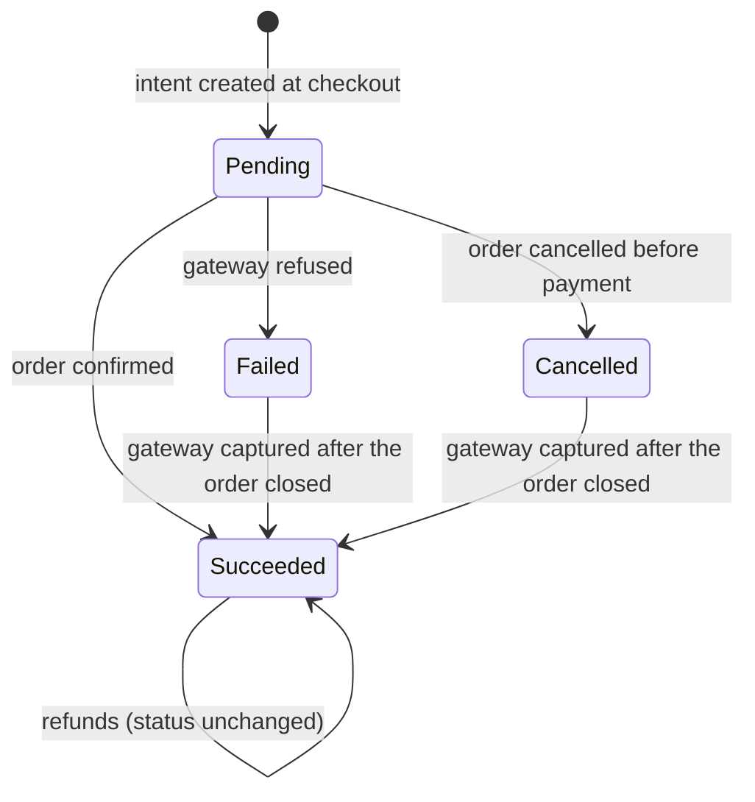

# Payments module

> **Code:** `src/Souq.Application/Features/Payments`, `src/Souq.Domain/Entities/Payment.cs`, `src/Souq.Domain/Entities/Refund.cs`, `src/Souq.Infrastructure/Payments`, `src/Souq.Infrastructure/Services/StripeAmountConverter.cs`, `src/Souq.API/Controllers/OrderRefundsController.cs` · **Decisions:** [ADR-0031](../../11-ADR/0031-payments-and-refunds.md), [ADR-0021](../../11-ADR/0021-transaction-boundaries.md), [ADR-0013](../../11-ADR/0013-optimistic-concurrency.md), [ADR-0014](../../11-ADR/0014-money-precision.md), [ADR-0020](../../11-ADR/0020-configuration-and-secrets.md) · **Change guide:** [ChangeGuide.md](ChangeGuide.md)

## Purpose

Payments records the money side of an order — one payment per order, how it settled, and what was given back — and hides which provider and which account took the money. It is its own module because payment state obeys different rules from order state (refunded ≤ captured, idempotency against a system we don't control, secrets at rest), and because it is the clearest extraction candidate: isolating it isolates PCI scope.

## Responsibilities

- One `Payment` per order: recorded when the intent is created, settled when the order is confirmed or cancelled. Ordering drives both through `IOrderPayments`.
- Refunds, partial or full, as **reserve → call → record** with an idempotency key, plus a retry for a refund the gateway never answered.
- The payment read model shown on an order (`IPaymentQueries`).
- The public client configuration the browser needs (the publishable key).
- In Infrastructure: the gateway adapters (Stripe, fake), the per-call routing between a store's own account and the deployment account, webhook signature verification, and conversion to the provider's minor units.
- Encrypting store gateway secrets at rest (`AesGcmSecretProtector` behind `ISecretProtector`).

## Not this module's job

| Not Payments' | Owner |
|---|---|
| Order status, and the decision to confirm, cancel or refund an order | [Ordering](../Ordering/README.md) — including the webhook use case |
| The use cases that connect, edit or disconnect a store's gateway account | [Platform](../Platform/README.md) — see below |
| Giving a coupon use back, or restocking, after money moves | [Promotions](../Promotions/README.md) / [Inventory](../Inventory/README.md); a refund does neither |
| Telling anyone that a refund happened | nobody today: no event, no notification |

**Payments must never call Ordering.** Ordering depends on Payments, so the reverse would be a cycle; `ModuleAndContractRuleTests` fails the build on any reference from `src/Souq.Application/Features/Payments` to another feature folder.

## Who owns store payment accounts

**Closed in the M1 architecture audit (TD-04/R-04).** The entity and the use cases that edit it now sit in the same module.

| Piece | Where it lives | Module |
|---|---|---|
| `StorePaymentAccount`, `PaymentKeyRules` | `src/Souq.Domain/Entities/StorePaymentAccount.cs` | Domain is not split by module; entities share `Souq.Domain.Entities` |
| `IStorePaymentAccountRepository` | `src/Souq.Domain/Interfaces/IStorePaymentAccountRepository.cs` | same |
| `IStorePaymentAccountEditor`, `StorePaymentAccountDto`, `StorePaymentAccountInput`, `StorePaymentAudit` — the published contract | `src/Souq.Application/Features/Payments/Contracts/StorePaymentAccountContracts.cs` | **Payments** |
| `StorePaymentAccountEditor` (implements the contract), `GetStorePaymentAccountQuery`, `UpdateStorePaymentAccountCommand`, `RemoveStorePaymentAccountCommand`, `StorePaymentPolicy` — the store's own admin path | `src/Souq.Application/Features/Payments/StorePaymentAccounts.cs` | **Payments** |
| `GetTenantPaymentAccountQuery`, `UpdateTenantPaymentAccountCommand`, `RemoveTenantPaymentAccountCommand` — the platform's admin path | `src/Souq.Application/Features/Platform/TenantPaymentAccounts.cs` | **Platform** — stays here because these commands carry `TenantId`, and only `Features.Platform` requests may ([MultiTenancy.md](../../02-ARCHITECTURE/MultiTenancy.md) §2); they call `IStorePaymentAccountEditor` through `ITenantScopeRunner`, never the concrete class |
| `PaymentGatewayRouter`, which reads the account and decrypts its secrets | `src/Souq.Infrastructure/Payments/PaymentGatewayRouter.cs` | Infrastructure, serving the Payments port. The store adapter is built through an injected `StoreGatewayFactory` (TD-52), so the routing rules are testable without a network |
| `StorePaymentAccounts` table | `StorePaymentAccountConfiguration` | — |

`ModuleAndContractRuleTests`' `AllowedContracts["Platform"] = ["Payments"]` authorizes exactly the one crossing above — Platform reaching `Payments.Contracts`, nothing else. Before this fix, the domain was Payments' but the use cases sat in Platform's folders (`Features/Stores`), so an edit to the sensitive gateway-secret code was reviewed and tested as a Platform change; see [ModuleBoundaryAudit.md](../../02-ARCHITECTURE/ModuleBoundaryAudit.md) for why the two files could not simply trade places without a contract in between.

## Business concepts

- **Payment** — the money side of exactly one order, at exactly one gateway account.
- **Gateway account name** — `stripe:store`, `stripe:deployment` or `fake`, recorded on the payment so later calls go where the money went.
- **Gateway account identity** — the publishable key of the account that actually took the payment. The *name* says which shelf to look on; this says which account. Without it, a store switching test keys for live ones sent refunds to an account that had never seen the intent ([ADR-0061](../../11-ADR/0061-a-payment-records-which-account-took-it.md)).
- **Provider payment id** — the intent id at the provider; the only thing we keep from the card flow.
- **Refundable** — amount − refunded − pending; the ceiling for the next refund.
- **Pending refund** — money promised to a refund that the gateway hasn't confirmed yet.
- **Idempotency key** — `souq-refund-{tenantId}-{refundId}`: retrying sends the same key, so money can't go back twice **while the provider still remembers the key**. Stripe keeps them for 24 hours; a retry after that window is a fresh request to Stripe. `RetryRefundAsync` has no age limit, so this page said "can't go back twice" without qualification until M6 measured it — see TD-51.
- **Deployment account** — the platform's own gateway account, used by every store that hasn't connected one.
- **Store account** — a store's own keys: publishable, secret, and optionally a webhook secret, with a live/test mode and a four-character hint.
- **Minor units** — the integer the provider charges in.

## Domain model

| Type | Kind | Path | Invariants it guards |
|---|---|---|---|
| `Payment` | aggregate root | `src/Souq.Domain/Entities/Payment.cs` | belongs to a saved order; gateway and provider id are required and bounded; settling is idempotent for the same target and refused for a different one once settled; only a Succeeded payment may be refunded; a refund matches the payment's currency, is positive, and never exceeds `Refundable`; a result is counted exactly once; a refund must belong to this payment |
| `Refund` | entity in the aggregate | `src/Souq.Domain/Entities/Refund.cs` | created Pending only through `Payment.RequestRefund` (internal constructor); completing a succeeded refund is a no-op, completing a failed one throws; failing a failed one is a no-op, failing a succeeded one throws; a completion needs a provider id; the reason is trimmed to 500 characters |
| `PaymentStatus` | enum | `src/Souq.Domain/Enums/PaymentStatus.cs` | Pending, Succeeded, Failed, Cancelled. A refund never changes it, so reporting can still tell "paid then returned" from "never paid" |
| `RefundStatus` | enum | `src/Souq.Domain/Enums/RefundStatus.cs` | Pending, Succeeded, Failed |
| `StorePaymentAccount` | aggregate root (Platform use cases) | `src/Souq.Domain/Entities/StorePaymentAccount.cs` | the first link requires a secret; the publishable key must be a Stripe key whose mode matches `LiveMode`; changing mode requires a new secret; only ciphertext is accepted, never a plaintext secret; ciphertext ≤ 1024 characters |
| `PaymentKeyRules` | policy (static) | same file | the accepted key shapes (`pk_`, `sk_`, `rk_`, `whsec_`) and the hint: the last four characters only |
| `InvalidPaymentOperationException` | exception | `src/Souq.Domain/Exceptions/InvalidPaymentOperationException.cs` | codes `InvalidPaymentOperation` (default), `PaymentNotRefundable`, `RefundExceedsPayment`, `InvalidPaymentKeys` — all HTTP 422 |
| `Money`, `CurrencyInfo` | value object / policy | `src/Souq.Domain/ValueObjects` | shared kernel; the minor-unit rule that the gateway conversion must agree with |

**Aggregate boundary.** `Payment` owns its refunds; `IPaymentRepository.GetForOrderAsync` loads both. Nothing outside the aggregate may create or settle a `Refund` — the amount guard lives on the payment.

**Concurrency.** `Payments` carries a `RowVersion`. Every refund changes the payment row (`PendingRefundAmount`, then `RefundedAmount`), so two concurrent refunds collide there: the loser re-reads and sees what the winner reserved. `Refunds` needs no token of its own. **`StorePaymentAccounts` carries one since `C12`**: two admins editing keys at once used to produce a silent last-write-wins, and payment keys are not a display field — the loser believes their store collects into one account while it collects into another. The conflict surfaces as `409` and is **not** retried automatically, because retrying writes the second admin's keys over the first's, which is the same defect with an extra step.

The two arrows out of `Failed` and `Cancelled` are the only way a settled payment moves, and they exist because the gateway — not Souq — decides whether money moved ([ADR-0036](../../11-ADR/0036-payment-intent-state-machine.md)).

## Use cases

| Use case | Command or query | Handler | Who may call it | Endpoint |
|---|---|---|---|---|
| Refund an order | `RefundOrderCommand` | `RefundOrderHandler` → `OrderPayments.RefundAsync` | `store.payments.manage` | `POST /api/orders/{id}/refunds` |
| Retry a pending refund | `RetryRefundCommand` | `RetryRefundHandler` → `OrderPayments.RetryRefundAsync` | `store.payments.manage` | `POST /api/orders/{id}/refunds/{refundId}/retry` |
| Client payment configuration | `GetPaymentConfigQuery` | `GetPaymentConfigHandler` | anonymous | `GET /api/payments/config` |
| Record an intent as a payment | `IOrderPayments.RecordIntentAsync` | `OrderPayments` | called by `CreateOrderHandler` | — |
| Settle a payment | `IOrderPayments.MarkSucceededAsync` / `MarkClosedAsync` | `OrderPayments` | called by `OrderPaymentConfirmation` | — |
| Refund everything left after a paid order is cancelled | `IOrderPayments.RefundAsync` with no amount | `OrderPayments` | called by `UpdateOrderStatusHandler` (`orders.manage`) | `PUT /api/orders/{id}/status` |
| Read an order's payment | `IPaymentQueries.ForOrderAsync` | `PaymentQueries` | called by `GetOrderByIdHandler` | `GET /api/orders/{id}` |
| Connect / edit / disconnect the store's account (Platform module) | `GetStorePaymentAccountQuery`, `UpdateStorePaymentAccountCommand`, `RemoveStorePaymentAccountCommand` | `StorePaymentAccountEditor` | `store.payments.manage` | `GET`/`PUT`/`DELETE /api/admin/store/payments` |
| The same, for any store, from the platform (Platform module) | `GetTenantPaymentAccountQuery`, `UpdateTenantPaymentAccountCommand`, `RemoveTenantPaymentAccountCommand` | the same editor, inside the target store's scope | `platform.tenants.manage`, platform host only | `GET`/`PUT`/`DELETE /api/platform/tenants/{id}/payments` |

## Public contracts

**`IOrderPayments`** (`src/Souq.Application/Features/Payments/Contracts/PaymentContracts.cs`) — the only way Ordering touches payments. Its unit-of-work rules are part of the contract:

| Member | Saving | Caller |
|---|---|---|
| `RecordIntentAsync` | tracks only; the caller saves it with the order | `CreateOrderHandler` |
| `MarkSucceededAsync` | tracks only; saved inside the confirmation transaction | `OrderPaymentConfirmation.ConfirmAsync` |
| `MarkClosedAsync` | tracks only; saved inside the cancellation transaction | `OrderPaymentConfirmation.CancelAsync` |
| `MarkCapturedAfterCloseAsync` | tracks only; the caller saves | `OrderPaymentConfirmation` when a cancelled order's intent turns out to have captured |
| `RefundAsync`, `RetryRefundAsync` | save twice themselves, with a gateway call in between — **must not be called inside an open transaction** ([ADR-0021](../../11-ADR/0021-transaction-boundaries.md)) | `RefundOrderHandler`, `RetryRefundHandler`, `UpdateOrderStatusHandler` after the cancellation commits |

**`IPaymentQueries`** — `ForOrderAsync`, used by `GetOrderByIdHandler`; the handler strips the refundable amount and the refund list for non-staff viewers. DTOs: `RefundOutcome`, `RefundDto`, `OrderPaymentDto`.

**`IPaymentService`** (`src/Souq.Application/Common/Interfaces/IPaymentService.cs`) — the gateway port: create intent, confirm, cancel intent, refund, **declared capabilities**, client config, parse webhook. It lives in the **shared kernel**, not under `src/Souq.Application/Features/Payments`, which is why Ordering's direct gateway calls are invisible to the module test. Its single implementation is `PaymentGatewayRouter`. Callers: `CreateOrderHandler`, `OrderPaymentConfirmation`, `ExpireStaleCheckoutsHandler`, `ProcessPaymentWebhookHandler`, `OrderPayments`, `GetPaymentConfigHandler`.

**`IPaymentGateway`** (`src/Souq.Infrastructure/Payments/IPaymentGateway.cs`) — one gateway account, given its keys, knowing nothing about stores or the database. `StripeGateway` and `FakeGateway` implement it; `DeploymentPaymentGateway` is the singleton wrapper for the deployment's account. Adding a provider means adding an implementation here and nothing in Application.

**`ISecretProtector`** — implemented by `AesGcmSecretProtector`; used by the router (decrypt) and by the Platform editor (encrypt).

## Dependencies

- **Uses:** its own aggregates through `IPaymentRepository`; `IPaymentService`; `ITenantContext` (the tenant id is part of every idempotency key); `IUnitOfWork`; `TimeProvider`; `Money`. `src/Souq.Application/Features/Payments` references **no other feature folder**, and `AllowedContracts` gives Payments no entry, so any such reference fails the build.
- The Infrastructure router additionally reads `IStorePaymentAccountRepository` (an entity whose use cases are Platform's) and `IPaymentRepository.GetAccountAsync`, which returns the account **kind and identity** recorded on the payment ([ADR-0061](../../11-ADR/0061-a-payment-records-which-account-took-it.md)).
- **Used by:** Ordering (`IOrderPayments`, `IPaymentQueries`, and the `IPaymentService` port), Platform (`StorePaymentAccountEditor` uses `ISecretProtector` and `PaymentKeyRules`), the frontend (`frontend/src/pages/admin/Payments.jsx`, `frontend/src/pages/admin/OrderDetailDrawer.jsx`, `frontend/src/pages/checkout/CardPaymentForm.jsx`).
- **Boundary leaks:** none in Application. At the database level `Payments` has a composite foreign key to `Orders` (Restrict) — deliberate, and the reason a payment knows an order id at all.
- **Enforced vs convention.** Enforced: no reference out of the module and no cycle (`ModuleAndContractRuleTests`); no Stripe type in Domain, Application or controllers (`DependencyRuleTests`); no card-like column anywhere and an exact reviewed column list for the three payment tables (`PaymentDataRulesTests`); tenancy rules (`TenancyRuleTests`). Convention: the reserve–call–record ordering and "no transaction across the gateway call" are guarded by `OrderPaymentsTests`, not by a structural rule.

## Data ownership

| Table | EF configuration | Tenant | Concurrency | Indexes and rules that encode business rules |
|---|---|---|---|---|
| `Payments` | `PaymentConfiguration` | `ITenantOwned` | `RowVersion` | unique (TenantId, OrderId) — **one payment per order**; unique (TenantId, ProviderPaymentId) — a webhook's intent id resolves to one row; alternate key (TenantId, Id) for the refund FK; FK (TenantId, OrderId) → `Orders`, Restrict; money columns `decimal(19,4)`; amount stored as an owned money pair |
| `Refunds` | `RefundConfiguration`, relationship declared on the payment | `ITenantOwned` | — | required FK (TenantId, PaymentId) → `Payments`, Restrict — a financial record is never deleted; provider refund id kept for reconciliation |
| `StorePaymentAccounts` | `StorePaymentAccountConfiguration` | `ITenantOwned` | — | unique TenantId — one account per store; only `SecretKeyCipher` and `WebhookSecretCipher` exist: there is **no column for a plaintext secret** |

Payments reads no other module's tables. `PaymentDataRulesTests` pins the column list of all three tables and scans every table in the model for card-like names, so adding a card column fails the build.

Migration: `src/Souq.Infrastructure/Migrations/20260911174818_Phase11Payments.cs` — additive, and it backfills a payment for every existing order that had an intent, including a Succeeded payment for orders cancelled after being paid so they can be refunded now. `MigrationRehearsalTests` checks the backfill.

## API

| Method | Route | Authorization | Module flag | Use case |
|---|---|---|---|---|
| GET | `/api/payments/config` | anonymous | — | `GetPaymentConfigQuery`; returns the publishable key, or `""` when the fake gateway is active |
| POST | `/api/payments/webhook` | anonymous; the `Stripe-Signature` header is the credential | — | `ProcessPaymentWebhookCommand` — an **Ordering** use case |
| POST | `/api/orders/{id}/refunds` | `store.payments.manage` | — | `RefundOrderCommand`; body `{ amount?, reason? }`, no amount means everything left |
| POST | `/api/orders/{id}/refunds/{refundId}/retry` | `store.payments.manage` | — | `RetryRefundCommand` |
| GET / PUT / DELETE | `/api/admin/store/payments` | `store.payments.manage` | — | the store's own account (Platform module) |
| GET / PUT / DELETE | `/api/platform/tenants/{id}/payments` | `platform.tenants.manage`, `PlatformEndpoint` | — | any store's account from the platform host |

A refund answers **200 even when the money did not move**: `RefundOutcome.Status` is `Succeeded`, `Failed` (the gateway refused, with `FailureReason`) or `Pending` (the gateway never answered). The frontend branches on that field, not on the HTTP status.

## Security and permissions

- **No card data ever**: Stripe Elements sends the card from the browser to Stripe; we store an intent id. `PaymentDataRulesTests` keeps it that way.
- `store.payments.manage` is held by `TenantAdmin` only — `TenantStaff` does not have it. But see [Ordering](../Ordering/README.md): cancelling a paid order refunds it in full and needs only `orders.manage`.
- Refunds and account changes are audited (`IAuditable`): `order.refund.requested` with the amount, `order.refund.retried` with the refund id, and `store.payments.updated` / `store.payments.removed` / `tenant.payments.viewed` / `tenant.payments.updated` / `tenant.payments.removed` with **what changed**, never the keys.
- Store secrets are encrypted with AES-256-GCM under a key from `Secrets:Keys:{id}` with `Secrets:ActiveKeyId`; the purpose string (`tenant:{id}:stripe:secret-key`) is authenticated data, so a ciphertext copied into another store's row will not decrypt. Key ids allow rotation. Secrets are write-only: `StorePaymentAccountDto` returns a hint and whether a webhook secret exists. Without `Secrets:ActiveKeyId` the editor refuses with `SecretsNotConfigured` and every store uses the deployment account.
- Test-mode store keys are accepted in Development and Testing, and elsewhere only with `Payments:AllowTestModeStoreAccounts`, which logs a startup warning — otherwise test cards would "pay" real orders.
- The fake gateway is selected implicitly only in Development and Testing; anywhere else it needs `Payments:Provider=Fake` (with a startup warning), and without `Stripe:SecretKey` the API refuses to start ([ADR-0020](../../11-ADR/0020-configuration-and-secrets.md)).
- Webhook trust: the signature is verified in the adapter, with the host store's own secret first and the deployment's second. A **store-signed** event naming another store is ignored; a **deployment-signed** event naming another store is applied inside that store's scope. Applying an event re-asks the gateway, so metadata alone proves nothing.
- No silent fallback: if a store's account can't be used, the answer is `503 PaymentsUnavailable`, never the deployment account.

## Tenant behaviour

- All three tables are tenant-owned, filtered and write-guarded; the payment's foreign key to its order carries the tenant.
- The router resolves the store's account **once per scope** and falls back to the singleton deployment gateway.
- For an existing intent, the account comes from the payment's recorded `Gateway`: `stripe:store` routes to the store's account (and raises `PaymentGatewayUnavailableException` if it is no longer linked); any other recorded value, including `fake`, routes to the deployment account; no payment row at all routes to the current account.
- Webhook endpoints are per Stripe account, so stores sharing the deployment account share one endpoint, on some store's host. That host store must be Active, or the endpoint answers `503 StoreUnavailable` and Stripe retries.

## Events and background work

None. No domain event is raised for a payment or a refund, no hosted service touches this module, and there is no reconciliation of pending refunds — a pending refund waits for a human to retry it. The webhook parser only recognises `payment_intent.succeeded` and `payment_intent.payment_failed`; refund events are ignored.

## External integrations

**Stripe** (`StripeGateway`), one `StripeClient` per adapter instance rather than static configuration, so two stores' keys can be used in one process:

| Call | Behaviour worth knowing |
|---|---|
| Create intent | amount in minor units, lower-case currency, automatic payment methods, and metadata carrying `orderReference` and `tenantId` — the metadata is what routes the webhook back to the right store |
| Confirm | a plain read of the intent; `succeeded` is the only success |
| Cancel intent | reads the state first; `succeeded`, `canceled` and `processing` are returned as they are; otherwise it cancels, and if Stripe refuses it re-reads, because the customer may have paid in between |
| Refund | sends the idempotency key; `succeeded` and `pending` both count as success; an explicit refusal (400, 402, 404) becomes a failed result; anything else throws, leaving the refund Pending for a retry with the same key |
| Parse webhook | signature verified here and nowhere else; a missing webhook secret means "can't verify", not "valid" |

**Fake gateway** (`FakeGateway`) for development and tests: intents `pi_fake_…`, confirmation always succeeds, cancellation always reports Cancelled, refunds are recorded in a singleton ledger by idempotency key so retries really are idempotent, and webhooks are accepted only when HMAC-SHA256-signed with `Payments:Fake:WebhookSecret`. It exposes no publishable key, which is the signal the frontend uses to show a direct "complete order" button instead of a card form.

**Minor units** (`StripeAmountConverter`): zero-decimal currencies are sent as they are, everything else is multiplied by 100 and rounded away from zero. Consequences to keep in mind:

- **P-05 (open):** JOD has three decimals in `CurrencyInfo` but is charged ×100, so a total like 59.955 JOD is charged as 59.96 — a difference of up to 0.005 per order. The same applies to every three-decimal currency in `CurrencyInfo` (BHD, IQD, KWD, LYD, OMR, TND), which P-05 does not mention. Live payments in these currencies are not production-ready until the multiplier is confirmed on the real account; if the account treats them as three-decimal, the multiplier must be 1000 and the current code charges a tenth of the price.
- `MGA` is in the converter's zero-decimal list but has the default two decimals in `CurrencyInfo`, so a fractional MGA amount would be rounded to whole units at the gateway.
- `ISK` and `UGX` are the opposite: zero decimals in `CurrencyInfo` (so `Money` refuses fractions) and ×100 at the gateway, which the code comment attributes to Stripe's backward compatibility.

## Tests

| Level | Classes | What they cover |
|---|---|---|
| Domain | `PaymentTests` | settling is idempotent and one-way; refunds never exceed the payment; a pending refund holds its amount; a refused refund gives it back and repeating the result doesn't double-count; only a succeeded payment is refundable; currency, sign and ownership |
| Domain | `StorePaymentAccountTests`, `MoneyTests`, `DomainExceptionCodeTests` | key shapes and modes, first link needs a secret, editing without a secret keeps it, mode change needs a new secret; money precision; error codes |
| Application | `OrderPaymentsTests` | save → gateway → save with no transaction; refund of the remainder; a refusal; a silent gateway then a retry with the same key; a concurrency conflict retried from a fresh read; results instead of exceptions when there is nothing to refund; intent recording and closing only a pending payment |
| Application | `StorePaymentAccountEditorTests` | encryption bound to the store, the test-key policy, format rules, secrets never read back, disconnect is idempotent |
| Integration | `PaymentsAndRefundsTests` | a payment recorded and settled; partial and full refunds; five concurrent refunds; cancelling a paid order refunds it; a deployment-signed webhook applied in the order's store and a forged one rejected; a store account stored encrypted, audited, and edited by the platform inside the store's scope |
| Integration | `SecretProtectorTests` and `FakeGatewayTests`, both in `tests/Souq.IntegrationTests/PaymentAdapterTests.cs` | AES-GCM round trip, purpose binding, rotation, tampering, startup validation; the fake gateway's idempotent refunds and signed webhooks |
| Integration | `PaymentDataRulesTests`, `StripeAmountConverterTests`, `ConfigurationTests` | no card-like columns and exact payment columns; the minor-unit table including the JOD rounding case; explicit provider selection and the publishable-key rule outside Development |
| Integration | `TenantIsolationTests`, `AuthorizationBoundaryTests`, `MigrationRehearsalTests` | refund routes isolated per store; config and webhook in the reviewed anonymous surface; the Phase 11 backfill |
| Architecture | `DependencyRuleTests`, `ModuleAndContractRuleTests` | Stripe stays in Infrastructure; the module references nothing |
| Frontend | `frontend/src/features/admin/payments/paymentView.test.js` | key modes, the first problem that blocks saving, never sending an empty secret, refund amount rules per currency |

`PaymentGatewayRoutingTests` (added by `C12`, closing TD-52) names the router directly and exercises all four routing rules offline, against a fake built through the injectable `StoreGatewayFactory`: store account when connected, deployment when not, the account **kind recorded on the payment** routing everything after the intent, and **503 rather than a silent fallback** when a store secret will not decrypt. The last is mutation-checked, because the silent version collects one merchant's money into another's account.

Gaps: **no test names `StripeGateway`.** The Stripe adapter itself — status mapping, cancellation race, refund error classes, signature parsing — has no automated coverage; every test runs against the fake gateway.

## Failure modes

| Situation | Code | HTTP | Handling |
|---|---|---|---|
| Refunding an order with no payment, or another store's order | `NotFound` | 404 | existence is not revealed |
| "Everything left" on a payment that isn't Succeeded | `PaymentNotRefundable` | 422 | returned as a result, so an admin cancellation that triggered it still stands |
| A specific amount on a payment that isn't Succeeded | `PaymentNotRefundable` | 422 | thrown by the entity |
| Nothing left to refund | `NothingToRefund` | 422 | — |
| Amount above the refundable | `RefundExceedsPayment` | 422 | — |
| Amount with more decimals than the currency allows | `InvalidMoney` | 422 | `Money` refuses it |
| Amount zero or negative | `ValidationFailed` | 400 | FluentValidation |
| Concurrent refunds on one payment | — | — | up to `OrderPayments.MaxAttempts` retries from a fresh read; only a conflict on the last attempt surfaces as `ConcurrencyConflict` 409 |
| Gateway refused the refund | — | 200 | outcome `Failed` with the reason; the reserved amount returns to refundable |
| Gateway did not answer (timeout, 5xx, unusable store account) | — | 200 | outcome `Pending`; the amount stays reserved; retry sends the same key |
| Retrying a settled refund | `RefundNotPending` | 422 | — |
| Retrying an unknown refund | `NotFound` | 404 | — |
| The account that took the payment is gone (confirm, cancel or refund) | `PaymentsUnavailable` | 503 | reconnect the account; no fallback to another account |
| A store secret can't be decrypted | `PaymentsUnavailable` | 503 | logged with the store id |
| Webhook signature invalid | `InvalidSignature` | 400 | no order touched |
| No webhook secret configured anywhere | — | 200 | acknowledged and ignored, with a warning log |
| Store keys in the wrong shape or mode | `InvalidPaymentKeys` | 422 | nothing saved |
| Test keys where policy forbids them | `TestKeysNotAllowed` | 422 | nothing saved |
| Secret encryption not configured | `SecretsNotConfigured` | 503 | the store keeps using the deployment account |
| No payment provider configured outside Development | — | — | the API refuses to start, naming the setting |

## Common change scenarios

Add a provider · change refund rules · support a new currency or change minor-unit handling · change how a store's account is configured (D-13) · handle a new webhook event · rotate the secrets key. Details in [ChangeGuide.md](ChangeGuide.md).

## Declared capabilities

`PaymentCapabilities` is what the connected account **says it can do**, asked before an operation is offered rather than discovered by a failed call ([ADR-0048](../../11-ADR/0048-payment-provider-abstraction.md) §5). It is read from the account that will actually take the money, so a store with its own account can differ from the deployment account.

Two rules are enforced today, and each has a real victim:

- **Partial refund.** A provider that does not support one used to reject it *after* the amount was reserved locally, leaving `PendingRefundAmount` sitting on a refund that would never happen — a number the merchant reads as money on its way. The check happens before the reservation.
- **Supported currencies.** An account that cannot take the store's currency fails checkout the way a gateway outage does: the order is cancelled and its reservation released, rather than leaving a dead order behind. An **empty** currency set means "no declared constraint", not "nothing".

`AmountGranularityMinorUnits` is declared but not yet enforced, and that is deliberate. It is a **pricing** constraint, not formatting: when a provider documents that a card network requires amounts ending in zero for a three-decimal currency, the smallest possible increment becomes ten minor units, which reaches back into product prices. **No market's value is written in the product** — the adapter declares what its provider documents, and the default `1` means no constraint. A rule nobody has verified does not enter the product as a precaution.

## Known limitations

1. **D-13 is open.** Stores without their own account are paid into the deployment account, which makes the platform the merchant of record by default. The mechanism for either answer exists; the choice does not.
2. **P-05 is open**, and wider than it reads: every three-decimal currency is charged rounded to two decimals (see External integrations).
3. **`stripe:store` doesn't say *which* store account.** If a store replaces its Stripe account with a different one, refunds and cancellations of earlier payments are sent to the new account, where the intent doesn't exist. The recorded name only distinguishes store from deployment — the code comment on `Payment` claiming later calls always reach "the same account" holds only for that distinction.
4. Disconnecting a store's account blocks confirming, cancelling and refunding every payment it took, until it is reconnected.
5. A pending refund needs a human to retry it: no reconciliation sweep, no refund webhooks.
6. A refund changes nothing outside the payment: not the order status, not the coupon use, not stock.
7. Money captured against an order that Ordering has already cancelled is recorded by `Payment.MarkCapturedAfterClose`, which moves the payment to `Succeeded` so the normal refund path accepts it ([ADR-0036](../../11-ADR/0036-payment-intent-state-machine.md)). Nothing refunds it automatically and nothing sweeps for it: the signal is an error log line, and the reconciliation query is "a `Succeeded` payment on a `Cancelled` order".
8. Every refund is sent to Stripe with the reason `requested_by_customer`, whatever the real reason was; the store's reason is kept only in our own row.
9. ~~`StorePaymentAccounts` has no concurrency token.~~ **Closed by `C12`**: it carries a `RowVersion`, and a stale edit is refused with `409` rather than silently overwriting.
10. `PaymentIntentResult` defaults its gateway name to a value no adapter produces; adapters always pass their own `Name`, and the router treats anything that isn't `stripe:store` as the deployment account.
11. Only Stripe and the fake gateway exist, and the Stripe adapter is untested (see Tests).

## Future evolution

- **DEFERRED**: Stripe Connect, or requiring every store to connect its own account — both are adapters behind the same router (D-13, before multi-store live payments).
- **DEFERRED**: refund webhooks and an automatic sweep for pending refunds — a manual retry covers today's volume.
- **FUTURE**: a second provider; a secrets vault instead of configuration keys; refund notifications.
- **Open decision P-06** (tax) would change what an order's amount means, and therefore what is charged and refunded.

## What M6's audit established

M6 verified this module against the code rather than re-reading this page. Nothing about payment behaviour was
changed — that needs an ADR ([AGENTS.md](../../../AGENTS.md) §0 rule 3) — but four things are now true that were
not before:

- **P-05 is prepared, not decided.** `StripeAmountConverter` now derives its multiplier through one switch,
  `HonoursIsoDecimals` (`false` today). `StripeAmountConverterTests` asserts **both** hypotheses: the live ×100
  for JOD, and the ×1000 that becomes correct if the owner's real test charge comes back three-decimal. So the
  answer, when it arrives, is flipping one value in front of an already-green test — not writing conversion and
  rounding logic under the pressure of a discovery in production. The tests also pin the trap: ISK and UGX are
  zero-decimal in ISO but ×100 at Stripe, so a naive `10^decimals` derivation would silently charge a hundredth.
- ~~**Refunds follow the account *kind*, not the account.**~~ **Closed by `C12`'s first slice**
  ([ADR-0061](../../11-ADR/0061-a-payment-records-which-account-took-it.md)): a payment now records the
  publishable key of the account that took it, and the router compares it **before** calling, refusing a
  mismatch with a message the operator can act on. Payments written before the column still carry no identity
  and keep the old behaviour — there is nothing to backfill from.
- **The refund idempotency key is time-bounded.** Stripe forgets keys after 24 hours — **TD-51**.
- ~~**The router has no tests** because it constructs its gateway inline.~~ **Closed by `C12`'s first slice
  (TD-52)**: the construction is behind an injectable `StoreGatewayFactory`, and `PaymentGatewayRoutingTests`
  exercises every routing rule offline.
