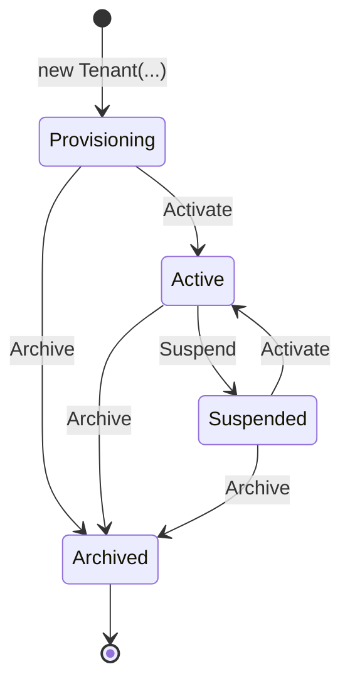

# Platform module

> **Code:** `src/Souq.Domain/Platform`, `src/Souq.Domain/Auditing`, `src/Souq.Application/Features/Platform`, `src/Souq.Application/Features/Stores`, `src/Souq.Application/Common/Tenancy`, `src/Souq.Application/Common/Auditing`, `src/Souq.Infrastructure/Tenancy`, `src/Souq.API/Tenancy` · **Decisions:** [ADR-0005](../../11-ADR/0005-multi-tenancy-model.md), [ADR-0006](../../11-ADR/0006-tenant-resolution.md), [ADR-0011](../../11-ADR/0011-white-label-architecture.md), [ADR-0022](../../11-ADR/0022-tenancy-enforcement.md), [ADR-0024](../../11-ADR/0024-platform-administration.md) · **Change guide:** [ChangeGuide.md](ChangeGuide.md)

## Purpose

Souq sells stores. The Platform module owns the store itself: who exists on the platform, on which hosts each store is served, what it looks and reads like, which optional features are switched on for it, and whether it is open for business. It is its own module because every other module needs an answer to "which store is this request for, and is it allowed to be here?" before it can do anything, and because those answers are commercial decisions (contract, billing, abuse) that belong to the platform owner, not to the store's own staff.

The module also hosts the **audit trail**: the append-only record of who did what in which store. It is a building block rather than a business capability, but its only reader today is the platform area, so it is documented here.

## Responsibilities

- The store (tenant) lifecycle: create, name, currency, locale, activate, suspend, archive.
- Hosts: adding, removing and choosing the primary domain; the platform-wide uniqueness of a host.
- Resolving a request's store from its `Host` header, and deciding whether the requested endpoint is available on that host in that store's state.
- The store settings document: per-language display name and announcement, branding (colours, typography and theme presets, uploaded logo/favicon/social image), contact details, social links, **policy links**, SEO, enabled languages.
- The platform's per-store switch for the optional modules, and the server-side enforcement of the **effective** set — what the store's plan grants, intersected with that switch.
- The public storefront configuration one store's frontend boots from, with its cache and ETag.
- The platform administration area: the store list and detail, a store's administrative accounts, inviting a store's first administrator, platform accounts, and the audit log.
- Writing the audit trail for every auditable request, and keeping it append-only.

## Not this module's job

| Not here | Owner |
|---|---|
| Accounts, passwords, sessions, roles and permissions | [Identity](../Identity/README.md) — Platform only *asks* for an invitation or a status change through shared building blocks |
| Cross-store counts and dashboards | [Reporting](../Reporting/README.md) |
| Products, orders, customers, coupons, reviews, shipping | The respective modules; Platform never reads their tables except through the reviewed `PlatformQueries` |
| Payment gateway behaviour and the encrypted store keys | [Payments](../Payments/README.md) — including the store-facing use cases, which **moved to `Features/Payments` in M1** (TD-04/R-04; four statements in this file still said `Features/Stores` until M11 corrected them, contradicting the Dependencies section that recorded the move) (see Dependencies) |
| Emails and templates | [Notifications](../Notifications/README.md) |
| Reading the review-publishing policy when a review is created | [Reviews](../Reviews/README.md); Platform owns the flag, Reviews owns the decision |
| Plans, subscriptions and entitlements — *what may this store use, and on what terms* | [Billing](../Billing/README.md) since C1. Platform keeps the per-store switch and the one enforcement point; Billing owns the other input |

## Business concepts

- **Store (tenant)** — one shop on the platform: name, slug, currency, default culture, time zone, status.
- **Slug** — the store's stable identifier (`marka`), used for subdomains and links; fixed after creation, and never one of the reserved system names.
- **Domain** — a host the store is served on. Unique across the whole platform; exactly one of a store's domains is **primary** (the host used to build invitation links and email links for work started elsewhere).
- **Verified domain** — a host whose ownership the platform confirmed manually. Informational today: verification is not required to serve traffic.
- **Store status** — Provisioning, Active, Suspended, Archived.
- **Settings document** — everything about how the store presents itself, validated as a whole and stored as one JSON document.
- **Branding preset** — a curated typography key and theme key; a new look is a product feature for every store, never a per-client fork.
- **Module flag** — the platform's per-store switch for an optional capability (promotions, reviews, wishlist). It is one of **two** inputs, not the answer: see *Effective modules* under [Tenant behaviour](#tenant-behaviour).
- **Platform area** — the platform owner's entry point, served only on platform hosts.
- **Audit entry** — one immutable line: when, which area, which action, which store, which actor, the target and safe metadata.
- **Tenant directory** — the cached host → store map every request consults.
- **Storefront configuration** — the public projection of a store's identity that the frontend boots from.

## Domain model

| Type | Kind | Path | Invariants it guards |
|---|---|---|---|
| `Tenant` | aggregate root | `src/Souq.Domain/Platform/Tenant.cs` | Name 2–100 characters with no control characters (it reaches email subjects); slug 2–40 lowercase alphanumerics and dashes, not a reserved name, normalized once at construction; culture within `SupportedCultures`; IANA-shaped time zone; valid currency code, and currency changes only while the store has no commercial activity; guarded status transitions; the default culture is always among the enabled cultures; at most one primary domain and no duplicate host within the store; the primary domain cannot be removed while other domains exist; branding asset URLs must start with this store's upload prefix |
| `TenantDomain` | entity in the `Tenant` aggregate | `src/Souq.Domain/Platform/TenantDomain.cs` | One normalized spelling per host (lowercase, no trailing dot, ≤253 characters, DNS label shape); created only through `Tenant.AddDomain` (internal constructor); `MarkVerified` sets `VerifiedAt` once |
| `TenantStatus` | enum | `src/Souq.Domain/Platform/TenantStatus.cs` | — |
| `StoreSettings` | value object | `src/Souq.Domain/Platform/StoreSettings.cs` | Immutable; replaced wholesale by `Tenant`; rebuilt from storage without validation so that a later rule never breaks an existing store |
| `StoreBranding` | value object | `src/Souq.Domain/Platform/StoreSettings.cs` | Typography and theme must be keys from `BrandPresets`; uploaded asset paths survive a style change |
| `BrandColors` | value object | `src/Souq.Domain/Platform/StoreSettings.cs` | `#RRGGBB` shape; WCAG contrast: text on background ≥ 4.5:1, button text (white or the text colour, whichever reads better) on primary and on accent ≥ 4.5:1, primary on background ≥ 3:1 |
| `StoreContact` | value object | `src/Souq.Domain/Platform/StoreSettings.cs` | Email shape and length; phone shape; per-language address through `LocalizedText` |
| `SocialLink` | value object | `src/Souq.Domain/Platform/StoreSettings.cs` | Only the eight known networks; absolute `https` URL on that network's own domain; at most `StoreSettings.MaxSocialLinks`, one per network |
| `SeoSettings` | value object | `src/Souq.Domain/Platform/StoreSettings.cs` | Title ≤70, description ≤160 characters per language |
| `StorePolicyLinks` | value object | `src/Souq.Domain/Platform/StoreSettings.cs` | The five policy kinds only (`privacy`, `terms`, `returns`, `shipping`, `faq`); each an absolute `https` URL ≤300 characters, on **any** domain — the merchant hosts the page. An empty value is a deletion, an unknown kind is refused rather than ignored. Answers TD-42 as the owner decided it (links, not authored pages) |
| `LocalizedText` | static helper | `src/Souq.Domain/Platform/StoreSettings.cs` | Only supported culture keys; trims; drops empty values; enforces the caller's maximum length |
| `BrandPresets` | static catalogue | `src/Souq.Domain/Platform/StoreSettings.cs` | The approved typography and theme keys |
| `BrandingAsset` | enum | `src/Souq.Domain/Platform/StoreSettings.cs` | — |
| `StoreModules` | static catalogue | `src/Souq.Domain/Platform/StoreModules.cs` | Known keys only on write (`Format`); tolerant on read (`Parse` drops unknown keys rather than failing a store) — tolerant but no longer silent, since C1: `Unknown` reports what was dropped so `TenantDirectory` can log it. Dropping fails closed either way, because an unknown key is never granted |
| `AuditEntry` | append-only record (not an `Entity`) | `src/Souq.Domain/Auditing/AuditEntry.cs` | Area must be one of `AuditAreas`; action must look like `tenant.created`; over-long values are clipped, never rejected — a truncated line beats a missing one |
| `TenantInfo` | Application snapshot record | `src/Souq.Application/Common/Tenancy/TenantInfo.cs` | `HasModule` asks the snapshot's module set and nothing else. The set is non-nullable **with no default**, so a snapshot cannot be built without one — until C1 a null set meant "everything enabled" and the parameter defaulted to null, so a snapshot built without modules granted every one of them |

**Aggregate boundaries.** `Tenant` owns its domains and its settings document. Nothing else in the system holds a reference to `TenantDomain`; business rows reference a store only by the `TenantId` foreign key from the shared kernel. `AuditEntry` is deliberately outside every aggregate and has **no** foreign key to `Tenants`: it is a historical witness, not a live relationship.

**Concurrency.** `Tenants` carries a `rowversion` (`HasRowVersion` in `src/Souq.Infrastructure/Persistence/Configurations/PersistenceConventions.cs`), because the platform owner and a store administrator can edit the same store at the same time. A lost race surfaces as `409 ConcurrencyConflict`.

**Lifecycle.**

`Suspend` is legal from `Active` **and from `Provisioning`** (C3): a store that has not opened yet can still need suspending for a commercial reason — an unfinished contract, a payment that never arrived — and while `Suspend` refused that, the only exit was `Archive`, which is irreversible. It is also what automated dunning (`C6`) needs, since a dunning chain suspends a store that has not paid without first asking what state it was in. `Suspend` from `Suspended` is refused as meaningless, and from `Archived` because archived is terminal. `Activate` is legal from anything except `Archived`, and is idempotent on an already-active store. `Archive` is terminal and refuses a second call. There is no delete: `TenantRepository.Remove` throws on purpose.

## Use cases

Platform-area requests (`Features/Platform`) are all audited, and are the **only** requests that *may* carry an explicit tenant id — the rule is permissive, not mandatory, and this line claimed the opposite until M11: `ListTenantsQuery`, `GetProvisioningOptionsQuery`, `ListPlatformUsersQuery` and `ListAuditEntriesQuery` carry none, because they are not about one store. The auditing half is enforced by `ModuleAndContractRuleTests`; the tenant-id half is enforced only as a prohibition on other modules. Store-side requests (`Features/Stores`) never carry one — the store is always the host's store.

| Use case | Command or query | Handler | Who may call it | Endpoint |
|---|---|---|---|---|
| List stores, with each store's primary domain and administrator state (`ActiveAdmins`, `PendingAdminInvitations`) | `ListTenantsQuery` | `ListTenantsHandler` | `platform.tenants.manage` | `GET /api/platform/tenants` |
| What provisioning accepts: identity limits, reserved slugs, modules, statuses, and the store settings editor's own options | `GetProvisioningOptionsQuery` | `GetProvisioningOptionsHandler` | `platform.tenants.manage` | `GET /api/platform/tenants/options` |
| Store detail | `GetTenantQuery` | `GetTenantHandler` | `platform.tenants.manage` | `GET /api/platform/tenants/{id}` |
| A store's administrative accounts | `ListTenantAccountsQuery` | `ListTenantAccountsHandler` | `platform.tenants.manage` | `GET /api/platform/tenants/{id}/accounts` |
| Create a store | `CreateTenantCommand` | `CreateTenantHandler` | `platform.tenants.manage` | `POST /api/platform/tenants` |
| Rename / change currency | `UpdateTenantCommand` | `UpdateTenantHandler` | `platform.tenants.manage` | `PUT /api/platform/tenants/{id}` |
| Activate / suspend / archive | `ChangeTenantStatusCommand` | `ChangeTenantStatusHandler` | `platform.tenants.manage` | `POST /api/platform/tenants/{id}/status` |
| Add / remove / set primary / verify a domain | `ChangeTenantDomainCommand` | `ChangeTenantDomainHandler` | `platform.tenants.manage` | `POST /api/platform/tenants/{id}/domains`, `DELETE /api/platform/tenants/{id}/domains/{host}`, `POST /api/platform/tenants/{id}/domains/{host}/primary`, `POST /api/platform/tenants/{id}/domains/{host}/verify` |
| Edit a store's settings from the platform | `UpdateTenantSettingsCommand` | `UpdateTenantSettingsHandler` | `platform.tenants.manage` | `PUT /api/platform/tenants/{id}/settings` |
| Set module flags | `SetTenantModulesCommand` | `SetTenantModulesHandler` | `platform.tenants.manage` | `PUT /api/platform/tenants/{id}/modules` |
| Upload a branding file from the platform | `UploadTenantBrandingCommand` | `UploadTenantBrandingHandler` | `platform.tenants.manage` | `POST /api/platform/tenants/{id}/branding/{asset}` |
| Invite a store's administrator | `InviteTenantAdminCommand` | `InviteTenantAdminHandler` | `platform.tenants.manage` | `POST /api/platform/tenants/{id}/admins` |
| Read / set / unlink a store's payment account | `GetTenantPaymentAccountQuery`, `UpdateTenantPaymentAccountCommand`, `RemoveTenantPaymentAccountCommand` | `GetTenantPaymentAccountHandler`, `UpdateTenantPaymentAccountHandler`, `RemoveTenantPaymentAccountHandler` | `platform.tenants.manage` | `GET`/`PUT`/`DELETE /api/platform/tenants/{id}/payments` |
| Read the audit log | `ListAuditEntriesQuery` | `ListAuditEntriesHandler` | `platform.audit.view` | `GET /api/platform/audit` |
| Read a store's own settings | `GetStoreSettingsQuery` | `GetStoreSettingsHandler` | `store.settings.manage` | `GET /api/admin/store/settings` |
| Edit a store's own settings | `UpdateStoreSettingsCommand` | `UpdateStoreSettingsHandler` | `store.settings.manage` | `PUT /api/admin/store/settings` |
| Read what the settings editor may offer (cultures, presets, social networks and domains, **policy kinds**, limits, contrast thresholds) | `GetStoreSettingsOptionsQuery` | `GetStoreSettingsOptionsHandler` | `store.settings.manage` | `GET /api/admin/store/settings/options` |
| Upload a branding file from the store | `UploadStoreBrandingCommand` | `UploadStoreBrandingHandler` | `store.settings.manage` | `POST /api/admin/store/branding/logo`, `/favicon`, `/social-image` |
| Read / change the review-publishing policy | `GetReviewSettingsQuery`, `UpdateReviewSettingsCommand` | `GetReviewSettingsHandler`, `UpdateReviewSettingsHandler` | `reviews.moderate` to read; **both** `reviews.moderate` and `store.settings.manage` to change | `GET`/`PUT /api/admin/reviews/settings` |
| Read / set / unlink the store's own payment account — **owned by [Payments](../Payments/README.md) since M1**, listed here because the platform area calls it through `IStorePaymentAccountEditor` | `GetStorePaymentAccountQuery`, `UpdateStorePaymentAccountCommand`, `RemoveStorePaymentAccountCommand` | `GetStorePaymentAccountHandler`, `UpdateStorePaymentAccountHandler`, `RemoveStorePaymentAccountHandler` | `store.payments.manage` | `GET`/`PUT`/`DELETE /api/admin/store/payments` |
| The public storefront configuration | `GetStorefrontConfigQuery` | `GetStorefrontConfigHandler` | anonymous | `GET /api/storefront/config` |

Platform account management (`ListPlatformUsersQuery`, `InvitePlatformUserCommand`, `SetPlatformUserStatusCommand`) also lives in `Features/Platform`, but the rules it applies are Identity's; see [Identity](../Identity/README.md).

**Frontend screens.**

| Route | Screen | What it does |
|---|---|---|
| `/platform` | `frontend/src/pages/platform/PlatformOverview.jsx` (inside `frontend/src/app/PlatformLayout.jsx`) | Platform totals from `GET /api/platform/stats` ([Reporting](../Reporting/README.md)) |
| `/platform/stores` | `frontend/src/pages/platform/Stores.jsx` | Server-paged store list with status, primary domain and administrator readiness |
| `/platform/stores/new`, `/platform/stores/:id/setup/:step` | `frontend/src/pages/platform/NewStore.jsx`, `frontend/src/pages/platform/StoreSetup.jsx` | The provisioning wizard (identity → branding → domains → modules → administrator → activate); each step saves on its own |
| `/platform/stores/:id` | `frontend/src/pages/platform/StoreDetail.jsx` with `frontend/src/pages/platform/StorePanels.jsx` | The store page: domains, modules, administrator, lifecycle actions |
| `/platform/stores/:id/settings` | `frontend/src/pages/platform/StoreSettingsPage.jsx` | The store settings editor aimed at one store's platform endpoints |
| `/platform/accounts` | `frontend/src/pages/platform/Accounts.jsx` | Platform accounts (owner only) |
| `/platform/audit` | `frontend/src/pages/platform/Audit.jsx` | The activity log |
| `/admin/settings` (store host) | `frontend/src/pages/admin/StoreSettings.jsx` | The store's own settings |

Both settings screens and the wizard's branding step render one editor, `frontend/src/components/settings/StoreSettingsEditor.jsx`, with its live preview. Pure rules the screens share with the server (slug and domain shape, readiness, resume step, lifecycle transitions, audit filters) are in `frontend/src/features/platform/provisioning.js` and `frontend/src/features/platform/audit.js`.

Destructive platform actions confirm in `ConfirmDialog`, and the server's refusal is shown inside the dialog: domain changes such as removing a domain, and every status change — suspending or archiving a store (archiving requires typing the store's slug), and activation, which warns about a missing domain or administrator without blocking — in `StorePanels.jsx`, and disabling a platform account through `frontend/src/components/common/useConfirmAction.jsx`.

## Public contracts

| Contract | Path | Who calls it |
|---|---|---|
| `IPlatformHosts` | `src/Souq.Application/Common/Tenancy/IPlatformHosts.cs` | `ChangeTenantDomainHandler`, to refuse a platform host offered as a store domain (`DomainReserved`). Implemented in the API layer by `ConfiguredPlatformHosts`, because the host list is deployment configuration. **Absent from this table until M11** |
| `ITenantDirectory` | `src/Souq.Application/Common/Tenancy/ITenantDirectory.cs` | `TenantResolutionMiddleware`; `Features/Platform` handlers; `OutboxProcessor` and `StoreSweepService` (iterate stores); `ProcessPaymentWebhookCommand` (route a webhook to the store that took the payment) |
| `ITenantContext` (+ `RequireTenant`) | `src/Souq.Application/Common/Tenancy/ITenantContext.cs` | Every module: currency, culture, module flags, and the tenant scope |
| `ITenantScopeRunner` | `src/Souq.Application/Common/Tenancy/ITenantScopeRunner.cs` | The platform area when it must *write* inside one store; `ProcessPaymentWebhookCommand` |
| `IStoreConfiguration` | `src/Souq.Application/Features/Stores/StoreSettingsUseCases.cs` | `GetStorefrontConfigHandler` |
| `IPlatformQueries` | `src/Souq.Application/Features/Platform/PlatformModels.cs` | The platform area's read use cases; implemented by `PlatformQueries`, the only reviewed query-filter bypass |
| `IAuditable`, `AuditRecord`, `IAuditTrail`, `IClientInfo` | `src/Souq.Application/Common/Auditing/Auditing.cs` | Every auditable request, and `AuditBehavior` |

`Souq.Domain.Platform` types themselves (`StoreModules` keys, `TenantStatus`) are part of the shared kernel in practice: other modules reference the constants, not this module's use cases.

**No module-flag contract:** earlier module documentation named a planned *ITenantModules* contract. It does not exist and is not needed — the effective modules travel inside the cached `TenantInfo` and are asked through `TenantInfo.HasModule`. C1 did not change that: it changed what goes into the snapshot, not who asks it.

## Dependencies

- **Uses:**
  - `IFileStorage` (branding uploads) and `MediaFileInspector` (content sniffing) from the shared kernel.
  - `Common/Accounts` (`AccountInvitations`, `AccountStatusChanger`, `IAccountQueries`) — Identity's rules, deliberately shared building blocks rather than a cross-module call.
  - Billing's published contract `IStoreEntitlements` (`src/Souq.Application/Features/Billing/Contracts/IStoreEntitlements.cs`, authorized in `AllowedContracts`): `CreateTenantHandler` subscribes a new store to the foundation plan — without it the store would be provisioned with no optional module at all — and `GetTenantHandler` reads its plan for the store page. A contract rather than Billing's domain types, because a direct reference would make Platform ⇄ Billing a cycle in both directions (Billing already reads `Tenant`).
  - **Boundary leak — closed in the M1 architecture audit (TD-04/R-04).** The store-payment-account use cases used to live in `Features/Stores` (this module's folder) while working on **Payments'** domain. They now live in `Features/Payments`, and the one path Platform genuinely needs — the platform admin's own view of a store's payment account, `src/Souq.Application/Features/Platform/TenantPaymentAccounts.cs` — reaches them through a published contract, `IStorePaymentAccountEditor` ([Payments/README.md](../Payments/README.md#who-owns-store-payment-accounts)), authorized explicitly in `ModuleAndContractRuleTests`' `AllowedContracts`.
  - In Infrastructure, `PlatformQueries` reads `Users`, `Customers`, `Products`, `Orders`, `Coupons` and `ShippingMethods` with `IgnoreQueryFilters` (the last two were added with the currency lock and were missing from this list until M11). That is the deliberate, reviewed exception ([ADR-0024](../../11-ADR/0024-platform-administration.md)).
- **Used by:**
  - Everything, through `ITenantContext` (currency, culture) and the request-time resolution.
  - Shopping: `PricingService` refuses a coupon when `StoreModules.Promotions` is off.
  - **Boundary leak:** Reviews' `CreateReviewHandler` loads the whole `Tenant` aggregate through `ITenantRepository` just to read `ReviewsAutoApprove`.
  - **Boundary leak:** Notifications' `NotificationEmails` loads the `Tenant` aggregate through `ITenantRepository` for the email's store name, logo and colours; `StoreOrigins` (Infrastructure) reads `Tenants`/`TenantDomains` directly for a store's primary-domain origin.
- **Enforced vs convention.**
  - Enforced by `tests/Souq.ArchitectureTests/TenancyRuleTests.cs`: platform entities must **not** be tenant-owned; every tenant-owned entity has the named filter and an FK to `Tenants`; `IgnoreQueryFilters` only inside `PlatformQueries`; no raw SQL outside migrations; `ExecuteUpdate`/`ExecuteDelete` only in the reviewed call sites, since they bypass `SaveChanges` and so the write guard; no feature takes the writable `TenantContext`.
  - Enforced by `tests/Souq.ArchitectureTests/ModuleAndContractRuleTests.cs`: only requests under `Features.Platform` may carry a `TenantId`; every request under `Features.Platform` and `Features.Reporting` must implement `IAuditable`; no feature folder references another module's namespace outside the allowed contracts.
  - Convention only: auditing store-side commands (`Features/Stores`, `Features/Staff`) — nothing fails the build if a new store command forgets `IAuditable`; keeping other modules off the `Tenant` aggregate; keeping the store-payment use cases out of this module's folder (**done in M1**, and this line's wording predates it) — and keeping the payment-account editor in `Features/Stores`.

## Data ownership

| Table | Configuration | Tenant-owned? | Notes |
|---|---|---|---|
| `Tenants` | `src/Souq.Infrastructure/Persistence/Configurations/TenantConfiguration.cs` | No — it *defines* the tenant | Unique index on `Slug`; the settings document in the `Settings` JSON column (converted by `StoreSettingsJson`); the platform's per-store module switch in the `EnabledModules` column, whose database default is **empty** since C1 — a row inserted without naming it grants nothing, where it used to grant every module; `Tenant`'s constructor still names all three for a new store; `ReviewsAutoApprove`; `rowversion` |
| `TenantDomains` | `TenantDomainConfiguration` in the same file | No | **Unique index on `Host` across the whole platform** — the last guard against stealing another store's host; cascade delete from `Tenants` |
| `AuditEntries` | `src/Souq.Infrastructure/Persistence/Configurations/AuditEntryConfiguration.cs` | No, and deliberately no FK to `Tenants` | Append-only, enforced by `TenantWriteGuardInterceptor`; indexes on `OccurredAt`, `(TenantId, OccurredAt)`, `(ActorUserId, OccurredAt)` |
| `StorePaymentAccounts` | `StorePaymentAccountConfiguration` | Yes | Owned by Payments (entity and key rules); written from `Features/Payments` (since M1) and this module's `Features/Platform` use cases (TD-04 records moving them to Payments) |

Other modules' data is read only through `PlatformQueries`: a store's administrative accounts (`Users` with an explicit `TenantId` predicate), and "does this store have any commercial activity?" (`Products`, `Orders`, `Coupons` or `ShippingMethods` — coupons and shipping methods are priced rows too, so a store holding only a coupon is currency-locked as well; this list said `Products` or `Orders` until M11, and M8 re-confirmed the wider one as what closes R-09), which is what locks a store's currency.

Migrations: `Phase2MultiTenancy` creates `Tenants` and `TenantDomains` and the default store (fixed id 1, named "Marka Demo", slug `marka`); `Phase4PlatformAdministration` adds the settings document, the module column and `AuditEntries`; `Phase13ReviewsWishlist` adds `ReviewsAutoApprove`; `CommercialControlPlane` changes the module column's default to empty (and creates [Billing](../Billing/README.md)'s own tables).

## API

| Method | Route | Authorization | Module flag | Use case |
|---|---|---|---|---|
| GET | `/api/platform/tenants` | `platform.tenants.manage`, platform host | — | List stores |
| GET | `/api/platform/tenants/options` | `platform.tenants.manage` | — | Provisioning options (same settings options object as `/api/admin/store/settings/options`) |
| GET | `/api/platform/tenants/{id}` | `platform.tenants.manage` | — | Store detail |
| POST | `/api/platform/tenants` | `platform.tenants.manage` | — | Create a store |
| PUT | `/api/platform/tenants/{id}` | `platform.tenants.manage` | — | Rename / currency |
| POST | `/api/platform/tenants/{id}/status` | `platform.tenants.manage` | — | Activate / suspend / archive |
| POST | `/api/platform/tenants/{id}/domains` | `platform.tenants.manage` | — | Add a domain |
| DELETE | `/api/platform/tenants/{id}/domains/{host}` | `platform.tenants.manage` | — | Remove a domain |
| POST | `/api/platform/tenants/{id}/domains/{host}/primary` | `platform.tenants.manage` | — | Set the primary domain |
| POST | `/api/platform/tenants/{id}/domains/{host}/verify` | `platform.tenants.manage` | — | Mark a domain verified (manual) |
| PUT | `/api/platform/tenants/{id}/settings` | `platform.tenants.manage` | — | Settings |
| PUT | `/api/platform/tenants/{id}/modules` | `platform.tenants.manage` | — | Module flags |
| POST | `/api/platform/tenants/{id}/branding/{asset}` | `platform.tenants.manage` | — | Branding upload |
| GET | `/api/platform/tenants/{id}/accounts` | `platform.tenants.manage` | — | The store's administrative accounts |
| POST | `/api/platform/tenants/{id}/admins` | `platform.tenants.manage` | — | Invite the store's administrator |
| GET/PUT/DELETE | `/api/platform/tenants/{id}/payments` | `platform.tenants.manage` | — | The store's payment account |
| GET | `/api/platform/audit` | `platform.audit.view` | — | Audit log |
| GET | `/api/platform/stats` | `platform.reports.view` | — | Platform totals ([Reporting](../Reporting/README.md)) |
| GET | `/api/platform/users` | `platform.users.manage` | — | Platform accounts, paged |
| POST | `/api/platform/users` | `platform.users.manage` | — | Invite a platform account |
| POST | `/api/platform/users/{id}/status` | `platform.users.manage` | — | Enable or disable one |
| GET/PUT | `/api/admin/store/settings` | `store.settings.manage` | — | The store's own settings |
| GET | `/api/admin/store/settings/options` | `store.settings.manage` | — | The editor's allowlists and limits, read from the Domain. `StoreSettingsOptionsTests` passes every offered option back through the Domain rules |
| POST | `/api/admin/store/branding/logo`, `/favicon`, `/social-image` | `store.settings.manage` | — | Branding uploads (≤2 MB, sniffed content) |
| GET/PUT/DELETE | `/api/admin/store/payments` | `store.payments.manage` | — | The store's payment account |
| GET | `/api/admin/reviews/settings` | `reviews.moderate` | `reviews` | Review-publishing policy |
| PUT | `/api/admin/reviews/settings` | `reviews.moderate` **and** `store.settings.manage` | `reviews` | Change the policy |
| GET | `/api/storefront/config` | anonymous (a reviewed public endpoint) | — | Storefront configuration |

Controllers: `src/Souq.API/Controllers/PlatformControllers.cs`, `src/Souq.API/Controllers/StoreAdministrationControllers.cs`, `src/Souq.API/Controllers/ReviewsController.cs`.

## Security and permissions

- `platform.tenants.manage` (PlatformOwner, PlatformAdmin) runs stores. `platform.users.manage` and `platform.settings.manage` are the owner's alone. `platform.audit.view` and `platform.reports.view` are granted to both platform roles. `platform.settings.manage` is currently **used by no endpoint**, and no platform-wide setting exists (open decision P-07).
- Every controller in the platform area carries `[PlatformEndpoint]`, so it 404s on a store host, and a store token (which carries `tid`) is rejected with 401 on a platform host. `AuthorizationBoundaryTests` proves both, and also that no platform endpoint is anonymous.
- Store-side settings endpoints carry no store id anywhere in the route: the store is the host's store, so editing another store's settings is impossible by construction rather than by a check that could be forgotten.
- Branding files are never URLs from the client: the server generates the path under `/uploads/tenants/{id}/branding/`, the file type comes from sniffed content ([ADR-0016](../../11-ADR/0016-upload-validation.md)), and `Tenant.SetBrandingAsset` refuses any path outside that store's prefix.
- Colour validation is a security-adjacent rule in the sense that it protects readability, not access: an unreadable palette is rejected and nothing is saved.
- Store payment secrets are encrypted with `AesGcmSecretProtector` bound to the store (`SecretPurposes`), never returned in any response, and never written to the audit trail — only "which fields changed" is recorded.

## Tenant behaviour

**Resolution** (`src/Souq.API/Tenancy/TenantResolutionMiddleware.cs`, runs before static files and authentication, only for `/api` and `/uploads`):

1. The host is lowercased and stripped of a trailing dot.
2. A host in `Tenancy:PlatformHosts` puts the request in platform scope (no store).
3. Otherwise, in Development and Testing **only**: an `X-Tenant` header selects a store by slug.
4. The `TenantDomains` map, through `ITenantDirectory`.
5. Otherwise, in Development and Testing **only**: `localhost`/`127.0.0.1`/`::1` resolves to `Tenancy:LocalDefaultTenant` (defaulted in `Program.cs` to `DbSeeder.DefaultTenantSlug`), then `{slug}.localhost`.
6. Otherwise `404 StoreNotFound`. There is no fallback store in production, and the development conveniences are switched on from the environment in `Program.cs`, so configuration cannot enable them.

A request for `/uploads/tenants/{id}/…` on another store's host gets a bare 404.

**Availability** (`src/Souq.API/Tenancy/TenantAvailability.cs`, after routing, so it can see the endpoint's metadata):

| Situation | Result |
|---|---|
| Platform endpoint on a store host, or a store endpoint on a platform host (and not `[AvailableOnAllHosts]`) | `404 NotFound` — the existence of the other area is not revealed |
| Store `Provisioning` and the endpoint is not `[AvailableDuringProvisioning]`, not `AvailableWhenStoreClosedAttribute`, and not behind a `[HasPermission]` policy | `503 StoreUnavailable` |
| Store `Suspended` or `Archived` and the endpoint is not `AvailableWhenStoreClosedAttribute` | `503 StoreUnavailable` |
| The endpoint declares `[RequiresModule(...)]` and the store's effective set does not contain it | `404 ModuleDisabled` |

Because administration endpoints are recognised by their permission policy, a store's staff can work while it is still being provisioned — which is exactly how a store is prepared before it opens.

**Effective modules** (C1). The set a store actually has is the **intersection** of two inputs: what its plan grants, plus its live unexpired entitlement overrides ([Billing](../Billing/README.md)), and the platform's per-store `EnabledModules` switch. The plan is the commercial ceiling; the switch is the operational off-button, so a store whose plan allows reviews can still turn them off. It is composed once per snapshot, in `TenantDirectory`: `TenantDirectory.Project` reads the three inputs in the same round trip that builds the rest of the snapshot, and they are intersected in memory afterwards by `Entitlements.Effective`, the rule itself, which lives in the Domain. **A missing or unresolvable input grants nothing** — no subscription, a plan that cannot be resolved, or an unknown key yields the empty set, never "everything". The enforcement point did not move: everyone still asks `TenantInfo.HasModule`, read by `TenantAvailabilityMiddleware` and by `PricingService`. `GET /api/storefront/config` reports this effective set rather than the raw column, so the SPA never offers a feature the server would 404.

**Caches.** `TenantDirectoryCache` (a dedicated `MemoryCache`, 10,000 entries, 60 s for hits, 15 s for misses) holds host, slug, id and storefront-config entries. `ITenantDirectory.Invalidate` bumps a generation counter, dropping every entry at once **on the calling instance only**; other instances follow within 60 s. Every platform command that changes a store calls it.

**Writes.** Platform commands that must write *inside* a store (inviting its administrator, saving its payment keys, storing its branding file) go through `ITenantScopeRunner`, which opens a new DI scope whose `TenantContext` is that store. The write guard and the storage prefix then apply exactly as on a request made on that store's own host — the platform never bypasses them.

## Events and background work

- No domain events are raised by this module.
- `AccountInvited` is enqueued in the outbox inside the target store's scope, so the dispatcher later processes it in that same store's scope. See [Notifications](../Notifications/README.md).
- `AuditBehavior` (`src/Souq.Application/Common/Behaviors/AuditBehavior.cs`) runs after validation and before the handler. It stages the entry into the current unit of work, so the handler's first `SaveChanges` commits the change and its audit line atomically. A failed `Result` or an exception discards the line; a request that saved nothing (a query) has its line flushed after success.
- `StoreSweepService` (Infrastructure) uses `ITenantDirectory.ListForBackgroundSweepsAsync` to run other modules' periodic work once per store — **active and suspended**, since a suspended store's expired stock holds would otherwise never be released (M5, R-24). Provisioning and archived stores are excluded.

## External integrations

- File storage through `IFileStorage` (`LocalFileStorage` today) for branding assets, always under the store's prefix.
- AES-256-GCM secret protection (`AesGcmSecretProtector`, key material from `Secrets:Keys` / `Secrets:ActiveKeyId`) for the store payment keys, edited through `Features/Payments` (they left this module's folder in M1 — TD-04).
- No other external system. DNS and TLS for custom domains are **PLANNED** (roadmap Phase 23).

## Tests

| Level | Class | What it covers |
|---|---|---|
| Domain | `tests/Souq.Domain.Tests/TenantTests.cs` | Creation defaults, slug and currency and locale validation, domain rules, guarded status transitions, currency lock |
| Domain | `tests/Souq.Domain.Tests/TenantSettingsTests.cs` | Default settings, the default culture always enabled, preset lists, branding-asset prefix, module replacement, social-link limits, control characters in the name, and policy links — the closed kind list, the `https`-absolute rule, empty-means-delete, and that a caller who does not mention them does not clear them |
| Domain | `tests/Souq.Domain.Tests/StoreSettingsTests.cs` | WCAG contrast maths and rejections, social-link allowlist, contact normalization, SEO limits, module parsing |
| Domain | `tests/Souq.Domain.Tests/InvitationAndAuditTests.cs` | Audit action shape, unknown area, clipping |
| Application | `tests/Souq.Application.Tests/Platform/TenantAdministrationTests.cs` | Unknown store id, directory invalidation, currency lock through the aggregate, invitation without a domain, invitation inside the store's scope |
| Application | `tests/Souq.Application.Tests/Stores/ReviewSettingsHandlersTests.cs` | Policy read/write on the context store, and its audit record |
| Application | `tests/Souq.Application.Tests/Payments/StorePaymentAccountEditorTests.cs` | Key encryption bound to the store, key-mode policy, malformed keys, unlink (owned by Payments; exercised from here because the platform path calls it through `IStorePaymentAccountEditor`) |
| Application | `tests/Souq.Application.Tests/Common/AuditBehaviorTests.cs` | Actor, store and area on the staged line; discard on failure and on exception; untouched non-auditable requests |
| Application | `tests/Souq.Application.Tests/Common/TenantContextTests.cs` | Set once, and `RequireTenant` throwing in platform scope |
| Integration | `tests/Souq.IntegrationTests/PlatformAdministrationTests.cs` | The full provisioning scenario, the Marka look and ETag/304, module enforcement in the endpoint and in checkout, domain theft, currency lock, platform accounts, append-only audit |
| Integration | `tests/Souq.IntegrationTests/CommercialControlPlaneTests.cs` | The two module inputs through the real middleware: a store left without a plan loses every optional module although its column is unchanged, and the storefront config reports the effective set rather than the column (owned by [Billing](../Billing/README.md), listed here because both behaviours are this module's endpoints) |
| Integration | `tests/Souq.IntegrationTests/ProvisioningBoundaryTests.cs` | The wizard's boundaries: platform options equal the store editor's, a platform host refused as a store domain, administrator readiness in the list, the provisioning owner's token refused on the new store, the new store isolated from its first moment |
| Integration | `tests/Souq.IntegrationTests/PlatformAuditViewerTests.cs` | Account, date-range and store filters together; server paging newest first; UTC range bounds as the browser sends them; an inverted range refused; reading the log writes a line; platform host and platform account only; response instants carry `Z` |
| Integration | `tests/Souq.IntegrationTests/StoreAdministrationTests.cs` | Store-side settings edit and its audit line, unreadable palette rejected, branding formats and host-scoped serving, staff vs settings permissions |
| Integration | `tests/Souq.IntegrationTests/TenantResolutionTests.cs`, `TenantResolutionMiddlewareTests.cs` | Unknown host, suspended and provisioning stores, platform host, development conveniences, upload host binding, log scope |
| Integration | `tests/Souq.IntegrationTests/TenantIsolationTests.cs` | Cross-store reads, writes, uniqueness, tokens, files |
| Architecture | `tests/Souq.ArchitectureTests/TenancyRuleTests.cs`, `ModuleAndContractRuleTests.cs` | The rules listed under Dependencies |
| Frontend | `frontend/src/app/tenantModel.test.js`, `frontend/src/whiteLabel.test.js` | Deriving theme tokens, currency and modules from the config, and mapping the boot response to a screen |
| Frontend | `frontend/src/features/platform/provisioning.test.js`, `frontend/src/features/platform/audit.test.js` | Slug, currency and domain rules as the server applies them; readiness and resume step; lifecycle transitions; audit filters in the URL, local-day bounds, metadata rendering and action categories |
| Frontend | `frontend/src/pages/platform/Provisioning.test.jsx` | Store list readiness and server-side search; creating a store; the store page's domain and administrator sections; archive requiring the slug; a refusal kept inside the dialog; the platform settings editor writing to the selected store |
| Frontend | `frontend/src/pages/platform/Accounts.test.jsx`, `frontend/src/pages/platform/Audit.test.jsx`, `frontend/src/pages/platform/PlatformOverview.test.jsx` | Account actions offered by the server, disable only after confirmation, `LastAdministrator` read in the dialog; audit lines as recorded, UTC instant in details, server filtering and paging; overview totals across statuses and empty platforms |
| End-to-end | `frontend/e2e/platform-provisioning.spec.js` | A store provisioned in a browser from creation to activation, its administrator accepting on the store host, the owner refused there, archive needing the slug |
| End-to-end | `frontend/e2e/back-office.spec.js` | Platform account invitation and acceptance, the disable found in the activity log by activity and by account, a store page opening its own activity (plus store-admin confirmation dialogs) |

## Failure modes

| Situation | Error code | HTTP | Where it comes from |
|---|---|---|---|
| Host maps to no store | `StoreNotFound` | 404 | `TenantResolutionMiddleware` |
| Wrong area for the host | `NotFound` | 404 | `TenantAvailabilityMiddleware` |
| Store not open for this endpoint | `StoreUnavailable` | 503 | `TenantAvailabilityMiddleware` |
| Endpoint of a disabled module | `ModuleDisabled` | 404 | `TenantAvailabilityMiddleware` |
| Coupon used while `promotions` is off | `ModuleDisabled` | 422 | `PricingService` through checkout |
| Unknown store id in a platform command | `NotFound` | 404 | `PlatformTenants.NotFound` |
| Slug already used | `TenantSlugTaken` | 409 | `CreateTenantHandler` |
| Host already mapped to a store | `DomainTaken` | 409 | `ChangeTenantDomainHandler` |
| Host is a platform host (`admin.…`) offered as a store domain | `DomainReserved` | 409 | `ChangeTenantDomainHandler`, via `IPlatformHosts` — asserted by `ProvisioningBoundaryTests` and the provisioning journey |
| Race past either check | `DuplicateValue` | 409 | Unique index → `UniqueConstraintViolationException` |
| Invalid name, slug, culture, time zone, currency, colours, preset, social link, module key, illegal status transition, currency change after activity, branding path outside the store | `InvalidTenantOperation` | 422 | `InvalidTenantOperationException` |
| Inviting an administrator to a store with no domain | `TenantHasNoDomain` | 422 | `InviteTenantAdminHandler` |
| Inviting an administrator to an archived store | `InvalidTenantOperation` | 422 | `InviteTenantAdminHandler` (a `Result` failure, not the aggregate) |
| Branding file too large / wrong type / missing | `FileTooLarge`, `UnsupportedMediaType`, `FileRequired` | 400 | `BrandingFiles.InspectAsync`, the controller |
| Concurrent edits of one store | `ConcurrencyConflict` | 409 | `rowversion` |
| Shape validation | `ValidationFailed` | 400 | `ValidationBehavior` |
| Store data touched with no store in scope (a bug) | `ServerError` | 500 | `TenantContextMissingException` |
| Write aimed at another store (a bug) | `ServerError` | 500 + a Critical log | `CrossTenantWriteException` |
| Update or delete of an audit row (a bug) | `ServerError` | 500 + a Critical log | `TenantWriteGuardInterceptor` |
| Store payment keys without server-side encryption configured | `SecretsNotConfigured` | 503 | `StorePaymentAccountEditor` |
| Test-mode keys where policy forbids them | `TestKeysNotAllowed` | 422 | `StorePaymentAccountEditor` |

## Common change scenarios

Details in [ChangeGuide.md](ChangeGuide.md): adding a store setting; adding a module flag; adding a platform endpoint; changing store-status rules; custom domains and DNS verification; changing what the storefront config exposes; adding an audited action; changing the tenant-resolution rules.

### Sessions, when a store's lifecycle changes

**Archiving a store revokes every session in it; suspending one does not** (TD-66, closed in C3). The difference is owner decision `C-17` = B: a suspension is temporary and means *admin-only*, so the merchant stays signed in to fix it, while archiving ends the relationship.

The defect this closed was narrow and real. Every permissioned endpoint already answered `503` for an archived store, but sign-in, sign-out, refresh and the current-user endpoint are `AvailableWhenStoreClosedAttribute` **on purpose** — so an archived store's administrators kept indefinitely refreshable sessions.

`ChangeTenantStatusHandler` now calls `IStoreSessionRevoker` inside the same transaction as the status change, so "archived with live sessions" never exists as a committed state. The adapter (`StoreSessionRevoker`) writes two bulk statements with an explicit `TenantId` condition — a new security stamp for every account of the store, and a revocation on every unrevoked refresh token — and then drops this instance's cached stamps. It is the first **writer** allowed to bypass the tenant filter, and it is listed with its reason in both allowlists in `TenancyRuleTests`; the alternative was loading every account of the store, customers included, to rotate a stamp each.

One stamp value is shared by the store's accounts, and that is safe rather than convenient: the stamp is a claim inside a **signed** token, so its only job is to differ from the one the existing tokens carry. Knowing another account's stamp forges nothing — the signature is what prevents that.

## Known limitations

- **A closed store serves its configuration and the authentication endpoints.** `AvailableWhenStoreClosedAttribute` is applied to `GET /api/storefront/config` **and to sign-in, refresh, sign-out and the current user** (`AuthController`), so a `Provisioning`, `Suspended` or `Archived` store still returns its identity and status and still lets its administrator in to fix it — that is the point. This bullet named only the configuration endpoint until M11, which had been wrong since Phase 12 (R-08) and disagreed with [StorefrontPreview.md](StorefrontPreview.md), the document that depends on the gate. `TenantResolutionTests` records the intent (the SPA draws a branded "unavailable" screen) while every other endpoint answers `503 StoreUnavailable` — proven by `PlatformAdministrationTests` and by `frontend/e2e/platform-provisioning.spec.js`, which reads an archived store's config.
- **A store can be activated with no domain and no administrator**, and the only domain of an active store can be removed. Nothing in the aggregate or the handlers prevents an unreachable-but-active store. The platform screens do not invent that rule either: readiness is reported, and activation warns inside its confirmation.
- **`VerifiedAt` is decorative.** Resolution never checks it, so a domain serves traffic the moment it is added. DNS/TLS verification is **PLANNED** (Phase 23).
- **The directory and storefront caches are per-process.** With more than one API instance, a suspension or a branding change takes up to 60 s to reach the others, and each instance computes its own ETag.
- **The settings document cannot be queried inside.** "Find every store whose contact email is X" means scanning JSON.
- **Audit gaps across scopes.** When a platform command writes inside a store (`InviteTenantAdminCommand`, `UpdateTenantPaymentAccountCommand`, `RemoveTenantPaymentAccountCommand`), the work commits in the store's `DbContext` while the audit line commits in the platform's — a crash in between leaves a change without its line. [ADR-0024](../../11-ADR/0024-platform-administration.md) records this for "two platform commands" and suggests the outbox (Phase 14) could close it; Phase 14 shipped and the gap is still open, and the payment commands were added to it in Phase 11.
- **The audit log has no retention or purge**, no export, and no store-facing viewer: there is no store audit endpoint or page, Phase 17 closed without one, and no later phase schedules it. The platform viewer (`/platform/audit`) reads it with the server's filters and paging and says on screen what the log does not contain.
- **Audit instants are UTC.** `occurredAt` and the date filters travel as UTC instants with a `Z` suffix (`src/Souq.API/Http/UtcDateTimeJsonConverter.cs`). The viewer shows each line in the reader's local time and the raw UTC instant in the entry's details; a "from"/"to" day is the reader's local day, converted to UTC before it is sent.
- **An audit line names ids, not people or stores.** `AuditEntryDto` carries the actor's id and role and the store's id; the viewer shows them as such rather than fetching names, because every platform read is itself an audit line and a store's accounts are outside the platform's scope.
- **Store queries are not audited** — only platform-area requests and store-side commands are. Sign-ins, sign-outs and other Identity events are not audited at all.
- **`Archive` is terminal but empty.** No data export, anonymization or deletion happens; the store simply stops serving.
- **No quotas.** Plans and subscriptions arrived with C1 and live in [Billing](../Billing/README.md), but this module's own commercial lever is still one switch over a fixed set of three keys, and nothing anywhere counts or caps a store's usage.
- **Readiness reads one page of accounts.** A store's page decides "has an administrator" from the first 100 administrative accounts, newest first; the list uses the server's exact counts.

## Future evolution

- **Not scheduled:** a store-facing audit view. Phase 17 closed without it.
- **DECISION REQUIRED (Phase 18, remaining):** storefront preview with a preview token — who may preview, which states, what a preview may do, lifetime and revocation, and how the credential crosses hosts. The brief is [StorefrontPreview.md](StorefrontPreview.md) (D-22).
- **DECISION REQUIRED:** platform-wide settings (`platform.settings.manage`) — no setting is defined (P-07).
- The store list, provisioning wizard, store page, platform accounts (`/platform/accounts`) and the activity log (`/platform/audit`) are delivered — see [FrontendArchitecture.md](../../08-FRONTEND/FrontendArchitecture.md) §5.
- **PLANNED (Phase 23):** automated TLS and DNS verification for custom domains; per-store email-domain authentication.
- **Delivered in C1:** plans, subscriptions and entitlements, in [Billing](../Billing/README.md). What stays undone is the money — prices, invoices, commissions and payouts — and quota enforcement over the limits a plan already carries.
- **FUTURE:** an audited "support mode" that lets the platform act inside a store — described in [MultiTenancy.md](../../02-ARCHITECTURE/MultiTenancy.md) and [AuthenticationAndAuthorization.md](../../07-SECURITY/AuthenticationAndAuthorization.md) as Phase 18, but absent from the roadmap's Phase 18 scope.
- **FUTURE:** distributed cache invalidation (or shorter lifetimes) when the API runs as several replicas; promoting individual settings fields to columns if they ever need to be queried; a dedicated database per store through the resolver seam described in [MultiTenancy.md](../../02-ARCHITECTURE/MultiTenancy.md).
