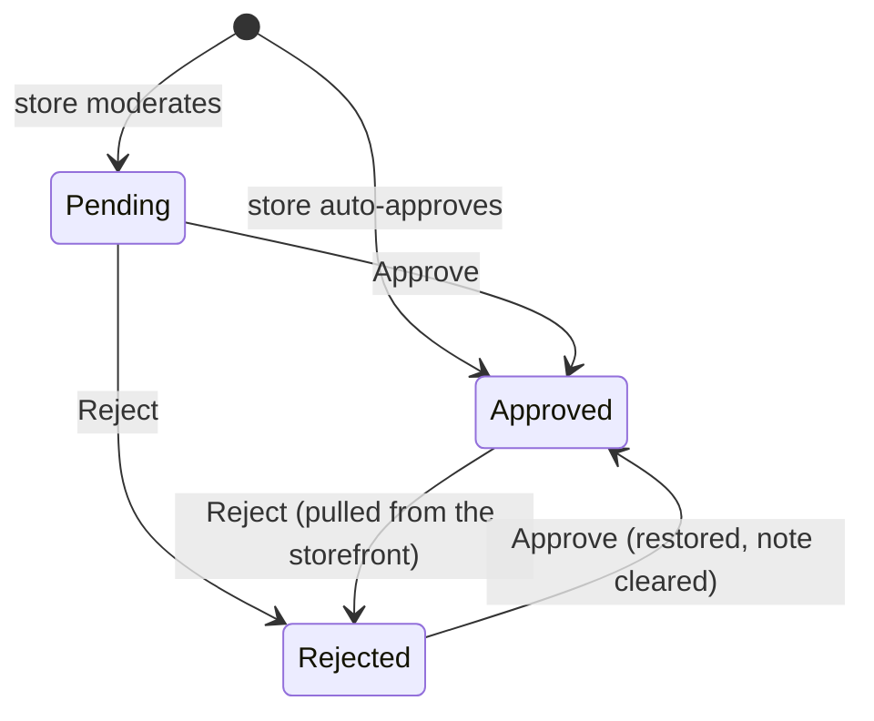

# Reviews module

> **Code:** `src/Souq.Application/Features/Reviews/`, `src/Souq.Domain/Entities/Review.cs`, `src/Souq.Infrastructure/Persistence/Queries/ReviewQueries.cs`, `src/Souq.API/Controllers/ReviewsController.cs` · **Decisions:** [ADR-0033](../../11-ADR/0033-review-moderation-and-wishlist.md), [ADR-0008](../../11-ADR/0008-cqrs-strategy.md) (read ports), [ADR-0024](../../11-ADR/0024-platform-administration.md) (module flags, audit) · **Change guide:** [ChangeGuide.md](ChangeGuide.md)

## Purpose

What customers say about products: a 1–5 rating with a comment, written only by someone who actually bought and received the product, published under a policy each store chooses, and summed into the rating a shopper sees on the product page. It is its own module because its rules are its own (eligibility, one review per product, moderation), because a store can switch the whole feature off, and because it must never write into Catalog — the rating is computed from reviews, never stored on the product.

## Responsibilities

- Accept a review from a verified buyer: one per customer per product, rating 1–5, comment up to 1000 characters.
- Hold the moderation state — Pending, Approved, Rejected — with the moderator, the time and a staff-only note.
- Serve the public list and the aggregates (count, average, per-star distribution) from **approved reviews only**.
- Serve the moderation queue and the approve/reject decisions, audited.

## Not this module's job

| Concern | Owner |
|---|---|
| Storing the publishing policy and its use cases | Platform — `Tenant.ReviewsAutoApprove`, `src/Souq.Application/Features/Stores/StoreReviewSettings.cs` (surfaced on the moderation controller) |
| Whether an order was delivered | Ordering (today answered through `IOrderRepository` — a leak) |
| Whether the customer is blocked, and the reviewer's display name | Customers |
| Product name, slug and translations | Catalog |
| Turning the `reviews` module on or off for a store | Platform (`StoreModules`) |
| Telling anyone a review arrived or was decided | Notifications — nothing is wired today (DEFERRED) |

## Business concepts

- **Verified purchase** — the reviewer has a `Delivered` order containing that product in this store.
- **One review per customer per product** — regardless of how many times they bought it, and regardless of a rejection.
- **Moderation state** — Pending (waiting, invisible), Approved (public, counted), Rejected (hidden, not counted).
- **Publishing policy** — per store: auto-approve, or hold every review for a moderator.
- **Moderation note** — the staff's reason for a rejection; never shown to the customer.
- **Rating aggregates** — count, average and the five-star distribution over approved reviews.

## Domain model

| Type | Kind | Path | Invariants it guards |
|---|---|---|---|
| `Review` | aggregate root | `src/Souq.Domain/Entities/Review.cs` | rating between 1 and 5; comment non-empty and ≤ `Review.CommentMaxLength` (1000), stored trimmed; created Pending unless the caller passes the store's auto-approve decision; a decision needs a moderator id > 0; note ≤ `Review.ModerationNoteMaxLength` (500), blank becomes null; repeating the current state changes nothing (the first moderator and time stand) |
| `ReviewStatus` | enum | `src/Souq.Domain/Enums/ReviewStatus.cs` | Pending 0, Approved 1, Rejected 2 |
| `InvalidReviewException` | domain exception | `src/Souq.Domain/Exceptions/DomainException.cs` | code `InvalidReview` |

**Aggregate boundary.** `Review` holds `ProductId`, `CustomerId` and `OrderId` as plain ids with **no** navigation properties, on purpose: a review needs identifiers, not other aggregates. `OrderId` is the stored evidence of the verified purchase; the rule that produces it lives in `CreateReviewHandler`, because it spans two aggregates and needs a query — the entity never learns what an order is.

**State machine.**

Approving clears the note; rejecting stores it. There is no delete: a rejected review is the evidence, and deleting it would let the customer post again.

**Concurrency.** No `rowversion` on `Reviews`. Two moderators deciding at the same moment is last-write-wins; both decisions are audited.

## Use cases

| Use case | Command or query | Handler | Who may call it | Endpoint |
|---|---|---|---|---|
| Public list + aggregates | `GetProductReviewsQuery` | `GetProductReviewsHandler` | anonymous | `GET /api/products/{productId}/reviews` |
| Write a review | `CreateReviewCommand` | `CreateReviewHandler` | signed-in customer | `POST /api/products/{productId}/reviews` (201) |
| Moderation queue | `ListReviewsForModerationQuery` | `ListReviewsForModerationHandler` | `reviews.moderate` | `GET /api/admin/reviews` |
| Approve | `ApproveReviewCommand` (audited `review.approved`) | `ApproveReviewHandler` | `reviews.moderate` | `POST /api/admin/reviews/{id}/approve` |
| Reject with a note | `RejectReviewCommand` (audited `review.rejected`) | `RejectReviewHandler` | `reviews.moderate` | `POST /api/admin/reviews/{id}/reject` |
| Read the publishing policy | `GetReviewSettingsQuery` (Platform) | `GetReviewSettingsHandler` | `reviews.moderate` | `GET /api/admin/reviews/settings` |
| Change the publishing policy | `UpdateReviewSettingsCommand` (Platform, audited `store.reviews.updated`) | `UpdateReviewSettingsHandler` | `reviews.moderate` **and** `store.settings.manage` | `PUT /api/admin/reviews/settings` |

Validators: `CreateReviewValidator`, `GetProductReviewsQueryValidator`, `ListReviewsForModerationValidator`, `RejectReviewValidator`. `ReviewDecision` is the shared approve/reject orchestration (load in tenant scope, apply, save).

**Eligibility, in order** (`CreateReviewHandler`): the caller is the `cid` claim → the profile exists and is not blocked (403 `CustomerBlocked`) → no earlier review of this product (409 `AlreadyReviewed`) → a `Delivered` order containing the product exists (422 `NotEligible`) → the store's `ReviewsAutoApprove` is read from the `Tenants` row **at write time**, so a policy change applies to the very next review.

## Public contracts

None offered. `IReviewQueries` is this module's own read port (`ListForProductAsync` for the storefront, `ListForModerationAsync` for staff), implemented by `ReviewQueries` in Infrastructure. No other module calls Reviews' Application code; Customers' export reads the `Reviews` **table** directly in its own Infrastructure projection.

*IOrderHistory* — the contract that should answer "did this customer receive product X?" — is **DEFERRED** (ADR-0033, ADR-0029: one consumer so far). Until then Reviews calls Ordering's domain repository.

## Dependencies

**Uses**

| What | Why | Note |
|---|---|---|
| Ordering's `IOrderRepository.FindDeliveredOrderIdContainingAsync` | verified-purchase check | **boundary leak** — the deferred *IOrderHistory* |
| Customers' `ICustomerRepository` | block check | **boundary leak** — the deferred *ICustomerDirectory* |
| Platform's `ITenantRepository` | reads `ReviewsAutoApprove` from the store row, deliberately not from the cached tenant directory | a domain port, not a module contract |
| `ITenantContext` | the store id and, for the queue, `DefaultCulture` for product names | shared kernel |
| Shared kernel | `ICurrentUser`, `IUnitOfWork`, `Result`/`Error`, paging, `IAuditable` | |
| Other modules' **tables**, read-only in Infrastructure | `ReviewQueries` joins `Customers` (reviewer name) and `Products` with translations (name, slug) | ADR-0008 read projection |

**Used by**

- Customers' export projection reads the `Reviews` table.
- The storefront product page and the admin moderation page (frontend).
- Nothing calls this module's Application code from another module.

**Enforced vs convention.** `ModuleAndContractRuleTests` maps Reviews to the `Reviews` feature folder and forbids referencing any other feature folder — Reviews has no allowed contracts and needs none, since its cross-module reach goes through **domain** ports, which no test covers. That the eligibility and block checks cross aggregates is therefore convention, documented here and in ADR-0033. The same suite forbids entities in contracts and `IQueryable` crossing the Application boundary.

## Data ownership

| Table | EF configuration | Tenant | Concurrency | Indexes that encode rules |
|---|---|---|---|---|
| `Reviews` | `ReviewConfiguration` | `ITenantOwned` | none | **unique `(CustomerId, ProductId)`** — one review per customer per product, the last guard behind the handler's check; `(TenantId, ProductId, Status)` for the public list; `(TenantId, Status, CreatedAt)` for the queue; composite FKs `(TenantId, ProductId)` → `Products`, `(TenantId, CustomerId)` → `Customers`, `(TenantId, OrderId)` → `Orders`, all `Restrict` — a review is a historical record and nothing it points at may be deleted under it |

Not owned but read: `Orders` and `OrderItems` (eligibility, through the repository), `Customers`, `Products` and their translations. The publishing policy column `Tenants.ReviewsAutoApprove` belongs to Platform.

Migration `Phase13ReviewsWishlist` is additive and carries two hand-written backfills: every existing review became Approved (it was already public), and every existing store kept publishing at once, while new stores start moderated.

## API

| Method | Route | Authorization | Module flag | Use case |
|---|---|---|---|---|
| GET | `/api/products/{productId}/reviews` | `[AllowAnonymous]` | `reviews` | approved list + aggregates |
| POST | `/api/products/{productId}/reviews` | `[Authorize]` + commerce profile | `reviews` | write a review |
| GET | `/api/admin/reviews` | `reviews.moderate` | `reviews` | moderation queue |
| POST | `/api/admin/reviews/{id}/approve` | `reviews.moderate` | `reviews` | approve |
| POST | `/api/admin/reviews/{id}/reject` | `reviews.moderate` | `reviews` | reject with a note |
| GET | `/api/admin/reviews/settings` | `reviews.moderate` | `reviews` | read the policy |
| PUT | `/api/admin/reviews/settings` | `reviews.moderate` + `store.settings.manage` | `reviews` | change the policy |

Both controllers carry `[RequiresModule(StoreModules.Reviews)]`, so a store with the module off answers 404 `ModuleDisabled` everywhere — including the public list.

**Frontend.** `frontend/src/pages/ProductDetail.jsx` renders `frontend/src/components/reviews/RatingSummary.jsx`, `frontend/src/components/reviews/ReviewList.jsx` and `frontend/src/components/reviews/ReviewForm.jsx` only when `useModule('reviews')` is true; pure logic in `frontend/src/features/reviews/ratingSummary.js`. Staff use `frontend/src/pages/admin/ReviewModeration.jsx` with `frontend/src/pages/admin/RejectReviewDrawer.jsx` and `frontend/src/features/admin/reviews/reviewModeration.js`; the policy checkbox is disabled without `store.settings.manage`.

## Security and permissions

- The reviewer is the token's `cid`; neither a customer id nor an order id is accepted from the client, so a review cannot be written in someone else's name or attached to someone else's order.
- **Privacy in public output:** `ReviewQueries` returns only the first word of the reviewer's name (a blank name becomes a fixed placeholder). Staff see the full name in the queue.
- **The moderation note is staff-only:** it is absent from `ReviewDto` and deliberately **excluded from the audit metadata**, because it is free text that may quote the review.
- **Two permissions for the policy:** a moderator may read it, but switching moderation off for the whole store also needs `store.settings.manage` — otherwise one staff member could disable review moderation.
- Every decision is audited with the review id (`review.approved`, `review.rejected`), and so is a policy change (`store.reviews.updated`, with the new value).
- A review of another store's product is impossible: the delivered-order lookup is tenant-filtered, so it ends as 422 `NotEligible`.

## Tenant behaviour

`Review` is `ITenantOwned`: the named query filter scopes reads, the write guard stamps and protects writes, and another store's review id is a 404 on approve, reject and the queue (`TenantIsolationTests`). The publishing policy is per store and read live from the `Tenants` row. The module flag is evaluated per request from the cached `TenantInfo.Modules` by `TenantAvailabilityMiddleware`. The moderation queue shows product names in the store's default culture, falling back to the first translation and then to the slug.

## Events and background work

None. Reviews raises no domain events, enqueues no outbox messages and has no hosted service. A pending review produces no staff alert, and a decision produces no customer message — both **DEFERRED** (ADR-0033 expected Phase 14's outbox to enable them; Phase 14 shipped without them). The delivered-order email does invite a review in its text, but it links to order tracking, not to a review form.

## External integrations

None.

## Tests

| Level | Class | Coverage |
|---|---|---|
| Domain | `ReviewTests` | rating and comment guards, trimming, the initial state under both policies, approve/reject with moderator and time, note truncation, idempotent repetition, a decision without a moderator |
| Domain | `TenantTests` | a new store starts moderated |
| Domain | `DomainExceptionCodeTests` | the `InvalidReview` code |
| Application | `CreateReviewHandlerTests` | blocked customer, no delivered order, already reviewed (short-circuits before the order query), the happy path binding the order id, both store policies, no authenticated user |
| Application | `ReviewModerationHandlersTests` | approve and reject by the current moderator, 404 without a save, unauthenticated, the note validator, the audit record without the note |
| Application | `ReviewSettingsHandlersTests` | the policy on the context store, audited with the new value |
| Integration | `ReviewModerationTests` | pending → approved → rejected → approved with aggregates following each step, the policy switch applying to the next review, staff moderating but not changing the policy, both module flags off and back on |
| Integration | `QueryServiceTests` | a constant query count for the public list and first-name-only output; a paid-but-undelivered order cannot review |
| Integration | `TenantIsolationTests` | cross-store moderation routes and queues, and a cross-store review attempt |
| Architecture | `ModuleAndContractRuleTests` | module mapping and no cross-feature references |
| Frontend | `frontend/src/features/reviews/ratingSummary.test.js`, `frontend/src/features/admin/reviews/reviewModeration.test.js` | distribution bars and the pending message; queue query building and the actions each status allows |

**Test gaps:** nothing asserts what a review looks like after the reviewer is erased (the public list then shows the anonymized name's first word), and nothing covers two moderators deciding concurrently.

## Failure modes

| Situation | Exception or error code | HTTP | Handling |
|---|---|---|---|
| `reviews` module disabled | `TenantAvailabilityMiddleware` | 404 `ModuleDisabled` | before authentication and any handler |
| Guest posting a review | `[Authorize]` | 401 `Unauthenticated` | |
| Staff account posting a review | `CustomerAccountRequiredException` | 403 `CustomerAccountRequired` | |
| Blocked customer | `Error.Forbidden("CustomerBlocked")` | 403 | |
| Second review of the same product | `Error.Conflict("AlreadyReviewed")`; unique index behind it | 409 `AlreadyReviewed`; a race yields 409 `DuplicateValue` | |
| Product not delivered to this customer, or from another store | `Error.BusinessRule("NotEligible")` | 422 `NotEligible` | |
| Rating or comment out of range | `CreateReviewValidator`, else `InvalidReviewException` | 400 `ValidationFailed` / 422 `InvalidReview` | |
| Moderating a missing or cross-store review | `Error.NotFound` | 404 `NotFound` | |
| Note over 500 characters | `RejectReviewValidator`, else `InvalidReviewException` | 400 / 422 | |
| Missing `reviews.moderate` | permission policy | 403 `Forbidden` | |
| Changing the policy without `store.settings.manage` | both permissions required | 403 `Forbidden` | |
| Unknown product id on the public list | none | 200 with an empty list and zero aggregates | no existence check by design |
| Deleting a product or customer that has reviews | `Restrict` FK ⇒ `ReferenceConstraintViolationException` | 409 `ReferenceConflict` | |

## Common change scenarios

Change eligibility · add store replies or review editing · add moderation notifications · change the publishing policy model · show ratings on product cards · add automatic filtering. Details in [ChangeGuide.md](ChangeGuide.md).

## Known limitations

- **Eligibility is `Delivered`-only.** A paid or shipped order cannot review; there is no time window either way, so a customer can review a product delivered years ago, and a refund after delivery does not remove the right (the order status machine has no refunded state).
- **One review, forever.** A rejected customer cannot rewrite; there is no edit history, so editing was deliberately left out.
- **No store replies.**
- **Silence around moderation.** Staff are not told a review is waiting, and customers are not told a decision was made. The only signal is the `Pending` status returned at submission.
- **Ratings appear only on the product page**, not on listing cards — that needs a cached or materialized aggregate. ADR-0033 left it to the storefront phase; Phase 16 shipped without it, and `frontend/src/components/product/ProductCard.jsx` shows no rating.
- **Boundary leaks:** Ordering's and Customers' domain repositories, as described above.
- **No concurrency token** on `Reviews`.
- **The public list does not check that the product exists or is published**, so a review page for an archived product still answers.
- **No abuse handling** — no spam or profanity filtering, no rate limit specific to review writing.

## Future evolution

- **Moderation notifications** (pending reviews for staff, decisions for customers) — **DEFERRED**; the outbox they were waiting for now exists, so this is mostly a handler plus a notification kind.
- **Store replies, review editing, resubmitting after a rejection** — **DEFERRED**: each needs an edit history (ADR-0033).
- **Ratings on product cards** — **DEFERRED**, not scheduled (Phase 16, the storefront, did not add them); needs a cached aggregate, never a counter written into `Product`.
- ***IOrderHistory*** and ***ICustomerDirectory*** contracts — **DEFERRED** until a second consumer.
- **Automatic filtering** (spam, profanity) — **FUTURE**; ADR-0033 lists it as a revisit trigger.
