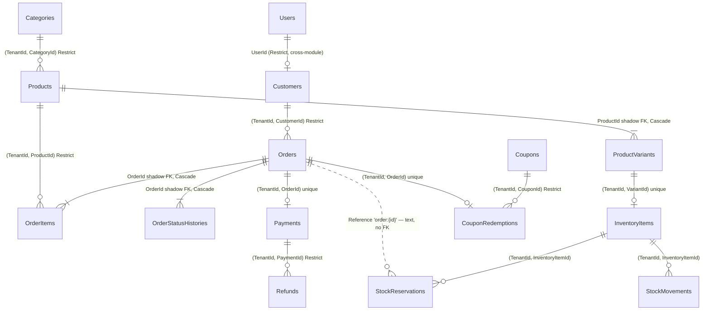

# Database ownership map

> **Read this before you touch a table.** It answers: who owns it, who may write it, who else reads it and how, and what happens to a row at the end of its life.
> **Sources:** `src/Souq.Infrastructure/Persistence/Configurations/` (mapping), `src/Souq.Infrastructure/Migrations/AppDbContextModelSnapshot.cs` (the schema as it stands today), `src/Souq.Domain/` (the rules).
> **Companions:** [DatabaseDesign.md](DatabaseDesign.md) (conventions) · [Migrations.md](Migrations.md) (how the schema changes).

## How to read this

- **Owning module.** The module whose use cases may write the table. Modules are namespaces, not projects ([ADR-0002](../11-ADR/0002-modular-monolith-structure.md)); the feature-folder → module map is the `ModuleFolders` map in `tests/Souq.ArchitectureTests/ModuleAndContractRuleTests.cs`.
- **Tenant scope.**
  - *tenant-owned* — the entity implements `ITenantOwned`: `TenantId int NOT NULL`, a foreign key to `Tenants` (`Restrict`), the named `Tenant` query filter, and `TenantWriteGuardInterceptor` stamping and guarding every write. Added by reflection in `AppDbContext`, so a new entity gets all of it by implementing the interface.
  - *tenant-or-platform* — the entity implements `ITenantOrPlatformOwned`: `TenantId int NULL`, where NULL means a platform row. Only `Souq.Domain.Identity` types may do this (`TenancyRuleTests`).
  - *platform* — a platform table. No tenant filter: these tables are what *defines* a tenant, and they are read before the tenant is known.
  - *none* — a building block: nullable `TenantId`, no foreign key, no filter. Read across stores by one reviewed component.
- **Concurrency token.** `RowVersion` is a SQL Server `rowversion` mapped as an EF shadow property (`PersistenceConventions.HasRowVersion`). "—" means last write wins.
- **Written by.** The use cases and services that write the table. Anything else must go through a contract or a query service.
- **Read by other modules.** *(query service)* = a projection in `src/Souq.Infrastructure/Persistence/Queries/`, which is allowed to join across modules because it lives in Infrastructure and returns DTOs. *(contract)* = the reviewed way, an interface in the module's *Contracts* folder. **boundary leak** = a handler in another module that uses this module's *domain repository or entity* directly; no test catches that, so every occurrence is listed here.
- **Lifecycle.** Deletion, archiving, anonymization, retention.

Nothing in this repository hard-deletes a store's history. Where a row must disappear for a person's data rights, the row is **anonymized in place** (`Customer.Erase`, `User.Erase`) so financial records and foreign keys stay valid.

## Commerce core at a glance

Tenant columns are omitted: every table below is tenant-owned, and every reference between two tenant-owned rows is a composite `(TenantId, XId) → (TenantId, Id)` foreign key.

Two links in the checkout path are deliberately **not** foreign keys: `Orders.PaymentIntentId` matches `Payments.ProviderPaymentId` as text, and `StockReservations.Reference` holds `OrderStockReference.For(orderId)` (`order:{id}`), so Inventory stores Ordering's reference without understanding it. Shopping's `Baskets` / `BasketLines` and `WishlistItems` reference `Customers`, `Products` and `ProductVariants` with the same composite keys; they are left out of the diagram to keep it readable.

## Platform

Owns the store registry, its hosts, its settings, and each store's payment-gateway account.

| Table | Owning module | Tenant scope | Key columns and important constraints | Concurrency | Written by | Read by other modules (how) | Lifecycle |
|---|---|---|---|---|---|---|---|
| `Tenants` | Platform | platform | `Slug` (40) unique platform-wide (`IX_Tenants_Slug`); `Status` int (`TenantStatus`: Provisioning/Active/Suspended/Archived); `Currency` (3), `DefaultCulture` (10), `TimeZone` (64); `Settings nvarchar(max) NULL` — one JSON document written whole by `StoreSettingsJson`, never queried inside; `EnabledModules nvarchar(200) NOT NULL DEFAULT 'promotions,reviews,wishlist'`; `ReviewsAutoApprove bit` | `RowVersion` | `CreateTenantHandler`, `UpdateTenantHandler`, `ChangeTenantStatusHandler`, `SetTenantModulesHandler`, `UpdateTenantSettingsHandler`, `UploadTenantBrandingHandler`, `UpdateStoreSettingsHandler`, `UploadStoreBrandingHandler`, `UpdateReviewSettingsHandler`, `DbSeeder.ApplyDefaultStoreLookAsync` | Every request: `TenantDirectory` (host/slug/id → cached `TenantInfo`, 60 s) · `StoreOrigins` (primary host for email links) · Reviews: `CreateReviewHandler` reads `ReviewsAutoApprove` through `ITenantRepository` (**boundary leak**) · Notifications: `NotificationEmails` reads branding through `ITenantRepository` (**boundary leak**) · `PlatformQueries` (list, detail, stats) | **Never deleted.** `TenantRepository.Remove` throws on purpose; `Tenant.Archive` sets the status. Every tenant-owned FK is `Restrict`, so a delete would fail anyway |
| `TenantDomains` | Platform | platform | `Host nvarchar(253)` **unique across the whole platform** (`IX_TenantDomains_Host`); `IsPrimary bit`; `VerifiedAt`; FK to `Tenants` `Cascade` | — | `ChangeTenantDomainHandler`, `DbSeeder.BindDefaultTenantHostsAsync` | `TenantDirectory` (host → store, every request) · `StoreOrigins` · `PlatformQueries` | Hard delete through the aggregate (`Tenant.RemoveDomain`), or cascade if a store row were ever deleted (it never is). Domain verification is recorded, never required — DNS/TLS verification is **PLANNED** (Phase 23) |
| `StorePaymentAccounts` | Platform (the `src/Souq.Application/Features/Stores` folder) | tenant-owned | One row per store (`IX_StorePaymentAccounts_TenantId` unique); `Provider varchar(20)`; `PublishableKey varchar(255)`; `SecretKeyCipher varchar(1024)` and `WebhookSecretCipher varchar(1024)` hold **AES-GCM ciphertext only** — there is no column for the plaintext; `SecretKeyHint` (last four characters); `LiveMode bit`; `UpdatedByUserId` (no FK) | — | `StorePaymentAccountEditor`, reached from the store admin (`UpdateStorePaymentAccountHandler`, `RemoveStorePaymentAccountHandler`) and from the platform (`UpdateTenantPaymentAccountHandler`, `RemoveTenantPaymentAccountHandler`) running inside that store's scope via `ITenantScopeRunner` | Payments: the gateway router resolves the store's account for every intent, confirmation, cancellation and refund (contract, `IPaymentService`) | Hard delete on disconnect. Refunds of payments that account took fail until it is reconnected ([ADR-0031](../11-ADR/0031-payments-and-refunds.md)) |

## Identity

Owns login accounts (store and platform) and their sessions.

| Table | Owning module | Tenant scope | Key columns and important constraints | Concurrency | Written by | Read by other modules (how) | Lifecycle |
|---|---|---|---|---|---|---|---|
| `Users` | Identity | tenant-or-platform (`TenantId NULL` = platform account) | Two filtered unique indexes carry the business rule "one account per email **per store**, and one per email among platform accounts": `IX_Users_TenantId_NormalizedEmail` `WHERE [TenantId] IS NOT NULL` and `IX_Users_NormalizedEmail_Platform` `WHERE [TenantId] IS NULL`; `PasswordHash nvarchar(500)` (BCrypt; empty string = erased, cannot sign in); `Role nvarchar(30)`; `Status` int (`UserStatus`); `SecurityStamp` (64, checked on every request); `FailedLoginCount`, `LockoutEndsAt`; `PasswordResetTokenHash` / `EmailVerificationTokenHash` `nvarchar(64)` — SHA-256 hex, **never the raw token** — each with an expiry and an index | `RowVersion` | Identity: `RegisterHandler`, `LoginHandler`, `ChangePasswordHandler`, `ResetPasswordHandler`, `VerifyEmailHandler`, `AccountInvitations`, `AccountStatusChanger` (behind `InviteStaffHandler`, `SetStaffStatusHandler`, `InvitePlatformUserHandler`, `InviteTenantAdminHandler`, `SetPlatformUserStatusHandler`); `DbSeeder` · Notifications issues reset/verification/invitation tokens at dispatch and saves their hashes through `IUserRepository` (**boundary leak** by design — [ADR-0034](../11-ADR/0034-notifications-outbox.md)) · Customers: `CustomerErasure` (**boundary leak**) | `SessionValidator` (security stamp, cached 30 s) · `AccountQueries`, `OrderQueries` (staff names on order history), `CustomerQueries` (email confirmed, last login), `PlatformQueries` (counts, store admin list — the reviewed `IgnoreQueryFilters` path) | **Never deleted.** `Disable()` sets the status and rotates the stamp; `Erase()` anonymizes in place (`erased-{id}@erased.invalid`, empty password hash, disabled, stamp rotated). The row survives because `Customers.UserId` is a `Restrict` foreign key |
| `RefreshTokens` | Identity | tenant-or-platform | `TokenHash nvarchar(64)` unique (SHA-256 of a 256-bit token; the token itself lives only in the `souq_refresh` cookie); `FamilyId uniqueidentifier` indexed (a family is revoked as a unit on reuse); `UserId` FK `Cascade`; `ExpiresAt`, `UsedAt`, `RevokedAt`, `RevokedReason nvarchar(40)`; `BelongsToPlatform bit` | — | Identity session use cases (`LoginHandler`, `RefreshSessionHandler`, `LogoutHandler`, password change and reset) · Customers: `CustomerErasure` revokes every active token (**boundary leak**) | — | Rows are **marked** used or revoked, never deleted. Nothing purges expired rows, so this table grows with every sign-in: no cleanup job exists today; a data-retention policy is **PLANNED** (Phase 23) |

## Customers

Owns the shopper's commerce profile and address book. Login lives in Identity.

| Table | Owning module | Tenant scope | Key columns and important constraints | Concurrency | Written by | Read by other modules (how) | Lifecycle |
|---|---|---|---|---|---|---|---|
| `Customers` | Customers | tenant-owned | `UserId` FK to `Users` `Restrict` (**a cross-module foreign key**), unique per store (`IX_Customers_TenantId_UserId`) — one profile per account; `Email nvarchar(256)` is a *contact* copy and is deliberately **not** unique (identity lives in `Users`), indexed for admin search; `Phone` (20); `Status` int (`CustomerStatus`); `BlockedAt`, `ErasedAt`; alternate key `AK_Customers_TenantId_Id` for composite references | — | Customers: profile and address handlers, `SetCustomerStatusHandler`, `CustomerErasure` (behind `EraseCustomerHandler` and `EraseMyAccountHandler`) · Identity: `RegisterHandler` creates the profile through `ICustomerRepository` (**boundary leak**) | Ordering: `CreateOrderHandler` loads the aggregate for the block check and the address snapshot (**boundary leak**, accepted in [ADR-0027](../11-ADR/0027-customer-profile-and-erasure.md)) · Reviews: `CreateReviewHandler` (**boundary leak**) · Notifications: order handlers (**boundary leak**) · Identity: `AuthSessionIssuer`, `GetCurrentUserHandler` resolve `cid` (**boundary leak**) · `OrderQueries`, `CouponQueries`, `ReviewQueries` join for the customer name; `CustomerQueries`; `PlatformQueries` counts | **Never deleted.** `Block`/`Unblock` set the status; `Erase` anonymizes in place — name replaced, email set to `erased-{id}@erased.invalid`, phone nulled, every address removed, status Blocked, `ErasedAt` stamped — in one save together with the account, its sessions, its basket and its wishlist. Orders and reviews stay, pointing at a profile that identifies nobody |
| `CustomerAddresses` | Customers | tenant-owned | Aggregate child: shadow FK `CustomerId` `Cascade`, indexed; `Country nvarchar(2)`, `RecipientName`, `Phone`, `City`, `Line1` required, `Region`/`Line2`/`PostalCode` optional; `IsDefaultShipping`, `IsDefaultBilling` bits. The rules "at most 20 addresses" and "exactly one default of each kind while any address exists" live in the `Customer` aggregate, **not** in the database | — (through its customer) | Customers: `AddMyAddressHandler`, `UpdateMyAddressHandler`, `RemoveMyAddressHandler`, `SetMyDefaultAddressHandler`, `CustomerErasure` | Ordering reads the chosen address through the loaded `Customer` aggregate and stores a single-line **snapshot** on the order, so editing or deleting an address never rewrites history | Hard delete, individually or with the aggregate on erasure |

## Catalog

Owns products, their texts, media and sellable units, and the category tree.

| Table | Owning module | Tenant scope | Key columns and important constraints | Concurrency | Written by | Read by other modules (how) | Lifecycle |
|---|---|---|---|---|---|---|---|
| `Products` | Catalog | tenant-owned | `Slug nvarchar(120)` unique **per store** (`IX_Products_TenantId_Slug`); `Status` int (`ProductStatus`: Draft/Active/Archived); `Brand` (100); `VideoUrl` (500); category reference is the composite `(TenantId, CategoryId) → (TenantId, Id)`, `Restrict`; listing index `IX_Products_TenantId_Status_CategoryId`; alternate key `AK_Products_TenantId_Id` | `RowVersion` | Catalog: `CreateProductHandler`, `UpdateProductHandler`, `ChangeProductStatusHandler`, `UploadProductImageHandler`, `RemoveProductImageHandler`, `ReorderProductImagesHandler`, `UploadProductVideoHandler`, `DeleteProductHandler`; `DbSeeder` | Shopping: `AddBasketItemHandler` and `PricingService` load products through `IProductRepository` (**boundary leak**) · Wishlist: `AddToWishlistHandler`, `MergeWishlistHandler` (**boundary leak**) · Notifications: low-stock handler (**boundary leak**) · `CatalogQueries`, `InventoryQueries`, `WishlistQueries`, `ReviewQueries`, `PlatformQueries` · referenced by `OrderItems`, `BasketLines`, `InventoryItems`, `StockMovements`, `Reviews`, `WishlistItems` | **Never hard-deleted.** `DELETE /api/products/{id}` archives (`DeleteProductHandler` → `Product.Archive`), because orders, reviews and ledger rows reference the row |
| `ProductTranslations` | Catalog | tenant-owned | One row per (product, culture): unique `IX_ProductTranslations_ProductId_Culture`; `Name` (200) required, `Description` (4000), `MetaTitle` (70), `MetaDescription` (160); shadow FK to the product, `Cascade` | — (through the product) | Catalog product handlers (`Product.SetTexts` replaces the whole set) | `CatalogQueries` reads them as correlated subqueries; order lines snapshot the name instead of joining | Replaced as a set: a culture no longer sent is deleted. Cascade with the product (which is never deleted) |
| `ProductVariants` | Catalog | tenant-owned | The sellable unit ([ADR-0025](../11-ADR/0025-catalog-model.md)). `Sku nvarchar(64)` unique per store when set (`IX_ProductVariants_TenantId_Sku` `WHERE [Sku] IS NOT NULL`); `Price decimal(19,4)` + `Currency`; `CompareAtPrice decimal(19,4)` in the price's currency (mapped from a backing field); **exactly one default per product** is enforced by the filtered unique index `IX_ProductVariants_ProductId_Default` (`WHERE [IsDefault] = 1`); alternate key `AK_ProductVariants_TenantId_Id` so inventory and basket lines can reference a variant within the store | — | Catalog product handlers | Inventory (`InventoryItems` composite FK) · Shopping (`BasketLines` composite FK) · `CatalogQueries`, `InventoryQueries` (price, SKU, default-variant stock). **Order lines do not reference a variant** — `OrderItems` carries `ProductId` plus a name and price snapshot | Cascade with the product. Today every product has exactly one, created with it |
| `ProductImages` | Catalog | tenant-owned | `Url nvarchar(500)`; `SortOrder` with index `IX_ProductImages_ProductId_SortOrder` (first row = primary image); shadow FK `Cascade`. "At most 10 per product" is a Domain rule only | — | Catalog image handlers | `CatalogQueries` (primary image and gallery), `WishlistQueries` | Hard delete of the row; **the uploaded file stays on disk** — an orphaned-file cleanup job is **PLANNED** (roadmap, "Phase 6 or later"; still not built) |
| `Categories` | Catalog | tenant-owned | `Slug nvarchar(100)` unique per store (`IX_Categories_TenantId_Slug`); self-reference `ParentId` `Restrict` — **not** tenant-scoped, the handler checks the store (the documented exception in [ADR-0022](../11-ADR/0022-tenancy-enforcement.md)); cycles and depth > 5 are rejected by `Category.MoveTo`; tree index `IX_Categories_TenantId_ParentId_SortOrder`; `IsActive` hides a branch and its products from the storefront; alternate key `AK_Categories_TenantId_Id` | — | Catalog: `CreateCategoryHandler`, `UpdateCategoryHandler`, `DeleteCategoryHandler`; `DbSeeder` | `CatalogQueries` (tree, product listing filter) | Hard delete, **only when empty**: `409 CategoryInUse` if it has products, `409 CategoryHasChildren` if it has children. Deactivate to hide instead |
| `CategoryTranslations` | Catalog | tenant-owned | Same shape as product translations; unique `IX_CategoryTranslations_CategoryId_Culture` | — | Catalog category handlers | `CatalogQueries` | Replaced as a set; cascade with the category |

## Inventory

Owns stock: what is on hand, what is held for unpaid orders, and the ledger that explains both.

| Table | Owning module | Tenant scope | Key columns and important constraints | Concurrency | Written by | Read by other modules (how) | Lifecycle |
|---|---|---|---|---|---|---|---|
| `InventoryItems` | Inventory | tenant-owned | One row per variant: `IX_InventoryItems_TenantId_VariantId` unique; composite FKs to `ProductVariants` and `Products` (`Restrict`); `OnHand`, `Reserved`, `LowStockThreshold`; check constraints `CK_InventoryItems_Quantities` (`OnHand >= 0 AND Reserved >= 0 AND Reserved <= OnHand`) and `CK_InventoryItems_Threshold`; alternate key `AK_InventoryItems_TenantId_Id`. `Available = OnHand − Reserved` is computed, never stored | **`RowVersion`** — the hottest row in the system | Inventory: `VariantStockInitializer` (called by `CreateProductHandler` inside its transaction), `InventoryReservations` + `InventoryWriter` (reserve, commit, release, restock — 5 attempts from a fresh read), `AdjustStockHandler`, `SetLowStockThresholdHandler`; `DbSeeder` | Ordering reserves/commits/releases through `IInventoryReservations` (contract) · Shopping checks availability through `IStockAvailability` (contract) · Catalog initializes stock through the port `IVariantStockInitializer`, implemented by Inventory · `CatalogQueries`, `InventoryQueries`, `WishlistQueries` compute `OnHand − Reserved` in SQL | **Never deleted** (products are archived, not deleted) |
| `StockReservations` | Inventory | tenant-owned | Composite FK to the item; `Reference nvarchar(64)` holds Ordering's `order:{id}` string (`OrderStockReference`) and is **not** a foreign key; `Quantity > 0` (`CK_StockReservations_Quantity`); `Status` int (`ReservationStatus`: Active/Committed/Released/Expired/Restocked); `ExpiresAt`, `ClosedAt`; the sweep index is filtered to active rows only: `IX_StockReservations_TenantId_ExpiresAt` `WHERE [Status] = 0` | — (guarded by its item's `RowVersion`) | Inventory's reservation service, driven by Ordering: `CreateOrderHandler` (reserve), `OrderPaymentConfirmation` (commit or release), `UpdateOrderStatusHandler` and `CancelMyOrderHandler` (release/restock), `ExpireStaleCheckoutsHandler` (expire) | Ordering, through the Inventory contract only | **Never deleted**: a reservation is closed with a status and a `ClosedAt`. The table grows with every checkout; no purge exists |
| `StockMovements` | Inventory | tenant-owned | Append-only ledger. Composite FKs to the product and the item; `Type` int (`StockMovementType`), `QuantityChange`, `NewQuantity`, `Note` (300); read indexes `IX_StockMovements_ProductId_CreatedAt` and `IX_StockMovements_InventoryItemId_CreatedAt`. Invariant: only `InventoryItem` can create a movement, so Σ `QuantityChange` per item = `OnHand` | — | Inventory only, as a by-product of `InventoryItem` operations; `DbSeeder` writes the opening `Purchase` rows | `InventoryQueries` (admin ledger page) | **Never deleted or updated.** The Phase 6 migration wrote opening-balance rows so the sum matches on hand from that point on |

## Shopping

Owns the server-side basket and the wishlist.

| Table | Owning module | Tenant scope | Key columns and important constraints | Concurrency | Written by | Read by other modules (how) | Lifecycle |
|---|---|---|---|---|---|---|---|
| `Baskets` | Shopping (`src/Souq.Application/Features/Baskets`) | tenant-owned | `CK_Baskets_Owner` enforces **exactly one owner**: a `CustomerId` (composite FK, `Restrict`) or a `GuestTokenHash char(64)` (SHA-256 of the guest cookie — the token itself is never stored), never both. One basket per owner per store: filtered unique `IX_Baskets_TenantId_CustomerId` and `IX_Baskets_TenantId_GuestTokenHash`; `ExpiresAt` with `IX_Baskets_TenantId_ExpiresAt` for the sweep. **No price columns**: every read prices lines live | — (last write wins, by decision in [ADR-0028](../11-ADR/0028-basket-and-pricing-pipeline.md)) | Shopping: the basket handlers and the basket resolver (merge at sign-in, delete on expiry), `PurgeExpiredBasketsHandler` · Ordering consumes purchased lines through `IBasketCheckout` (contract) at payment confirmation · Customers: `CustomerErasure` deletes the basket (**boundary leak**) | Ordering (`IBasketCheckout`) | **Hard delete**: the expiry sweep (`BasketCleanupService` → `PurgeExpiredBasketsCommand`, at most 500 baskets per store per run, every `Basket:CleanupIntervalMinutes`), a guest basket read after expiry, the guest basket after a merge, and customer erasure. Sliding expiry: 30 days guest, 180 days customer |
| `BasketLines` | Shopping | tenant-owned | Aggregate child (shadow FK `BasketId`, `Cascade`); composite FKs to `Products` and `ProductVariants` (`Restrict`, because products are archived rather than deleted); `CK_BasketLines_Quantity` (`BETWEEN 1 AND 99`); one line per variant: unique `IX_BasketLines_BasketId_VariantId` | — | Same as `Baskets` | — | Deleted with the line, the basket, or when the paid order consumes the quantity |
| `WishlistItems` | Shopping (the `src/Souq.Application/Features/Wishlist` folder) | tenant-owned | Unique `IX_WishlistItems_TenantId_CustomerId_ProductId` — the last guard against a double click (the unit of work turns the violation into 409); composite FKs to `Customers` and `Products` (`Restrict`). "At most 200 per customer" is a Domain rule | — | Wishlist: `AddToWishlistHandler`, `RemoveFromWishlistHandler`, `MergeWishlistHandler` · Customers: `CustomerErasure` deletes them (**boundary leak**) | `WishlistQueries` reads product and stock data live | **Hard delete** on removal and on erasure (a wishlist is intent, not a record) |

## Ordering

Owns orders, their lines, their history and the per-store order numbers.

| Table | Owning module | Tenant scope | Key columns and important constraints | Concurrency | Written by | Read by other modules (how) | Lifecycle |
|---|---|---|---|---|---|---|---|
| `Orders` | Ordering | tenant-owned | `OrderNumber int` unique per store (`IX_Orders_TenantId_OrderNumber`, from 1001); `TrackingToken char(32)` unique per store (`IX_Orders_TenantId_TrackingToken`) — 128 random bits, the only key the anonymous tracking page accepts; customer reference is the composite `(TenantId, CustomerId)` `Restrict`; `Status` int (`OrderStatus`); `Currency` (3) snapshot of the store currency; `ShippingAddress` / `BillingAddress nvarchar(500)` single-line snapshots; `CouponCode nvarchar(50)` text snapshot (no FK); `DiscountAmount`/`DiscountCurrency` optional owned `Money`; shipping snapshot (`ShippingMethodName`, `ShippingAmount decimal(19,4)`, `ShippingMinDays`, `ShippingMaxDays`, `ShippingCountry char(2)`, `ShippingTrackingUrlTemplate`, `ShippingCarrier`, `TrackingNumber`) with **no FK to `ShippingMethods`**; `PlacedAt`, `PlacedSubtotal`, `PlacedTotal` frozen by `Order.Place`; `PaymentIntentId nvarchar(100)`; list indexes `IX_Orders_TenantId_CreatedAt`, `IX_Orders_TenantId_Status_CreatedAt`, `IX_Orders_TenantId_CustomerId`; alternate key `AK_Orders_TenantId_Id` | **`RowVersion`** (client confirmation vs webhook vs admin) | Ordering: `CreateOrderHandler`, `OrderPaymentConfirmation` (behind `ConfirmOrderPaymentHandler`, `ApplyPaymentEventHandler`, `ProcessPaymentWebhookHandler`), `UpdateOrderStatusHandler`, `CancelMyOrderHandler`, `ExpireStaleCheckoutsHandler` | Reviews: `CreateReviewHandler` asks for a delivered order containing the product through `IOrderRepository` (**boundary leak**) · Notifications: order email and in-app handlers (**boundary leak**) · `CustomerQueries` (order count, spend, last order), `CatalogQueries` (best-selling = delivered quantities), `CouponQueries` (order number), `OrderQueries`, `PlatformQueries` · referenced by `Payments`, `CouponRedemptions`, `Reviews` | **Never deleted.** Cancelled is a status. Totals are immutable after `Place`. The shipping snapshot keeps the recipient's name, phone and address after the customer is erased — lawful accounting retention; purging those snapshots is **PLANNED** (Phase 20) |
| `OrderItems` | Ordering | tenant-owned | Aggregate child: shadow FK `OrderId` **`NOT NULL`** (`Cascade`) — it was nullable until Phase 1A; composite FK to `Products` (`Restrict`, which is why products are archived); `ProductName nvarchar(200)`, `UnitPrice decimal(19,4)` + `Currency`, `Quantity` — all snapshots; `LineTotal` is computed, not stored; indexes `IX_OrderItems_OrderId` and `IX_OrderItems_TenantId_ProductId` | — (through the order) | Ordering, through the `Order` aggregate | `CustomerQueries` (spend), `CatalogQueries` (best-selling) | Never deleted in practice; cascade with the order, which is never deleted |
| `OrderStatusHistories` | Ordering | tenant-owned | Aggregate child: shadow FK `OrderId` **`NOT NULL`** (`Cascade`); `Status` int; `Note nvarchar(300)` (staff-only text); `ChangedBy` int (`OrderActorKind`: System/Customer/Staff/PaymentGateway) and `ChangedByUserId` **without a foreign key**, so disabling an account never breaks the record | — | Ordering, through the `Order` aggregate (every transition writes one row) | `OrderQueries` (timeline; notes and actors are stripped for customers and for the public tracking page) | **Never deleted or edited** |
| `OrderNumberSequences` | Ordering | tenant-owned | One row per store (`IX_OrderNumberSequences_TenantId` unique); `LastNumber int`, starting at `OrderNumberSequence.FirstNumber` (1001) | — (serialized by the row lock) | `OrderNumbers` (the `IOrderNumbers` port), called only inside the checkout transaction: `ExecuteUpdateAsync` increments atomically, and the row lock serializes that store's checkouts until commit | — | Created with the store's first order; never deleted. Numbers are unique but not contiguous (a rolled-back checkout returns its number; a cancelled order keeps one) |

## Promotions

| Table | Owning module | Tenant scope | Key columns and important constraints | Concurrency | Written by | Read by other modules (how) | Lifecycle |
|---|---|---|---|---|---|---|---|
| `Coupons` | Promotions | tenant-owned | `Code nvarchar(50)` unique **per store** (`IX_Coupons_TenantId_Code`); `Type` int (`DiscountType`); `Value decimal(19,4)` (a percentage or a fixed amount, at money precision); optional `MinOrderAmount`/`MinOrderCurrency`; `StartsAt`, `ExpiresAt`, `MaxUses`, `MaxUsesPerCustomer`; `UsedCount int` = uses held by open or paid orders; alternate key `AK_Coupons_TenantId_Id` | **`RowVersion`** (serializes concurrent redemptions of the same coupon) | Promotions: `CreateCouponHandler`, `UpdateCouponHandler`, `DeleteCouponHandler`, and `CouponRedemptions` (which moves `UsedCount`) | Ordering reserves, confirms and releases uses through `ICouponRedemptions` (contract) · Shopping: `PricingService` loads the coupon through `ICouponRepository` to quote a basket (**boundary leak**) · `CouponQueries` | Hard delete **only while unused**; once `UsedCount > 0` or any redemption exists, `409 CouponInUse` — deactivate instead ([ADR-0030](../11-ADR/0030-coupon-redemptions.md)) |
| `CouponRedemptions` | Promotions | tenant-owned | One redemption per order: unique `IX_CouponRedemptions_TenantId_OrderId`; composite FKs to `Coupons`, `Orders`, `Customers` (all `Restrict`); `DiscountAmount decimal(19,4)` + `Currency`; `Status` int (`CouponRedemptionStatus`: Reserved/Confirmed/Released); the per-customer limit is counted on `IX_CouponRedemptions_TenantId_CouponId_CustomerId_Status` | — (reserve and release also move the coupon's `UsedCount`, which its `RowVersion` guards; `Confirm` touches only this row) | Promotions' `CouponRedemptions`, driven by Ordering's checkout, confirmation and every cancellation path | Shopping: `PricingService` counts a customer's active redemptions through `ICouponRedemptionRepository` (**boundary leak**) · `CouponQueries` (admin redemption list) | **Never deleted**: Reserved → Confirmed or Released. A refund does not release a use; only a cancellation does |

## Payments

| Table | Owning module | Tenant scope | Key columns and important constraints | Concurrency | Written by | Read by other modules (how) | Lifecycle |
|---|---|---|---|---|---|---|---|
| `Payments` | Payments | tenant-owned | One payment per order: unique `IX_Payments_TenantId_OrderId`; the provider's intent id is unique per store (`IX_Payments_TenantId_ProviderPaymentId`) and is how a webhook finds the row; `Gateway varchar(40)` records **which account created the intent** (`fake`, `stripe:deployment`, or the store's account), so later calls go back to it; `Amount` + `Currency`, `Status` int (`PaymentStatus`), `RefundedAmount` and `PendingRefundAmount decimal(19,4)`; composite FK to `Orders` (`Restrict`); alternate key `AK_Payments_TenantId_Id`. **No card columns exist, and `PaymentDataRulesTests` fails if one is added** | **`RowVersion`** (a refund reserves its amount here; concurrent refunds retry from a fresh read, 5 attempts) | Payments: `OrderPayments` (the `IOrderPayments` contract used by Ordering's checkout, confirmation and cancellation paths), `RefundOrderHandler`, `RetryRefundHandler` | Ordering reads payment state through `IPaymentQueries` (contract) | **Never deleted** (financial record) |
| `Refunds` | Payments | tenant-owned | Child of the payment through a composite FK `(TenantId, PaymentId)` `Restrict` (an aggregate child that still carries its tenant); `Amount` + `Currency`; `Reason`/`FailureReason nvarchar(500)`; `Status` int (`RefundStatus`); `ProviderRefundId varchar(100)` (matched with the gateway); `RequestedByUserId` without a FK; `CompletedAt`. The refund id is the gateway idempotency key, so a retry can never refund twice | — (through the payment) | Payments: `OrderPayments` | `PaymentQueries` (order detail) | **Never deleted.** A refund the gateway never answered stays Pending until someone retries it; there is no reconciliation job |

## Shipping

| Table | Owning module | Tenant scope | Key columns and important constraints | Concurrency | Written by | Read by other modules (how) | Lifecycle |
|---|---|---|---|---|---|---|---|
| `ShippingMethods` | Shipping | tenant-owned | `Name nvarchar(100)`; `Price decimal(19,4)` + `Currency`; `FreeOverAmount` in the price's currency; `Carrier`; `TrackingUrlTemplate nvarchar(300)` (https only, `{number}` placeholder); `MinDays`/`MaxDays`; `Countries varchar(300)` — comma-separated ISO codes, empty means everywhere; `IsActive`, `SortOrder` with `IX_ShippingMethods_TenantId_IsActive_SortOrder` | — | Shipping: `CreateShippingMethodHandler`, `UpdateShippingMethodHandler`, `DeleteShippingMethodHandler` | Shopping's pricing pipeline asks `IShippingRateProvider` (contract, implemented by `StoreShippingRates`); Ordering receives the chosen option through the pipeline and stores a **snapshot** on the order | **Hard delete** is safe precisely because orders keep the snapshot and no foreign key points here. Deactivate to pause a method |

## Reviews

| Table | Owning module | Tenant scope | Key columns and important constraints | Concurrency | Written by | Read by other modules (how) | Lifecycle |
|---|---|---|---|---|---|---|---|
| `Reviews` | Reviews | tenant-owned | One review per customer and product: unique `IX_Reviews_CustomerId_ProductId` — note it does **not** lead with `TenantId`; it is still effectively per store because customer ids are global identity values; composite FKs to `Products`, `Customers` and `Orders`, all `Restrict`; `Rating int`, `Comment nvarchar(1000)`; `Status` int (`ReviewStatus`: Pending/Approved/Rejected); `ModeratedAt`, `ModeratedByUserId` (no FK), `ModerationNote nvarchar(500)` (staff only); public list index `IX_Reviews_TenantId_ProductId_Status`, moderation queue `IX_Reviews_TenantId_Status_CreatedAt` | — | Reviews: `CreateReviewHandler` (Pending or Approved according to `Tenant.ReviewsAutoApprove`), `ApproveReviewHandler`, `RejectReviewHandler` | `ReviewQueries` (public list and aggregates over **approved** rows only; moderation queue), `CustomerQueries` (data export) | **Never deleted**, including on erasure: a rejected review stays as evidence and blocks a second one. Aggregates simply ignore non-approved rows |

## Notifications

| Table | Owning module | Tenant scope | Key columns and important constraints | Concurrency | Written by | Read by other modules (how) | Lifecycle |
|---|---|---|---|---|---|---|---|
| `Notifications` | Notifications | tenant-owned | `RecipientUserId int` **without a foreign key to `Users`**; `Kind nvarchar(40)` and `Data nvarchar(1000)` (small JSON the frontend renders in the visitor's language — no server-rendered text); `ReadAt`; inbox indexes `IX_Notifications_TenantId_RecipientUserId_ReadAt` (unread badge) and `IX_Notifications_TenantId_RecipientUserId_CreatedAt` (list) | — | Notifications: `OrderStatusChangedHandler`, `StockBecameLowHandler` (fan-out in one save), `MarkNotificationReadHandler`, `MarkAllNotificationsReadHandler` (a bulk `ExecuteUpdateAsync`, so no interceptor runs and `UpdatedAt` is not stamped) | `NotificationQueries` only | **Never deleted.** Read is a timestamp, not a delete. Nothing purges old rows; a data-retention policy is **PLANNED** (Phase 23) |

## Reporting

Owns no tables. `GetPlatformStatsHandler` reads through the `IPlatformReports` port, implemented by `PlatformQueries` — the one reviewed type allowed to call `IgnoreQueryFilters` (`TenancyRuleTests`), and only for explicit-tenant predicates or aggregate counts.

## Shared building blocks

| Table | Owning module | Tenant scope | Key columns and important constraints | Concurrency | Written by | Read by other modules (how) | Lifecycle |
|---|---|---|---|---|---|---|---|
| `OutboxMessages` | building block (dispatched by Notifications) | none — `TenantId int NULL`, no FK, **no query filter** (the dispatcher walks every store) | `bigint` identity; `Type nvarchar(100)` must be a name from a fixed allow-list; `Payload nvarchar(4000)` carries **references only** (ids, origin, enum names) — never a token, a rendered email or personal data; `OccurredAt`, `NextAttemptAt`, `Attempts`, `LockedUntil` (a two-minute lease claimed with a conditional update, so two instances never process one row), `ProcessedAt`, `FailedAt`, `LastError nvarchar(500)`; two filtered indexes: `IX_OutboxMessages_NextAttemptAt` (`WHERE [ProcessedAt] IS NULL AND [FailedAt] IS NULL`) and `IX_OutboxMessages_ProcessedAt` (`WHERE [ProcessedAt] IS NOT NULL`) | — (the lease and conditional updates take its place) | `AppDbContext.SaveChangesAsync` writes rows for domain events in the same transaction as the change; `NotificationOutbox` (`INotificationOutbox.Enqueue`) for explicit requests; `OutboxProcessor` claims, completes and fails rows with bulk updates | Read only by `OutboxProcessor`; each message is dispatched inside its store's scope (or the platform scope) | Processed rows are **purged** by `OutboxDispatcherService` once an hour, older than `Notifications:RetentionDays` (14 by default). Dead rows (`FailedAt`) are kept for diagnosis, with no operator screen yet (**PLANNED**, Phase 17/23) |
| `AuditEntries` | building block (written by every module, read by Platform) | none — `TenantId int NULL`, **no FK by design** (a historical witness, not a live relationship), no query filter | `bigint` identity; `OccurredAt`; `Area nvarchar(10)` (Platform/Store/System); `Action nvarchar(80)` must match `tenant.created`-style dotted lower-case; `ActorUserId`, `ActorRole`; `TargetType`/`TargetId`; `Metadata nvarchar(4000)` — fields the request chose, never a copy of the request body; `IpAddress nvarchar(45)`; `CorrelationId nvarchar(64)`; query indexes by time, by store and by actor | — | `AuditBehavior` stages one row per `IAuditable` request **before** the handler, so it commits in the handler's own transaction; `AuditTrail.FlushAsync` saves a row that no handler saved, and `Discard()` detaches it when the request fails or returns a failure result | `PlatformQueries.ListAuditAsync` (behind `ListAuditEntriesHandler`, platform host and permission) | **Append-only, enforced in code:** `TenantWriteGuardInterceptor` throws on any update or delete of an audit row and logs it as Critical. Nothing purges; retention is **PLANNED** (Phase 23) |

## Known gaps in ownership

- **Boundary leaks are common and untested.** The architecture tests police the Application layer's *contract* references, not the Domain layer, so any handler can take another module's repository. Every occurrence found in the code is marked above: Ordering, Reviews, Notifications and Identity read `Customers`; Shopping and Wishlist read `Products`, `Coupons` and `CouponRedemptions`; Customers writes `Users`, `RefreshTokens`, `Baskets` and `WishlistItems` during erasure; Notifications writes `Users` when it issues a token.
- **Query services join across modules on purpose.** That is the documented trade-off of [ADR-0008](../11-ADR/0008-cqrs-strategy.md): the join lives in Infrastructure and returns a DTO, so no Application-layer dependency is created. `CustomerQueries` (Ordering + Reviews + Identity tables), `CatalogQueries` (Ordering + Inventory), `OrderQueries` (Customers + Identity), `ReviewQueries` (Customers + Catalog), `WishlistQueries` (Catalog + Inventory), `CouponQueries` (Ordering + Customers).
- **Tables that only grow:** `RefreshTokens`, `StockReservations`, `Notifications`, `AuditEntries`, and dead `OutboxMessages`. Only processed outbox rows are purged today.
- **`Reviews`' unique index does not lead with `TenantId`**, unlike every other per-store uniqueness rule. It is correct today only because customer ids are unique platform-wide.
