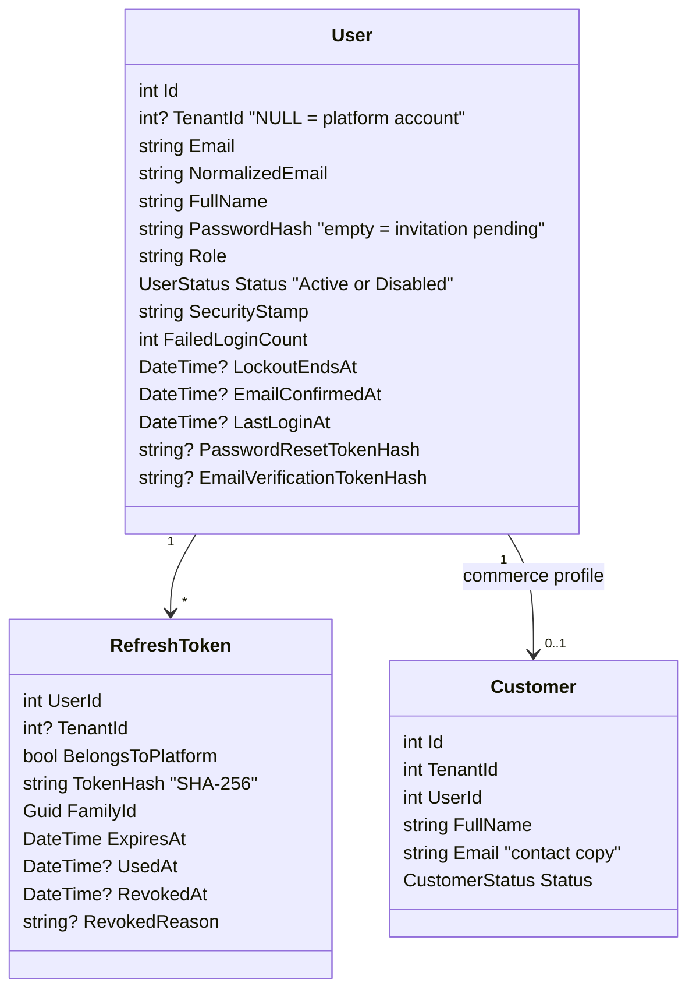

# Souq: Authentication and Authorization

> **Decisions:** [ADR-0010](../11-ADR/0010-authentication-authorization.md) (what) and [ADR-0023](../11-ADR/0023-sessions-and-credentials.md) (how); the permission mechanism is [ADR-0019](../11-ADR/0019-authorization-foundation.md).
> **Control catalog** — implementation paths, tests and gaps, control by control: [SecurityControls.md](SecurityControls.md) §1–§2. Wider security narrative: [Security.md](Security.md).
> Unlabelled statements describe the code today. **PLANNED** items are scheduled in [ProductRoadmap.md](../12-ROADMAP/ProductRoadmap.md); **DEFERRED** and **FUTURE** items are not.

## 1. Identity model

- **Accounts are per store.** The same address can hold independent accounts at store A and store B; the unique key is `(TenantId, NormalizedEmail)`.
  - Each store owns its customer relationship.
  - A breach or a ban in one store does not affect the other.
- **Platform accounts** have `TenantId` null, with a unique `NormalizedEmail` among platform accounts.
  - They exist only on platform hosts.
  - The named tenant filter shows store accounts in a store scope and platform accounts in the platform scope, so signing in on the wrong host finds no account at all.
- **The customer profile** (`Customer`) is the commerce side: orders, reviews, addresses, the basket, the wishlist and in-app notifications all hang off it.
  - Registration creates the account and the profile in one transaction.
  - Staff accounts have no profile and cannot shop (`403 CustomerAccountRequired`).
- **The `User` aggregate guards its own rules in the Domain:** lockout, stamp rotation, single-use tokens, erasure, and no role change across the platform/store line.

## 2. Roles and permissions

| Role | Scope | Permissions |
|---|---|---|
| **PlatformOwner** | Platform | Every platform permission: `platform.tenants.manage`, `platform.users.manage`, `platform.settings.manage`, `platform.reports.view`, `platform.audit.view` |
| **PlatformAdmin** | Platform | `platform.tenants.manage`, `platform.reports.view`, `platform.audit.view` (not users, not settings) |
| **TenantAdmin** | One store | Every store permission |
| **TenantStaff** | One store | `catalog.manage`, `inventory.view`, `inventory.manage`, `orders.view`, `orders.manage`, `customers.view`, `reviews.moderate`, `store.reports.view` |
| **Customer** | One store | None. Their own data is reached through ownership checks |

**Store permissions:** `catalog.manage`; `inventory.view`, `inventory.manage`; `orders.view`, `orders.manage`; `customers.view`, `customers.manage`; `promotions.manage`; `reviews.moderate`; `store.settings.manage`, `store.staff.manage`, `store.reports.view`, `store.payments.manage`, `store.shipping.manage`.

One permission is defined and granted but not yet required by any endpoint: `platform.settings.manage`. No platform-wide setting exists for it to guard; deciding what belongs there is open decision P-07. The roles will not change shape when it arrives.

**How permissions are applied:**
- Permissions are constants (`Permissions.Orders.Manage`). Roles map to them in one table, `RolePermissions`, which both the endpoint policies and the use cases ask.
- Store roles never receive platform permissions and platform roles never receive store permissions. This is unit-tested (`RolePermissionsTests`), and the token's host binding makes it moot in any case.
- Endpoints declare `[HasPermission(...)]`, `[Authorize]` or `[AllowAnonymous]` explicitly; a guard test fails on any endpoint that declares nothing, and a misspelled permission throws instead of silently denying everyone.
- The token carries the **role**, not the permissions, and the server resolves permissions on each request — so a change to the table takes effect on deploy without reissuing tokens.
- `GET /api/auth/me` returns the caller's permission list for the UI. It is display only; the server enforces every decision itself.

**Resource rules live in use cases:**
- A customer sees only their own orders (`cid`).
- Staff see the store's orders (`orders.view`).
- Someone else's resource is a 404, never a 403.

Custom per-store roles are **DEFERRED** until a client needs them ([ADR-0019](../11-ADR/0019-authorization-foundation.md) says where they would go).

## 3. Tokens and sessions

| Token | Lifetime | Browser storage | Properties |
|---|---|---|---|
| Access (HS256 JWT) | 15 min (`Jwt:ExpiryMinutes`, accepted range 5–60) | JavaScript memory only | Carries the user id, email, name and role in the standard `ClaimTypes` claim names, plus `sstamp`, `tid` (store accounts) and `cid` (accounts with a customer profile) |
| Refresh | 30 days, sliding (`Jwt:RefreshTokenDays`, 1–90) | Cookie `souq_refresh`: `HttpOnly`, `Secure`, `SameSite=Strict`, `Path=/api/auth` | 256-bit random; only its SHA-256 hash is stored; rotated on every use; grouped into families for reuse detection |

The issuer writes the claims with the full `ClaimTypes` URIs and the API reads them unmapped (`MapInboundClaims = false`), so what is written is exactly what is read. The custom names are the three in `SouqClaimTypes`. `Auth:RefreshCookie:Secure` can be turned off for a local http deployment only.

**Validation on every authenticated request** (`AccessTokenValidation`):
1. signature, issuer, audience and lifetime, with a 30-second clock skew;
2. **host binding:** on a store host `tid` must equal the resolved store; on a platform host there must be no `tid`;
3. `sstamp` must equal the account's current security stamp, and the account must be active. The stamp is cached for 30 seconds per instance, and the instance that changes it drops the cached value at once.

**Refresh** (`POST /api/auth/refresh`, cookie only):
- **Active token:** it is marked used, and a new token in the same family plus a new access token are issued.
- **Token used within the last 10 seconds, and the family still has an active token:** another token in the family is issued. This covers two tabs refreshing at once — and the second condition is what keeps it to that. **Corrected in M9:** the grace applied to any token consumed in the last ten seconds, and `RevokeAllAsync` sweeps only *unused* tokens, so a token another device had just rotated survived a password change and could mint a fully valid new session for ten seconds. An attacker rotating every five seconds would therefore have survived every password change. An innocent race means the first tab's rotation succeeded, so the family still holds an active token; a password change, a logout or reuse detection revokes that token and leaves none — which is the distinction now enforced, with no new column.
- **Token used within the grace but the family has no active token:** `401 InvalidRefreshToken`. The session was ended deliberately, and this is **not** treated as theft on purpose: reuse detection rotates the security stamp, which would sign out the person who had just changed their password, from the device they changed it on, because another device they signed out happened to poll.
- **Token used earlier: reuse detected.** The family is revoked, the stamp rotates so every access token dies, a warning is logged, and the answer is `401 RefreshTokenReused`.
- **Expired, revoked or unknown token, or an account that is not active:** `401 InvalidRefreshToken`. In every failure case the cookie is cleared.

**Revocation:**

| Event | Effect |
|---|---|
| Logout | The cookie's family is revoked and the cookie is deleted. **The security stamp is not rotated**, so an access token captured before logout keeps working until it expires (≤ 15 min); the browser simply forgets it |
| Change password | The stamp rotates, all refresh tokens are revoked, and the caller receives a fresh session |
| Reset password | The stamp rotates, all refresh tokens are revoked, the lockout is cleared and the address is confirmed |
| Reuse detected | The family is revoked and the stamp rotates |
| Account disabled | Active refresh tokens are revoked, the stamp rotates, and the mutating instance forgets the cached stamp, so access tokens fail immediately there and within 30 seconds elsewhere |
| Customer erased | The login is anonymized and disabled, tokens revoked, the cached stamp forgotten |
| Role changed | The stamp rotates |

## 4. Account security

- **Lockout:** 5 consecutive failures lock the account for 15 minutes (`401 AccountLocked`); a successful login resets the counter. The lockout is evaluated **before** the password is checked, so this code tells a caller that the address exists and lets anyone lock a known address on purpose. Both are known gaps (SEC-AUTHN-03).
- **Timing:** an unknown address still runs a BCrypt comparison against a decoy hash, so response time does not reveal which addresses exist, and login answers `InvalidCredentials` in both cases. Forgot-password always answers 200. Registration, however, answers `409 EmailTaken` for an address that already exists in the store.
- **Rate limits:** fixed window per `host|client IP`, configured under `RateLimiting:*`.
  - 10/min: register, login, change password, forgot password, reset password, verify email, resend verification.
  - 30/min: refresh. 30/min: coupon preview. 120/min: basket writes.
  - Exceeding a limit returns `429 TooManyRequests` with `Retry-After`. The limiter is in-process, so limits multiply if the API runs as several instances.
- **Passwords:** BCrypt; 8–128 characters with at least one letter and one digit (`PasswordRules`). Accounts created from configuration outside Development need at least 12 characters and must differ from the development password — that check is length-based only and does not apply the letters-and-digits rule.
- **Password reset:** a 32-byte CSPRNG token, stored only as a hash, valid 2 hours, single use, generated when the email is dispatched rather than when the request arrives. Success rotates the stamp and revokes every session.
- **Email verification:** registration queues a 48-hour, single-use, hashed token, and `POST /api/auth/resend-verification` issues a new one. The result is recorded (`EmailConfirmedAt`, and `emailConfirmed` in `/api/auth/me`) but **nothing requires a verified address** — not login, not checkout. The Phase 3 plan deferred that requirement to Phases 4 and 9; neither implemented it and no later phase schedules it (**DEFERRED**).
- **Email links point at the host the request came from**, so store B's customer returns to store B. This is safe because an unknown host is rejected before any use case runs.
- **Bootstrap:** `Seed:PlatformOwnerEmail` / `Seed:PlatformOwnerPassword` create the first platform owner and `Seed:AdminEmail` / `Seed:AdminPassword` the default store's admin. Only Development falls back to the documented credentials (`admin@souq.com` / `Admin@123` for the store, `owner@souq.com` / `Owner@12345` for the platform). An existing account is never overwritten; only a legacy non-BCrypt hash is upgraded.

### Administrative accounts

[ADR-0024](../11-ADR/0024-platform-administration.md).

- **Invitations.**
  - Store staff and admins, platform admins and owners are *invited*, never self-registered.
  - The account is created without a password, with a hashed, single-use 72-hour token — the reset mechanism — and an empty hash makes login impossible until it is accepted.
  - The email links to `/accept-invitation` on the right host: the store's **primary domain** when the platform invites a store admin (so a domain must exist first), and the request's own host otherwise. The page completes through `POST /api/auth/reset-password`, which sets the password and confirms the address.
  - Inviting the same address again renews a pending invitation, which kills the previous link at once. An address that already belongs to an active account — including a customer account in that store — is rejected with `EmailTaken`.
- **Enable and disable.**
  - Nobody can disable their own account (`CannotDisableSelf`).
  - The last active TenantAdmin, or PlatformOwner, cannot be disabled (`LastAdministrator`).
  - Disabling revokes every active refresh token and rotates the security stamp, so the session ends immediately on that instance.
- **Who manages whom.**
  - The store admin manages store staff (`store.staff.manage`), inside their store only.
  - The platform owner manages platform accounts (`platform.users.manage`).
  - Platform admins invite store admins (`platform.tenants.manage`), and every platform request is audited.
- **Platform console screens.** The frontend guards each platform screen with the permission its endpoints require (`frontend/src/App.jsx`): `/platform/accounts` needs `platform.users.manage`, so only the platform owner sees it, and `/platform/audit` needs `platform.audit.view`, held by both platform roles. As with every route guard (§6), the server enforces the same permission on the API.

## 5. Endpoints

| Endpoint | Authentication | Notes |
|---|---|---|
| `POST /api/auth/register` | Public, rate-limited | Store hosts only (`403 RegistrationNotAllowed` on a platform host). Creates the account and customer profile, queues the verification email, and starts a session |
| `POST /api/auth/login` | Public, rate-limited | Starts a session. The body carries the access token and the user; the cookie carries the refresh token |
| `POST /api/auth/refresh` | Refresh cookie | Rotates the token; the body is the same as login. A failure clears the cookie |
| `POST /api/auth/logout` | Refresh cookie, anonymous | 204 always; revokes the family and deletes the cookie |
| `GET /api/auth/me` | Access token | The current user as stored now, with permissions and area (`Store` or `Platform`) |
| `POST /api/auth/change-password` | Access token, rate-limited | Revokes the other sessions and returns a fresh one |
| `POST /api/auth/forgot-password` | Public, rate-limited | Always 200 |
| `POST /api/auth/reset-password` | Public, rate-limited | Single-use token; also the invitation-acceptance path |
| `POST /api/auth/verify-email` | Public, rate-limited | 204 |
| `POST /api/auth/resend-verification` | Access token, rate-limited | 204 |

Auth endpoints are served on store and platform hosts alike and while a store is still provisioning. A suspended or archived store still serves login, refresh, logout and `me` (`[AvailableWhenStoreClosed]` in `src/Souq.API/Controllers/AuthController.cs`), so its administrators can sign in and see why; every other auth endpoint — registration, forgot and reset password, email verification, change password — answers `503 StoreUnavailable` (SEC-AUTHZ-08).

**Account administration:**

| Endpoint | Permission |
|---|---|
| `GET` and `POST /api/admin/staff`, `POST /api/admin/staff/{id}/status` | `store.staff.manage` |
| `GET` and `POST /api/platform/users`, `POST /api/platform/users/{id}/status` | `platform.users.manage` |
| `POST /api/platform/tenants/{id}/admins`, `GET /api/platform/tenants/{id}/accounts` | `platform.tenants.manage` |

## 6. Frontend

- **`frontend/src/api/client.js`** keeps the access token in module memory, never in `localStorage`.
  - On a 401 for a request that carried a token, it refreshes once and retries once. Concurrent callers share one refresh, because two parallel refreshes with the same token would look like theft.
  - A rejected refresh emits a session-expired event.
  - Public auth calls are made without a token and never trigger a refresh, so a wrong password is an answer, not an expired session.
- **`AuthProvider`** (`frontend/src/context/AuthContext.jsx`):
  - restores the session with a silent refresh on load and reports `loading` until the server answers, so a page refresh never bounces a signed-in user to the login page;
  - exposes `can(permission)` and `canManageStore`;
  - holds the user in React state only — nothing about the session is persisted in the browser.
- **Route guards** (`frontend/src/components/ProtectedRoute.jsx`): `ProtectedRoute`, `AdminRoute`, `RequirePermission`, `RequireModule` and `PlatformRoute` use the server's permissions and the store's module flags. They are a user-experience layer, not a security boundary — the file says so — and the server refuses every unauthorized request with 401, 403 or 404 regardless.

## 7. Why custom (evolved) instead of ASP.NET Core Identity or an external IdP

Full reasoning in [ADR-0010](../11-ADR/0010-authentication-authorization.md). In short:
- the existing implementation worked and was tested;
- a Domain-owned `User` keeps Clean Architecture intact;
- tenant-scoped uniqueness is natural;
- the missing hardening was a known, bounded list, now delivered.

An external IdP stays possible later without touching business code, because the **claims contract** — user id, `tid`, `cid`, role — is the only thing the rest of the system depends on. That is also the migration path if MFA or SSO is ever required (**FUTURE**; it is ADR-0010's revisit condition).

## 8. Platform Owner vs Tenant Admin: the separation

| Aspect | Platform Owner/Admin | Tenant Admin |
|---|---|---|
| Account | `TenantId` null | `TenantId` = their store |
| Signs in on | Platform host only | Their store's host only |
| Token | No `tid`; rejected on store hosts | `tid` = their store; rejected on other hosts |
| API area | `/api/platform/*` | `/api/admin/*` and the store endpoints |
| Sees | All stores, through audited platform use cases | Their store only (query filters) |
| Creates a store, changes its slug, currency, domains, status and modules | Yes | No |
| Edits store settings (display name, locale, branding, contact, social links, SEO, announcement) | Yes, at any time, through `PUT /api/platform/tenants/{id}/settings` | Yes, through `PUT /api/admin/store/settings` |
| Connects the store's payment account | Yes, in the store's scope | Yes, with `store.payments.manage` |
| Edits the store's catalog, orders or customers | No — there is no support-mode path today (**FUTURE**, not scheduled) | Yes |

Both settings routes bind the same input type, so the platform and the store admin edit the same field set; what only the platform can do is everything **around** the store — identity, domains, status, modules and provisioning. Every platform action, including reads, writes an audit row.

## 9. Tests

- **Domain:** `UserTests` and `RefreshTokenTests` cover lockout, token lifetimes and single use, stamp rotation, erasure and rotation state.
- **Application:** one class per handler — `LoginHandlerTests`, `RegisterHandlerTests`, `RefreshSessionHandlerTests`, `LogoutHandlerTests`, `ChangePasswordHandlerTests`, `ForgotPasswordHandlerTests`, `ResetPasswordHandlerTests`, `VerifyEmailHandlerTests` — plus `RolePermissionsTests` for the store/platform split and the ownership helper, `AccountsTests` for invitations and the disable guards, and `IdentityEmailHandlersTests` for token issue at dispatch.
- **Integration (real HTTP, real SQL Server):**
  - `AuthSessionTests`: cookie flags and token claims; rotation and reuse; logout; a password change ending the other devices' sessions; lockout; the platform owner signing in only on the platform host with a token that has no `tid`; registration refused on the platform host; email verification; email links on the store's host; 429 with `Retry-After`.
  - `AuthorizationMatrixTests`: role × endpoint, and staff cannot shop.
  - `AuthorizationBoundaryTests`: every endpoint declares its decision, the public list is reviewed, permissions exist, anonymous is 401 and customer 403, platform endpoints are absent on store hosts, and a customer cannot read or confirm another customer's order.
  - `TenantIsolationTests`: store A's token on B's host is 401, and every id-bearing endpoint is covered.
  - `PlatformAdministrationTests`: provisioning end to end, platform-user management restricted to the owner, disabling ending a session immediately, and the append-only audit log.
  - `StartupAndSecurityTests`: no default administrator outside Development, a weak seed password refusing startup, reset tokens stored hashed and used once.
  - `MigrationRehearsalTests`: legacy accounts keep their id, role and password hash through the identity migration.
