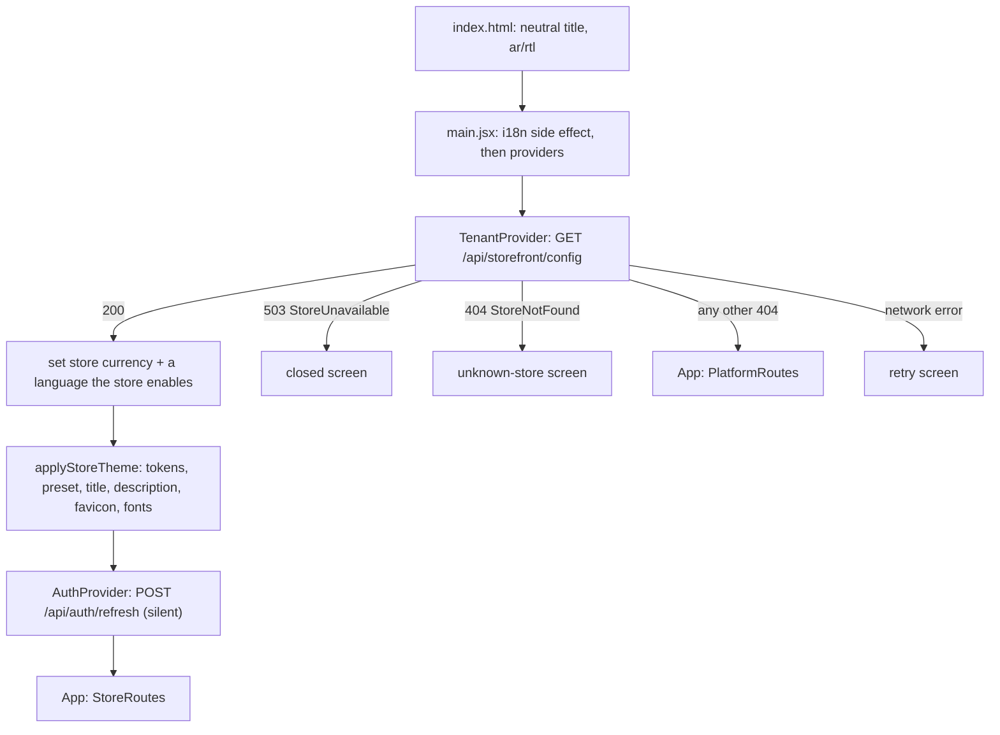

# Frontend guide

> **Code:** `frontend/` · **Decisions:** [ADR-0011](../11-ADR/0011-white-label-architecture.md), [ADR-0035](../11-ADR/0035-white-label-runtime.md), [ADR-0010](../11-ADR/0010-authentication-authorization.md), [ADR-0017](../11-ADR/0017-error-contract.md), [ADR-0023](../11-ADR/0023-sessions-and-credentials.md) · **Companion pages:** [FrontendArchitecture.md](FrontendArchitecture.md) (target shape and per-phase history), [WhiteLabel.md](WhiteLabel.md) (what a store can customize)

This is the page to read before changing the frontend. It describes what exists today, where each kind of code belongs, and how to make the common changes safely. The target structure the frontend is moving towards is in [FrontendArchitecture.md](FrontendArchitecture.md); everything here is current unless labelled.

**Stack:** React 18, Vite 5, React Router 6, i18next with react-i18next, Stripe.js with its official React bindings, Vitest 3. Plain JavaScript — no TypeScript. CSS Modules plus one global token sheet. No state library, no data-fetching library, no component library: `frontend/package.json` lists seven runtime dependencies and three dev dependencies.

**Size today:** 119 JavaScript/JSX modules (excluding tests), 58 CSS modules plus `frontend/src/styles.css`, 23 Vitest files, and 818 translation keys per language of which 85 are error codes.

## 1. The one thing to keep in mind

**One build renders any store, and the server decides everything that matters.** The SPA asks GET `/api/storefront/config` before it renders anything; the API resolves the store from the `Host` header and answers with that store's identity, languages, currency and enabled modules. The same bundle then paints itself as that store.

The frontend is never the authority for the store, permissions, prices, stock, coupon validity or module availability. It renders the server's decisions and handles its errors. Route guards, hidden buttons and module gates exist so a user is not shown a screen the server would reject — they are user experience, not security.

## 2. Structure map of `frontend/src`

| Folder | What belongs there | What must not go there |
|---|---|---|
| `frontend/src/main.jsx` | The entry point: provider composition only | Routes, business logic |
| `frontend/src/App.jsx` | The route tables for the areas, `CustomerLayout`, the lazy imports, the `guarded` helper | Data fetching beyond the shared category list |
| `frontend/src/app` | The white-label runtime and area shells: `TenantProvider`, `frontend/src/app/tenantModel.js` (pure), `frontend/src/app/storeTheme.js` (document side effects), `frontend/src/app/BootScreens.jsx`, `frontend/src/app/StoreBrand.jsx`, `frontend/src/app/PlatformLayout.jsx` | Feature screens; anything store-specific |
| `frontend/src/api` | The HTTP core: `frontend/src/api/client.js` (session, errors, every endpoint function), `frontend/src/api/problem.js` and `frontend/src/api/query.js` (pure, tested) | React, UI state, translation of anything but error codes |
| `frontend/src/components` | The UI kit (`frontend/src/components/common`), icons, storefront chrome (`frontend/src/components/layout`), and shared widgets for product, cart, catalog, reviews and notifications; the route guards in `frontend/src/components/ProtectedRoute.jsx` | New `fetch` calls; business rules; brand or colour literals in `common` |
| `frontend/src/context` | React contexts: `frontend/src/context/AuthContext.jsx`, `frontend/src/context/CartContext.jsx`, `frontend/src/context/WishlistContext.jsx`, `frontend/src/context/ToastContext.jsx` | Presentation. (The tenant context lives in `frontend/src/app` instead — an inconsistency, see §17) |
| `frontend/src/features` | Pure logic per feature — payload builders, query builders, form rules, view models — each with a test file beside it | React components, `fetch`, DOM access (the single exception is `frontend/src/features/account/download.js`) |
| `frontend/src/hooks` | Cross-screen hooks: `frontend/src/hooks/useCatalog.js`, `frontend/src/hooks/useDebouncedValue.js` | Feature-specific hooks (those belong with their feature) |
| `frontend/src/i18n` | i18next setup, `setLanguage`, `formatDate`, `formatDateTime`, and the `ar`/`en` locale files | Store-specific text (that comes from the store configuration) |
| `frontend/src/pages` | Route screens grouped by area: the storefront and customer pages at the root, then `account`, `admin`, `auth`, `checkout` | Reusable UI (promote it to `frontend/src/components`); pure logic (promote it to `frontend/src/features`) |
| `frontend/src/styles.css` | Design tokens, reset, base element styles, and the two global classes `.souq-layout` and `.souq-visually-hidden` | Component styles (each component has its own CSS module) |

Two rules hold everywhere in the tree:

- **All network access goes through `frontend/src/api/client.js`.** It is the only module that calls `fetch`.
- **No store-specific literal anywhere.** `frontend/src/whiteLabel.test.js` reads every source file and `frontend/index.html` and fails on a brand name, a currency code or a contact detail.

## 3. The boot sequence

1. **`frontend/index.html` carries no identity.** It ships `lang="ar" dir="rtl"`, the product title, an empty favicon and preconnects to the Google Fonts hosts. Title, description, favicon and fonts are replaced at runtime.
2. **`frontend/src/main.jsx` imports the i18n module for its side effect.** Language detection runs at import time: the stored `souq_lang` value, else the browser language, else `ar`; `dir` and `lang` are written onto `<html>` immediately.
3. **Provider order is deliberate:** `BrowserRouter` → `ToastProvider` → `TenantProvider` → `AuthProvider` → `App`, inside `React.StrictMode`. The tenant comes first because nothing should render — not even a session restore — before the store is known. `AuthProvider` sits inside it, so the silent refresh is only sent once the boot request has succeeded. `CartProvider` and `WishlistProvider` are **not** global: they are mounted by `CustomerLayout`, so the admin and platform areas never create a basket.
4. **`TenantProvider` fetches the configuration** through `api.getStorefrontConfig()`. On success it sets the store currency for prices that carry no explicit currency (`setStoreCurrency`), narrows the visitor language to one the store enables (`supportedLanguage`, then `setLanguage`), and switches to mode `store`. On failure, `bootOutcome` maps the error to a mode.
5. **Boot screens.** Until the mode is `store` or `platform`, `BootScreen` renders instead of the application: a spinner while loading, a text card for a closed store or an unknown host, and a card with a retry button for a network error. `retry` re-runs the request.
6. **Theme application.** Once the config is in, an effect calls `applyStoreTheme(config, language)`, which writes the semantic tokens as inline custom properties on `<html>`, sets `data-preset`, the document title, the meta description, the favicon and the store's font stylesheet. It re-runs when the language changes, because title and description are per-language.
7. **`AuthProvider` restores the session** with `refreshSession()` and keeps `loading` true until the answer arrives, so a page refresh never bounces a signed-in user to the sign-in screen.
8. **`App` picks the area:** `mode === 'platform'` renders `PlatformRoutes`, anything else `StoreRoutes`, both inside a `Suspense` boundary, with `ToastContainer` beside them.

**How the boot answer decides the area.** The mapping in `bootOutcome` mirrors the server's rules:

| Server answer | Cause | SPA result |
|---|---|---|
| `503` with code `StoreUnavailable` | The store is not `Active` — `TenantAvailabilityMiddleware` closes every endpoint that is not explicitly marked | The "closed" boot screen |
| `404` with code `StoreNotFound` | No store is mapped to this host (`TenantResolutionMiddleware`) | The "unknown store" boot screen |
| `404` with any other code | The storefront endpoint does not exist on the platform host, so `TenantAvailabilityMiddleware` answers `NotFound` | The platform area |
| Anything else, including a network failure | — | The retry screen |

The browser cannot *choose* to be the platform: the platform routes only appear when the host itself has no storefront, and every platform endpoint is authorized by the server for that host.

## 4. Routing and the four areas

| Area | Host | Layout | Guard (UX only) | Loading |
|---|---|---|---|---|
| Storefront | store host | `CustomerLayout` in `frontend/src/App.jsx` | none | home and product page eager, the rest lazy |
| Customer account | store host | `AccountLayout` nested in `CustomerLayout` | `ProtectedRoute` on the shell route | lazy |
| Authentication | store host and platform host | `AuthLayout` | none | lazy |
| Store admin | store host, `/admin/*` | `AdminLayout` with `AdminSidebar` and `AdminMobileTabBar` | `AdminRoute`, then `RequirePermission` and `RequireModule` per page | lazy |
| Platform | platform host, `/platform/*` | `PlatformLayout` (placeholder shell) | `PlatformRoute` | lazy |

**Storefront and account routes:** `/` (`Store`), `/offers`, `/products/:handle` (slug or id), `/cart`, `/wishlist` (behind the `wishlist` module), `/track/:token`, `/checkout`, `/confirmation`, `/orders/:id`, and — inside the account shell — `/account` (`Profile`), `/account/addresses` (`Addresses`) and `/orders` (`MyOrders`). Anything the shell holds, plus checkout, confirmation and the order page, requires a session; an unknown path under the storefront renders `NotFound`, not a silent redirect home.

The shell is one `Route` carrying `ProtectedRoute` and `AccountLayout`, so the guard and the navigation are declared once. `/orders/:id` stays outside it: the order page has its own back link and a full-width layout, and its URL is the one that email and notification links point at.

`/track/:token` is deliberately unguarded: the public tracking link is a random token, so it works for a signed-out recipient and cannot be guessed from an order id.

`CustomerLayout` owns the storefront chrome (`AnnouncementBar`, `Navbar`, `CategoryNav`, `Footer`, `CartDrawer`; the drawer is the quick look and links through to the `/cart` page, and both read the same `CartContext` state), mounts the cart and wishlist providers, fetches the category list once, and passes `{ showToast, refreshProducts, refreshKey, categories }` down through the router's outlet context (the search term left it in Phase 16 — the URL carries it now). A page reads it with `useOutletContext()`.

**Authentication routes:** `/login`, `/register`, `/forgot-password`, `/reset-password`, `/verify-email`, and `/accept-invitation`, which renders `ResetPassword` with `mode="invitation"` — the same server endpoint, different text. The platform host exposes only sign-in, password recovery and invitation acceptance; there is no self-registration there.

**Admin routes** all sit under one `Route` with `AdminRoute` and `AdminLayout`, and each child is wrapped by the local `guarded(element, permission, module)` helper:

| Route | Permission | Module |
|---|---|---|
| `/admin` | — (any store account with at least one permission) | — |
| `/admin/products`, `/admin/categories` | `catalog.manage` | — |
| `/admin/inventory` | `inventory.view` | — |
| `/admin/coupons` | `promotions.manage` | `promotions` |
| `/admin/orders` | `orders.view` | — |
| `/admin/customers` | `customers.view` | — |
| `/admin/shipping` | `store.shipping.manage` | — |
| `/admin/payments` | `store.payments.manage` | — |
| `/admin/reviews` | `reviews.moderate` | `reviews` |

The same list drives the navigation: `ADMIN_NAV` in `frontend/src/pages/admin/AdminSidebar.jsx` carries the permission and module of each entry, and `useAdminNav` filters it, so the sidebar and the mobile tab bar hide exactly what the route guard would redirect away from.

**Guards** live in `frontend/src/components/ProtectedRoute.jsx`:

| Guard | Rule | Otherwise |
|---|---|---|
| `ProtectedRoute` | signed in | `/login`, remembering the target in `state.from` |
| `AdminRoute` | signed in and `canManageStore` (area `Store` with at least one permission) | `/login` when signed out, `/` for a customer |
| `RequirePermission` | `can(permission)` | `/admin` |
| `RequireModule` | `useModule(module)` | the given fallback: `/` on the storefront, `/admin` for admin pages |
| `PlatformRoute` | signed in with `user.area === 'Platform'` | `/login` |

`ProtectedRoute`, `AdminRoute` and `PlatformRoute` render `PagePending` while the session is being restored instead of judging early. `RequirePermission` does not need that check because it is always nested inside `AdminRoute`, which already waited.

**Code splitting.** Every page is a `React.lazy` import except `Store` and `ProductDetail`, which are in the first bundle because they are the common entry points. Three `Suspense` boundaries carry `PagePending`: the application root, the storefront outlet, and the admin content area — so the admin sidebar stays on screen while a page loads.

## 5. State

| Holder | Mounted | Holds | Truth |
|---|---|---|---|
| `TenantProvider` | globally | `{ mode, config, retry }`; read through `useTenant`, `useStoreConfig`, `useModule` | the server's config endpoint, read-only |
| `AuthProvider` | globally | `user`, `loading`, `isAuthenticated`, `canManageStore`, `can()`, and the session actions | the server; nothing is persisted in the browser |
| `ToastProvider` | globally | the transient toast list; `success`/`error`/`info`, auto-dismissed after three seconds | local |
| `CartProvider` | inside `CustomerLayout` | the basket exactly as `/api/basket` returned it | the server: every action replaces the whole basket ([ADR-0028](../11-ADR/0028-basket-and-pricing-pipeline.md)) |
| `WishlistProvider` | inside `CustomerLayout` | the wishlist | the server for a signed-in customer, `localStorage` for a guest ([ADR-0033](../11-ADR/0033-review-moderation-and-wishlist.md)) |

**Cart.** `CartProvider` waits for the session restore, then reads the basket, and reads it again whenever the user changes — the first read after sign-in is where the server merges the guest basket. Each operation returns the server's basket and replaces local state with it, so a locally computed total can never diverge from the price the order will be created with. Failures (a line that is no longer available, not enough stock) are shown once as a toast by the context, and the caller learns success from the returned boolean.

**Wishlist.** A guest's list lives in `localStorage` under `souq_wishlist` as whole product objects, so the page renders with no network. When a customer signs in, the local ids are merged server-side and the local copy is cleared, so the next guest on a shared device does not inherit it. If the module is off, or the account is a staff account, the list stays local and no request is sent.

**Everything else is local component state.** Pages hold their data, loading flag, error, filters and page number in `useState` and fetch in `useEffect`. Two module-level values are shared outside React: the access token inside `frontend/src/api/client.js`, and the store currency inside `frontend/src/app/tenantModel.js`.

**URL state.** The storefront catalog keeps its whole state in the query string (`?cats=&min=&max=&sort=&view=&page=`), so a filtered view is shareable; `frontend/src/components/catalog/Catalog.jsx` is the only place that does this. Admin lists keep page and filters in component state, so a reload resets them.

**Why there is no global store and no query library yet.** D-19 was **decided** in Phase 17 ([ADR-0037](../11-ADR/0037-frontend-server-state-and-types.md)) after the frontend was measured rather than recalled: a query library (TanStack Query) is the target for server state, but nothing is installed yet. It arrives at the first screen that is rebuilt or newly written, together with the jsdom environment and rendering library that let the migration be proved by a test — not as a separate migration project during a hardening phase. TypeScript is deferred separately until a CI pipeline exists to enforce a type-check, because a check nobody runs is not a control.

What that costs today: no caching, no request de-duplication and no retry policy. Every screen refetches on mount, and the category list is fetched once per storefront layout and shared through the outlet context.

**Guarding is not deferred.** An effect that can be outrun by a fast navigation must ignore a superseded response, using a local `active` flag. Five do this today — `useCatalog`, `Store`, `TenantProvider`, `AuthProvider` and `WishlistProvider` — and **24 of the 29 fetching components do not**. Copy the idiom whenever you touch a screen. The one place it sat next to money is fixed: the checkout re-quote now ignores a superseded price, so the total beside the order button always matches the choice that produced it.

## 6. Talking to the API

Everything lives in `frontend/src/api/client.js`, with two pure helpers beside it.

- **Base URL is the relative `/api`.** There is no environment variable and no absolute host anywhere in the frontend: the SPA is always served from the same origin as the API — through the Vite proxy in development and through nginx in the container. That is what makes host-based tenancy work, and it is why there is no CORS problem to solve.
- **`credentials: 'same-origin'`** on every call, so the two cookies the server sets travel automatically: the refresh cookie `souq_refresh` on path `/api/auth`, and the guest basket cookie `souq_basket` on path `/api/basket`. JavaScript never reads either.
- **`send()` is the single path** every request takes. It attaches `Authorization: Bearer <token>` when a token is in memory and the call is not marked anonymous; on a `401` for a request that carried a token it runs one shared refresh and retries once; if the refresh is rejected it dispatches `SESSION_EXPIRED` on `authEvents`, which `AuthProvider` listens for and turns into a signed-out UI. A non-OK response becomes a normalized error; `204` becomes `null`; anything else is parsed as JSON.
- **Three wrappers** sit on `send()`: `request()` adds the JSON content type; `upload()` posts `FormData` **without** a content type, because the browser has to generate the multipart boundary itself; `publicAuth()` marks the call anonymous, because a `401` from sign-in is an answer, not an expired session, and must not trigger a refresh.
- **The refresh is single-flight.** Refresh tokens rotate, so two parallel refreshes with the same token look like token reuse — theft — to the server ([ADR-0023](../11-ADR/0023-sessions-and-credentials.md)). `refreshSession()` keeps one in-flight promise and hands it to every caller.

**Errors.** `toApiError` in `frontend/src/api/problem.js` turns an RFC 7807 body into one `Error` with `status`, `code`, `traceId`, `fieldErrors` and a display `message` ([ADR-0017](../11-ADR/0017-error-contract.md)). The message is chosen by language: the server's messages are Arabic, so an Arabic UI shows the server's `detail` (it is more precise — "the coupon has expired" rather than "invalid coupon"), while another language shows the translation of the stable `code` from `errors.codes.<Code>`, falling back to the server text for a code the UI does not know yet, and finally to `errors.connection`. `frontend/src/api/problem.js` is pure and tested; the i18next binding lives in `frontend/src/api/client.js`.

**Build UI logic on `code`, never on the message text.** `error.code` is the contract; the text is not.

**Server state** goes through TanStack Query since Phase 16 ([ADR-0038](../11-ADR/0038-query-layer-adopted-and-type-checking.md)). `QueryProvider` sits under `AuthProvider` in `main.jsx` so that a change of user id resets every query — without that, signing out and in as someone else on the same device would paint the first customer's orders for the second before the server was asked. Keys live in `frontend/src/app/queryKeys.js`; `staleTime` is 0 everywhere except the category tree, because a shop must not present a stale price as current. The admin screens still hand-roll fetching until Phase 17 rebuilds them.

**The `api` object** exposes 92 named functions grouped by feature — authentication, customer account, storefront config, catalog, orders, basket, payments, coupons, reviews, wishlist, notifications, and the admin groups for products, categories, inventory, customers, orders, store payments and shipping. They hide HTTP from the rest of the application: a screen calls `api.getMyOrders({ page })`, not a URL.

**Query strings** are built by `toQueryString` in `frontend/src/api/query.js`: empty values (`null`, `undefined`, `''`) are dropped so no `keyword=` reaches the server, `0` and `false` are kept because they are real values, and arrays are emitted as a repeated key (`categoryIds=1&categoryIds=2`), which is the shape ASP.NET model binding turns into a list.

**The Vite dev proxy** (`frontend/vite.config.js`) forwards `/api` and `/uploads` to the API on 127.0.0.1 port 5200. The comments record the reasons: port 5200 because macOS reserves 5000 for AirPlay, the literal `127.0.0.1` because resolving `localhost` inside Node hung the proxy, and the object form because the shorthand hung it too. The proxy does not set `changeOrigin`, so the browser's `Host` header reaches the API unchanged — which is what lets `localhost` resolve to the seeded development store (`Tenancy:LocalDefaultTenant`, defaulted to `DbSeeder.DefaultTenantSlug` in Development and Testing) and `{slug}.localhost` to any other store.

**Stripe.** `frontend/src/pages/checkout/stripeClient.js` loads Stripe.js once per session with the publishable key from GET `/api/payments/config`. It distinguishes **three** answers, and the distinction matters: a key loads the card field; an **empty** key means the store has no gateway configured, which is a real answer worth caching — `CardPaymentForm` falls back to a single confirm button through the server's fake gateway, so the store stays usable without Stripe keys; a **failed request** is not an answer, so it is never cached, and the screen shows an error with a retry. Collapsing the third case into the second is what made one transient network error disable card payment for a whole session. Card details never reach the Souq API.

**Polling.** The only poll in the application is the notification badge, every 60 seconds while a session exists (`POLL_MS` in `frontend/src/features/notifications/notificationView.js`).

## 7. Authentication in the browser

- **The access token lives in module memory** inside `frontend/src/api/client.js` and nowhere else — not `localStorage`, not `sessionStorage`, not a context. An injected script finds no stored token, and the token never leaves that module ([ADR-0010](../11-ADR/0010-authentication-authorization.md)).
- **The refresh token is an `HttpOnly` cookie** scoped to `/api/auth`, `SameSite=Strict`, and `Secure` unless explicitly disabled for a local HTTP deployment (`Auth:RefreshCookie`). JavaScript cannot read it, and it is not sent with cross-site requests. Each store host has its own cookie.
- **Session restore** happens once at boot. Until it finishes, `loading` is true and the guards render a spinner rather than redirecting.
- **Sign-out** clears the UI immediately and then calls `/api/auth/logout` to revoke the refresh token; a failure of that call does not keep anyone signed in locally.

**The user object** (`UserInfo` on the server) carries `id`, `fullName`, `email`, `role`, `permissions`, `emailConfirmed`, `customerId` and `area`. Three of those drive the UI:

- `permissions` — what the UI offers. `can(permission)` in `frontend/src/context/AuthContext.jsx` is the only test; the role name is never branched on, because staff and administrators differ by permission, not by title.
- `customerId` — only an account with a customer profile sees "My account"; the `/api/account` endpoints reject a staff account.
- `area` — `Store` or `Platform`. `canManageStore` requires area `Store` with at least one permission; `PlatformRoute` requires area `Platform`. A store token is not accepted on the platform host and vice versa, because the server binds the token to the host.

**Permission strings are literals** in `frontend/src/App.jsx`, `frontend/src/pages/admin/AdminSidebar.jsx` and a few pages (`inventory.manage`, `customers.manage`, `store.payments.manage`, `store.settings.manage`, `orders.view`). They must match `Permissions` in `src/Souq.Application/Common/Security/Permissions.cs`; nothing checks that they still do.

**Platform accounts** sign in on the platform host and land in `PlatformLayout`, which today is a shell with the platform name, the signed-in account and a sign-out button. Its screens are **PLANNED** for Phase 18; the platform API already exists.

## 8. Tenant and storefront behaviour

Everything a store can change about itself arrives in one response. Where each part is consumed:

| Configuration | Read by |
|---|---|
| `settings.displayName`, `name` | `StoreBrand` (name or logo), the footer copyright, the registration subtitle |
| `settings.branding.colors` | `themeVariables` → the semantic tokens on `<html>` |
| `settings.branding.typography`, `themePreset`, `logoUrl`, `faviconUrl` | `applyStoreTheme`: font stylesheet, `data-preset`, logo, favicon |
| `settings.seo.title`, `settings.seo.description` | document title and meta description; the description is also the footer blurb |
| `settings.announcement` | `AnnouncementBar` — no announcement means no bar, and its height token is zeroed so sticky elements do not leave a gap |
| `settings.contact`, `settings.social` | `Footer` |
| `settings.locale.currency` | `setStoreCurrency`, used for any price shown without an explicit currency |
| `settings.locale.defaultCulture`, `enabledCultures` | the language chosen at boot, the text fallback chain, and whether the language toggle appears at all |
| `modules` | `useModule`, `RequireModule`, `useAdminNav` |

Fields the SPA currently ignores: `slug`, `status`, `settings.locale.timeZone`, `settings.locale.currencyDecimals` (the frontend derives fraction digits from `Intl` instead) and `settings.branding.socialImageUrl`.

**The frontend never sends a tenant id.** No request carries a store identifier: the host decides, the server resolves, and a forged value would gain nothing. The development-only `X-Tenant` header exists on the server; the frontend never sends it.

**Module gates.** `useModule` hides the UI of a disabled module and, just as importantly, stops the request: `wishlist` controls the navbar heart, the mobile menu and footer links, the product-card heart, the `/wishlist` route and the wishlist server sync; `reviews` controls the review section on the product page and the admin moderation screen; `promotions` controls the coupon field at checkout and the admin coupons screen. The server enforces the same flags with `404 ModuleDisabled` regardless ([ADR-0022](../11-ADR/0022-tenancy-enforcement.md)).

**Languages.** Only `ar` and `en` exist, on both sides (`SUPPORTED` in `frontend/src/i18n/index.js`, `Tenant.SupportedCultures` on the server). A visitor's language survives only if the store enables it; a single-language store shows no toggle.

## 9. Admin and storefront are separate applications sharing a build

- **Separate shells.** `AdminLayout` has its own sidebar, header and mobile tab bar; it is not the storefront with buttons hidden. It does not mount the cart or wishlist providers.
- **Separate bundles.** Every admin screen is lazy, so a visitor never downloads admin code ([ADR-0035](../11-ADR/0035-white-label-runtime.md)).
- **Separate entry rules.** `AdminRoute` for the area, a permission per page, a module flag where the page belongs to an optional module, and the same conditions applied to the navigation.
- **Shared by design:** the API client, the UI kit, i18n, the design tokens and the money formatter.

Admin screens follow one pattern: a toolbar of filters, a `DataTable` with server paging, row actions in a `RowActionsMenu`, and forms in a `Drawer`. Destructive actions currently confirm with `window.confirm` in six screens; designed confirmation dialogs are **PLANNED** for Phase 17.

## 10. Loading, errors, empty states and toasts

Every data view handles three states, with shared components from `frontend/src/components/common`:

- **Loading** — `Skeleton` blocks shaped like the content, or `Spinner` for small inline waits.
- **Error** — `ErrorBanner` with the server's message and an optional retry callback.
- **Empty** — `EmptyState` with an icon, a message and an optional action.

`DataTable` bundles all three, so admin tables get them by construction. `PagePending` covers route-level loading, and `BootScreen` covers failures before the store is known.

**Toasts** (`useToast`) report the result of an action: added to cart, saved, deleted, or a failed operation. The cart and wishlist contexts already toast their own failures — do not toast them again at the call site.

**Two gaps to know about.** There is no error boundary, so an exception during render blanks the page rather than showing a recoverable screen. And `error.traceId` and `error.fieldErrors` are produced by `toApiError` but no screen displays them yet — a support-facing trace id and per-field server errors are both one small change away.

## 11. Forms and validation

Client validation exists for fast feedback; the server is the authority and its message is displayed as returned.

- `FormField` wraps label, control and error; `inputClass(hasError)` styles the control. Forms carry `noValidate` and track a `touched` map so errors appear after a field is left, not while typing.
- A submit failure sets a `serverError` that renders in an `ErrorBanner` (or in `AuthLayout` for the authentication screens).
- **Rules that the server also enforces live in `frontend/src/features`** as pure functions returning a translation key: `couponFormProblem`, `methodFormProblem`, `accountFormProblem`, `refundProblem`, `missingAddressFields`. The page translates the key. This keeps the "first problem that blocks saving" logic testable and out of JSX.
- **Payload builders normalize** before sending: trimmed strings, upper-case country and coupon codes, empty optional fields as `null`, numbers parsed once (`buildProductPayload`, `buildCouponPayload`, `buildMethodPayload`, `formToAddress`).
- Some rules are duplicated inline instead: the e-mail pattern in three authentication screens and the eight-character password minimum in two. See §17.

## 12. Internationalization and right-to-left

- **One namespace.** All keys live in `frontend/src/i18n/locales/ar.json` and `frontend/src/i18n/locales/en.json` under a single `translation` namespace, grouped by area (`common`, `nav`, `cart`, `product`, `reviews`, `store`, `catalog`, `offers`, `auth`, `checkout`, `confirmation`, `orders`, `admin`, `wishlist`, `footer`, `errors`, `account`, `notifications`, `boot`, `platform`).
- **`setLanguage` is the only way to switch.** It updates i18next, stores the choice under `souq_lang`, and sets `dir` and `lang` on `<html>` — which is what flips the whole layout, since the CSS relies on the document direction rather than per-component mirroring. Components that must mirror explicitly ask for it: `Pagination` flips its chevrons from `i18n.dir()`, and `DataTable` aligns columns with logical `start`/`end`.
- **Fonts follow the language.** `html[lang="en"]` in `frontend/src/styles.css` switches the display and body fonts to Inter; Arabic uses the store's typography preset.
- **Server-provided text** is never translated in the browser. Catalog names and descriptions come per language in `translations` and are read by `frontend/src/features/catalog/catalogText.js` with a fallback to the store's default text (and to `nameAr`/`nameEn` for cart or wishlist items saved before Phase 5). Store texts use `pickText`. Notifications arrive as a kind plus parameters and are worded by `describeNotification`, so they follow a language switch.
- **Error codes are a contract.** `frontend/src/i18n/locales.test.js` fails if a code exists in one language and not the other, or if a message is blank. Full key parity across the two files currently holds but is not tested.

**Money.** `formatMoney(amount, currency, language)` in `frontend/src/app/tenantModel.js` uses `Intl.NumberFormat` with Latin digits in both languages, the currency symbol in Arabic and the code in English, and the currency's fraction digits taken from `Intl` (which is ISO 4217 data) rather than a table in the frontend. Amounts arrive from the API as decimals in major units; "minor units" only determines how many fraction digits are shown, and `refundProblem` uses the same number to reject over-precise refund amounts. Screens call `formatPrice(amount, currency?)` from `frontend/src/components/product/ProductBadges.jsx`, which falls back to the store currency when a value carries none.

**Dates** use `formatDate` and `formatDateTime` from `frontend/src/i18n/index.js`. Both pin a fixed locale (`ar-JO` or `en-US`) and neither applies the store's time zone — see §17.

## 13. Styling and theming

- **Tokens are semantic, never brand-named.** Components read `--color-*`, `--font-display`, `--font-body`, radii, shadows and the type scale. `frontend/src/styles.css` defines neutral defaults for the moments before the configuration arrives; `applyStoreTheme` then writes the store's values as inline custom properties on `<html>`, which outrank `:root`.

| Written from the store's branding | Fixed for every store |
|---|---|
| `--color-primary`, `--color-primary-strong`, `--color-on-primary`, `--color-secondary`, `--color-accent`, `--color-accent-soft`, `--color-on-accent`, `--color-bg`, `--color-surface-alt`, `--color-text`, `--color-text-muted`, `--color-border`, `--shadow`, `--tenant-font-heading`, `--tenant-font-body` | `--color-surface`, the status colours `--color-success`, `--color-info`, `--color-danger` and their soft variants, radii, `--shadow-lg`, the type scale, easings, `--navbar-height` |

- **Derived colours keep text readable** (`frontend/src/app/tenantModel.js`): the strong primary is a darkened mix, `on-primary` and `on-accent` are black or white by contrast, and muted text is the lightest mix of text and background that still reaches 4.5:1. The unit test asserts that last rule for both sample stores.
- **One CSS Module per component**, imported as `styles`, so class names never collide. Only `.souq-layout` (the page container) and `.souq-visually-hidden` are global.
- **`Button` variants** are `primary`, `saffron`, `ghost` and `danger` — `saffron` is the accent-coloured button and the name is a leftover of the first store's palette, not a brand colour: it resolves to `--color-accent`.
- **Rules when you add styles:** use tokens, not hex; put the style in the component's module; if a value must come from the store, derive it in `themeVariables` and cover it with a test. Twenty-one of the 58 CSS modules still contain hex literals, mostly for shadows, overlays and status tints.

## 14. Testing

Run everything with `npm test` in `frontend` (`vitest run`). There is no Vitest configuration block, so tests run on Vite's config with Vitest's defaults, and test files sit beside the module they cover.

| Area | Files | What is covered |
|---|---|---|
| HTTP core | `frontend/src/api/client.test.js`, `frontend/src/api/problem.test.js`, `frontend/src/api/query.test.js` | The token stays in memory and is sent on later calls; one refresh and one retry on expiry; a single shared refresh for concurrent calls; the expiry event and dropped token when the refresh is rejected; no refresh after a failed sign-in; session restore from the cookie. Error message choice, code, trace id, field errors, fallback. Query-string rules. |
| White-label runtime | `frontend/src/app/tenantModel.test.js` | Two stores with different branding, currency, languages and modules produce different tokens, fonts, prices, names, titles and module answers; derived muted text keeps 4.5:1; boot outcomes map to the right screen. |
| Feature logic | 17 files under `frontend/src/features` | Address payloads, category tree and cycle-free parent options, coupon form rules, customer actions, payment key modes and refund limits, product payload and admin query, review moderation actions, shipping form and options, basket mapping and line problems, catalog text fallbacks, checkout shipping choice, notification wording, order view helpers, rating distribution, wishlist merge rules. |
| Checkout gateway | `frontend/src/pages/checkout/stripeClient.test.js` | A failed payment-config request is not cached and the next attempt asks again; a real key loads Stripe.js exactly once; an empty key is cached as "this store has no gateway". |
| Guard rails | `frontend/src/whiteLabel.test.js`, `frontend/src/i18n/locales.test.js` | No brand, currency or contact literal in any source file or `frontend/index.html` (the test also asserts it scanned more than 150 files, so it cannot silently stop covering the tree); error codes translated in both languages and never blank. |

**Not covered today:** there are no component, hook, context or router tests — no rendering library is installed, so guards, layouts, forms and the providers are only exercised by hand. `frontend/src/app/storeTheme.js` (document side effects), `frontend/src/features/account/download.js` and every page are untested. That gap is why the checkout re-quote guard added in Phase 17 is verified by reading rather than by a test, and closing it is part of the query-layer adoption ([ADR-0037](../11-ADR/0037-frontend-server-state-and-types.md)). There is no end-to-end suite and no CI pipeline running any of this. Frontend unit tests and an E2E suite are **PLANNED** for Phase 19.

When you add pure logic, add its test in the same commit — that is the part of this codebase where tests are cheap and expected.

## 15. Build and deployment

- **`npm run build`** produces the Vite bundle: one eager chunk plus a lazy chunk per page. Measured in Phase 15: about 381 KB of JavaScript in the first bundle (122 KB gzipped) and about 144 KB loading on demand. No budget is enforced; bundle-size budgets are **PLANNED** for Phase 21. Both locale files are statically imported, so they are part of the first chunk.
- **`frontend/Dockerfile`** builds with `node:20-alpine` (`npm ci`, `npm run build`) and serves the result from `nginx:1.27-alpine`.
- **`frontend/nginx.conf`** proxies `/api/` and `/uploads/` to the API container on port 8080, and falls back to `frontend/index.html` for every other path so the router owns client-side routing. Two settings carry reasons worth keeping: `proxy_set_header Host $http_host` on `/api/`, because the API resolves the store from the `Host` header and builds e-mail links from it; and `client_max_body_size 55m`, because nginx's 1 MB default would reject product video uploads with a `413` before the API ever saw them.
- **`docker-compose.yml`** builds this image as the `web` service and publishes it on port 8081.
- Not configured in nginx: compression, cache headers for the hashed assets, and security headers such as CSP and HSTS. Those are **PLANNED** for Phases 20–21.

## 16. How to …

**Add a page.**
1. Create the page under `frontend/src/pages` in the folder of its area, with its own CSS module.
2. Add a `lazy` import and a `Route` in `frontend/src/App.jsx`, inside the right area and layout.
3. Wrap it: `ProtectedRoute` for a customer page, `guarded(element, permission, module)` for an admin page, `RequireModule` for an optional-module storefront page.
4. If it is an admin page, add an entry to `ADMIN_NAV` with the same permission and module, so the navigation and the guard agree.
5. Add the keys to both locale files.
6. Fetch through `api`, and handle loading, error and empty states.
7. Confirm the server endpoint carries the matching permission and module attributes — the guard is not protection.

**Add a feature.** Put the rules that are pure — payload shape, query shape, "what blocks saving", view mapping — in a module under `frontend/src/features` named for its feature, with a test beside it, and keep the component thin. Never re-implement a server rule as the authority; mirror it only to give faster feedback, and always show the server's answer when it disagrees.

**Add an API call.**
1. Add a function to the `api` object in `frontend/src/api/client.js`, in the group its feature belongs to.
2. Use `request` (JSON), `upload` (files) or `publicAuth` (anonymous authentication endpoints).
3. Build query strings with `toQueryString`; never hand-concatenate.
4. Never add a tenant id or a customer id that the server can infer from the session or the host.
5. Branch on `error.code`, and add that code to `errors.codes` in **both** locale files — the locales test fails if only one has it.

**Add a translation.** Add the same key path to `frontend/src/i18n/locales/ar.json` and `frontend/src/i18n/locales/en.json`, use `t('group.key')` with `{{interpolation}}` for values, and keep store-specific wording out: anything that differs per store belongs in the store's configuration, not in the locale files.

**Gate something behind a module.** Use `useModule('<module>')` for UI, `RequireModule` for a route, and the `module` field of `ADMIN_NAV` for navigation. The module names are the ones in `StoreModules` on the server.

**Add or change a design token.** Add a neutral default to `:root` in `frontend/src/styles.css`. If the value comes from the store, compute it in `themeVariables` and extend `frontend/src/app/tenantModel.test.js`. Never hard-code a colour in a component.

## 17. Technical debt

Each item below was verified against the code.

| # | Item | Evidence | Why it matters |
|---|---|---|---|
| 1 | Dead API functions | `api.deleteProduct` and `api.getProductBySlug` in `frontend/src/api/client.js` have no callers | Products are archived, not deleted; slug routes wait for the storefront rebuild |
| 2 | The feature-folder migration is only half done | `frontend/src/features` holds pure logic only; every screen is still under `frontend/src/pages`, and feature components such as `NotificationBell` and `ReviewForm` call the API from `frontend/src/components` | A feature is spread across three folders, so a change touches all three |
| 3 | `frontend/src/api/client.js` is one module for the whole product | 92 endpoint functions covering every feature, imported by 36 modules | Every screen imports the whole surface; splitting arrives with the query layer ([ADR-0037](../11-ADR/0037-frontend-server-state-and-types.md)) |
| 4 | Money and catalog-text helpers live in a component file | `formatPrice`, `getProductName`, `getProductDescription` and `getCategoryName` are exported from `frontend/src/components/product/ProductBadges.jsx` and imported by admin, checkout and order screens | A presentation component has become a utility module |
| 5 | Duplicated helpers | `numberOrNull` in `frontend/src/features/admin/coupons/couponForm.js` and `frontend/src/features/admin/shipping/shippingForm.js` plus `optionalNumber` in `frontend/src/features/admin/products/productPayload.js`; the e-mail pattern in `frontend/src/pages/auth/Login.jsx`, `frontend/src/pages/auth/Register.jsx` and `frontend/src/pages/auth/ForgotPassword.jsx`; the eight-character password rule in `frontend/src/pages/auth/Register.jsx` and `frontend/src/pages/auth/ResetPassword.jsx`; the "server detail or translated code" rule in `frontend/src/api/client.js`, in `couponProblemMessage` and again inline in `frontend/src/pages/checkout/Checkout.jsx`; the supported-language list in `frontend/src/i18n/index.js` (`SUPPORTED`) and `frontend/src/features/catalog/catalogText.js` (`CATALOG_CULTURES`); two language-fallback helpers with different shapes (`pickText`, `localizedText`) | Each one is a place where two copies can drift apart |
| 6 | Store-specific literals the white-label test does not catch | `ar-JO` in `formatDate`/`formatDateTime`; `country: 'JO'` in `emptyAddress()`; the card-field colours and `Tajawal` in `CARD_ELEMENT_OPTIONS` (a Stripe iframe cannot read the page's CSS variables); the `saffron` button variant name | Dates, the default address country and the card field still carry the first store's identity |
| 7 | Arabic dates and prices disagree on digits | `formatMoney` forces Latin digits (`ar-u-nu-latn`); `formatDate` does not, so `ar-JO` renders Arabic-Indic digits | The same screen shows two numeral systems |
| 8 | Placeholder content | Six `href="#"` links in `Footer`; the offers row and `/offers` are just "newest products" until a real offer flag exists; `Confirmation` promises a fixed 3–5 day window while shipping methods carry their own estimates; the `Hero` slides are fixed locale text, not store content; `StockBadge` assumes a low-stock threshold of 5 | Visible to customers, and the delivery window can contradict the chosen shipping method |
| 9 | No error boundary | No `componentDidCatch` or boundary component anywhere | A render exception blanks the application |
| 10 | No component or route tests | No rendering library in `frontend/package.json`; all 24 test files run in the default node environment | Guards, layouts, providers and forms are verified only by hand |
| 11 | Admin list state is not in the URL | `useSearchParams` appears only in the catalog, the category bar, the storefront page and two authentication screens | A reload or a shared link loses an admin filter |
| 12 | Unguarded async effects | Counted in Phase 17: **24 of 29** fetching components set state without an `active` flag — `ProductDetail` does it from three requests — unlike `useCatalog`, `Store`, `TenantProvider`, `AuthProvider` and `WishlistProvider` | Fast navigation between products can render the previous product's data. The checkout re-quote, the one case beside money, is now guarded |
| 13 | `ToastContext` builds a new value object on every render | `frontend/src/context/ToastContext.jsx` has no `useMemo`, and `CartProvider` depends on it | Every toast re-renders all consumers and recreates the cart callbacks |
| 14 | Browser dialogs for destructive admin actions | `window.confirm` in six admin screens | No styling, no localization control, no explanation of consequences |
| 15 | Permission and module strings are untied literals | `frontend/src/App.jsx` and `frontend/src/pages/admin/AdminSidebar.jsx` repeat the server's permission names | A renamed permission fails silently as a hidden or a rejected page |

## 18. Where the frontend is going

The target structure and the reasoning behind it are in [FrontendArchitecture.md](FrontendArchitecture.md) §3–§4; the migration plan is §6 there. In short:

- **Screens move into feature folders as they are rebuilt** (Phases 16–17), with `git mv` so history survives and the diff stays reviewable. Moving everything at once was rejected: a large diff with no behaviour change, and merge pain for the storefront rebuild.
- **Splitting `frontend/src/api/client.js` per feature waits for the query layer**, because the query layer decides what those modules look like. D-19 is now **DECIDED** and names when that layer arrives ([ADR-0037](../11-ADR/0037-frontend-server-state-and-types.md)).
- **TypeScript and TanStack Query** are proposed and deferred with a trigger, with an incremental path: `allowJs`, new files typed, the pure feature modules converted first; the query layer used first for the new catalog and basket screens.
- **Phase 16** rebuilds the storefront (configurable home sections, slug routes, per-host SEO heads, a real account area) and **Phase 17** the admin dashboard; both are the moment to pay down the debt in §17 for the screens they touch.
