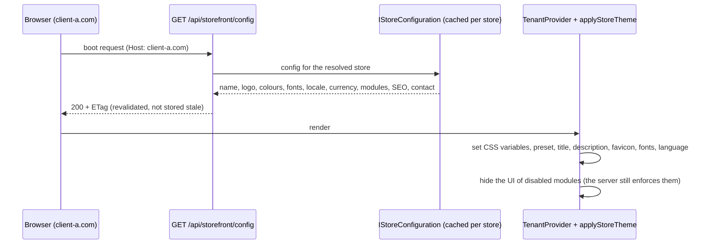

# Souq: white-label architecture

> **Status:** target adopted 2026-09-11 ([ADR-0011](../11-ADR/0011-white-label-architecture.md)). Both halves are delivered.
> - **Backend configuration — Phase 4** ([ADR-0024](../11-ADR/0024-platform-administration.md)): a validated settings model (per-language texts, WCAG-checked colours, preset fonts and themes, allowlisted social links), branding uploads, module flags, and GET `/api/storefront/config` with an ETag. The first store was seeded with the original brand's look, which turned that brand into a tenant.
> - **Frontend runtime — Phase 15** ([ADR-0035](../11-ADR/0035-white-label-runtime.md)): the SPA boots from the host's store configuration, applies semantic tokens, and hides the UI of disabled modules. How it is wired is in [FrontendGuide.md](FrontendGuide.md) §3, §8 and §13.

## 1. Principle

**One codebase, many tenants, per-tenant configuration.**

A new client never produces a new repository, branch, build, or `if (tenant == …)`. Everything that differs between stores is one of three things:
1. **data** (catalog, customers, orders),
2. **configuration** (branding, locale, contact, SEO, domains), or
3. **module flags** (which capabilities are on).

If a client asks for something none of those can express, it becomes a product feature available to every tenant, or it is declined.

## 2. What can be customized, and by whom

"Provision" means the platform owner sets it before handover, in the provisioning wizard at `/platform/stores` on the platform host, which calls the platform API. "Tenant" means the tenant administrator can edit it afterwards, through the settings screen at `/admin/settings`, which calls PUT `/api/admin/store/settings` (permission `store.settings.manage`). Both paths apply the same validation: `StoreSettingsEditor` on top of the `StoreSettings` value objects.

| Setting | Provision (platform) | After handover (tenant admin) | Validation and notes |
|---|---|---|---|
| Store name, per language | yes | yes | Up to 80 characters; only supported languages |
| Logo, favicon, social image | yes | yes | Validated upload, stored under the store's prefix; the client never supplies a URL |
| Colours: primary, secondary, accent, background, text | yes | yes | Hex. `BrandColors` rejects an unreadable palette: text on background at least 4.5:1, button text on primary and on accent at least 4.5:1, and primary against background at least 3:1 (WCAG AA). The "on" colours and all shades are derived, not entered. |
| Typography preset | yes | yes | One of five presets in `BrandPresets` (`kufi-tajawal`, `tajawal`, `cairo`, `almarai`, `ibm-plex`). No arbitrary font URLs. |
| Theme preset (layout variant) | yes | yes | One of `classic`, `minimal`, `bold` in `BrandPresets`; §4 |
| Theme mode (light / dark default) | yes | yes | One of `light`, `dark`, `system` in `BrandPresets.ThemeModes`, default `system`. It sets the store's **default**; a visitor who uses the toggle overrides it, and that choice is stored per origin so it cannot cross stores. [DesignSystem.md](DesignSystem.md) §3 |
| Opening experience | yes | yes | `StoreOpening`: off by default, with a style from `BrandPresets.OpeningStyles` (`doors` today). A short reveal on a visitor's first arrival at the storefront root, skipped for reduced motion, deep links and crawlers. [DesignSystem.md](DesignSystem.md) §7 |
| Currency | yes | no | ISO 4217. **Locked once the store has any product or order** (`Tenant.ChangeCurrency` with `HasCommercialActivityAsync`): changing it mid-life would break financial history. |
| Default language, enabled languages, time zone | yes | yes | `ar` and `en` today (`Tenant.SupportedCultures`); the time zone is an IANA id used for display and reports, storage stays UTC. The SPA formats dates in the store's time zone and region, in the reader's language (`frontend/src/app/dateLocale.js`). |
| Contact: e-mail, phone, address | yes | yes | Shown in the footer and used as the reply address on e-mails |
| Social links | yes | yes | A known network on its own domain, `https` only; no `javascript:` and no disguised links |
| SEO: title and description, per language | yes | yes | 70 and 160 characters; used for the document title and meta description |
| Domains (custom, subdomain) | yes | no (can request) | Unique across the platform; one primary. Verification exists as a platform action that marks a domain verified; an automated DNS check is **FUTURE**. |
| Enabled modules | yes | no | Enforced server-side ([MultiTenancy.md](../02-ARCHITECTURE/MultiTenancy.md), D-11) |
| Plan and limits | — | — | **FUTURE**: no plan exists on the tenant model yet |
| E-mail templates | — | — | The wording lives in `EmailComposer`, per language, the same for every store. The store personalizes the sender name, logo, primary colour and reply address (`EmailBranding`), not the text. Editable templates are **FUTURE**; sender-domain verification (SPF/DKIM) belongs to the platform's sending domain. |

**Why this split:** the platform owner controls what affects **contracts, billing, legal identity and the platform's integrity** (domains, currency, modules, plan). The tenant controls **presentation and content**, which is their day-to-day business.

## 3. Runtime architecture

- **The config endpoint is public and resolved from the host.** `StorefrontController` returns presentation data only — no secrets, no administrative e-mail, no internal ids. The payload is `StorefrontConfigDto`: slug, name, status, settings and the enabled modules.
- **Caching.** `StoreConfiguration` reads through `TenantDirectoryCache`, an in-process cache with a size limit (the `Host` header is attacker-controlled, so unbounded keys would be a memory hole), a 60-second lifetime for hits and 15 seconds for misses, and generation-based invalidation so a settings change takes effect immediately on the instance that made it and within a minute elsewhere. The response carries a content-derived `ETag` with `Cache-Control: no-cache`, so a browser revalidates every time and gets `304` when nothing changed — an identity change is never served stale.
- **Semantic design tokens** ([ADR-0035](../11-ADR/0035-white-label-runtime.md)): components read only `--color-*`, `--font-display`, `--font-body`, radii and the type scale. `applyStoreTheme` writes the store's values onto `<html>`, deriving the strong primary, the soft accent, the readable "on" colours and a muted text colour that keeps 4.5:1 against the background. Status colours (success, info, danger) and the card surface are the same for every store on purpose. The full list of store-derived and fixed tokens is in [FrontendGuide.md](FrontendGuide.md) §13; the reasoning behind the groups, and how dark mode re-derives every one of them, is in [DesignSystem.md](DesignSystem.md) §2.
- **The mode is an input to derivation, not a CSS override.** Because `applyStoreTheme` writes inline custom properties, a `[data-theme="dark"]` rule in a stylesheet would lose to them. `themeVariables(branding, mode)` therefore produces a complete token set per mode, and the neutral dark block in `frontend/src/styles.css` covers only the window before the store's configuration arrives.
- **Fonts** come from the store's typography preset and are loaded from Google Fonts at runtime; the English UI always uses Inter.
- **Formatting:** prices use `Intl.NumberFormat` with the currency's fraction digits from ISO 4217 data, in Latin digits, in the visitor's language. There is no currency table in the frontend.
- **SEO:** the SPA sets the title and meta description at runtime from the store's SEO text. Page-level title, description, sharing tags and schema.org product data are also set client-side (`frontend/src/app/pageMetadata.js`, `frontend/src/app/structuredData.js`), which serves crawlers that run JavaScript. Injecting the store's head into `frontend/index.html` per host, for crawlers and link previews that do not, is **DEFERRED**: it was not delivered in Phase 16 and is not scheduled. Full server-side rendering is not planned; revisit if organic search becomes the main acquisition channel.
- **E-mails** use the store's name, logo, primary colour and reply address, in the recipient's language ([ADR-0034](../11-ADR/0034-notifications-outbox.md)).

## 4. Theme presets (layout variations without forks)

- A **preset** is a named bundle of token defaults plus layout switches. The registry is `BrandPresets.Themes`: `classic`, `minimal`, `bold`.
- Intended switches: header style, product-card style, home-page section order.
- A tenant picks one, the server validates it, and since Phase 15 the SPA exposes it as `data-preset` on `<html>`. **No stylesheet reads that attribute yet** — the storefront rebuild in Phase 16 did not add the layout switches, and they are not scheduled (**DEFERRED**). Today the attribute is a hook, and a preset changes nothing visually.
- A new preset is a product feature available to everyone, never a per-client branch.
- Custom CSS injection is **not** offered: it breaks upgrades and invites XSS. Revisit only with sandboxing and a paid tier.

## 5. What is deliberately not customizable

- Business rules beyond the provided settings: checkout steps, the order state machine, tax logic. They change for everyone, through the roadmap.
- Arbitrary scripts, CSS or HTML.
- The data model: no per-tenant columns. A product carries a default `ProductVariant` with price and SKU; a generic per-store attribute model does not exist and is **FUTURE**.

## 6. Migration from today

1. **Done in Phase 4:** the settings model was created and the first store was seeded with the original brand's exact look — its palette, its `kufi-tajawal` typography preset, its footer contact details and its announcement. That brand stopped being the product and became a tenant.
2. **Done in Phase 15** ([ADR-0035](../11-ADR/0035-white-label-runtime.md)): brand references and the hard-coded currency were removed from the frontend, `frontend/index.html` and the committed backend configuration; tenant branding replaced the visitor theme switcher; the four old palettes are no longer offered to visitors. The branding editor now exists (`/admin/settings`), with a live preview in both modes and the Domain's contrast rules checked as the merchant types. Selectable colour *presets* are still not offered: a merchant enters colours.

   A visitor-facing **light/dark toggle** returned afterwards, and it is not the old theme switcher: it chooses a *mode*, not a palette. Both modes are derived from the store's own colours, so the identity survives the switch.

   **A trap this exposed.** The settings document in `StoreSettingsJson` is deliberately separate from the domain model, so that a rule tightened later cannot reject a store saved before it. The cost is that a field added to `StoreBranding` and not to `BrandingDocument` is accepted with `204` and never stored. That happened to `themeMode` and `opening`: the API answered success and the read came back with defaults, and nothing failed until the store was opened in a browser. `tests/Souq.IntegrationTests/StoreBrandingPersistenceTests.cs` now writes through the platform API and reads back through the storefront config, which is the round trip a browser actually makes.
3. **DEFERRED, not scheduled:** per-host head injection for SEO (§3). Phase 16 added client-side page metadata and structured data instead.
4. **Done when** the same build shows two differently branded stores and a search of the source finds no brand or currency literals. Met in Phase 15 and guarded by three tests:
   - `frontend/src/whiteLabel.test.js` scans every frontend source file and `frontend/index.html`;
   - `WhiteLabelSourceTests` scans the backend code and the committed appsettings files, with two deliberate exemptions: the seeder (demo data, not product logic) and the ISO currency table;
   - `frontend/src/app/tenantModel.test.js` renders two stores with different branding, currency, languages and modules.

   CI (`.github/workflows/ci.yml`) runs all three: the frontend tests in its frontend job and `WhiteLabelSourceTests` with the architecture tests.

**What those tests did not catch.** Some store-specific assumptions contained no brand name or currency code, so the regular-expression checks passed them: dates pinned to `ar-JO`/`en-US` and the browser's time zone, an address form that defaulted the country to `JO`, a Stripe card field styled with literal colours and a literal font, and a button variant named after the original palette. All four were closed in Phase 16 (TD-27): `frontend/src/app/dateLocale.js`, the empty default country in `frontend/src/features/account/addressForm.js`, `frontend/src/features/checkout/cardAppearance.js` reading the tenant's tokens, and the `accent` variant in `frontend/src/components/common/Button.module.css`; `frontend/src/whiteLabel.test.js` gained a rule for the first two. Details in [FrontendGuide.md](FrontendGuide.md) §17, item 6.
