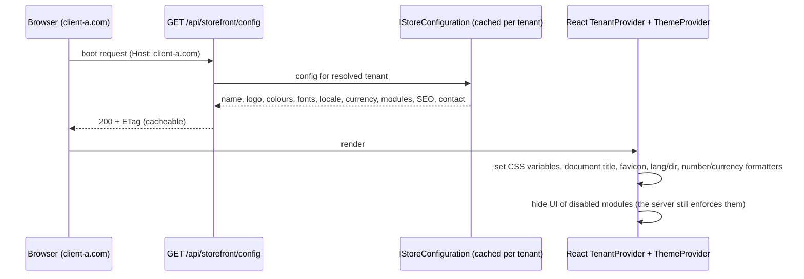

# Souq: White-Label Architecture

> **Status:** Target adopted 2026-09-11 ([ADR-0011](../11-ADR/0011-white-label-architecture.md)).
> - **Backend configuration: ✅ Phase 4** ([ADR-0024](../11-ADR/0024-platform-administration.md)).
>   - A validated settings model: per-language texts, WCAG-checked colours, preset fonts and themes, allowlisted social links.
>   - Branding uploads.
>   - Module flags.
>   - `GET /api/storefront/config` with an ETag.
>   - The default store seeded with today's Marka look.
> - **The frontend runtime arrives in Phase 15.** Until then the SPA still hard-codes the Marka brand, JOD and the four visitor-selectable palettes.

## 1. Principle

**One codebase + many tenants + per-tenant configuration.**

A new client never produces a new repository, branch, build, or `if (tenant == …)`. Everything that differs between stores is one of three things:
1. **data** (catalog, customers, orders),
2. **configuration** (branding, locale, contact, SEO, domains), or
3. **module flags** (which capabilities are on).

If a client asks for something none of those can express, it becomes a product feature available to every tenant, or it is declined.

## 2. What can be customized, and by whom

"Provision" means the platform owner sets it before handover. "Tenant" means the tenant admin can edit it afterwards.

| Setting | Provision (Platform) | After handover (Tenant Admin) | Validation / notes |
|---|---|---|---|
| Store name (per language) | ✅ | ✅ | 2–80 characters |
| Logo, favicon | ✅ | ✅ | Validated upload (PNG/WebP/JPEG; favicon PNG/ICO), tenant-prefixed storage |
| Colours: primary, secondary, accent, background | ✅ | ✅ | Hex. Derived shades are computed. **WCAG AA contrast is checked** against text colours, and inaccessible pairs are rejected. |
| Typography preset | ✅ | ✅ | Chosen from a curated list with Arabic and Latin pairs (e.g. Tajawal/Inter). No arbitrary font URLs. |
| Theme preset (layout variant) | ✅ | ✅ | From the preset registry (§4) |
| Currency | ✅ | ❌ | ISO-4217. **Locked after the first order**: changing currency mid-life breaks financial history. |
| Default language + enabled languages | ✅ | ✅ (the enabled subset) | `ar`, `en` today; more with translation tables (Phase 5) |
| Time zone | ✅ | ✅ | IANA id; used for display and reports. Storage stays UTC. |
| Contact: email, phone, address | ✅ | ✅ | Shown in the footer and emails |
| Social links | ✅ | ✅ | An allowlist of networks; `https` URLs only |
| SEO: title template, description, OG image | ✅ | ✅ | Length limits; per language |
| Domains (custom, subdomain) | ✅ | ❌ (can request) | Unique globally; DNS verification; one primary |
| Enabled modules | ✅ (within the plan) | ❌ | Enforced server-side ([MultiTenancy.md](../02-ARCHITECTURE/MultiTenancy.md), D-11) |
| Plan and limits | ✅ | ❌ | Later (subscriptions) |
| Email sender identity and templates | ✅ | ✅ (template text) | Sender domain needs SPF/DKIM verification (Phase 14/23) |

**Why this split:** the platform owner controls what affects **contracts, billing, legal identity, and the platform's integrity** (domains, currency, modules, plan). The tenant controls **presentation and content**, which is their day-to-day business.

## 3. Runtime architecture

- **The config endpoint is public and resolved from the host.** It returns only presentation data: no secrets, no internal ids beyond what the UI needs. It is cached in memory per tenant and invalidated when settings change, and the ETag lets browsers revalidate cheaply.
- **Semantic design tokens** (✅ Phase 15, [ADR-0035](../11-ADR/0035-white-label-runtime.md)):
  - Components use only these tokens:
    - `--color-primary`, `--color-secondary`, `--color-accent`;
    - `--color-bg`, `--color-surface`, `--color-text`, `--color-text-muted`, `--color-border`;
    - `--font-display`, `--font-body`, `--radius`, and so on.
  - The runtime theme provider (`app/storeTheme.js`) writes them onto `<html>` from the config.
  - It derives the strong, soft and "on" variants so that text stays readable.
  - The brand-named tokens were renamed to the semantic ones across all components.
- **Formatting** (✅ Phase 15): prices use `Intl.NumberFormat(locale, { style: 'currency', currency })` with the currency's minor units. The hard-coded `JOD`/3-decimal logic is gone.
- **SEO:**
  - The SPA sets the title and meta tags at runtime.
  - For crawlers and link previews, the web server injects the tenant's `<title>`, description, and OG tags into `index.html` per host (a tiny server-side step, Phase 16).
  - Full SSR is not planned. Revisit if organic search becomes the main acquisition channel.
- **Emails** use the tenant's name, logo, colours, and sender identity, through per-tenant, per-language templates (Phase 14).

## 4. Theme presets (layout variations without forks)

- A **preset** is a named, versioned bundle of token defaults plus layout switches. Examples: `classic` (today's Marka look), `minimal`, `bold`.
- Switches include: header style, product-card style, home-page section order.
- A tenant picks one (`branding.themePreset`, validated by the server). Since Phase 15 the SPA exposes it as `data-preset` on `<html>`. The layout switches per preset arrive with the storefront rebuild (Phase 16).
- A new preset is a product feature available to everyone, never a per-client branch.
- Custom CSS injection is **not** offered: it breaks upgrades and invites XSS. Revisit only with sandboxing and a paid tier.

## 5. What is deliberately not customizable

- Business rules beyond the provided settings: checkout steps, order state machine, tax logic. They change for everyone, via the roadmap.
- Arbitrary scripts, CSS, or HTML.
- The data model (no per-tenant columns). Extra product attributes use the generic attribute model (Phase 5).

## 6. Migration from today

1. ✅ **Phase 4:** create the settings model and seed tenant #1 "Marka Demo" with today's exact look (petrol/saffron, Reem Kufi/Tajawal/Inter as preset `kufi-tajawal`, footer contact, announcement text). Marka stops being the product and becomes a tenant.
2. ✅ **Phase 15** ([ADR-0035](../11-ADR/0035-white-label-runtime.md)):
   - The brand references and the hard-coded `JOD` are removed from the frontend, `index.html` and the committed backend configuration.
   - Tenant branding replaces the visitor theme switcher.
   - The four old palettes aren't offered to visitors anymore. Selectable colour presets belong in the branding editor (Phases 17–18); until then a store's colours are set through the settings API.
3. **Phase 16:** per-host `index.html` head injection for SEO.
4. **Done when** the same build shows two differently branded stores, and a search of the source finds no brand or currency literals. ✅ Met in Phase 15, and enforced by tests:
   - `frontend/src/whiteLabel.test.js` checks the frontend source.
   - `WhiteLabelSourceTests` checks the backend code and committed `appsettings*`.
   - `tenantModel.test.js` renders two stores.

   A CI pipeline will run these checks once one exists.
