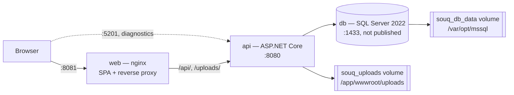

# Deployment

> What exists today to run Souq, what happens when the API starts, what one instance assumes, and what must be true before real customers use it.
> Settings: [Configuration.md](Configuration.md) · Failures: [Troubleshooting.md](Troubleshooting.md) · Local work: [DevelopmentGuide.md](DevelopmentGuide.md) · Scaling: [ScalingStrategy.md](ScalingStrategy.md).
>
> There is no CI/CD pipeline, no staging definition, no infrastructure-as-code and no deployment script in this repository. The only deployment artefact is `docker-compose.yml` with two Dockerfiles. Everything beyond that is **PLANNED** for Phase 23 in [ProductRoadmap.md](../12-ROADMAP/ProductRoadmap.md).

## 1. Current topology

`docker-compose.yml` at the repository root builds and runs three services on the default compose network (no networks are declared, so all three share one bridge and reach each other by service name).



| Service | Image / build | Ports | Volumes | Depends on |
|---|---|---|---|---|
| `db` | mcr.microsoft.com/mssql/server:2022-latest, forced to `linux/amd64` | none published (deliberately isolated from any SQL Server already on the host) | `souq_db_data` → `/var/opt/mssql` | — |
| `api` | built from `src/Souq.API/Dockerfile` (SDK 10.0 build stage → aspnet 10.0 runtime), listens on 8080 | `5201:8080`, for direct diagnostics | `souq_uploads` → `/app/wwwroot/uploads` | `db`, condition `service_healthy` |
| `web` | built from `frontend/Dockerfile` (node:20-alpine build → nginx:1.27-alpine runtime) | `8081:80` | — | `api` (start only — no health condition, because the API has no health check) |

Health: only `db` has one (`sqlcmd … SELECT 1`, every 10 s, 10 retries, 25 s start period). It is what makes the API wait for a usable database.

**The API image.** Multi-stage: `csproj` files are copied and restored first so a code change does not re-download packages; the runtime stage carries no SDK and no sources. `ASPNETCORE_HTTP_PORTS=8080` is set explicitly. No `USER` instruction, so the container runs as root.

**The web image and nginx** (`frontend/nginx.conf`):

| Location | Behaviour |
|---|---|
| `/api/` | proxied to `http://api:8080/api/` with `Host: $http_host` (the browser's host, including port — this is what makes host-based tenant resolution and email links work), `X-Forwarded-For`, `X-Forwarded-Proto: $scheme`, and `client_max_body_size 55m` to match the API's largest upload limit |
| `/uploads/` | proxied to `http://api:8080/uploads/` — **with no `Host` header override**, so nginx sends `Host: api:8080`. See the risks in §10 |
| `/` | `try_files $uri /index.html` for the SPA |

nginx terminates plain http on port 80 only. TLS, HSTS and security headers are not configured anywhere in this repository ([Security.md](../07-SECURITY/Security.md) §4 states TLS is expected at a reverse proxy; automated TLS for custom domains is **PLANNED** for Phase 23).

Running it: copy `.env.example` to `.env`, fill it in, then `docker compose up --build`. The stack runs as `Production`, which is why the payment and email fail-fast rules apply — see [Configuration.md](Configuration.md).

## 2. What happens when the API starts

Order matters: nothing touches the database until the configuration is proven good.

1. **Service registration** — `AddApplication()` then `AddInfrastructure(configuration, environment)`. Three decisions are made here and can already fail the start: the connection string must exist, a payment gateway must be selectable, an email provider must be selectable (or explicitly waived). Registration also records the chosen adapters and any operational warnings in `InfrastructureStartupReport`.
2. **`builder.Build()`**.
3. **Fail-fast validation** — `Program.cs` runs the options startup validator immediately: `Jwt`, `Stripe` (when Stripe is selected), `Secrets`, `Storage`, `Inventory`, `Basket`, `Notifications`. Messages name the key and never print its value.
4. **Startup report to the log** — one `Adapters selected: payments …, email …` line, then one `Configuration warning: …` line per warning. Read these first on any deployment; they are the cheapest confirmation that the stack is wired the way you think.
5. **Migrations and seeding** — `DbSeeder.SeedAsync`:
   - `Database.MigrateAsync()` applies every pending migration in `src/Souq.Infrastructure/Migrations`;
   - hosts listed in `Seed:DefaultTenantHosts` are bound to the default store, unless already bound to some store;
   - the default store's look is applied **once**, only if its settings were never customised;
   - the platform owner is seeded (platform scope), then the default store's demo catalog (only when it has no categories) and its first admin.
   
   A weak seed password throws here — after the schema has already been migrated.
6. **Pipeline** (order is load-bearing): forwarded headers → correlation header → exception handler → status-code pages → Swagger (Development only) → **tenant resolution** → `/uploads` static files (the directory is created if missing) → routing → **tenant availability** (platform/store host, store status, module flags) → rate limiter → CORS → authentication → request logging → authorization → controllers.
7. **Hosted services start** and begin their first cycle.

Consequences to keep in mind:

- **Migrations run at application startup, not as a deployment step.** Moving them to a migration bundle is **PLANNED** for Phase 23, explicitly so replicas do not race ([DatabaseDesign.md](../06-DATABASE/DatabaseDesign.md) §10).
- **Seeding runs on every start** and is idempotent, but it is not environment-gated: a fresh production database also gets the demo store's catalog and the demo look (`DbSeeder` seeds the default store's categories, products, inventory and contact details). Decide deliberately whether to keep, edit or archive that store.
- Swagger is Development-only, so the compose stack on port 5201 serves the API but **no** Swagger UI, despite the comment in `docker-compose.yml` and the table in the root `README.md`.

## 3. Background services

All three live in `src/Souq.Infrastructure/BackgroundJobs` and run inside every API process (decision D-15: .NET hosted services, no Hangfire until scheduling needs grow).

| Service | Cadence | Work | Needs |
|---|---|---|---|
| `ReservationExpiryService` | `Inventory:SweepIntervalSeconds` (default 60 s, `0` disables) | sends `ExpireStaleCheckoutsCommand` inside each **active** store's scope: settles expired checkout reservations, asking the gateway to cancel the intent first | database, payment gateway |
| `BasketCleanupService` | `Basket:CleanupIntervalMinutes` (default 60 min, `0` disables) | sends `PurgeExpiredBasketsCommand` per active store | database |
| `OutboxDispatcherService` | `Notifications:DispatchIntervalSeconds` (default 5 s, `0` disables) | processes due outbox messages in batches of 50, and once an hour purges processed rows older than `Notifications:RetentionDays` | database, email provider |

The two sweeps share `StoreSweepService`: each cycle lists active stores and runs the work inside each store's scope, so the tenant filter and write guard apply exactly as in an HTTP request. A failure is logged per store and never stops the loop or the host.

**One instance versus several**

| Service | Two instances | Why |
|---|---|---|
| `OutboxDispatcherService` | safe | each row is claimed with a conditional update and a two-minute lease (`LockedUntil`), and a crashed worker's lease expires. Delivery is at-least-once |
| `ReservationExpiryService`, `BasketCleanupService` | safe but wasteful | the commands are idempotent; both instances simply do the same walk. A distributed lock is **PLANNED** for Phase 23 |

If you do run several instances, the supported lever today is configuration: set the intervals to `0` on all but one instance so only that one sweeps and dispatches.

## 4. Per-instance state

Nothing is shared between processes except the database. Anything below is per instance and matters the moment there is more than one.

| State | Lifetime | Effect of a second instance |
|---|---|---|
| `TenantDirectoryCache` (host → store, store config) | 60 s for hits, 15 s for misses, plus explicit invalidation | a store change (suspend, domain, modules) applies instantly on the instance that made it and within ~60 s elsewhere |
| `SessionStampCache` | 30 s | a disabled account or a password change can still be accepted by another instance for up to 30 s |
| Rate-limiter windows | in memory | effective limits multiply by the number of instances |
| `FakeGatewayLedger` (fake gateway only) | process lifetime | refund idempotency is per process; irrelevant with Stripe |
| Uploaded files | local disk | see §7 |

## 5. Logging and correlation

- **Format:** console. `Production` uses the JSON formatter with scopes and UTC timestamps (`appsettings.Production.json`); other environments log text. In Docker: `docker compose logs -f api`. Nothing ships logs anywhere — no aggregation, no metrics, no traces, no alerts. OpenTelemetry is **PLANNED** for Phase 23 ([ADR-0018](../11-ADR/0018-observability.md)).
- **One line per request** from `RequestLoggingMiddleware`: method, path without the query string, status, duration, route template. 5xx logs at Error, a client abort is recorded as 499.
- **Correlation:** `CorrelationHeaderMiddleware` puts the request's W3C trace id in `X-Correlation-Id` on **every** response, including errors, and the same value appears as `traceId` in every ProblemDetails body and in the `CorrelationId` log scope. Incoming client-chosen ids are not accepted; an incoming `traceparent` is honoured by the framework.
- **Scopes** carried into every log line inside a request: `CorrelationId`, `TenantId` (or `Area=Platform`), `UserId`, and the use-case name from the MediatR behavior. A use case slower than `UseCaseLoggingBehavior.SlowThreshold` (500 ms) logs a warning.
- **Never logged:** bodies, query strings, headers, tokens, reset links, card data. Emails are masked in adapter logs.

Support flow: ask for the `X-Correlation-Id` (or the `traceId` in the error body), then `docker compose logs api | grep <id>`.

## 6. Health checks

**There are none in the API.** No health-check services are registered and no health endpoint is mapped (verified by searching the source). `web` therefore waits only for the API container to *start*, not to be ready, and no orchestrator can currently tell a live instance from a wedged one. Health checks are **PLANNED** for Phase 23.

Closest usable smoke check today, for a store host you know:

```bash
curl -i -H "Host: localhost" http://localhost:5201/api/storefront/config
```

200 means the pipeline, tenant resolution and (unless the answer came from the 60-second tenant cache) the database are working. Treat it as a smoke test, not as a liveness probe.

## 7. File storage

`LocalFileStorage` writes to `{Storage:Local:RootPath}/tenants/{tenantId}/{folder}/{guid}{ext}` and returns `/uploads/tenants/{tenantId}/…`. The API serves that folder read-only with an allow-list of media types, `nosniff` and a sandboxing CSP, and `TenantResolutionMiddleware` refuses to serve one store's files on another store's host.

Implications:

- **Files are local to the instance.** Several API instances need the same volume (shared mount) or the files will 404 depending on which instance answers. Cloud blob storage behind the same `IFileStorage` port is **PLANNED** for Phase 23 (decision D-18).
- In compose the data lives in the `souq_uploads` volume. **It is not in the database**, so a database backup alone loses every product image and branding asset.
- Removing an image from a product gallery does not delete the file yet ([Security.md](../07-SECURITY/Security.md) §5), so the volume grows monotonically.

## 8. Production checklist

Every item is verifiable before you let customers in. "Log" means the API's startup output (`docker compose logs api | head -40`).

**Environment and secrets**

- [ ] `ASPNETCORE_ENVIRONMENT` is `Production`: `docker compose exec api printenv ASPNETCORE_ENVIRONMENT`.
- [ ] `.env` exists, is not committed (`git check-ignore .env`), and every value is unique to this environment.
- [ ] `JWT_KEY` is ≥ 32 bytes of fresh randomness (`openssl rand -base64 48`) and is not reused from another environment. A short key fails the start by design.
- [ ] `DB_SA_PASSWORD` is strong. **Known weakness:** compose connects the app as `sa`; a least-privilege SQL login requires editing the `ConnectionStrings__Default` line.
- [ ] No secret appears in `src/Souq.API/appsettings.json` or `src/Souq.API/appsettings.Production.json` (both ship empty secret values; keep it that way).

**Payments**

- [ ] Log says `payments Stripe`, not `payments Fake`. `PAYMENTS_PROVIDER=Fake` marks every order paid without money.
- [ ] `STRIPE_SECRET_KEY` and `STRIPE_PUBLISHABLE_KEY` are live keys; the publishable key is served by `GET /api/payments/config`.
- [ ] `STRIPE_WEBHOOK_SECRET` is set — otherwise the log carries the "confirmation depends on the customer's browser" warning and a closed tab leaves an order pending.
- [ ] The Stripe dashboard's webhook endpoint points at a **store host** of this deployment, `POST /api/payments/webhook` over https. Events for other stores of the same deployment account are routed internally to the named store; an event signed by a store's own account is never applied to another store.
- [ ] `PAYMENTS_ALLOW_TEST_MODE_STORE_ACCOUNTS` is unset or `false` (no warning line in the log).
- [ ] If any store prices in JOD: the P-05 question is settled with Stripe (×100 versus ×1000) before the first live charge.

**Per-store payment keys**

- [ ] `SECRETS_KEY` is set (base64 of 32 bytes) if stores will connect their own Stripe accounts, and it is backed up somewhere other than the server — losing it makes every stored store key undecryptable.
- [ ] It is not changed in place; rotation follows [Configuration.md](Configuration.md) §10.

**Email**

- [ ] Log says `email Resend`, `email Brevo` or `email Gmail` — never `email Log` in production.
- [ ] Exactly one provider key is set, and the `GMAIL_APP_PASSWORD` placeholder from `.env.example` has been cleared if Gmail is not the provider.
- [ ] The sender address is real and verified for the provider's domain (`BREVO_SENDER_EMAIL` / `GMAIL_USERNAME`; for Resend, `Resend:From` must be added to `docker-compose.yml` — compose does not expose it and the default is Resend's shared test sender).
- [ ] A real password reset arrives, and the outbox row shows `ProcessedAt` set (§9 shows the query).

**Accounts and bootstrap**

- [ ] `SEED_ADMIN_EMAIL` / `SEED_ADMIN_PASSWORD` (≥ 12 characters) and `SEED_PLATFORM_OWNER_EMAIL` / `SEED_PLATFORM_OWNER_PASSWORD` set for the first start only.
- [ ] Both accounts sign in successfully.
- [ ] The four variables are then **removed from `.env`** and the stack restarted. Seeding never rewrites an existing account's password, so the accounts survive; the "No … account seeded" warnings that then appear on every start are expected.
- [ ] The demo default store (slug `marka`, seeded catalog and demo contact details) is either adopted as a real store, cleaned up, or archived through `POST /api/platform/tenants/{id}/status` with `{"action":"Archive"}`.

**Hosts, TLS and proxying**

- [ ] TLS terminates in front of the stack, and the API sees `https`. nginx sets `X-Forwarded-Proto $scheme` from **its own** listener (plain http on port 80), so an outer TLS terminator's header is overwritten and links in emails come out as `http://`. Verify by requesting a password reset and reading the link scheme; fix by terminating TLS in this nginx or by passing the outer header through.
- [ ] `TRUSTED_PROXY_NETWORKS` covers the proxy network and nothing else (never `0.0.0.0/0`).
- [ ] The `5201:8080` port mapping is removed for a public deployment; a client that reaches the API directly is seen from the Docker bridge, which lies inside the default trusted range, and could then forge `X-Forwarded-For` to bypass rate limits.
- [ ] `PLATFORM_HOST` is the real platform domain and resolves to this deployment; the platform owner can sign in there and store endpoints answer 404 there.
- [ ] Every store domain is added through the platform API (`POST /api/platform/tenants/{id}/domains`, then `…/domains/{host}/primary`), and DNS points at the deployment. `DEFAULT_TENANT_HOSTS` is only for the default store and defaults to `localhost`.
- [ ] `FRONTEND_URL` is the public origin of the storefront (its scheme and port are used for links in messages that have no request behind them).
- [ ] `Auth:RefreshCookie:Secure` stays at its default `true` for an https deployment (and is only ever lowered for a local http host — compose does not expose it).

**Data**

- [ ] A database backup exists and a restore has been rehearsed (§9 — today nothing is automated).
- [ ] The `souq_uploads` volume is part of the same backup.
- [ ] SQL Server has at least 2 GB of memory available in the Docker VM or host.

## 9. Backups and restore

**CURRENT: nothing is automated.** There is no backup job, no retention policy and no rehearsed restore in this repository. Backups plus a restore drill are **PLANNED** for Phase 23, and the roadmap's risk R4 already asks for a backup before each migration phase.

What must be captured together, or a restore is incomplete:

| Asset | Where | Note |
|---|---|---|
| `SouqDb` database | `souq_db_data` volume | orders, tenants, users, outbox, encrypted store payment keys |
| Uploaded media | `souq_uploads` volume | product images and branding; not in the database |
| Secrets | `.env` / the environment | `JWT_KEY`, `SECRETS_KEY`, DB password, provider keys. `SECRETS_KEY` is unrecoverable: without it, stored store payment keys are permanently unreadable |

Manual procedure (standard SQL Server commands, **not scripted here and not rehearsed** — test it on a copy first):

```bash
# 1. Database backup inside the db container, then copy it out
docker compose exec db sh -c '/opt/mssql-tools18/bin/sqlcmd -S localhost -U sa -P "$MSSQL_SA_PASSWORD" -C \
  -Q "BACKUP DATABASE [SouqDb] TO DISK = N'"'"'/var/opt/mssql/data/SouqDb.bak'"'"' WITH INIT, COMPRESSION"'
docker compose cp db:/var/opt/mssql/data/SouqDb.bak ./SouqDb.bak

# 2. Uploaded media
docker compose cp api:/app/wwwroot/uploads ./uploads-backup
```

Restore, in this order: stop `api` (so migrations and background jobs cannot write during the restore) → copy the `.bak` back into the db container and `RESTORE DATABASE [SouqDb] … WITH REPLACE` → copy the uploads back → start `api`, which will apply any migrations the restored database is missing. Check the startup log for the adapters line and for migration errors.

## 10. Known risks in the current stack

Read from the code; none of these were reproduced by running the stack.

| Risk | Where | Impact |
|---|---|---|
| `/uploads/` is proxied without a `Host` header override, so the API sees `Host: api:8080` | `frontend/nginx.conf` | in Production that host maps to no store, so uploaded images and branding assets very likely answer `404 StoreNotFound` through nginx. Add `proxy_set_header Host $http_host;` to that location |
| `X-Forwarded-Proto` is set from nginx's own scheme | `frontend/nginx.conf` | behind an outer TLS terminator the API believes it is on http: email links, and any scheme-derived URL, come out as `http://` |
| The API port `5201` is published | `docker-compose.yml` | a direct client bypasses nginx and is seen from the Docker bridge range, which the default `TRUSTED_PROXY_NETWORKS` trusts, so `X-Forwarded-For` can be forged to evade rate limits |
| The app connects as `sa` | `docker-compose.yml` | full server privileges for the application; a SQL injection or a leaked connection string is unbounded |
| The API container runs as root | `src/Souq.API/Dockerfile` | no `USER` instruction; a container escape starts from root |
| Floating image tags (`2022-latest`, `sdk:10.0`, `aspnet:10.0`, `nginx:1.27-alpine`, `node:20-alpine`) | both Dockerfiles and compose | two deployments from the same commit can differ |
| Demo data in production | `DbSeeder` | a fresh production database is seeded with the demo store's catalog, colours and contact details (`support@marka.example`) |
| `.env.example` ships a non-empty `GMAIL_APP_PASSWORD` placeholder | `.env.example` | defeats the "no email provider" fail-fast; messages die in the outbox instead of stopping the start |
| No health check, no HSTS or security headers, no TLS in the repository | — | Phases 20 and 23 |

## 11. Rollback

- **Schema.** Migrations are applied by the application at startup, so deploying an older image does **not** roll the schema back: `Migrate` only moves forward. An older image keeps working only if every newer migration was additive. Reverting a data-reshaping migration is not rehearsed — `MigrationRehearsalTests` shows that migrations drop columns after moving their data (for example the pre-Phase-5 product columns and the credentials that moved out of `Customers`), so a `Down()` cannot restore that data even though every migration has one.
- **Preferred rollback:** restore the database backup taken before the deployment, then deploy the matching image.
- **If you must step the schema back** (with a backup in hand):

  ```bash
  dotnet ef migrations script <FromMigration> <ToMigration> \
    --project src/Souq.Infrastructure --startup-project src/Souq.API   # review first
  dotnet ef database update <ToMigration> \
    --project src/Souq.Infrastructure --startup-project src/Souq.API
  ```

- **Levers that need no deployment at all**, and are the right first response to a broken feature:

  | Lever | Call | Effect |
  |---|---|---|
  | Turn an optional module off for one store | `PUT /api/platform/tenants/{id}/modules` (allowed values come from `StoreModules`: `promotions`, `reviews`, `wishlist`) | its endpoints answer `404 ModuleDisabled` and the storefront hides it |
  | Close one store | `POST /api/platform/tenants/{id}/status` with `{"action":"Suspend"}` | everything but the storefront-config endpoint answers `503 StoreUnavailable`, so the SPA shows the closed screen |
  | Stop a background sweep | set its interval to `0` and restart | see §3 |

  Both API levers take effect immediately on the instance that served them and within about 60 seconds elsewhere (the tenant directory cache).

## 12. Planned and future work

| Item | Status | Source |
|---|---|---|
| CI/CD and defined environments | **PLANNED** Phase 23 | roadmap |
| Migrations as a deployment step (migration bundle) instead of at startup | **PLANNED** Phase 23 | roadmap, [DatabaseDesign.md](../06-DATABASE/DatabaseDesign.md) §10 |
| Backups plus a restore drill | **PLANNED** Phase 23 | roadmap |
| Health checks | **PLANNED** Phase 23 | roadmap |
| Metrics, traces, alerting (OpenTelemetry over the existing trace ids) | **PLANNED** Phase 23 | [ADR-0018](../11-ADR/0018-observability.md) |
| Automated TLS for custom domains, and DNS/TLS domain verification | **PLANNED** Phase 23 | roadmap, risk R7 |
| Per-store sending domains with SPF/DKIM | **PLANNED** Phase 23 | [ADR-0034](../11-ADR/0034-notifications-outbox.md), risk R9 |
| Cloud blob storage for uploads | **PLANNED** Phase 23 (decision D-18) | roadmap |
| Distributed lock for the per-store sweeps | **PLANNED** Phase 23 | `StoreSweepService`, roadmap Phase 6 |
| Managed secret store and key rotation | **PLANNED** Phases 20 and 23 | [ADR-0020](../11-ADR/0020-configuration-and-secrets.md) |
| Security headers, CSP, HSTS | **PLANNED** Phase 20 | [Security.md](../07-SECURITY/Security.md) §4 |
| Response compression, CDN, image optimization | **PLANNED** Phase 21 | roadmap |
| Operator screen for dead outbox messages | **PLANNED** Phase 17 or 23 | [ADR-0034](../11-ADR/0034-notifications-outbox.md) |
| Data-retention policy and incident runbook | **PLANNED** Phase 23 | roadmap |
| Non-root container user, pinned image digests, least-privilege SQL login | **FUTURE** — not scheduled by any phase | this document, §10 |
