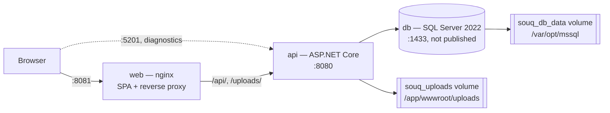

# Deployment

> What exists today to run Souq, what happens when the API starts, what one instance assumes, and what must be true before real customers use it.
> Settings: [Configuration.md](Configuration.md) · Failures: [Troubleshooting.md](Troubleshooting.md) · Local work: [DevelopmentGuide.md](DevelopmentGuide.md) · Scaling: [ScalingStrategy.md](ScalingStrategy.md).
>
> What exists: `docker-compose.yml` with two Dockerfiles; a CI pipeline, [`.github/workflows/ci.yml`](../../.github/workflows/ci.yml), which builds and tests but **does not deploy** (and does not block a merge until branch protection is switched on — [OwnerDecisions.md](OwnerDecisions.md), "Branch protection"); and operational scripts in `scripts/` — `scripts/release-gate.sh`, `scripts/smoke-test.sh`, `scripts/backup.sh`, `scripts/backup-verify.sh`, `scripts/restore.sh`, `scripts/rehearse-restore.sh`, `scripts/audit-config.sh` and `scripts/verify-least-privilege.sh` ([scripts/README.md](../../scripts/README.md)). Since M18 there is also a release pipeline, [`.github/workflows/release.yml`](../../.github/workflows/release.yml), and `scripts/deploy.sh` — a tagged release builds versioned images and a migration bundle, and the deploy script verifies readiness and rolls back (§13). **What still does not exist: a server.** The pipeline's SSH deploy step has never executed, and neither has the pipeline itself — GitHub Actions has refused to start every job since before M13 for billing reasons, which is an owner action ([OwnerDecisions.md](OwnerDecisions.md)). Until it is resolved, `scripts/ci-local.sh` runs CI's fast job on Linux from a development machine.

## 1. Current topology

`docker-compose.yml` at the repository root builds and runs three services on the default compose network (no networks are declared, so all three share one bridge and reach each other by service name).



| Service | Image / build | Ports | Volumes | Depends on |
|---|---|---|---|---|
| `db` | mcr.microsoft.com/mssql/server:2022-latest, forced to `linux/amd64` | none published (deliberately isolated from any SQL Server already on the host) | `souq_db_data` → `/var/opt/mssql` | — |
| `api` | built from `src/Souq.API/Dockerfile` (SDK 10.0 build stage → aspnet 10.0 runtime), listens on 8080 | `5201:8080`, for direct diagnostics | `souq_uploads` → `/app/wwwroot/uploads` | `db`, condition `service_healthy` |
| `web` | built from `frontend/Dockerfile` (node:22-alpine build → nginx:1.27-alpine runtime) | `8081:80` | — | `api`, condition `service_healthy` |

Health: `db` has one (`sqlcmd … SELECT 1`, every 10 s, 10 retries, 25 s start period), which makes the API wait for a usable database; `api` has one (§6), which makes `web` wait for an API that has finished migrating and can actually answer.

**The API image.** Multi-stage: `csproj` files are copied and restored first so a code change does not re-download packages; the runtime stage carries no SDK and no sources. `ASPNETCORE_HTTP_PORTS=8080` is set explicitly. A `HEALTHCHECK` runs the image's own binary with `--health-check` (§6). No `USER` instruction, so the container runs as root.

**The web image and nginx** (`frontend/nginx.conf`):

| Location | Behaviour |
|---|---|
| `/api/` | proxied to `http://api:8080/api/` with `Host: $http_host` (the browser's host, including port — this is what makes host-based tenant resolution and email links work), `X-Forwarded-For`, `X-Forwarded-Proto: $souq_forwarded_proto` (an incoming `http`/`https` value is kept, otherwise nginx's own scheme), and `client_max_body_size 55m` to match the API's largest upload limit |
| `/uploads/` | proxied to `http://api:8080/uploads/` with the same `Host`, `X-Forwarded-For` and `X-Forwarded-Proto` headers as `/api/` — tenant resolution runs on this path too, so the original host is what makes a store's media resolvable |
| `/` | `try_files $uri /index.html` for the SPA, with the SPA's security headers (`X-Content-Type-Options`, `Referrer-Policy`, `X-Frame-Options`, `Permissions-Policy`) and a `Content-Security-Policy-Report-Only` policy |

The access log uses the `souq_safe` format: query strings stripped, `/track/…` paths redacted, no `Referer`.

nginx terminates plain http on port 80 only. **TLS is not configured anywhere in this repository** ([Security.md](../07-SECURITY/Security.md) §4 states TLS is expected at a reverse proxy; automated TLS for custom domains is **PLANNED** for Phase 23). Security headers and HSTS do exist: the API sets its own on every response (`SecurityHeadersMiddleware`, and `UseHsts` outside Development, sent only on requests it sees as https), and nginx adds the SPA's on `/`. The SPA's CSP is report-only until one browser pass confirms it.

Running it: copy `.env.example` to `.env`, fill it in, then `docker compose up --build`. The stack runs as `Production`, which is why the payment and email fail-fast rules apply — see [Configuration.md](Configuration.md).

## 2. What happens when the API starts

Order matters: nothing touches the database until the configuration is proven good.

1. **Service registration** — `AddApplication()` then `AddInfrastructure(configuration, environment)`. Three decisions are made here and can already fail the start: the connection string must exist, a payment gateway must be selectable, an email provider must be selectable (or explicitly waived). Registration also records the chosen adapters and any operational warnings in `InfrastructureStartupReport`.
2. **`builder.Build()`**.
3. **Fail-fast validation** — `Program.cs` runs the options startup validator immediately: `Jwt`, `Stripe` (when Stripe is selected), `Secrets`, `Storage`, `Inventory`, `Basket`, `Notifications`. Messages name the key and never print its value.
4. **Startup report to the log** — one `Adapters selected: payments …, email …` line, then one `Configuration warning: …` line per warning. Read these first on any deployment; they are the cheapest confirmation that the stack is wired the way you think.
5. **Migrations and seeding** — `DbSeeder.SeedAsync`:
   - `Database.MigrateAsync()` applies every pending migration in `src/Souq.Infrastructure/Migrations`;
   - hosts listed in `Seed:DefaultTenantHosts` are bound to the default store, unless already bound to some store;
   - the default store's look is applied **once**, only if its settings were never customised;
   - the platform owner is seeded (platform scope), then the default store's demo catalog (only when it has no categories) and its first admin.
   
   A weak seed password throws here — after the schema has already been migrated.
6. **Pipeline** (order is load-bearing): forwarded headers → correlation header → exception handler → status-code pages → Swagger (Development only) → **tenant resolution** → `/uploads` static files (the directory is created if missing) → routing → **tenant availability** (platform/store host, store status, module flags) → rate limiter → CORS → authentication → request logging → authorization → controllers.
7. **Hosted services start** and begin their first cycle.

Consequences to keep in mind:

- **Migrations run at application startup by default, and since M17 that is an explicit choice.** `Database:MigrateOnStartup` must be set outside Development/Testing or the API refuses to start, naming both options. `true` keeps today's behaviour (correct for one instance, stopped and started). `false` means the API does not migrate and logs an error naming any pending migration instead of booting a version against a schema it does not match — run the bundle step first (`dotnet ef migrations bundle --self-contained`, then execute it as the migration identity). The order that makes it worth doing is **migrate, verify, roll out**; with startup migration those three are one event. See [Migrations.md](../06-DATABASE/Migrations.md) §2.
- **Seeding runs on every start** and is idempotent. Demo content is environment-gated: the default store's catalog and demo look are applied only when `Seed:DemoData` resolves true, which outside Development and Testing means asking for it explicitly (`DbSeeder.ShouldSeedDemoData`). A production database therefore starts with the default store row but no demo products; decide deliberately whether to adopt, rename or archive that store.
- Swagger is Development-only, so the compose stack on port 5201 serves the API but **no** Swagger UI, despite the comment on that port mapping in `docker-compose.yml`.

## 3. Background services

All three live in `src/Souq.Infrastructure/BackgroundJobs` and run inside every API process (decision D-15: .NET hosted services, no Hangfire until scheduling needs grow).

| Service | Cadence | Work | Needs |
|---|---|---|---|
| `ReservationExpiryService` | `Inventory:SweepIntervalSeconds` (default 60 s, `0` disables) | sends `ExpireStaleCheckoutsCommand` inside each **active** store's scope: settles expired checkout reservations, asking the gateway to cancel the intent first | database, payment gateway |
| `BasketCleanupService` | `Basket:CleanupIntervalMinutes` (default 60 min, `0` disables) | sends `PurgeExpiredBasketsCommand` per active store | database |
| `OutboxDispatcherService` | `Notifications:DispatchIntervalSeconds` (default 5 s, `0` disables) | processes due outbox messages in batches of 50, and once an hour purges processed rows older than `Notifications:RetentionDays` | database, email provider |

The two sweeps share `StoreSweepService`: each cycle lists active stores and runs the work inside each store's scope, so the tenant filter and write guard apply exactly as in an HTTP request. A failure is logged per store and never stops the loop or the host.

**One instance versus several**

| Service | Two instances | Why |
|---|---|---|
| `OutboxDispatcherService` | safe | each row is claimed with a conditional update and a two-minute lease (`LockedUntil`), and a crashed worker's lease expires. Delivery is at-least-once |
| `ReservationExpiryService`, `BasketCleanupService` | safe but wasteful | the commands are idempotent; both instances simply do the same walk. A distributed lock is **PLANNED** for Phase 23 |

If you do run several instances, the supported lever today is configuration: set the intervals to `0` on all but one instance so only that one sweeps and dispatches.

## 4. Per-instance state

Nothing is shared between processes except the database. Anything below is per instance and matters the moment there is more than one.

| State | Lifetime | Effect of a second instance |
|---|---|---|
| `TenantDirectoryCache` (host → store, store config) | 60 s for hits, 15 s for misses, plus explicit invalidation | a store change (suspend, domain, modules) applies instantly on the instance that made it and within ~60 s elsewhere |
| `SessionStampCache` | 30 s | a disabled account or a password change can still be accepted by another instance for up to 30 s |
| Rate-limiter windows | in memory | effective limits multiply by the number of instances |
| `FakeGatewayLedger` (fake gateway only) | process lifetime | refund idempotency is per process; irrelevant with Stripe |
| Uploaded files | local disk | see §7 |

## 5. Logging and correlation

- **Format:** console. `Production` uses the JSON formatter with scopes and UTC timestamps (`appsettings.Production.json`); other environments log text. In Docker: `docker compose logs -f api`. Nothing ships logs anywhere — no aggregation, no metrics, no traces, no alerts. OpenTelemetry is **PLANNED** for Phase 23 ([ADR-0018](../11-ADR/0018-observability.md)).
- **One line per request** from `RequestLoggingMiddleware`: method, path without the query string, status, duration, route template. 5xx logs at Error, a client abort is recorded as 499. **The status in the line is the status the client received**, including for rejections raised as exceptions and translated by `GlobalExceptionHandler` — a 403, 409 or 422 is logged as itself, at Information. Until 2026-09-19 they were all logged as 500 at Error, so a 5xx alert built on this line would have fired on ordinary traffic; if you have logs from before that commit, read their status field with that in mind.
- **Correlation:** `CorrelationHeaderMiddleware` puts the request's W3C trace id in `X-Correlation-Id` on **every** response, including errors, and the same value appears as `traceId` in every ProblemDetails body and in the `CorrelationId` log scope. Incoming client-chosen ids are not accepted; an incoming `traceparent` is honoured by the framework.
- **Scopes** carried into every log line inside a request: `CorrelationId`, `TenantId` (or `Area=Platform`), `UserId`, and the use-case name from the MediatR behavior. A use case slower than `UseCaseLoggingBehavior.SlowThreshold` (500 ms) logs a warning.
- **Never logged:** bodies, query strings, headers, tokens, reset links, card data. Emails are masked in adapter logs.

Support flow: ask for the `X-Correlation-Id` (or the `traceId` in the error body), then `docker compose logs api | grep <id>`.

## 6. Health checks

Two endpoints, with deliberately different meanings. Confusing them is the usual way a health check makes an
outage worse.

| Endpoint | Question | Checks | A failure means |
|---|---|---|---|
| `/health/live` | Is the process alive? | **none** | restart this container |
| `/health/ready` | Can this instance serve a real request? | `database` | stop sending it traffic — do **not** restart |

**Why liveness checks nothing.** If liveness touched the database, then one database hiccup would fail it on
every instance at once and the orchestrator would restart the whole API tier — turning a partial, self-healing
fault into a full outage. Liveness answers for the process and nothing else.

**What readiness actually checks.** `DatabaseHealthCheck` asks two questions, both cheap and neither of them
touching tenant data (so the check runs with no store in context, which is exactly the state a probe arrives in):

1. Can it connect to the database? If not → `Unhealthy`.
2. Are there pending migrations? If so → `Unhealthy`. Migrations are applied at startup (§2), so a pending
   migration after startup means the schema is older than the code — most plausibly **a restored backup that
   predates the deployed image**. Serving orders against a schema the code does not expect is worse than
   refusing traffic, so this is a hard failure, not a warning.

**They sit outside `/api`, before tenant resolution, on purpose.** A probe arrives on the container's own host
name, which is not a registered store domain, and `TenantResolutionMiddleware` answers 404 for unknown hosts —
but only on `/api` and `/uploads`. Health lives outside both, and is mapped before tenant resolution, rate
limiting and authentication, so a probe is never rate-limited and liveness still answers when the tenant
directory or the database is broken. `HealthCheckTests` pins this by asking the same unknown host for both
`/health/live` (200) and an `/api` route (404); if these endpoints ever move under `/api`, that test fails
instead of production.

**The response body is deliberately thin** — the overall status and each check's status by name, with no
description, exception or timing:

```json
{"status":"Unhealthy","checks":{"database":"Unhealthy"}}
```

The reason (unreachable vs. stale schema) goes to the log, not to an anonymous caller. These endpoints are
unauthenticated: **restrict them at the network edge**.

> **Probe the API, never the web container.** `frontend/nginx.conf` proxies only `/api/` and `/uploads/`;
> everything else falls through to `try_files $uri /index.html`. So `http://web/health/ready` returns the SPA's
> `index.html` with **200 OK** — a load balancer pointed there would report a permanently healthy stack no
> matter what the API is doing. Probe the API service directly (`http://api:8080/health/ready`, or
> `http://localhost:5201/health/ready` from the host).

**The container probe.** `mcr.microsoft.com/dotnet/aspnet:10.0` ships with neither `curl` nor `wget`, and
installing one would put a general-purpose HTTP client in the production image for the sake of a health check —
a ready-made tool for an attacker who gets a shell. Instead the image probes itself with the runtime it already
has:

```bash
dotnet Souq.API.dll --health-check    # exit 0 = ready, 1 = not
```

That path runs before any service is built — no configuration, no database, no secrets — and just asks this
instance for `/health/ready`. It is wired as `HEALTHCHECK` in `src/Souq.API/Dockerfile` (every 30 s, 10 s
timeout, 3 retries, 90 s start period — generous because migrations and seeding run before the first answer),
which is what lets `web` wait on `condition: service_healthy` instead of merely on the API container starting.

Check it from the host:

```bash
curl -fsS http://localhost:5201/health/ready && echo READY
docker compose ps          # the api service shows (healthy) once it is
```

**Verified, not just written** (2026-09-14, on a throwaway compose project with its own volumes, never against
the real `souq_db_data`): `web` was observed waiting — compose reported `api Waiting → Healthy` before
`web Starting`. The first probe failed while migrations ran and the second passed 5 s later, inside the start
period, so the container reached healthy with a failing streak of 0. On the API port, `/health/live` returned
`{"status":"Healthy","checks":{}}` and `/health/ready` returned `{"status":"Healthy","checks":{"database":"Healthy"}}`
with `Cache-Control: no-store`; on a host name with no store, `/health/live` answered 200 while
`/api/storefront/config` answered 404. Through nginx on 8081 the same path returned **200 `text/html`** — the
SPA, confirming the warning above. `dotnet Souq.API.dll --health-check` inside the container exited 0.

### The monitoring contract

What an orchestrator or monitor should do with each answer. **Drilled on a running stack**, not inferred:

| Observed | Meaning | Correct response |
|---|---|---|
| `live` 200, `ready` 200 | serving normally | nothing |
| `live` 200, `ready` **503** | the process is fine, a dependency is not | **remove from the load balancer, do not restart** |
| `live` 200, `ready` 503 for a long time | the dependency is not coming back | page a human; restarting the API changes nothing |
| **neither answers** | the process never started, or died | this is the restart/crash-loop case (§3 of [IncidentResponse.md](IncidentResponse.md)) |

**Measured, with the database stopped under a running API:** `live` stayed 200, `ready` returned 503 with
`{"status":"Unhealthy","checks":{"database":"Unhealthy"}}`, and real requests returned 500. When the database
came back, readiness returned to 200 in about 11 seconds **with zero container restarts**. That is the whole
argument for separating the two: a liveness probe that touched the database would have restarted every
instance during a blip that healed itself.

**One asymmetry worth knowing before it confuses you.** The database being unavailable produces *two different
shapes* depending on when:

- **After startup** — the graceful case above: live 200, ready 503, self-healing.
- **At startup** — migrations and seeding run before the first request is served, so the process fails there and
  **no endpoint answers at all**. The only signal is the startup exception in the log, and the container's
  `HEALTHCHECK` marks it unhealthy once the start period expires. An orchestrator sees a failing container, not
  a 503 — which is correct, because an instance that never migrated must not take traffic.

**Deliberately not health checks:** the payment gateway and the email provider. Their outage must not remove a
store from the load balancer — customers can still browse, and the outbox holds what cannot be sent. Readiness
answers "can this instance serve a request", not "is every downstream service well". Adding them would
manufacture an outage from a supplier's bad afternoon.

**What is still missing:** nothing outside the stack polls these endpoints or alerts a human (R-20). The
endpoints and their contract are the mechanism; the monitor is a deployment action.

## 6a. The first-deployment smoke test

```bash
./scripts/smoke-test.sh --base-url https://yourstore.example --api-url http://api-host:8080 \
                        --store-host yourstore.example --compose-project souq
```

Thirty-one automated checks, in a deliberate order: the ones that write nothing first (liveness, readiness,
tenant resolution, an unknown host getting 404 while liveness on that same host still answers), then a real
customer registration, basket and order tagged with a unique run id, then the proxy's own behaviour, and
finally a search of the logs for what the run itself just created.

It **fails the deployment** rather than reporting politely: any failed check exits non-zero with "do not open
the store". Verified in both directions — a healthy stack passes 31 checks, and with the API stopped it still
runs every check, reports 17 failures and refuses.

Three things it deliberately will not do:

- **It never fakes a successful payment.** If a real gateway is configured it says so and stops at order
  creation, because completing a payment needs a real test card on the real account. A smoke test that fakes
  the money path lies in exactly the situation it exists for.
- **It does not assert email delivery.** It reads which adapter the API actually selected from the startup log
  and tells you whether anything can arrive at all.
- **It does not take or restore a backup.** It confirms the database container is reachable for
  `scripts/backup.sh` and points at `scripts/rehearse-restore.sh`, which is a separate deliberate act.

The checks marked **◆** in its output are the ones no script can close — a real payment, a real email, and the
restore rehearsal.

## 7. File storage

`LocalFileStorage` writes to `{Storage:Local:RootPath}/tenants/{tenantId}/{folder}/{guid}{ext}` and returns `/uploads/tenants/{tenantId}/…`. The API serves that folder read-only with an allow-list of media types, `nosniff` and a sandboxing CSP, and `TenantResolutionMiddleware` refuses to serve one store's files on another store's host.

Implications:

- **Files are local to the instance.** Several API instances need the same volume (shared mount) or the files will 404 depending on which instance answers. Cloud blob storage behind the same `IFileStorage` port is **PLANNED** for Phase 23 (decision D-18).
- In compose the data lives in the `souq_uploads` volume. **It is not in the database**, so a database backup alone loses every product image and branding asset.
- Removing an image from a product gallery does not delete the file yet ([Security.md](../07-SECURITY/Security.md) §5), so the volume grows monotonically.

## 8. Production checklist

The checklist lives in one place: **[ProductionReleaseChecklist.md](ProductionReleaseChecklist.md)** — environment and secrets, database identities, payments, email, accounts, hosts and TLS, uploads, logging, monitoring, backups and sign-off, each item verifiable. `scripts/release-gate.sh` executes the parts that can be executed. An earlier copy kept here had drifted from it and was removed.

## 9. Backups and restore

Full contract, runbook and the recorded restore drill: **[BackupAndRestore.md](BackupAndRestore.md)**. In short:

| | |
|---|---|
| Mechanism | `scripts/backup.sh`, `scripts/restore.sh`, `scripts/rehearse-restore.sh` — provider-neutral, rehearsed |
| Captures | the `SouqDb` database **and** the uploads volume as one dated set, with a manifest and SHA-256 sums |
| Never captures | secrets — deliberately, so a leaked backup is not also a leaked key ([BackupAndRestore.md](BackupAndRestore.md) §3) |
| Proven | a set was restored onto a clean server after its source stack was destroyed, and the API served traffic from it |
| **Still missing** | the off-site copy, the schedule, and alerting on failure — all deployment-specific (§7 there). R-19 stays open until they exist |

A database backup alone is an incomplete restore: product images and branding live in `souq_uploads`, and
`SECRETS_KEY` is unrecoverable — without it every stored store payment key stays permanently unreadable.

## 10. Known risks in the current stack

Read from the code; none of these were reproduced by running the stack.

| Risk | Where | Impact |
|---|---|---|
| ~~`X-Forwarded-Proto` is set from nginx's own scheme~~ **fixed** | `frontend/nginx.conf` | nginx now preserves an incoming `X-Forwarded-Proto` and falls back to its own scheme. If nginx is itself the internet-facing edge, drop that `map` — see [Security.md](../07-SECURITY/Security.md) §4 |
| The API port `5201` is published | `docker-compose.yml` | a direct client bypasses nginx and is seen from the Docker bridge range, which the default `TRUSTED_PROXY_NETWORKS` trusts, so `X-Forwarded-For` can be forged to evade rate limits |
| The app connects as `sa` | `docker-compose.yml` | full server privileges for the application; a SQL injection or a leaked connection string is unbounded. Fix for real deployments with the measured recipe: `scripts/sql/least-privilege-logins.sql`, then `ConnectionStrings__Default` for the runtime login and `ConnectionStrings__Migrations` for the migration login ([DatabasePrivileges.md](../07-SECURITY/DatabasePrivileges.md)) |
| The API container runs as root | `src/Souq.API/Dockerfile` | no `USER` instruction; a container escape starts from root |
| Floating image tags (`2022-latest`, `sdk:10.0`, `aspnet:10.0`, `nginx:1.27-alpine`, `node:22-alpine`) | both Dockerfiles and compose | two deployments from the same commit can differ |
| The default store row exists in every database | the `Phase2MultiTenancy` migration | production starts with an **Active** store still carrying the seeded demo name, with no catalog and possibly no administrator. The startup log now warns until it is adopted or archived — the procedure is [SeedAndBootstrap.md](SeedAndBootstrap.md) §3 |
| No TLS in the repository (the header set and HSTS now exist) | — | terminate TLS at the edge; automated TLS for custom domains is Phase 23 |

## 11. Rollback

- **Deploy stop-then-start, not rolling.** The data-moving migrations expand, migrate and contract in one step, so the moment a new instance applies one, columns an older instance still reads are gone. Two application versions cannot share this database across such a migration ([Migrations.md](../06-DATABASE/Migrations.md) §7). Stop the old version, start the new one, then check `/health/ready` — which reports a schema older than the image as not ready.
- **Schema.** Migrations are applied by the application at startup, so deploying an older image does **not** roll the schema back: `Migrate` only moves forward. An older image keeps working only if every newer migration was additive. Reverting a data-reshaping migration **is** now rehearsed, and it loses data: `MigrationRollbackTests` steps a realistic product back past `Phase5Catalog` and forward again, and a third language and a second image vanish without any error ([Migrations.md](../06-DATABASE/Migrations.md) §7). `Down()` is lossy by construction, not broken — the old schema has nowhere to put what the new one holds.
- **Preferred rollback:** restore the database backup taken before the deployment, then deploy the matching image ([BackupAndRestore.md](BackupAndRestore.md) §6 — stop `api` first, or its startup migration writes during the restore).
- **If you must step the schema back** (with a backup in hand):

  ```bash
  dotnet ef migrations script <FromMigration> <ToMigration> \
    --project src/Souq.Infrastructure --startup-project src/Souq.API   # review first
  dotnet ef database update <ToMigration> \
    --project src/Souq.Infrastructure --startup-project src/Souq.API
  ```

- **Levers that need no deployment at all**, and are the right first response to a broken feature:

  | Lever | Call | Effect |
  |---|---|---|
  | Turn an optional module off for one store | `PUT /api/platform/tenants/{id}/modules` (allowed values come from `StoreModules`: `promotions`, `reviews`, `wishlist`) | its endpoints answer `404 ModuleDisabled` and the storefront hides it |
  | Close one store | `POST /api/platform/tenants/{id}/status` with `{"action":"Suspend"}` | everything but the storefront-config endpoint answers `503 StoreUnavailable`, so the SPA shows the closed screen |
  | Stop a background sweep | set its interval to `0` and restart | see §3 |

  Both API levers take effect immediately on the instance that served them and within about 60 seconds elsewhere (the tenant directory cache).

## 11a. When it goes wrong

[IncidentResponse.md](IncidentResponse.md) is the runbook: which layer is broken, what to capture before changing anything, the two meanings of a failing readiness check, money incidents (where an unrecorded payment matters more than an outage), security incidents, and what this repository deliberately does not provide — no alerting, no metrics, no on-call rotation.

## 13. Releasing and deploying a version (M18)

A release is a **SemVer tag**. [`.github/workflows/release.yml`](../../.github/workflows/release.yml) triggers on `v*`, rejects a tag that is not `vMAJOR.MINOR.PATCH[-prerelease]`,
runs the full gate (build with warnings as errors, all four suites including integration over real SQL Server, and a
clean-tree check), then builds two images tagged with **both** the version and the commit, plus a self-contained
migration bundle kept as an artifact for 90 days.

Why the version is in the image tag at all: before M18 `docker-compose.yml` had no `image:`, so a deployment was
"build from whatever source is present". That cannot be rolled back, because what was running a minute ago never had
a name. It does now: `${SOUQ_IMAGE_API:-souq-api}:${SOUQ_VERSION:-dev}`.

**Deploying**, on the host:

```bash
./scripts/deploy.sh --version v1.4.0 \
  --env-file /etc/souq/.env --backup-dir /var/backups/souq \
  --migrate-bundle ./migrate \
  --base-url https://store.example --api-url http://localhost:5201
```

The script, in order: reads the currently running version from the running container (not a state file — a state
file drifts silently, a running container does not lie about what it runs); reads the schema head from
`__EFMigrationsHistory`; takes a backup if `--backup-dir` is given, and **refuses to migrate without one if the
backup fails**; stops `api` and `web` before migrating, because two versions cannot share this database across a
data-moving migration (§11); runs the bundle; starts the new version; waits for `/health/ready`; and runs the smoke
test when a base URL is given. `docker compose up` reporting a started container is not health, and the difference
between those two claims is the entire subject of a failed deployment.

**Rollback** is conditional on the schema, and this is deliberate:

| Situation | `deploy.sh` does | Exit |
|---|---|---|
| Healthy | reports success; warns if the schema moved, since rollback from here needs a restore | `0` |
| Failed, schema unchanged | **rolls back automatically** to the previous tag and re-verifies readiness | `1` |
| Failed, schema moved **or unreadable** | **refuses**, and prints the restore path and the previous version | `1` |

The third row is the point. An older image against a newer schema reads columns that are gone — worse than the
outage being escaped. "Unreadable" is grouped with "moved" on purpose: a deployment that cannot establish what the
schema did has not earned the right to act by itself.

**What has been verified, and what has not.** All three rows above were exercised against the container stack: a
real deployment, a deliberately broken version that failed its health check and was automatically rolled back, and
the same failure with the schema state withheld, which refused. The migration bundle was built, run against the live
database, stepped back one migration and forward again, and driven through `deploy.sh --migrate-bundle` with
`Database:MigrateOnStartup=false`. **Not verified:** the SSH step in [`.github/workflows/release.yml`](../../.github/workflows/release.yml), because there is no server; and
[`.github/workflows/release.yml`](../../.github/workflows/release.yml) itself, because GitHub Actions is billing-blocked. [ADR-0046](../11-ADR/0046-continuous-delivery-and-rollback.md).

**Before pushing**, `./scripts/ci-local.sh` runs CI's fast job on Linux in a container against exactly what CI would
check out. It exists because the macOS/Linux gap hid four real defects at once — including a regex that counted a
different number of tests on each platform, and a backup age check that silently passed on a host without `python3`.

## 12. Planned and future work

| Item | Status | Source |
|---|---|---|
| CI | **exists** — [`.github/workflows/ci.yml`](../../.github/workflows/ci.yml) builds and tests; it blocks merges only once branch protection is on, and **since before M13 it has not run at all**: GitHub Actions refuses to start jobs for billing reasons (owner action). `scripts/ci-local.sh` runs its fast job locally on Linux meanwhile | roadmap Phase 23 (delivered early) |
| CD and defined environments | **exists, unexercised** — [`.github/workflows/release.yml`](../../.github/workflows/release.yml) and `scripts/deploy.sh` (§13). The mechanism is verified against the container stack; the SSH step and a `staging` environment need a host | M18, [ADR-0046](../11-ADR/0046-continuous-delivery-and-rollback.md) |
| Migrations as a deployment step (migration bundle) instead of at startup | **exists** — `Database:MigrateOnStartup=false` (M17) plus the bundle built by [`.github/workflows/release.yml`](../../.github/workflows/release.yml) and applied by `deploy.sh --migrate-bundle` (M18), rehearsed back and forward against a live database | M17/M18, R-18 |
| Metrics, traces, alerting (OpenTelemetry over the existing trace ids) | **PLANNED** Phase 23 | [ADR-0018](../11-ADR/0018-observability.md) |
| Automated TLS for custom domains, and DNS/TLS domain verification | **PLANNED** Phase 23 | roadmap, risk R7 |
| Per-store sending domains with SPF/DKIM | **PLANNED** Phase 23 | [ADR-0034](../11-ADR/0034-notifications-outbox.md), risk R9 |
| Cloud blob storage for uploads | **PLANNED** Phase 23 (decision D-18) | roadmap |
| Distributed lock for the per-store sweeps | **PLANNED** Phase 23 | `StoreSweepService`, roadmap Phase 6 |
| Managed secret store and key rotation | **PLANNED** Phases 20 and 23 | [ADR-0020](../11-ADR/0020-configuration-and-secrets.md) |
| Security headers, CSP, HSTS | **exist** — `SecurityHeadersMiddleware`, `UseHsts`, nginx headers on the SPA; the SPA CSP is still report-only. Phase 20 reviews them | [Security.md](../07-SECURITY/Security.md) §4 |
| Response compression, CDN, image optimization | **PLANNED** Phase 21 | roadmap |
| Operator screen for dead outbox messages | **FUTURE** — not built; Phase 17 closed without it and no roadmap phase schedules it | [ADR-0034](../11-ADR/0034-notifications-outbox.md) |
| Data-retention policy | **PLANNED** Phase 23 | roadmap |
| Incident runbook | **exists** — [IncidentResponse.md](IncidentResponse.md) | roadmap Phase 23 (delivered early) |
| Non-root container user, pinned image digests | **FUTURE** — not scheduled by any phase | this document, §10 |
| Least-privilege SQL logins in a deployment | the recipe **exists** and is measured ([DatabasePrivileges.md](../07-SECURITY/DatabasePrivileges.md)); applying it is a deployment action | [ReleaseReadiness.md](ReleaseReadiness.md) R-12 |
