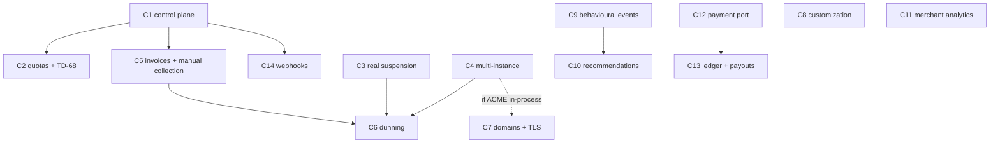

# The commercial platform plan

> **What this page is.** The execution contract for the commercial track: the phases `C1`–`C14`, what each
> delivers, what blocks what, what is deliberately deferred, and the decisions that are the owner's before
> engineering can proceed. The architecture it executes is
> [CommercialPlatformArchitecture.md](CommercialPlatformArchitecture.md); the evidence it rests on is
> [CommercialReadiness.md](CommercialReadiness.md).
>
> **What this page is not.** It is not a roadmap phase list. Per [AGENTS.md](../../AGENTS.md) §5, roadmap phase
> numbers in [ProductRoadmap.md](ProductRoadmap.md) describe **product capability** and are never renumbered or
> reused; engineering missions take a name, not the next free number. These phases are `C1`–`C14` — a **third**
> track beside the roadmap's Phases 1–23 and the master plan's `M1`–`M20`, both of which are closed. Where a `C`
> phase delivers genuine product capability, adding it to `ProductRoadmap.md` §6 is the owner's next roadmap
> edit, and this plan does not pre-empt that placement.
>
> **The eight blocking owner decisions were answered on 2026-09-21** and `C9`, `C3`, `C5`, the policy-link half
> of `C8`, the tax architecture and `C12`'s port are unblocked. Every answer is recorded in
> [OwnerDecisions.md](../09-OPERATIONS/OwnerDecisions.md); §0 lists what each one released and what is still
> gated.
>
> **`C1`, `C2` and `C11` are done.** The *Billing* module exists, plans and entitlements are enforced through the
> seam that already existed, the fail-open default is closed, numeric limits are now **enforced** by a counter row
> that no isolation level can defeat, and merchant analytics answer in the merchant's own day with profit reported
> only as far as the data supports it. `C11` was taken out of order because it is the only phase gated by nothing
> at all — see §0's `next_phase` note.
>
> **Last verified against the code:** 2026-09-21, branch `phase/17-production-hardening`, after `C11`.

---

## 0. Status (machine-readable)

```yaml
plan_version: 1.7.0
track: commercial
current_phase: C8
phase_status: done
# 2026-09-21: the owner answered the eight questions of OwnerDecisionBrief.md, and SIX phases that
# were gated are now unblocked. The canonical record of each answer is its own entry in
# docs/09-OPERATIONS/OwnerDecisions.md; §5 of this page carries the plan-side consequence.
#
#   C-08  = A  -> C9  unblocked (opaque visitor identifier; capture ships OFF until the owner
#                     supplies lawful basis + retention + residency — those three are still open)
#   C-17  = B  -> C3  unblocked (admin-only suspension), and C6 once C3+C4+C5 are in
#   TD-42 = C  -> the policy-link half of C8 unblocked, and M2 of SouqMasterPlan.md closes with it
#   C-15  = A  -> C5  unblocked (JOD), together with P-06's answer below
#   P-06  = a configurable jurisdiction-aware tax capability, NOT a rate. Unblocks the tax
#                     architecture; unblocks no jurisdiction's values, which stay unverified
#   D-13  = A  -> each store is its own merchant of record; Souq earns by invoicing subscriptions
#   C-01  = B  -> a redirect-first model WITHOUT transaction-time splitting; NO provider chosen,
#                     so C12 builds the port and the model, and the adapter waits on a contract
#   C-19  = A  -> disclosure in the merchant agreement; blocks no engineering, as recorded
#
# STILL BLOCKED, and by what:
#   C4  <- D-18 for blob storage ONLY. Its other two thirds (cross-instance invalidation of all
#          three caches, and a lock/leader election for the sweeps) are blocked by nothing — split.
#   C7  <- C-11 (managed edge or self-run ACME; apex; SLA; abandoned-domain policy)
#   C10 <- C-09 (may behavioural data be pooled across tenants) + C9's data having accumulated
#   C13 <- a provider contract. C-02 is answered by D-13=A; C-03/C-04/C-05 have NO SUBJECT under
#          D-13=A + C-01=B, because no commission is taken from a shopper's payment at all
#   C14 <- C-18 (customer code: never, webhooks only, or a sandbox)
current_phase_note: |
  2026-09-22, in one session and in this order:
    • the eight owner decisions recorded (1611277)
    • F-32 fixed — a test that failed one hour every night (4a5601e)
    • TD-42's policy links, closing M2's last deliverable (42876d3)
    • C3 done: admin-only suspension, TD-66 and TD-67 closed with it (039f788)
    • C9's store and write path: capture ships OFF until C-08's three
      sub-answers exist; only the search surface records so far (6b77f98)
    • P-06's tax capability: jurisdiction profiles, versions, the verification
      workflow, a store's selection — a fifteenth module (d894148)
    • and the tax term itself: the pricing pipeline's explicit zero is now
      calculated, frozen onto the order, and shown to the shopper (60f5021)
next_phase: none-unblocked
# C6, C8 and C9 are closed; C12's port seam and both its prerequisites are in. Everything that remains
# is waiting on someone outside engineering — see the blocked list above and §5. §4.13's four customization
# items are all built now; the visible gap left inside a closed phase is that text overrides have no editor
# screen yet, which is a small frontend change needing no decision.
blocked_decisions: ["D-18", "C-11", "C-09", "C-18", "C-12", "C-13"]
answered_decisions: ["C-08", "C-17", "TD-42", "C-15", "P-06", "D-13", "C-01", "C-19"]
open_sub_decisions: ["C-08 lawful basis", "C-08 retention period", "C-08 data residency",
                     "P-06 every jurisdiction value", "C-01 the provider itself"]
last_verified_date: 2026-09-22
last_verified_head: c9a4edb  # +C8's text overrides

# ── ما بقي، ولماذا ─────────────────────────────────────────────────────────
# C4  — بقي منه ثُلثٌ واحد: التخزين السحابي، وهو وحده الموقوف على D-18. القفلُ والإبطالُ تمّا.
# C12 — المنفذ بشكله الجديد والنموذج المُحوِّل (C-01 = B). المحوّلُ نفسه ينتظر عقد مزوّد.
# C9b — أسطحُ الالتقاط الباقية. لا تُراكم بياناتٍ اليوم لأنّ الالتقاط معطّل، فقيمتُها تبدأ يوم
#       يُجيب المالك على أسئلة C-08 الثلاث (الأساس القانوني، ومدّة الحفظ، ومكان التخزين).
# C8  — **تمّت**: القوالب الثلاثة (ADR-0059) وسجلُّ الأقسام (ADR-0060). وبقي تحت عنوانها ما
#       أجّله المالك: صفحاتُ المتجر المؤلَّفة (TD-42) وتجاوزاتُ النصوص لكلّ متجر.
# C10 — موقوف على C-09 وعلى تراكم بيانات C9.
# ونصفُ شريحةٍ واحدة تبقى مؤجَّلة صراحةً: فئةُ الضريبة للمنتج (ضريبتان في سلّةٍ واحدة).
#
# ── ما أُغلق في جلسة 2026-09-22 (الثانية) ─────────────────────────────────
# C5 — **تمّت كاملةً**: الإعداد الذي يفشل مغلقاً، وسلسلةُ ترقيمٍ واحدة للمنصّة، والفاتورةُ
#      المجمَّدة، وإشعارُ الدائن، والتحصيلُ اليدويّ، ودفترُ القياس — ومعها شاشاتُها الأربع
#      (إعدادُ الفوترة، الدفتر، الفاتورة، ومسوّدةٌ جديدة) وشاشةُ التاجر عن اشتراكه. ADR-0056.
# وشاشتا الضريبة اللتان كانتا API فقط: صارتا موجودتين ومحقَّقتَين في متصفّح — فما كان
#      «قدرةً بلا واجهة» صار قدرةً يصلها مشغّلٌ وتاجر.
# وفجوةُ التحقّق في المتصفّح التي تركتها C3: أُغلقت برحلةٍ تُعلّق متجراً وتعيده.
# C4 — ثُلثاه: عقدُ إيجارٍ يُطالَب بتحديثٍ شرطيّ واحد، وعدّادُ جيلٍ مشترك تقرؤه كلُّ نسخة خلال
#      ثوانٍ. ومعهما تصحيحُ تصنيف محدّد المعدّل: **عدّادٌ يُشارَك لا ذاكرةٌ تُبطَل**. ADR-0057.
# C6 — **تمّت**: `DunningPolicy` دالّةٌ نقيّة بجدول حالات، وشرطان معاً قبل أن يُغلق متجر (مهلةٌ
#      مضت **و**تذكيراتٌ استُنفدت)، والفاصلُ يُقاس من آخر تذكير فلا تُضغَط السلّمُ بانقطاع.
#      معطّلةٌ حتى يُفعّلها إنسان، ومرفوضةٌ بمهلةِ صفر، والتحذيرُ عند المفتاح. ADR-0058.
baseline_branch: phase/17-production-hardening

# ── ما جرى بعد C11 وليس مرحلة ─────────────────────────────────────────────
# كل مرحلة تجارية متبقّية موقوفة على قرار مالك، فتحوّل العمل إلى دَين **غير موقوف** من
# TechnicalDebt.md و ReleaseReadiness.md. المغلق: TD-61 (متجر مؤرشف بلا اختبار)، TD-62 (وهو
# الـ P0 الوحيد الذي كان هندسياً)، TD-60 (حدود المعدّل)، F-21 (قراءات بلا حدّ)، TD-48 (حبس
# التركيز)، TD-63 (أرقام الأمان مثبَّتة بقيمها).
#
# وثلاثة عيوب كشفها العمل نفسه لا البحث عنها، وكلّها مُصلَحة:
#   • F-29 — EF Core يُفعّل RCSI على كل قاعدة يُنشئها، فحارس "آخر مدير" كان يفشل **مفتوحاً على
#     كل نشر**. صار يفتح معاملته بـ SERIALIZABLE حين يكون الثابت في خطر، ويقيسه اختبار على قاعدة
#     بلقطات فعلاً وبحاجز يُلزم المتسابقَين بالكتابة قبل العدّ — وبلا ذلك الحاجز كان النمط القديم
#     يمرّ ثلاثاً من ثلاث، وهو بعينه ما يحذّر منه ADR-0049 §الالتزام الرابع.
#   • F-30 — جمود SQL كان 409 داخل معاملة و500 خارجها.
#   • F-31 — مصنع اختبار مشتقّ يكسر ملتقط السجلّ لأصناف لاحقة (عطب ترتيبي يقرأ كأنه تذبذب).
#
# وبعد هذه، **لم يبقَ في السجلّين بند P0 ولا P1 غير موقوف**: ما تبقّى إمّا موقوف على قرار مالك
# أو على حساب/نشر خارجي، وإمّا P2/P3.
```

**The completion protocol is the master plan's.** [SouqMasterPlan.md](SouqMasterPlan.md) §3 defines discover →
implement → test → run the real application → Docker verification → representative flows → fix defects → full
release gate → documentation → commit → push → verify remote → clean tree, and §5 defines the STOP conditions.
This plan adds phases, not a second protocol.

---

## 1. The critical path in one line

**Decide the money model → build the control plane → make suspension real → make it multi-instance → bill →
dun.** Everything else runs beside it. The one item whose cost rises every day it is delayed is the behavioural
event foundation (`C9`), because the data it captures cannot be reconstructed afterwards.

---

## 2. The phases

Each phase lists: **delivers · depends on · blocked by · why here**.

### C1 — The commercial control plane

- **Delivers.** The *Billing* module and its registration (`ModuleMap`, the contracts map, a module document).
  *Plan* (versioned), *Subscription*, *Entitlement* and *Limit* as Domain concepts. The effective module set
  derived from the plan in `TenantDirectory.Project` so there stays one answer and one enforcement point. An
  expiring, attributed, audited *EntitlementOverride* for support. **Closing the fail-open default** in
  `TenantInfo.HasModule`, the database default and the tolerant reader, with a test that an unresolvable plan
  grants nothing. Extending `ModuleAndContractRuleTests` so the new feature folder is covered by the
  platform-audit rule, and extending the filter-bypass rule to cover shape-B reads.
- **Depends on.** Nothing.
- **Blocked by.** Nothing. Plans exist under every answer to D-13.
- **Why here.** It is the one piece nothing else can substitute for, and it is small: a value object, a check
  beside the existing check, and a platform screen.
- **Done.** *Plan* (versioned, frozen on publish), *Subscription*, *Entitlement*, *Limit* and an expiring,
  attributed, audited *EntitlementOverride* all exist in `Souq.Domain.Platform`, owned by a registered fourteenth
  module. The effective module set is composed once in `TenantDirectory` as the **intersection** of what the plan
  grants and what the platform has switched on, and every missing input resolves to nothing — recorded as
  [ADR-0053](../11-ADR/0053-entitlement-resolution.md). All three fail-open links are closed, the most important
  of them by the compiler: `TenantInfo.Modules` lost its default value, so every construction site had to be
  decided rather than inherited. A *foundation plan* carrying today's three free modules was created by the
  migration and assigned to every existing store, so no store's behaviour changed. The filter-bypass rule gained
  its shape-B twin, and it immediately found a pre-existing reader that no inventory had listed.
- **Two things C1 did *not* decide, on purpose.** It built the **mechanism** for tiers and limits without naming
  a single commercial tier or limit — that is `C-12`, and the foundation plan is explicitly not an answer to it.
  And it enforces no limit at all: the plan carries numbers and nothing counts, because the counter design is
  `C2`'s and copying the repository's existing count-then-write pattern is what [ADR-0049](../11-ADR/0049-tenant-quota-enforcement.md)
  exists to forbid.
- **`C-14` was answered by this phase's own scope, and the owner may still overrule it.** C1's deliverable list
  named "an expiring, attributed, audited *EntitlementOverride*" — which is option (b) of `C-14` verbatim — so it
  was built. If the owner answers "no", what is removed is one table, one screen section and one file; nothing
  else depends on it. This is flagged rather than buried because engineering chose an option a decision record
  had open.

### C2 — Quotas, and closing TD-68

- **Delivers.** *ITenantQuotaGuard* with one implementation, the per-tenant counter row taken with an explicit
  lock inside the caller's transaction, the reviewed bulk-write entry with its written reason, the reconciling
  sweep that keeps the counter truthful, and an architecture test forbidding any other count-then-insert. A
  startup check that reads the database's own `READ_COMMITTED_SNAPSHOT` setting and warns loudly, closing TD-68
  for the existing administrator guard as well. A concurrency test that can actually reach the guarded branch —
  unlike `LastAdministratorConcurrencyTests`, which cannot.
- **Depends on.** C1 (limits come from the plan).
- **Blocked by.** Nothing.
- **Why here.** A commercial quota that fails open is a billing defect, and the repository's existing pattern
  fails open silently under a database setting that a managed host enables by default.
- **Done (2026-09-21).** *ITenantQuotaGuard* with one implementation, `TenantUsageCounter` as a store-owned
  table, the reviewed bulk-write entry with its written reason, `QuotaReconciliationService` as a
  `StoreSweepService`, and `QuotaRuleTests` forbidding any other count-then-insert. TD-68 closed with the
  startup check `DatabaseIsolation` — on the running database, since a test could only ever assert the test
  container. Wired to the five paths that create or free a countable thing: product create, archive and
  restore; staff invite and enable/disable.
- **Three things C2 decided that the plan did not name, all recorded in [ADR-0054](../11-ADR/0054-limit-semantics-and-catalogue.md).**
  (1) **An absent limit means uncapped, not zero** — deliberately asymmetric with the entitlement gate, and the
  only answer that did not stop every existing store the day this shipped, since the foundation plan carries no
  limits. (2) **`LimitNames` is a closed catalogue**, which *reverses* a C1 abstention: C1 left names
  unvalidated so as not to answer `C-12` implicitly, and this catalogue still does not — it lists what the
  machine can count, never a tier or a value. (3) **Archived products and disabled staff do not count**, because
  neither has a hard delete here and counting them would have made every limit a one-way ratchet with upgrade as
  the only exit — a commercial policy nobody decided.
- **What C2 did *not* do.** No tier and no number was named; `C-12` is untouched and still the owner's. No usage
  is displayed to a merchant — `PeekAsync` exists and takes no lock, and no screen calls it yet.
- **Two pre-existing findings the new rule surfaced, neither in any inventory.** `CouponRedemptions` counts then
  inserts and is **correct** — the coupon aggregate's `rowversion` serialises it, the exception ADR-0049 names —
  and is now inventoried with that reasoning rather than left undocumented. And `HEAD` at `38daea9` did **not**
  build clean from scratch: a blocking `.Result` in C1's own test violates `xUnit1031`, and the incremental build
  was not recompiling that project, so `dotnet build -warnaserror` reported success without ever seeing it.
  Verified against a pristine worktree before fixing.

### C3 — Suspension that actually suspends — **done**

- **Delivers.** TD-66 (revoke sessions and refresh tokens on archive; decide suspend separately), TD-67 (a
  store-status filter per message kind in the outbox), TD-61 (the missing archived-store availability tests), and
  the background-sweep list fix so Provisioning and Archived stores are reachable by the jobs that must see them.
  A `Suspend()` path that works from `Provisioning`, which it currently refuses.
- **Depends on.** Nothing.
- **Blocked by.** ~~A product call on what a suspended storefront does (§5, C-17).~~ **Answered 2026-09-21:
  `C-17` = B, admin-only.** The storefront shows the branded unavailable page, the merchant can still sign in
  and act, and customers can still track orders they already paid for. Three consequences are now in scope and
  are engineering, not further decisions: the browser app must stop refusing to mount for a non-`Active` store
  (it refuses for all of them today, so a suspended merchant cannot reach their own admin); public order
  tracking must gain a closed-store exemption; and purchasing must be refused server-side, not merely hidden.
- **Why here.** Today suspension is a status column plus a middleware gate, which is fine while a human types it
  and unsafe the moment dunning automates it. This must precede C6.
- **Done (2026-09-22).** Suspension now means something different from archiving, in five places that were one:
  - **The gate.** `Suspended` and `Archived` shared a single branch of `TenantAvailabilityMiddleware.IsOpen`, so
    nothing distinguished them. `Suspended` now opens `[HasPermission]` endpoints — the merchant works — plus
    the new `AvailableWhenStoreSuspendedAttribute`, while `Archived` stays as it was. **Purchasing is refused by
    the server, not hidden by the browser:** the basket, order-creation and registration paths carry no
    permission, so they fall into the closed branch by construction, and a test asserts each one.
  - **Order tracking** carries the new attribute, because a shopper who paid before the suspension is not party
    to it — the dispute is between the platform and the merchant. Not for an archived store.
  - **`Suspend()` from `Provisioning`**, which the aggregate refused, leaving `Archive` — irreversible — as the
    only exit from a temporary problem. `C6` needs this: a dunning chain suspends a store that has not paid
    without first asking what state it was in.
  - **TD-66 closed, and the product question it named was answered first.** Archiving revokes every session in
    the store inside the archive's own transaction; suspending revokes none. `IStoreSessionRevoker` is the first
    **writer** allowed to bypass the tenant filter, listed with its reason in both allowlists.
  - **TD-67 closed, and the rule turned out to be short.** A suspended store blocks no message at all — under
    `C-17` = B it has a merchant who ships and a shopper who tracks, so blocking the shipping email while
    allowing the tracking link is a contradiction the shopper can see. An archived store blocks everything
    except the two account-security messages, which are about the person and not the store.
  - **The browser stopped denying what the server allows.** The SPA refused to mount for *any* non-`Active`
    store, so a suspended merchant could not reach their own admin even though the API was about to allow it —
    and a provisioning merchant could not either, though the API had allowed that since Phase 12. Only
    `Archived` replaces the app now; `Suspended` and `Provisioning` mount it, and a gate renders a branded
    per-status notice in place of the shopping pages. Three states had shared one message ("temporarily
    closed"), which told a permanently-closed store's visitor to come back soon.
- **Deliberately not done, with the reason** — the plan's own line asked for "the background-sweep list fix so
  Provisioning and Archived stores are reachable by the jobs that must see them", and after `C-17` = B **there is
  no such job**. `ListForBackgroundSweepsAsync` covers `Active` and `Suspended`, which is what the two store
  sweeps (reservation expiry, basket cleanup) need; a provisioning store has served no shopper so nothing of its
  can expire, and an archived store is a closed record. `ITenantDirectory` argues both exclusions in its header
  and `BackgroundSweepScopeTests` pins them. `C6`'s dunning sweep is platform-scope on the outbox's lease
  pattern, by its own design, so it does not need this either. Changing it would have meant editing a test that
  exists to prevent exactly that, for no caller.

### C4 — Multi-instance correctness

- **Delivers.** Cross-instance invalidation for **all three** per-process caches (tenant directory 60 s, session
  stamp 30 s, and the rate limiter, whose per-tenant limits currently multiply by instance count). A distributed
  lock or leader election for the single-instance sweeps. Blob storage behind `IFileStorage` (TD-20, R-13) and
  the Domain prefix rule that currently rejects any non-local URL (TD-22).
- **Depends on.** Nothing.
- **Blocked by.** D-18 in the roadmap's decision log — cloud blob storage — which is un-ticked and is the one
  decision row that gates multi-instance uploads.
- **Why here.** It is the precondition for automated dunning and for running ACME in-process, and it is the
  thing most likely to be skipped because nothing fails without it until there are two instances.

### C5 — Platform invoices and manual collection

- **Delivers.** *PlatformInvoice* with Souq's own number series allocated at issue and immutable afterwards, the
  tax snapshot frozen at issue, *CreditNote* as a separate aggregate, and **manual/offline collection** — a
  merchant paying by bank transfer, with invoices, reminders and grace periods operating with no provider in the
  loop. *BillableEvent* and *BillingPeriod* with Open → Closing → Closed.
- **Depends on.** C1, and the tax capability from `P-06`'s answer for the snapshot it freezes.
- **The tax configuration capability shipped first, on 2026-09-22** (a fifteenth module, `Tax`, per
  [ADR-0055](../11-ADR/0055-tax-as-a-configurable-capability.md)): a platform-maintained jurisdiction profile,
  versioned and frozen on publish; rates in basis points; a verification workflow whose `Verified` state
  engineering never sets; a store's *selection* of a profile, with the reason reported when it is not
  collecting; ten endpoints; five additive tables. **No jurisdiction ships with the product** — there is no
  seeded profile, verified or otherwise, and there deliberately never will be one from engineering.
  - **Nothing charges tax yet, and that boundary is deliberate.** Consuming a calculator means freezing a
    snapshot onto the order in the same change, or a store could charge tax its own order does not record. So
    `PricingService`'s tax term is still an explicit zero and the two halves ship together next.
  - **The configuration half went first because it is the part with external lead time**: a profile is
    worthless until an accountant verifies it, and that wait can start now.
  - It also gives `platform.settings.manage` its **first endpoint** — open decision `P-07` had recorded that
    the permission existed, that no endpoint required it, and that no platform-wide setting existed.
- **Blocked by.** ~~The invoicing currency and the jurisdictions it must satisfy (§5, C-15, P-06).~~ **Both
  answered 2026-09-21: `C-15` = A, JOD**, and **`P-06` = a configurable jurisdiction-aware capability**. The
  invoice freezes a tax *snapshot* taken from whichever profile version applied at issue, and an unverified
  profile is carried as unverified onto the invoice rather than silently trusted.
- **Why here.** It is the half of billing that needs no payment provider at all, and in this market it is the
  mainstream case rather than the fallback.
- **Done (2026-09-22), and it is the phase that makes the company payable.** *PlatformInvoice* with Souq's own
  platform-wide number series allocated inside the issuing transaction, the tax snapshot frozen at issue through
  the **same verification gate a shopper's basket passes**, *CreditNote* as a separate aggregate with its own
  series, manual collection recorded and attributed on the document itself, and *BillableEvent* / *BillingPeriod*
  as a ledger that prices nothing by itself. Recorded as [ADR-0056](../11-ADR/0056-platform-invoices-and-manual-collection.md).
- **`C-15`'s answer entered the product as configuration, not as a constant** — it could not be a literal, because
  `WhiteLabelSourceTests` forbids a currency in `src/` and that rule is right. So billing **fails closed**: with no
  currency and no issuer nothing can be invoiced, the refusal names itself, and the row is deliberately **not
  seeded in production**. Once an invoice exists the currency locks.
- **Five screens, because an API is not a capability.** Billing settings, the ledger, one invoice, a new draft,
  and the merchant's own view of what it owes. The first browser run is what found that *creating* an invoice had
  no UI at all — every other step existed. **The merchant screen has no pay button and a test asserts its
  absence**: collection is a bank transfer by `C-15`, and a button promising a gateway would promise a lie.
- **What C5 deliberately did not do:** no automated collection (needs `C-01`), no dunning (that is `C6`), no
  commission ledger (`D-13` = A leaves it no subject), no PDF or email, and no tier values (`C-12`).

### C6 — Dunning and automated suspension — **done**

- **Delivers.** The dunning state machine on Souq's own invoice state — not on a provider webhook — with its
  grace period, reminder schedule and escalation to `Suspended`. The platform-scope sweep using the outbox's
  lease pattern rather than `StoreSweepService`, which is per-store and single-instance by its own declaration.
- **Depends on.** C3, C4, C5. **All three landed first**, in that order, on 2026-09-22.
- **Blocked by.** ~~C-17 (what suspension means commercially).~~ **Answered 2026-09-21: `C-17` = B**, and `C3`
  turned that answer into a reversible state with an operator's button — which is what makes an automatic
  suspension survivable.
- **Why here.** It is the first place the platform takes an irreversible action against a paying customer
  automatically, so everything it rests on must be true first.
- **Built** ([ADR-0058](../11-ADR/0058-dunning-and-automated-suspension.md)):
  - `DunningPolicy.Decide(invoice, settings, utcNow)` — a **pure function** returning an action plus a named
    reason, reading no database and no clock. The service executes its answer and adds no condition of its own,
    which is why the most dangerous logic in the product is a state table testable with no server.
  - **Two conditions before a store closes**: the grace period passed **and** every reminder sent. Grace alone
    would suspend a merchant who was never told; reminders alone would let a shortened interval quietly shorten
    everyone's runway. Mutation-checked — `&&` → `||` fails four of twelve policy tests.
  - The reminder interval is measured **from the last reminder**, so a sweep that was down for two days sends one
    reminder rather than the two it missed.
  - `DunningService`: platform scope, under `C4`'s `GuardedWork.Dunning` lease, batch of 200, hourly by default.
    Suspension and the invoice's escalation mark commit **together**; session revocation and directory
    invalidation happen after the commit.
  - The reminder goes through the outbox with the invoice's tenant taken explicitly (the sweep has no ambient
    tenant), reaching `store.settings.manage` holders in-app and by email, ar + en. **No payment link** — there
    is no provider in this path.
  - **Off until an operator enables it**, refused outright with a zero-day grace period, and the platform
    billing-settings screen carries the warning at the switch with the toggle disabled in that case.
- **Deliberately not built.** Automated collection of any kind (no provider — `C-01`), per-store dunning
  overrides (a tenant fork of a platform rule), and partial-payment credit toward the ladder.

### C7 — Custom domains: verification and certificates

- **Delivers.** The two state machines on `TenantDomain` (ownership and certificate) kept deliberately separate,
  the namespaced TXT token with its expiry, the *IDnsProbe* port, the *IDomainAttachment* port shaped so it can
  hold either a managed edge or a self-run ACME client, the authorization gate that answers yes only for a
  verified host, re-verification and renewal scheduling with backoff, and expiry alerting. Making `VerifiedAt`
  load-bearing, and giving it a way to be undone.
- **Depends on.** C4 if ACME runs in-process (certificate storage needs atomic operations and a lock).
- **Blocked by.** C-11 (managed edge or self-run; apex support; activation SLA; abandoned-domain policy).
- **Why here.** This is what turns onboarding customer #2 from an operation into a product.

### C8 — Customization a merchant can see — **done**

- **Delivers.** Real theme presets (CSS only — the hook, validation, delivery and editor already exist). A
  server-validated registry of section types so the home page becomes an ordered descriptor list rather than
  fixed JSX. Store-authored content pages or policy links, per TD-42. Per-store string overrides applied as an
  explicit overlay after boot.
- **Depends on.** Nothing.
- **Blocked by.** ~~TD-42 (scope)~~ **answered 2026-09-21: `TD-42` = C — links now, revisit authored pages when
  a real merchant requires them**, so the policy-link half of this phase is unblocked and *ContentPage* stays
  deferred with its trigger named. Still blocked: a design decision on what the three presets *are*.
- **Policy links: done (2026-09-22).** `StorePolicyLinks` on the store's settings document — five optional
  kinds, absolute `https` on any domain because the merchant hosts the page, an empty value meaning deletion,
  and an unknown kind refused rather than ignored. No migration, because the settings are a JSON document, so
  no existing store's footer changed. The footer renders a link only where one is set and shows no policy
  column at all otherwise — which is the substance of the decision, not a detail: Phase 16 had deleted six
  `href="#"` links from this same footer, and the rule that replaces them is that what is shown goes somewhere
  real. A new architecture test pairs the domain's kind list with the footer's labels and both locale files,
  and was shown to fail on an unlabelled kind before it was kept. **This also closes the one deliverable that
  kept `M2` of [SouqMasterPlan.md](SouqMasterPlan.md) open.**
- **Theme presets: done (2026-09-22), closing `TD-65`** ([ADR-0059](../11-ADR/0059-theme-presets-vary-form-not-colour.md)).
  The design decision this waited on was made and written down: **a preset varies form, never colour or font
  family** — those are the merchant's identity, chosen in the same editor, and a preset imposing a palette
  would compete with the store for it. So the three are three answers to *how much the interface asserts
  itself*: `classic` floats on a soft brand-tinted shadow, `minimal` replaces that shadow with a 1px hairline
  and tightens the radii, `bold` squares the corners, thickens the rule to 2px and raises the heading weight.
  **No component changed** — `minimal` and `bold` redefine `--shadow` as `0 0 0 Npx var(--color-border)`, and
  every surface already writes `box-shadow: var(--shadow)`, so each acquires a line for free and dark mode with
  it, because the border token is already derived per mode. The selector is the bare attribute, not
  `html[…]`, so the **settings preview** picks it up too. Two defects fell out and were fixed: `previewBranding`
  dropped `themePreset`, so the preview was always `classic` — the browser journey caught it, because the field
  is sent correctly on save and the loss is only visible in something drawn — and `--shadow-sm`/`--shadow-md`
  were never derived at all, keeping light-mode values in dark mode, which is a black shadow on a black surface.
- **Section registry: done (2026-09-22)** ([ADR-0060](../11-ADR/0060-home-page-sections-as-an-ordered-registry.md)),
  which closes the phase. `StoreSections` is a closed allowlist in the Domain — `hero`, `featured`,
  `newArrivals`, `offers`, `catalog` — with the default order being the page's existing order character for
  character, published through the same options endpoint as typography and policy kinds. The merchant reorders
  and toggles; **no component name ever arrives from a client**, and a type the frontend does not recognise is
  skipped rather than fatal. An unknown type is refused and a duplicate refused (ignoring either means a
  merchant saves one layout and gets another); the catalog may be moved but never removed, because a home page
  without it has no products on it. **Unmentioned types are appended disabled** — the `StoreModules` principle,
  so a new section never appears on a store that did not ask for it — while a store that never configured
  sections reads the full default, so the upgrade changes nothing for anybody. `sections` is
  absent-means-unchanged, unlike the rest of that contract, because an older client would otherwise erase a
  merchant's layout by saving an unrelated field. No migration: the settings are a JSON document. The editor
  reorders with two named buttons rather than drag-and-drop, so it works from the keyboard and needs no
  left/right that RTL would invert.
- **Per-store string overrides: done (2026-09-22)**
  ([ADR-0062](../11-ADR/0062-store-text-overrides-are-a-closed-list.md)), which closes the phase's fourth and
  last deliverable. A store may rename display text **from a closed list of nine keys in the Domain** — the
  translation file also holds error messages, what the platform says on its own behalf, and accessibility
  strings only a screen reader reads, and a merchant rewriting *"payment could not be completed"* or emptying a
  label only a blind shopper hears has broken their store rather than customised it. An unknown key is refused
  rather than ignored; empty means delete, so clearing a rename restores the original instead of leaving a
  button with no word on it. The load-bearing detail is **ordering**: the language bundle reloads on every
  switch and overwrites whatever was layered on it, so the overrides are re-applied on bundle load, on config
  arrival and after every language change — with a test that reproduces the disappearance before fixing it. No
  migration, and **no editor yet**: the capability is complete through the API and the storefront, and a
  merchant cannot set a rename from a screen. That is the next visible-value change here.
- **Why here.** It was the cheapest credibility fix on the list: a merchant evaluating the product picked one of
  three themes and saw no difference, which reads as broken. All four deliverables are now closed. What remains
  under this heading is only `TD-42`'s authored-page capability, which the owner deferred with a named trigger.

### C9 — The behavioural event foundation — **done, and capture still ships off**

- **Delivers.** The event envelope and the versioned payload, the bounded non-blocking write path generalised
  from `ISearchLog`, the search-execution identifier minted at query time and echoed back, position-in-list and
  list identity on every impression, write-time denormalisation, the separate identity-link table, the rollup
  jobs, and the retention policy.
- **Depends on.** Nothing technical.
- **Blocked by.** ~~C-08~~ **answered 2026-09-21: `C-08` = A — store an opaque visitor identifier for signed-out
  shoppers.** The three sub-questions option A reserved to the owner — the lawful basis, the retention period,
  and whether rows may leave Jordan — are **still open**, so this phase ships the whole foundation with
  **capture off unless configured**: no default retention window, no default lawful basis, no external
  processor, and a startup check that reports the state plainly. Turning it on is a deliberate act with those
  three answers in hand.
- **Done (2026-09-22): the store, the write path, retention and the rollups.** The envelope and its versioned
  payload, the bounded drop-on-full channel, a writer that batches inside each store's scope, the identity link
  as its own table, the two rollups, and the purge — with a migration that adds five tables and changes nothing
  existing.
  - **Capture ships OFF, and that is the phase's headline, not a caveat.** `C-08` = A reserved three answers to
    the owner "before the first row is written" — lawful basis, retention period, residency — so the absence of
    an answer stops the write: `Enabled` without a retention period *and* a lawful basis **refuses to boot**,
    naming the key and `C-08`. Disabled means no row *and* no cookie on anybody's browser, and an integration
    test measures that on a real deployment rather than reading the code. A second test runs a **configured**
    deployment end to end: the search mints its execution id, the response echoes it, the row is written with
    the same id in its envelope, and both cookies appear — one of them declared non-essential.
  - **No default retention shipped.** The 13- and 14-month figures the plan found are research, not the owner's
    decision, so neither is a default. `VisitorIdentifierEnabled` is a separate switch, so `C-08`'s "no" answer
    is preserved in the same shape: capture can run with no identifier at all.
  - **"Roll up before you purge" is enforced by code, not by documentation.** `AnalyticsRollupState` records the
    last complete day rolled up, and the purge never passes it — so a store whose rollup stalls grows its log
    and keeps its history, which is the right trade: disk is cheaper than an aggregate that cannot be recomputed.
    A watermark row was needed because "has this day been rolled up?" cannot be inferred from the existence of
    rollup rows: a day with no events produces none.
  - **Both writer defects ADR-0050 named are fixed rather than inherited**: per-store isolation in the writer
    (one store's bad batch no longer discards every other store's rows in that cycle) and drops counted at
    platform scope instead of silently returning.
  - **Four architecture tests caught real mistakes on the way in**, which is the system working: the visitor
    cookie read the clock directly; the payload registry sat outside `Contracts`, so `Catalog` reached into
    another module's internals; the rollup's read-then-insert needed a written reason in the count-then-write
    allowlist; and the new domain types needed an owner in the module map.
- **The server-side capture surfaces: done (2026-09-22).** `cart.added`, `cart.removed`, `checkout.started`
  and `order.placed` are emitted where each fact occurs, so the funnel search → cart → checkout → purchase is
  closed without the frontend sending anything: the search-execution id is stamped by the sink from the request
  context, not carried by hand through every caller.
  - **`order.placed` fires when the order is *paid*, not when it is created**, and that is a difference in
    meaning rather than placement: the rollups count it as a purchase, and an order created then abandoned is
    not one. `checkout.started` marks the creation, and the gap between the two *is* the abandonment rate.
  - **Prices are frozen into the event.** A basket is priced live, so "what did it cost when it was added"
    cannot be answered from the product a month later.
  - `cart.removed` reads the product only when capture is enabled — the removal path pays nothing while it is
    off, which is the default.
  - Every emit is guarded and swallowed: *a shopper's basket does not fail because of measurement*, the same
    property the search path already held.
  - Two `AllowedContracts` edges were added deliberately, `Shopping` → `Reporting` and `Ordering` →
    `Reporting`, which is what the existing comment there promised would happen "when the capture surfaces
    arrive".
- **The browser-only surfaces: done (2026-09-22), completing the phase.** `POST /api/storefront/events` takes
  list impressions with position, clicks and item views — anonymous by decision, because the signed-out shopper
  is most of the browsing and a measurement only signed-in people generate measures the minority.
  - **The client sends identifiers and positions, never money or stock.** The impression payload carries price
    and availability, and accepting those from the browser would let any visitor claim a product was shown at a
    price that was never offered — into the table the merchant's numbers are built from. The server reads them
    from its own catalogue.
  - **202 whatever happens**, so the answer does not reveal whether the store captures; the browser waits for
    no measurement; and with capture off there is no query, no payload and no row.
  - The search-execution id travels in a **header on every request** rather than in each event's payload, so
    the chain closes even for events only the server writes.
  - Impressions batch in the browser; a click flushes immediately because the page is about to change. What is
    measured is **ordering, not visibility** — without an intersection observer we do not know what actually
    entered the viewport, and claiming otherwise produces a number that looks precise and is not.
- **Why here — and why the delay is expensive.** Every other item on this plan can be built later at the same
  cost. This one cannot: a purchase that happened before the event existed can never be attributed to the search
  that produced it. **If C-08 is answered "no visitor identifier", say so explicitly and record what is
  permanently foreclosed** — funnel analysis, search-to-purchase attribution, and every behavioural
  recommendation — rather than leaving the question open.

### C10 — Related products and recommendation baselines

- **Delivers.** Attribute/content similarity first, because it needs no behavioural data and is therefore the
  only thing correct on day one for a new tenant. Then co-occurrence with a rescaled measure and a minimum
  support. A *RecommendationReason* closed enum with reviewed Arabic copy. A slot request id and the ordered
  items displayed, so click-through rate is computable at all. Live availability joined at request time. A
  per-tenant readiness state, because the thresholds are per tenant and a paid tier cannot promise what a store
  with forty orders can deliver.
- **Depends on.** C9 for anything behavioural. `FindRelatedProductsAsync` already exists with a route and a
  frontend surface, so the first slice changes one implementation and no client code.
- **Blocked by.** C-09 (may behavioural data be pooled across tenants).

### C11 — Merchant analytics and decision support

- **Delivers.** Per-store time zone in reports — `TenantInfo.TimeZone` is already projected on every request and
  read by nothing in Reporting, so a merchant's "today" is currently wrong by their offset. A cost price on
  `ProductVariant`, which makes line-level margin computable immediately because `OrderItem` already carries
  `VariantId`. Refund-period attribution from `Refund` rows rather than a running total with no date. A
  platform-owner revenue view through `PlatformQueries`.
- **Depends on.** Nothing.
- **Blocked by.** Nothing.
- **Done (2026-09-21).** All four, and each turned out to be a wrong number rather than a missing one:
  - **The merchant's day.** `WindowFor` computed every boundary from `nowUtc.Date` while the browser already
    formatted in the store's zone — so a merchant in a +3 zone was answered about a window opening at 03:00 their
    time, and the trend chart labelled UTC days with store-zone dates. Boundaries are now computed in local time
    with full `TimeZoneInfo` handling (including the midnight that does not exist on a spring-forward night, which
    made `ConvertTimeToUtc` throw). **One limit stays and is written down:** SQL-side bucketing shifts by a single
    offset because EF Core 10 does not translate `AT TIME ZONE` (tried two ways); totals and boundaries are always
    exact, and only a DST zone's two transition days move an hour of orders into the neighbouring bucket.
  - **Refund attribution.** Moved from the order's period to the refund's, from `Refund` rows rather than
    `Payment.RefundedAmount`, which carries no date — and filtered to `Succeeded`, because `Refund.Fail` stamps
    `CompletedAt` exactly as `Succeed` does. This reverses a choice the module page had already half-retracted.
  - **Cost and margin.** `ProductVariant.Cost` optional, `OrderItem.UnitCost` frozen at sale. The design refuses
    two errors: treating an unknown cost as zero (which shows a merchant a 100% margin) and reading today's cost
    for yesterday's sale. Coverage is reported beside the margin so partial data reads as partial.
  - **Platform revenue.** Per store and per currency, never summed across currencies, on a UTC window because the
    query spans zones. Reverses a documented "by design" claim, and raises `C-19` — what the *merchant agreement*
    says the operator can see, which is a contract question and is now recorded as one.
- **Three defects this phase surfaced that nothing else would have.** `F-30`: a SQL Server deadlock escaped
  `SaveChangesAsync` untranslated while `InTransactionAsync` had translated it since F-7, so the same race was a
  retryable 409 inside a transaction and a 500 outside one — and the basket's merge path writes outside one, so
  F-28's retry never saw the class. Only reproducible under full-suite load. `pendingRefunds` counted payments
  rather than refund requests, so an operational alert undercounted the work waiting. And the white-label guard
  caught a currency name in a new *comment*, which is exactly the rule working.

### C12 — The payment port, re-shaped, and the first regional adapter — **port done, adapter blocked**

- **Delivers.** The flow-agnostic port: *StartPayment* returning a discriminated result (redirect, client
  script, browser post, completed synchronously, deferred out-of-band), a persisted *PaymentAttempt* aggregate,
  money totals derived from an append-only event log, a webhook **inbox** with raw-bytes verification and a
  tenant-resolving route, declared adapter capabilities including amount granularity, and refund as its own
  entity. TD-50 (record the account identity, not just its kind) and TD-52 (the injectable gateway factory) are
  prerequisites, not follow-ups.
- **Depends on.** Nothing technical.
- **Blocked by.** ~~D-13 and C-01~~ **both answered 2026-09-21.** `D-13` = A — each store is its own merchant of
  record, Souq never touches shopper funds, and Souq earns by invoicing subscriptions. `C-01` = B — a
  **redirect-first model without transaction-time splitting**, with **no provider chosen**. So this phase builds
  the port, the redirect-first result, the attempt aggregate, the webhook inbox and the declared capabilities,
  and it does **not** build a named provider's adapter: that waits on a contract, which is an external
  dependency. Three things `D-13` = A makes mandatory rather than optional arrive with it: TD-50 (record the
  account's identity, not just its kind), a payment item in store readiness, and a concurrency token on
  `StorePaymentAccounts`.
- **Prerequisites and the mandatory trio: done (2026-09-22).** `TD-52` — the gateway construction is behind an
  injectable `StoreGatewayFactory`, and every routing rule `D-13` rests on is now tested offline, including the
  `503`-not-silent-fallback rule, which is mutation-checked because the silent version collects one merchant's
  money into another's account. `TD-50` — a payment records the **publishable key** of the account that took it
  and the router refuses a mismatch before calling
  ([ADR-0061](../11-ADR/0061-a-payment-records-which-account-took-it.md)); an unrecorded identity passes, so no
  existing payment lost its refund path on upgrade day. And `StorePaymentAccounts` now carries a concurrency
  token, so two admins editing keys at once get a `409` instead of a silent overwrite — not an auto-retry, which
  would be the same defect with an extra step.
- **The port re-shape: the seam is done (2026-09-22).** `StartPaymentResult` is a discriminated result —
  `ClientScript` / `Redirect` / `BrowserPost` / `Completed` / `Deferred` — that the core carries without
  understanding, and `CheckoutPayment` branches on it, **refusing an unimplemented flow rather than mishandling
  it**: a redirect provider whose reference was handed to the card widget would render an empty payment screen
  and leave a pending order holding stock, with no error anywhere. Declared capabilities landed with it, with
  two enforced rules. Adding a redirect-first provider is now an adapter change, not a change to an Application
  interface — which is the whole promise of the port.
- **Deliberately deferred inside this phase, with the trigger named:** the *PaymentAttempt* aggregate,
  event-log-derived totals, and the webhook **inbox**. All three are answers to the shopper *leaving the
  process* and to out-of-order, duplicated ingress. Every adapter that exists produces `ClientScript`: nobody
  leaves, and `Payment` already addresses the single attempt. Building the aggregate now would add a second
  table duplicating `Payment` that no flow exercises, and two places holding the truth about money is worse than
  either. **They land with the first adapter that returns `Redirect` or `BrowserPost`** — which is also the
  first time their ordering guarantees can be tested against something real. Recorded in
  [ADR-0048](../11-ADR/0048-payment-provider-abstraction.md)'s implementation notes.
- **Still blocked:** the adapter for a named provider, on a contract — an external dependency, and the same one
  that would unblock the deferred three.

### C13 — Commissions, payouts, ledger and reconciliation

- **Delivers.** The append-only ledger with an explicit direction and the balancing invariant enforced in the
  aggregate. *Commission* with a versioned policy and a named basis. *Payout*. *Chargeback* with a liable
  party and a state machine modelled on the **longest** provider's lifecycle, not the shortest. Three provider
  reference columns per movement. The reconciliation job and its exception queue.
- **Depends on.** C12.
- **Blocked by.** **Re-scoped by the 2026-09-21 answers rather than unblocked.** `D-13` = A + `C-01` = B mean no
  commission is taken from a shopper's payment, so commissions, payouts and reconciliation against a provider's
  settlement report have nothing to record: `C-02` is answered "never", and `C-03`, `C-04` and `C-05` have no
  subject. What remains of this phase — Souq's own receivable from a merchant — belongs to `C5`. The phase
  stays on the plan for the day Souq is in a funds flow, and that day re-opens `D-13`. `C-06` (who bears a
  chargeback) still applies to the **store's own** provider relationship, which is the store's contract, not
  Souq's ledger.

### C14 — The bounded extension model

- **Delivers.** Outbound webhooks with per-tenant secrets, signing, retries, replay protection and an
  idempotency key, riding the existing outbox for the durable half. A scoped API for a merchant's own systems.
- **Depends on.** C1.
- **Blocked by.** C-18 (never run customer code, webhooks only, or build a sandbox).

---

## 3. Dependencies



`C8` and `C11` depend on nothing and can run at any time. `C9` depends on nothing technical and everything
legal.

## 4. Recommended order

| # | Phase | Why here | Gate |
|---|---|---|---|
| 1 | ~~**C1**~~ **done** | nothing else can substitute for it, and nothing blocks it | — |
| 2 | ~~**C2**~~ **done** | a quota that fails open is a billing defect; also closed TD-68 | — |
| 3 | **C9** | the only item whose cost rises with delay | ~~C-08~~ answered A — **store, write path, rollups and retention done 2026-09-22; capture surfaces next** |
| 4 | ~~**C3**~~ **done (2026-09-22)** | suspension must be real before it is automated | ~~C-17~~ answered B |
| 5 | **C8** | cheapest visible credibility; parallel to the money track | ~~TD-42~~ **answered C — policy links shipped 2026-09-22; theme presets and the section registry still need a design call** |
| 6 | ~~**C5**~~ **done (2026-09-22)** | the half of billing that needs no provider — and, under `D-13` = A, the only way Souq is paid | ~~C-15, P-06~~ answered |
| 7 | **C4** &larr; **next** | the precondition for C6 and for in-process ACME | **split:** caches + locking unblocked; blob storage still D-18 |
| 8 | **C6** | the first automated irreversible action against a customer | ~~C-17~~ answered; ~~C3~~ done, ~~C5~~ done &mdash; **only C4's lock remains** |
| 9 | **C7** | turns onboarding into a product | **C-11** |
| 10 | ~~**C11**~~ **done (taken early)** | small, independent, immediately useful to merchants — and the only phase gated by nothing, so it ran once C2 closed | — |
| 11 | **C12** | the port's vocabulary is set by the first real adapter | ~~D-13, C-01~~ **both answered — the port and the redirect-first model are unblocked; a real adapter waits on a provider contract** |
| 12 | **C13** | the whole financial layer, once the port is real | a provider contract. C-02 answered by D-13=A; C-03/C-04/C-05 have no subject under D-13=A |
| 13 | **C10** | needs C9's data to have accumulated | C-09 |
| 14 | **C14** | worth building when a customer actually asks | C-18 |

**What the 2026-09-21 answers changed about this order.** `C9` keeps its place and is now buildable. `C13`
shrinks: with no commission taken from a shopper's payment, the ledger's marketplace half — commissions,
payouts, reconciliation against a provider's settlement report — has nothing to record, and what remains is
Souq's own receivable from a merchant, which is `C5`'s. The phase is not cancelled; it is re-scoped to the day
Souq is in a funds flow, and that day needs `D-13` re-opened.

## 5. NEXT OWNER DECISIONS

> **Eight of these were answered on 2026-09-21** — `C-08` = A, `C-17` = B, `TD-42` = C, `C-19` = A, `C-15` = A,
> `D-13` = A, `C-01` = B (a model, not a provider), and `P-06` as a configurable jurisdiction-aware capability
> rather than any of its three offered letters. **The canonical record of each is its own entry in
> [OwnerDecisions.md](../09-OPERATIONS/OwnerDecisions.md)**; §0 of this page lists what each released. The
> prose below is kept as the question that was asked, with the answer marked, because the *reasoning* behind
> each option is still the best record of why the answer costs what it costs.
>
> **What remains genuinely open:** `D-18` (cloud blob storage, for a third of `C4`), `C-11` (custom domains),
> `C-09` (pooling behavioural data), `C-18` (customer code), `C-12` (tiers and limit values — it blocks
> *selling*, not building), and three sub-answers inside decisions that are otherwise closed: `C-08`'s lawful
> basis, retention period and residency, every value in any `P-06` jurisdiction profile, and the `C-01`
> provider itself.

These are decisions engineering has taken as far as it can and then stopped on purpose. The canonical register
is [OwnerDecisions.md](../09-OPERATIONS/OwnerDecisions.md); the `C-` items below are new and are summarised
there with a pointer here.

**Written for the owner rather than for an engineer:**
[OwnerDecisionBrief.md](OwnerDecisionBrief.md) takes the seven that currently block this plan — `C-08`, `C-17`,
`TD-42`, `C-15` with `P-06`, `D-13`, `C-01` and `C-19` — and gives each one plain-language options, the
technical consequence of each, what is already built, and one precise question. It adds no decision and
changes nothing here; it is a reading surface over this section and the register.

### The three that gate the most

**D-13 — merchant of record, and how the platform collects its revenue.** Already open, and this research
changes its shape rather than its answer. Two facts the record did not have: **Stripe does not operate in
Jordan** (the UAE is its only MENA country), so "adopt Stripe Connect" is not available in the home market; and
every mainstream merchant-of-record vendor checked — Paddle, Polar, Stripe Managed Payments, FastSpring —
excludes **physical goods** *and* forbids a platform reselling for third-party sellers, so that door is closed
too. What remains is: (a) each store is its own merchant of record and Souq never touches shopper funds — no
licensing exposure, but commission cannot be netted and a full merchant-billing subsystem is mandatory;
(b) Souq is in the funds flow — commission netting becomes nearly free, and Souq acquires chargeback liability,
KYC obligations and a probable licensing conversation with the Central Bank of Jordan; (c) today's unchosen
state, where it varies per store.

**C-01 — the payment provider for the launch market.** The first adapter defines the port's vocabulary, so
building against a provider Souq cannot go live with would validate the wrong shape. Verified candidates that
support Jordan and JOD: **MyFatoorah** (the only one verified to combine Jordan, JOD, transaction-time splitting
and a native fixed+percentage commission), **Amazon Payment Services** (prices natively in JOD and documents
three-decimal handling — including that VISA requires such amounts to end in zero), **PayTabs** via MEPS,
**HyperPay**, **Telr**, **N-Genius**. Most of these are redirect-first and several cannot split at all. This is
a commercial and contractual choice, not an engineering one.

**C-08 — is a visitor identifier stored for signed-out shoppers?** Storing one makes search-to-purchase
attribution, funnel analysis and behavioural recommendations possible, and makes the event store personal data
under GDPR and Jordan's data-protection law. Not storing one keeps the table outside that regime — the position
`SearchQueryLog` takes today — and permanently forecloses all three. Sub-questions that come with a "yes":
retention (13 months matches one regulator's tracker lifetime; 14 is the industry norm), consent basis, whether
events may leave Jordan, whether consent is per-tenant or per-platform, and who owns the data in the merchant
contract. **Answer this before `C9`, and if the answer is "no", record what it forecloses rather than leaving
the question open.**

### The rest, with what each blocks

| id | Question | Options, in brief | Blocks |
|---|---|---|---|
| **C-02** | Does Souq ever hold shopper funds? | never (software only) · yes (netting becomes possible; licensing question opens) | C13 |
| **C-03** | What is the commission basis? | goods only · goods + shipping · after discounts · gross including tax — on a 100 + 10 shipping order these differ by real money | C13 |
| **C-04** | Does the platform refund its commission when the store refunds a shopper? | always proportionally · never · percentage component only. Both provider defaults are traps: one has the platform funding every refund, the other keeps commission on a sale that did not happen | C13 |
| **C-05** | Who absorbs the rounding remainder on a percentage in a three-decimal currency? | toward the merchant · toward the platform · half-away-from-zero · accumulate and settle | C13 |
| **C-06** | Who bears a chargeback, and how is it recovered? | platform · store, with a rolling reserve percentage and holding period — bank auto-debit is not available here the way it is in some markets | C13 |
| **C-07** | What is the pricing granularity in JOD? | accept a 10-fils minimum increment platform-wide (one rounding rule everywhere) · allow 1-fil pricing and make the rule conditional on tenant, provider and card scheme | C12, C13 |
| **C-09** | May behavioural data be pooled across tenants? | never (correct by construction, simplest to put in a contract, every tenant starts cold) · pooled with consent · pooled anonymously | C10 |
| **C-11** | Custom domains: managed edge or self-run ACME? | managed (per-hostname monthly cost, no certificate handling, wildcards gated) · self-run (free certificates, and Souq owns storage, locking, renewal and expiry alerting). Plus: apex support or CNAME-only, the activation SLA shown to merchants, and the policy for a domain that stops pointing at us | C7 |
| **C-12** | What are the tiers, and per limit: hard, soft or overage? | hard is the only one needing no billing integration; overage needs metering first. **C2 built the mechanism and answered none of this:** limits are hard today because that is the only kind that needs no billing, and the two countable names (`catalog.products`, `staff.seats`) carry no values anywhere | still open — it now blocks *selling*, not *building* |
| **C-13** | Trials? | none · time-limited with reduced limits (needs a Trial state and an expiry sweep) · freemium | C1 |
| **C-14** | May support grant a capability outside a plan? | no · an expiring, attributed, audited override · an ad-hoc flag (creates a second truth — not recommended) | C1 |
| **C-15** | What currency does Souq invoice merchants in, and must it support merchants with no card on file? | JOD · USD; and bank transfer is a mainstream case here, not an edge one | C5 |
| **C-16** | Data residency | single region stated in the contract · the hybrid path `MultiTenancy.md` already designs · regional stamps | C4, C9 |
| **C-17** | What does a suspended storefront actually do? | read-only · admin-only · fully dark — and what happens to orders already placed, to data exports, and whether there is a hard delete | C3, C6 |
| **C-18** | Customer code: never, or eventually? | never (webhooks plus bounded configuration) · webhooks now, reconsider at a named threshold · build a sandbox (a platform, not a feature) | C14 |

### Corrections to existing decision records

- **P-05 is smaller than its record says.** `StripeAmountConverter` already carries an explicit
  `HonoursIsoDecimals` switch and `StripeAmountConverterTests` already encodes **both** hypotheses, including
  that the flag is false so it cannot be flipped by accident. Answering P-05 is a one-value change in front of a
  green test, not new arithmetic. Two rows in [ReleaseReadiness.md](../09-OPERATIONS/ReleaseReadiness.md) still
  say otherwise. Separately, ISO 4217 has exactly seven three-decimal currencies — BHD, IQD, JOD, KWD, LYD, OMR,
  TND — which matches `CurrencyInfo`.
- **P-06 is larger than its record says.** Jordan's national e-invoicing is a **clearance** model: the invoice is
  validated by the tax authority before it is legally issued. That makes it a separate outbound integration
  between "invoice issued" and "invoice legally valid", and it is a strong argument that the store must remain
  the invoice issuer.

## 6. Pure engineering decisions — no owner input needed

Recorded here so they are not mistaken for owner questions, and so nobody asks: the three table shapes and where
commercial entities live; the *Billing* module boundary and its contract edges; the quota mechanism and the
architecture test that enforces it; the shape of the payment port and its result algebra; the webhook inbox and
its dedup rule; the event envelope and its versioning; the domain lifecycle state machines; the ledger's
balancing invariant and reversal-not-update rule; basis points for rates and one rounding site; the
recommendation reason enum; which caches need cross-instance invalidation. All six ADRs (`0047`–`0052`) record
decisions in this category only.

## 7. Deliberately deferred

| Deferred | Until |
|---|---|
| Marketplace splits, payouts and reconciliation against provider reports | D-13 is answered and a provider is chosen |
| Usage-priced tiers and overage | metering has run for a period and the numbers are real |
| Recommendations beyond attribute similarity | a tenant crosses the data thresholds |
| A second payment provider | the first adapter has shipped and the port has survived one real integration |
| Self-service merchant signup | there is a plan to sign up to and a way to charge for it |
| A rollup or read model for dashboards | a measurement breaches a budget — materialisation is currently an accepted rejection in ADR-0044 |
| An inverted-term search table (TD-45) | a measured latency breach on a real catalogue |
| Stemming (TD-46) | search analytics shows a recurring pattern folding and edit distance cannot recover |
| A sandbox for customer code | never, unless C-18 says otherwise — and then it is a platform, with its own ADR |
| Per-store email sending domains | a provider decision, and it overlaps C7's DNS work |
| Multi-currency stores | one currency per store is the cheaper correct answer for this market |
| Microservices, a broker, event sourcing, a per-tenant database, a search engine, Redis | unchanged — [ExplicitNonGoals.md](../02-ARCHITECTURE/ExplicitNonGoals.md), and nothing in this plan is the measured evidence that would reverse one |

## 8. Related

[CommercialPlatformArchitecture.md](CommercialPlatformArchitecture.md) ·
[CommercialReadiness.md](CommercialReadiness.md) ·
[SouqMasterPlan.md](SouqMasterPlan.md) ·
[ProductRoadmap.md](ProductRoadmap.md) ·
[TechnicalDebt.md](TechnicalDebt.md) ·
[OwnerDecisions.md](../09-OPERATIONS/OwnerDecisions.md) ·
[ReleaseReadiness.md](../09-OPERATIONS/ReleaseReadiness.md) ·
[RiskRegister.md](../02-ARCHITECTURE/RiskRegister.md) ·
[ADR index](../11-ADR/README.md)
