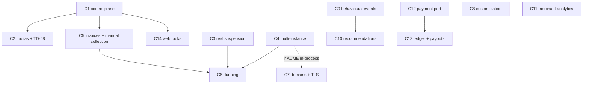

# The commercial platform plan

> **What this page is.** The execution contract for the commercial track: the phases `C1`–`C14`, what each
> delivers, what blocks what, what is deliberately deferred, and the decisions that are the owner's before
> engineering can proceed. The architecture it executes is
> [CommercialPlatformArchitecture.md](CommercialPlatformArchitecture.md); the evidence it rests on is
> [CommercialReadiness.md](CommercialReadiness.md).
>
> **What this page is not.** It is not a roadmap phase list. Per [AGENTS.md](../../AGENTS.md) §5, roadmap phase
> numbers in [ProductRoadmap.md](ProductRoadmap.md) describe **product capability** and are never renumbered or
> reused; engineering missions take a name, not the next free number. These phases are `C1`–`C14` — a **third**
> track beside the roadmap's Phases 1–23 and the master plan's `M1`–`M20`, both of which are closed. Where a `C`
> phase delivers genuine product capability, adding it to `ProductRoadmap.md` §6 is the owner's next roadmap
> edit, and this plan does not pre-empt that placement.
>
> **`C1`, `C2` and `C11` are done.** The *Billing* module exists, plans and entitlements are enforced through the
> seam that already existed, the fail-open default is closed, numeric limits are now **enforced** by a counter row
> that no isolation level can defeat, and merchant analytics answer in the merchant's own day with profit reported
> only as far as the data supports it. `C11` was taken out of order because it is the only phase gated by nothing
> at all — see §0's `next_phase` note.
>
> **Last verified against the code:** 2026-09-21, branch `phase/17-production-hardening`, after `C11`.

---

## 0. Status (machine-readable)

```yaml
plan_version: 1.3.0
track: commercial
current_phase: C11
phase_status: done
# EVERY remaining phase is gated on an owner decision. C11 was the last unblocked one, which is
# why it was taken out of §4's order. The cheapest to unblock, in this order:
#   C-08  -> C9  (behavioural events; the ONLY phase whose cost rises with delay — data not
#                 captured today can never be reconstructed. Answer it even if the answer is "no".)
#   C-17  -> C3  (real suspension), then C6 with C4+C5
#   TD-42 -> C8  (store-authored pages/themes: the cheapest visible credibility fix)
#   C-15  -> C5  (invoices + manual collection; needs P-06 too)
#   D-18  -> C4  (multi-instance: cloud blob storage)
#   C-11  -> C7  (custom domains)
#   D-13 + C-01 -> C12, then C13
#   C-09  -> C10 · C-18 -> C14
next_phase: C9                                 # gated on C-08; no unblocked phase remains
blocked_decisions: ["C-08", "C-17", "TD-42", "C-15", "P-06", "D-18", "C-11", "D-13", "C-01", "C-09", "C-18"]
last_verified_date: 2026-09-21
last_verified_head: 1f0affd                    # C11 closed at d7ee2e5; the commits after it are unblocked
                                               # debt (TD-61, TD-62, TD-60, F-21, TD-48, TD-63), not a C phase
baseline_branch: phase/17-production-hardening

# ── ما جرى بعد C11 وليس مرحلة ─────────────────────────────────────────────
# كل مرحلة تجارية متبقّية موقوفة على قرار مالك، فتحوّل العمل إلى دَين **غير موقوف** من
# TechnicalDebt.md و ReleaseReadiness.md. المغلق: TD-61 (متجر مؤرشف بلا اختبار)، TD-62 (وهو
# الـ P0 الوحيد الذي كان هندسياً)، TD-60 (حدود المعدّل)، F-21 (قراءات بلا حدّ)، TD-48 (حبس
# التركيز)، TD-63 (أرقام الأمان مثبَّتة بقيمها).
#
# وثلاثة عيوب كشفها العمل نفسه لا البحث عنها: F-29 (EF Core يُفعّل RCSI على كل قاعدة يُنشئها،
# فحارس آخر مدير يفشل مفتوحاً على كل نشر — **مفتوح**، مسموع عند كل إقلاع، وإصلاحه مُحدَّد)،
# F-30 (جمود SQL كان 409 داخل معاملة و500 خارجها — مُصلَح)، F-31 (مصنع اختبار مشتقّ يكسر
# ملتقط السجلّ لأصناف لاحقة — مُصلَح).
```

**The completion protocol is the master plan's.** [SouqMasterPlan.md](SouqMasterPlan.md) §3 defines discover →
implement → test → run the real application → Docker verification → representative flows → fix defects → full
release gate → documentation → commit → push → verify remote → clean tree, and §5 defines the STOP conditions.
This plan adds phases, not a second protocol.

---

## 1. The critical path in one line

**Decide the money model → build the control plane → make suspension real → make it multi-instance → bill →
dun.** Everything else runs beside it. The one item whose cost rises every day it is delayed is the behavioural
event foundation (`C9`), because the data it captures cannot be reconstructed afterwards.

---

## 2. The phases

Each phase lists: **delivers · depends on · blocked by · why here**.

### C1 — The commercial control plane

- **Delivers.** The *Billing* module and its registration (`ModuleMap`, the contracts map, a module document).
  *Plan* (versioned), *Subscription*, *Entitlement* and *Limit* as Domain concepts. The effective module set
  derived from the plan in `TenantDirectory.Project` so there stays one answer and one enforcement point. An
  expiring, attributed, audited *EntitlementOverride* for support. **Closing the fail-open default** in
  `TenantInfo.HasModule`, the database default and the tolerant reader, with a test that an unresolvable plan
  grants nothing. Extending `ModuleAndContractRuleTests` so the new feature folder is covered by the
  platform-audit rule, and extending the filter-bypass rule to cover shape-B reads.
- **Depends on.** Nothing.
- **Blocked by.** Nothing. Plans exist under every answer to D-13.
- **Why here.** It is the one piece nothing else can substitute for, and it is small: a value object, a check
  beside the existing check, and a platform screen.
- **Done.** *Plan* (versioned, frozen on publish), *Subscription*, *Entitlement*, *Limit* and an expiring,
  attributed, audited *EntitlementOverride* all exist in `Souq.Domain.Platform`, owned by a registered fourteenth
  module. The effective module set is composed once in `TenantDirectory` as the **intersection** of what the plan
  grants and what the platform has switched on, and every missing input resolves to nothing — recorded as
  [ADR-0053](../11-ADR/0053-entitlement-resolution.md). All three fail-open links are closed, the most important
  of them by the compiler: `TenantInfo.Modules` lost its default value, so every construction site had to be
  decided rather than inherited. A *foundation plan* carrying today's three free modules was created by the
  migration and assigned to every existing store, so no store's behaviour changed. The filter-bypass rule gained
  its shape-B twin, and it immediately found a pre-existing reader that no inventory had listed.
- **Two things C1 did *not* decide, on purpose.** It built the **mechanism** for tiers and limits without naming
  a single commercial tier or limit — that is `C-12`, and the foundation plan is explicitly not an answer to it.
  And it enforces no limit at all: the plan carries numbers and nothing counts, because the counter design is
  `C2`'s and copying the repository's existing count-then-write pattern is what [ADR-0049](../11-ADR/0049-tenant-quota-enforcement.md)
  exists to forbid.
- **`C-14` was answered by this phase's own scope, and the owner may still overrule it.** C1's deliverable list
  named "an expiring, attributed, audited *EntitlementOverride*" — which is option (b) of `C-14` verbatim — so it
  was built. If the owner answers "no", what is removed is one table, one screen section and one file; nothing
  else depends on it. This is flagged rather than buried because engineering chose an option a decision record
  had open.

### C2 — Quotas, and closing TD-68

- **Delivers.** *ITenantQuotaGuard* with one implementation, the per-tenant counter row taken with an explicit
  lock inside the caller's transaction, the reviewed bulk-write entry with its written reason, the reconciling
  sweep that keeps the counter truthful, and an architecture test forbidding any other count-then-insert. A
  startup check that reads the database's own `READ_COMMITTED_SNAPSHOT` setting and warns loudly, closing TD-68
  for the existing administrator guard as well. A concurrency test that can actually reach the guarded branch —
  unlike `LastAdministratorConcurrencyTests`, which cannot.
- **Depends on.** C1 (limits come from the plan).
- **Blocked by.** Nothing.
- **Why here.** A commercial quota that fails open is a billing defect, and the repository's existing pattern
  fails open silently under a database setting that a managed host enables by default.
- **Done (2026-09-21).** *ITenantQuotaGuard* with one implementation, `TenantUsageCounter` as a store-owned
  table, the reviewed bulk-write entry with its written reason, `QuotaReconciliationService` as a
  `StoreSweepService`, and `QuotaRuleTests` forbidding any other count-then-insert. TD-68 closed with the
  startup check `DatabaseIsolation` — on the running database, since a test could only ever assert the test
  container. Wired to the five paths that create or free a countable thing: product create, archive and
  restore; staff invite and enable/disable.
- **Three things C2 decided that the plan did not name, all recorded in [ADR-0054](../11-ADR/0054-limit-semantics-and-catalogue.md).**
  (1) **An absent limit means uncapped, not zero** — deliberately asymmetric with the entitlement gate, and the
  only answer that did not stop every existing store the day this shipped, since the foundation plan carries no
  limits. (2) **`LimitNames` is a closed catalogue**, which *reverses* a C1 abstention: C1 left names
  unvalidated so as not to answer `C-12` implicitly, and this catalogue still does not — it lists what the
  machine can count, never a tier or a value. (3) **Archived products and disabled staff do not count**, because
  neither has a hard delete here and counting them would have made every limit a one-way ratchet with upgrade as
  the only exit — a commercial policy nobody decided.
- **What C2 did *not* do.** No tier and no number was named; `C-12` is untouched and still the owner's. No usage
  is displayed to a merchant — `PeekAsync` exists and takes no lock, and no screen calls it yet.
- **Two pre-existing findings the new rule surfaced, neither in any inventory.** `CouponRedemptions` counts then
  inserts and is **correct** — the coupon aggregate's `rowversion` serialises it, the exception ADR-0049 names —
  and is now inventoried with that reasoning rather than left undocumented. And `HEAD` at `38daea9` did **not**
  build clean from scratch: a blocking `.Result` in C1's own test violates `xUnit1031`, and the incremental build
  was not recompiling that project, so `dotnet build -warnaserror` reported success without ever seeing it.
  Verified against a pristine worktree before fixing.

### C3 — Suspension that actually suspends

- **Delivers.** TD-66 (revoke sessions and refresh tokens on archive; decide suspend separately), TD-67 (a
  store-status filter per message kind in the outbox), TD-61 (the missing archived-store availability tests), and
  the background-sweep list fix so Provisioning and Archived stores are reachable by the jobs that must see them.
  A `Suspend()` path that works from `Provisioning`, which it currently refuses.
- **Depends on.** Nothing.
- **Blocked by.** A product call on what a suspended storefront does (§5, C-17).
- **Why here.** Today suspension is a status column plus a middleware gate, which is fine while a human types it
  and unsafe the moment dunning automates it. This must precede C6.

### C4 — Multi-instance correctness

- **Delivers.** Cross-instance invalidation for **all three** per-process caches (tenant directory 60 s, session
  stamp 30 s, and the rate limiter, whose per-tenant limits currently multiply by instance count). A distributed
  lock or leader election for the single-instance sweeps. Blob storage behind `IFileStorage` (TD-20, R-13) and
  the Domain prefix rule that currently rejects any non-local URL (TD-22).
- **Depends on.** Nothing.
- **Blocked by.** D-18 in the roadmap's decision log — cloud blob storage — which is un-ticked and is the one
  decision row that gates multi-instance uploads.
- **Why here.** It is the precondition for automated dunning and for running ACME in-process, and it is the
  thing most likely to be skipped because nothing fails without it until there are two instances.

### C5 — Platform invoices and manual collection

- **Delivers.** *PlatformInvoice* with Souq's own number series allocated at issue and immutable afterwards, the
  tax snapshot frozen at issue, *CreditNote* as a separate aggregate, and **manual/offline collection** — a
  merchant paying by bank transfer, with invoices, reminders and grace periods operating with no provider in the
  loop. *BillableEvent* and *BillingPeriod* with Open → Closing → Closed.
- **Depends on.** C1.
- **Blocked by.** The invoicing currency and the jurisdictions it must satisfy (§5, C-15, P-06).
- **Why here.** It is the half of billing that needs no payment provider at all, and in this market it is the
  mainstream case rather than the fallback.

### C6 — Dunning and automated suspension

- **Delivers.** The dunning state machine on Souq's own invoice state — not on a provider webhook — with its
  grace period, reminder schedule and escalation to `Suspended`. The platform-scope sweep using the outbox's
  lease pattern rather than `StoreSweepService`, which is per-store and single-instance by its own declaration.
- **Depends on.** C3, C4, C5.
- **Blocked by.** C-17 (what suspension means commercially).
- **Why here.** It is the first place the platform takes an irreversible action against a paying customer
  automatically, so everything it rests on must be true first.

### C7 — Custom domains: verification and certificates

- **Delivers.** The two state machines on `TenantDomain` (ownership and certificate) kept deliberately separate,
  the namespaced TXT token with its expiry, the *IDnsProbe* port, the *IDomainAttachment* port shaped so it can
  hold either a managed edge or a self-run ACME client, the authorization gate that answers yes only for a
  verified host, re-verification and renewal scheduling with backoff, and expiry alerting. Making `VerifiedAt`
  load-bearing, and giving it a way to be undone.
- **Depends on.** C4 if ACME runs in-process (certificate storage needs atomic operations and a lock).
- **Blocked by.** C-11 (managed edge or self-run; apex support; activation SLA; abandoned-domain policy).
- **Why here.** This is what turns onboarding customer #2 from an operation into a product.

### C8 — Customization a merchant can see

- **Delivers.** Real theme presets (CSS only — the hook, validation, delivery and editor already exist). A
  server-validated registry of section types so the home page becomes an ordered descriptor list rather than
  fixed JSX. Store-authored content pages or policy links, per TD-42. Per-store string overrides applied as an
  explicit overlay after boot.
- **Depends on.** Nothing.
- **Blocked by.** TD-42 (scope), and a design decision on what the three presets *are*.
- **Why here.** It is the cheapest credibility fix on the list: a merchant evaluating the product today picks one
  of three themes and sees no difference, which reads as broken.

### C9 — The behavioural event foundation

- **Delivers.** The event envelope and the versioned payload, the bounded non-blocking write path generalised
  from `ISearchLog`, the search-execution identifier minted at query time and echoed back, position-in-list and
  list identity on every impression, write-time denormalisation, the separate identity-link table, the rollup
  jobs, and the retention policy.
- **Depends on.** Nothing technical.
- **Blocked by.** C-08 (is a visitor identifier stored for signed-out shoppers, on what basis, for how long, and
  may it leave the country).
- **Why here — and why the delay is expensive.** Every other item on this plan can be built later at the same
  cost. This one cannot: a purchase that happened before the event existed can never be attributed to the search
  that produced it. **If C-08 is answered "no visitor identifier", say so explicitly and record what is
  permanently foreclosed** — funnel analysis, search-to-purchase attribution, and every behavioural
  recommendation — rather than leaving the question open.

### C10 — Related products and recommendation baselines

- **Delivers.** Attribute/content similarity first, because it needs no behavioural data and is therefore the
  only thing correct on day one for a new tenant. Then co-occurrence with a rescaled measure and a minimum
  support. A *RecommendationReason* closed enum with reviewed Arabic copy. A slot request id and the ordered
  items displayed, so click-through rate is computable at all. Live availability joined at request time. A
  per-tenant readiness state, because the thresholds are per tenant and a paid tier cannot promise what a store
  with forty orders can deliver.
- **Depends on.** C9 for anything behavioural. `FindRelatedProductsAsync` already exists with a route and a
  frontend surface, so the first slice changes one implementation and no client code.
- **Blocked by.** C-09 (may behavioural data be pooled across tenants).

### C11 — Merchant analytics and decision support

- **Delivers.** Per-store time zone in reports — `TenantInfo.TimeZone` is already projected on every request and
  read by nothing in Reporting, so a merchant's "today" is currently wrong by their offset. A cost price on
  `ProductVariant`, which makes line-level margin computable immediately because `OrderItem` already carries
  `VariantId`. Refund-period attribution from `Refund` rows rather than a running total with no date. A
  platform-owner revenue view through `PlatformQueries`.
- **Depends on.** Nothing.
- **Blocked by.** Nothing.
- **Done (2026-09-21).** All four, and each turned out to be a wrong number rather than a missing one:
  - **The merchant's day.** `WindowFor` computed every boundary from `nowUtc.Date` while the browser already
    formatted in the store's zone — so a merchant in a +3 zone was answered about a window opening at 03:00 their
    time, and the trend chart labelled UTC days with store-zone dates. Boundaries are now computed in local time
    with full `TimeZoneInfo` handling (including the midnight that does not exist on a spring-forward night, which
    made `ConvertTimeToUtc` throw). **One limit stays and is written down:** SQL-side bucketing shifts by a single
    offset because EF Core 10 does not translate `AT TIME ZONE` (tried two ways); totals and boundaries are always
    exact, and only a DST zone's two transition days move an hour of orders into the neighbouring bucket.
  - **Refund attribution.** Moved from the order's period to the refund's, from `Refund` rows rather than
    `Payment.RefundedAmount`, which carries no date — and filtered to `Succeeded`, because `Refund.Fail` stamps
    `CompletedAt` exactly as `Succeed` does. This reverses a choice the module page had already half-retracted.
  - **Cost and margin.** `ProductVariant.Cost` optional, `OrderItem.UnitCost` frozen at sale. The design refuses
    two errors: treating an unknown cost as zero (which shows a merchant a 100% margin) and reading today's cost
    for yesterday's sale. Coverage is reported beside the margin so partial data reads as partial.
  - **Platform revenue.** Per store and per currency, never summed across currencies, on a UTC window because the
    query spans zones. Reverses a documented "by design" claim, and raises `C-19` — what the *merchant agreement*
    says the operator can see, which is a contract question and is now recorded as one.
- **Three defects this phase surfaced that nothing else would have.** `F-30`: a SQL Server deadlock escaped
  `SaveChangesAsync` untranslated while `InTransactionAsync` had translated it since F-7, so the same race was a
  retryable 409 inside a transaction and a 500 outside one — and the basket's merge path writes outside one, so
  F-28's retry never saw the class. Only reproducible under full-suite load. `pendingRefunds` counted payments
  rather than refund requests, so an operational alert undercounted the work waiting. And the white-label guard
  caught a currency name in a new *comment*, which is exactly the rule working.

### C12 — The payment port, re-shaped, and the first regional adapter

- **Delivers.** The flow-agnostic port: *StartPayment* returning a discriminated result (redirect, client
  script, browser post, completed synchronously, deferred out-of-band), a persisted *PaymentAttempt* aggregate,
  money totals derived from an append-only event log, a webhook **inbox** with raw-bytes verification and a
  tenant-resolving route, declared adapter capabilities including amount granularity, and refund as its own
  entity. TD-50 (record the account identity, not just its kind) and TD-52 (the injectable gateway factory) are
  prerequisites, not follow-ups.
- **Depends on.** Nothing technical.
- **Blocked by.** D-13 and C-01 — the first adapter defines the port's vocabulary, and building it against a
  provider Souq cannot go live with would validate the wrong shape.

### C13 — Commissions, payouts, ledger and reconciliation

- **Delivers.** The append-only ledger with an explicit direction and the balancing invariant enforced in the
  aggregate. *Commission* with a versioned policy and a named basis. *Payout*. *Chargeback* with a liable
  party and a state machine modelled on the **longest** provider's lifecycle, not the shortest. Three provider
  reference columns per movement. The reconciliation job and its exception queue.
- **Depends on.** C12.
- **Blocked by.** D-13, C-02, C-03, C-04, C-05, C-06.

### C14 — The bounded extension model

- **Delivers.** Outbound webhooks with per-tenant secrets, signing, retries, replay protection and an
  idempotency key, riding the existing outbox for the durable half. A scoped API for a merchant's own systems.
- **Depends on.** C1.
- **Blocked by.** C-18 (never run customer code, webhooks only, or build a sandbox).

---

## 3. Dependencies



`C8` and `C11` depend on nothing and can run at any time. `C9` depends on nothing technical and everything
legal.

## 4. Recommended order

| # | Phase | Why here | Gate |
|---|---|---|---|
| 1 | ~~**C1**~~ **done** | nothing else can substitute for it, and nothing blocks it | — |
| 2 | ~~**C2**~~ **done** | a quota that fails open is a billing defect; also closed TD-68 | — |
| 3 | **C9** | the only item whose cost rises with delay | **C-08** |
| 4 | **C3** | suspension must be real before it is automated | C-17 |
| 5 | **C8** | cheapest visible credibility; parallel to the money track | TD-42 |
| 6 | **C5** | the half of billing that needs no provider | C-15, P-06 |
| 7 | **C4** | the precondition for C6 and for in-process ACME | D-18 |
| 8 | **C6** | the first automated irreversible action against a customer | C-17 |
| 9 | **C7** | turns onboarding into a product | **C-11** |
| 10 | ~~**C11**~~ **done (taken early)** | small, independent, immediately useful to merchants — and the only phase gated by nothing, so it ran once C2 closed | — |
| 11 | **C12** | the port's vocabulary is set by the first real adapter | **D-13, C-01** |
| 12 | **C13** | the whole financial layer, once the port is real | D-13 + five more |
| 13 | **C10** | needs C9's data to have accumulated | C-09 |
| 14 | **C14** | worth building when a customer actually asks | C-18 |

## 5. NEXT OWNER DECISIONS

These are decisions engineering has taken as far as it can and then stopped on purpose. The canonical register
is [OwnerDecisions.md](../09-OPERATIONS/OwnerDecisions.md); the `C-` items below are new and are summarised
there with a pointer here.

### The three that gate the most

**D-13 — merchant of record, and how the platform collects its revenue.** Already open, and this research
changes its shape rather than its answer. Two facts the record did not have: **Stripe does not operate in
Jordan** (the UAE is its only MENA country), so "adopt Stripe Connect" is not available in the home market; and
every mainstream merchant-of-record vendor checked — Paddle, Polar, Stripe Managed Payments, FastSpring —
excludes **physical goods** *and* forbids a platform reselling for third-party sellers, so that door is closed
too. What remains is: (a) each store is its own merchant of record and Souq never touches shopper funds — no
licensing exposure, but commission cannot be netted and a full merchant-billing subsystem is mandatory;
(b) Souq is in the funds flow — commission netting becomes nearly free, and Souq acquires chargeback liability,
KYC obligations and a probable licensing conversation with the Central Bank of Jordan; (c) today's unchosen
state, where it varies per store.

**C-01 — the payment provider for the launch market.** The first adapter defines the port's vocabulary, so
building against a provider Souq cannot go live with would validate the wrong shape. Verified candidates that
support Jordan and JOD: **MyFatoorah** (the only one verified to combine Jordan, JOD, transaction-time splitting
and a native fixed+percentage commission), **Amazon Payment Services** (prices natively in JOD and documents
three-decimal handling — including that VISA requires such amounts to end in zero), **PayTabs** via MEPS,
**HyperPay**, **Telr**, **N-Genius**. Most of these are redirect-first and several cannot split at all. This is
a commercial and contractual choice, not an engineering one.

**C-08 — is a visitor identifier stored for signed-out shoppers?** Storing one makes search-to-purchase
attribution, funnel analysis and behavioural recommendations possible, and makes the event store personal data
under GDPR and Jordan's data-protection law. Not storing one keeps the table outside that regime — the position
`SearchQueryLog` takes today — and permanently forecloses all three. Sub-questions that come with a "yes":
retention (13 months matches one regulator's tracker lifetime; 14 is the industry norm), consent basis, whether
events may leave Jordan, whether consent is per-tenant or per-platform, and who owns the data in the merchant
contract. **Answer this before `C9`, and if the answer is "no", record what it forecloses rather than leaving
the question open.**

### The rest, with what each blocks

| id | Question | Options, in brief | Blocks |
|---|---|---|---|
| **C-02** | Does Souq ever hold shopper funds? | never (software only) · yes (netting becomes possible; licensing question opens) | C13 |
| **C-03** | What is the commission basis? | goods only · goods + shipping · after discounts · gross including tax — on a 100 + 10 shipping order these differ by real money | C13 |
| **C-04** | Does the platform refund its commission when the store refunds a shopper? | always proportionally · never · percentage component only. Both provider defaults are traps: one has the platform funding every refund, the other keeps commission on a sale that did not happen | C13 |
| **C-05** | Who absorbs the rounding remainder on a percentage in a three-decimal currency? | toward the merchant · toward the platform · half-away-from-zero · accumulate and settle | C13 |
| **C-06** | Who bears a chargeback, and how is it recovered? | platform · store, with a rolling reserve percentage and holding period — bank auto-debit is not available here the way it is in some markets | C13 |
| **C-07** | What is the pricing granularity in JOD? | accept a 10-fils minimum increment platform-wide (one rounding rule everywhere) · allow 1-fil pricing and make the rule conditional on tenant, provider and card scheme | C12, C13 |
| **C-09** | May behavioural data be pooled across tenants? | never (correct by construction, simplest to put in a contract, every tenant starts cold) · pooled with consent · pooled anonymously | C10 |
| **C-11** | Custom domains: managed edge or self-run ACME? | managed (per-hostname monthly cost, no certificate handling, wildcards gated) · self-run (free certificates, and Souq owns storage, locking, renewal and expiry alerting). Plus: apex support or CNAME-only, the activation SLA shown to merchants, and the policy for a domain that stops pointing at us | C7 |
| **C-12** | What are the tiers, and per limit: hard, soft or overage? | hard is the only one needing no billing integration; overage needs metering first. **C2 built the mechanism and answered none of this:** limits are hard today because that is the only kind that needs no billing, and the two countable names (`catalog.products`, `staff.seats`) carry no values anywhere | still open — it now blocks *selling*, not *building* |
| **C-13** | Trials? | none · time-limited with reduced limits (needs a Trial state and an expiry sweep) · freemium | C1 |
| **C-14** | May support grant a capability outside a plan? | no · an expiring, attributed, audited override · an ad-hoc flag (creates a second truth — not recommended) | C1 |
| **C-15** | What currency does Souq invoice merchants in, and must it support merchants with no card on file? | JOD · USD; and bank transfer is a mainstream case here, not an edge one | C5 |
| **C-16** | Data residency | single region stated in the contract · the hybrid path `MultiTenancy.md` already designs · regional stamps | C4, C9 |
| **C-17** | What does a suspended storefront actually do? | read-only · admin-only · fully dark — and what happens to orders already placed, to data exports, and whether there is a hard delete | C3, C6 |
| **C-18** | Customer code: never, or eventually? | never (webhooks plus bounded configuration) · webhooks now, reconsider at a named threshold · build a sandbox (a platform, not a feature) | C14 |

### Corrections to existing decision records

- **P-05 is smaller than its record says.** `StripeAmountConverter` already carries an explicit
  `HonoursIsoDecimals` switch and `StripeAmountConverterTests` already encodes **both** hypotheses, including
  that the flag is false so it cannot be flipped by accident. Answering P-05 is a one-value change in front of a
  green test, not new arithmetic. Two rows in [ReleaseReadiness.md](../09-OPERATIONS/ReleaseReadiness.md) still
  say otherwise. Separately, ISO 4217 has exactly seven three-decimal currencies — BHD, IQD, JOD, KWD, LYD, OMR,
  TND — which matches `CurrencyInfo`.
- **P-06 is larger than its record says.** Jordan's national e-invoicing is a **clearance** model: the invoice is
  validated by the tax authority before it is legally issued. That makes it a separate outbound integration
  between "invoice issued" and "invoice legally valid", and it is a strong argument that the store must remain
  the invoice issuer.

## 6. Pure engineering decisions — no owner input needed

Recorded here so they are not mistaken for owner questions, and so nobody asks: the three table shapes and where
commercial entities live; the *Billing* module boundary and its contract edges; the quota mechanism and the
architecture test that enforces it; the shape of the payment port and its result algebra; the webhook inbox and
its dedup rule; the event envelope and its versioning; the domain lifecycle state machines; the ledger's
balancing invariant and reversal-not-update rule; basis points for rates and one rounding site; the
recommendation reason enum; which caches need cross-instance invalidation. All six ADRs (`0047`–`0052`) record
decisions in this category only.

## 7. Deliberately deferred

| Deferred | Until |
|---|---|
| Marketplace splits, payouts and reconciliation against provider reports | D-13 is answered and a provider is chosen |
| Usage-priced tiers and overage | metering has run for a period and the numbers are real |
| Recommendations beyond attribute similarity | a tenant crosses the data thresholds |
| A second payment provider | the first adapter has shipped and the port has survived one real integration |
| Self-service merchant signup | there is a plan to sign up to and a way to charge for it |
| A rollup or read model for dashboards | a measurement breaches a budget — materialisation is currently an accepted rejection in ADR-0044 |
| An inverted-term search table (TD-45) | a measured latency breach on a real catalogue |
| Stemming (TD-46) | search analytics shows a recurring pattern folding and edit distance cannot recover |
| A sandbox for customer code | never, unless C-18 says otherwise — and then it is a platform, with its own ADR |
| Per-store email sending domains | a provider decision, and it overlaps C7's DNS work |
| Multi-currency stores | one currency per store is the cheaper correct answer for this market |
| Microservices, a broker, event sourcing, a per-tenant database, a search engine, Redis | unchanged — [ExplicitNonGoals.md](../02-ARCHITECTURE/ExplicitNonGoals.md), and nothing in this plan is the measured evidence that would reverse one |

## 8. Related

[CommercialPlatformArchitecture.md](CommercialPlatformArchitecture.md) ·
[CommercialReadiness.md](CommercialReadiness.md) ·
[SouqMasterPlan.md](SouqMasterPlan.md) ·
[ProductRoadmap.md](ProductRoadmap.md) ·
[TechnicalDebt.md](TechnicalDebt.md) ·
[OwnerDecisions.md](../09-OPERATIONS/OwnerDecisions.md) ·
[ReleaseReadiness.md](../09-OPERATIONS/ReleaseReadiness.md) ·
[RiskRegister.md](../02-ARCHITECTURE/RiskRegister.md) ·
[ADR index](../11-ADR/README.md)
