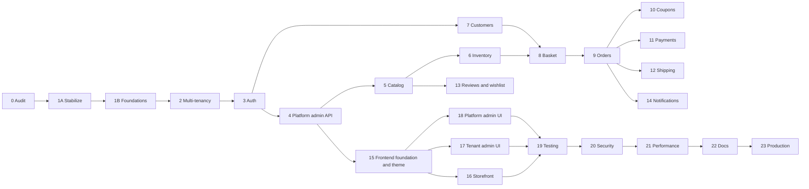

# Souq Platform: Product Roadmap

> **Goal:** turn Souq into one **white-label, multi-tenant e-commerce platform**, sold to many clients (≈ $5,000+ each) and maintainable by a professional team.
> **Status:** Phase 0 ✅ · Target architecture ✅ documented · Phase 1A ✅ (merged to `main`) · Phase 1B ✅ on branch `phase/1b-production-foundations` (awaiting review) · **Autonomous run on `phase/2-15-multitenant-platform`** (branched from the 1B tip): Phase 2 ✅ · Phase 3 ✅ · Phase 4 ✅ · Phase 5 ✅ · Phase 6 ✅ · Phase 7 ✅ · Phase 8 ✅ · Phase 9 ✅ · Phase 10 ✅ · Phase 11 ✅ · Phase 12 ✅ · Phase 13 ✅ · Phase 14 ✅ · Phase 15 ✅. An **engineering-knowledge and handoff pass** then ran on branch `phase/16-engineering-knowledge-and-handoff` (documentation system, module and boundary documentation, generated inventories, documentation tests) — it is not a roadmap phase, and the roadmap's Phase 16 (Storefront) has not started. A second engineering mission, **production hardening**, then ran on branch `phase/17-production-hardening` and **completed at commit `6a520b7`** (23 commits from the Phase 16 tip `d35c666`): payment-intent state machine, tenant-isolation, transaction, concurrency, idempotency and API-contract audits, and the release-readiness triage in [ReleaseReadiness.md](../09-OPERATIONS/ReleaseReadiness.md). It is **not** a roadmap phase either, and the roadmap's Phase 17 (Tenant admin dashboard) has not started.
> **Companion document:** [ArchitectureAssessment.md](../archive/ArchitectureAssessment.md) covers the current state, the problem register (IDs such as `B1` and `C2`), the target architecture, and the full reasoning behind every decision (`D-xx`).
> **Last updated:** 2026-09-14

---

## 1. Vision

**One codebase, one deployment, many independent stores.**

The platform owner provisions and configures client stores ("tenants") from a central platform administration area.
Each tenant gets its own domain, branding, language, currency, catalog, customers, orders, and enabled modules.
The backend enforces tenant isolation.
A client never sees another client's data, even if the UI or an API call is manipulated.

```
            ┌────────────────────── Souq platform (one codebase, one deployment) ──────────────────────┐
            │                                                                                            │
 admin.souq.app ─► Platform administration (platform owner/admins, no tenant context)                  │
 client-a.com  ─►  Storefront + /account + /admin   ── tenant A: own branding, data, modules            │
 client-b.com  ─►  Storefront + /account + /admin   ── tenant B: own branding, data, modules            │
            │                                                                                            │
            └──────────── shared SQL Server database, every tenant-owned row carries TenantId ───────────┘
```

## 2. Product principles (non-negotiable)

1. **One product.** No per-client forks, no `SouqClientA`, and no `if (tenant == "abc")` in code. Tenants differ only through configuration, data, and modules.
2. **The backend enforces isolation, centrally.** Isolation comes from global query filters, write guards, and automated tests. It never depends on the frontend.
3. **Evolve, don't rewrite.** Keep what works (Assessment §10). There is no second competing architecture.
4. **Every phase ends shippable.** Build green, tests green, app runnable, docs updated, committed.
5. **Secure by default.** Least privilege, no secrets in git, and no tokens or sensitive data in logs.
6. **Every abstraction pays rent.** Interfaces exist only at real variation points: payments, shipping, storage, notifications, tenancy.
7. **Explain the why.** Every phase report states what changed, why, which layer it lives in, the principle behind it, the alternatives, and how to reuse the idea elsewhere.

## 3. Actors and areas

| Actor | Scope | UI area | Served on |
|---|---|---|---|
| **Platform Owner** | Whole platform, including owner-only settings | Platform admin | Platform host (e.g. `admin.souq.app`) |
| **Platform Admin** | Delegated platform operations | Platform admin | Platform host |
| **Tenant Admin** (store owner) | One tenant, full control | Back-office `/admin` | Tenant domain |
| **Tenant Staff** | One tenant, permission subset | Back-office `/admin` | Tenant domain |
| **Customer** | Own account inside one tenant | Storefront + `/account` | Tenant domain |
| **Visitor** | Public storefront | Storefront | Tenant domain |

## 4. Milestones

| Milestone | Phases | Outcome |
|---|---|---|
| **M0 Baseline** | 0 | Audit, target architecture, this plan |
| **M1 Platform core** | 1A · 1B · 2 · 3 · 4 | Stable, multi-tenant, secure identity, tenants manageable through the API |
| **M2 Commerce core** | 5 – 10 | Complete tenant-aware catalog, inventory, customers, basket, orders, coupons |
| **M3 Integrations** | 11 – 14 | Pluggable payments, shipping, reviews/wishlist, notifications |
| **M4 Experience** | 15 – 18 | White-label frontend: storefront, tenant admin, platform admin |
| **M5 Launch** | 19 – 23 | Tested, secured, fast, documented, production-ready → **first client** |



*The graph shows true dependencies. Execution stays sequential, one approved phase at a time (see CLAUDE.md), but the graph shows which reorderings are safe if priorities change.*

## 5. Recommended changes to the original 23-phase plan

The original ordering is sound. I recommend five adjustments:

| # | Change | Why |
|---|---|---|
| 1 | **Split Phase 1** into **1A Stabilize** and **1B Architecture foundations** | The audit found live defects: overselling race, cancelled orders never restock, a default admin password seeded in production, reset links written to logs, and an upload path that allows stored XSS. Multi-tenancy would multiply each of them by N tenants. Two small gates are easier to review than one large one. |
| 2 | **Testing becomes continuous.** The integration-test harness was built in 1A (moved forward from 1B), and Phase 19 becomes gap closure + E2E + load | Tenant-isolation tests must exist from the first day of Phase 2. A tenancy bug found in Phase 19 would mean re-auditing 17 phases of work. |
| 3 | **The white-label/theme runtime moves from 18 to 15** and merges with the frontend foundation. The old 15/16/17 become 16/17/18 | Storefront, tenant admin, and platform admin all build on the theme and tenant-config runtime. Doing it last means restyling every screen twice. |
| 4 | **Security quick wins are pulled forward** into 1A and 3 | Phase 20 becomes verification and hardening, not the first time security is considered. |
| 5 | **The storefront config API lands in Phase 4 (backend)** | Tenant configuration must exist and be testable before the frontend consumes it in Phase 15. |

## 6. Phase plan

Status legend: ✅ done · 🟡 in progress · ⏳ planned · ⏸ awaiting approval

**Roadmap phases are product capability, and only product capability.** The numbers below describe what a customer or a store owner can do when the phase is finished. They are never renumbered, never reinterpreted, and never consumed by engineering work.

**Engineering missions are separate and carry no roadmap number.** Hardening, release-readiness and knowledge work run on their own branches and close against the registers, not against this plan. Two have run so far — `phase/16-engineering-knowledge-and-handoff` (the documentation system) and `phase/17-production-hardening` (completed at `6a520b7`) — and neither advanced the roadmap: Phase 16 (Storefront) and Phase 17 (Tenant admin dashboard) are both still ⏳. The number in such a branch name is a branch sequence, not a phase. When an engineering mission needs a name, give it one ("production hardening", "operational readiness") rather than the next free roadmap number.

### Phase 0: Complete system audit ✅
- **Goal.** Understand the system completely before changing it.
- **Delivered.** [ArchitectureAssessment.md](../archive/ArchitectureAssessment.md), which contains the feature, entity, API, database, and frontend maps, an end-to-end trace, the problem register, the target architecture, and the migration strategy. Also this roadmap.
- **Verified.** `dotnet build` passes with 0 warnings. `dotnet test` passes 133/133. The frontend production build passes. NuGet reports no vulnerable packages.

### Target architecture ✅ (documented before Phase 1A, 2026-09-11)
- **Delivered:**
  - [Architecture.md](../02-ARCHITECTURE/Architecture.md) and [ArchitectureEvaluation.md](../02-ARCHITECTURE/ArchitectureEvaluation.md) (ten styles evaluated);
  - [Modules.md](../04-MODULES/Modules.md), [MultiTenancy.md](../02-ARCHITECTURE/MultiTenancy.md), [DatabaseDesign.md](../06-DATABASE/DatabaseDesign.md), [ApiDocumentation.md](../05-API/ApiDocumentation.md);
  - [Security.md](../07-SECURITY/Security.md), [AuthenticationAndAuthorization.md](../07-SECURITY/AuthenticationAndAuthorization.md);
  - [FrontendArchitecture.md](../08-FRONTEND/FrontendArchitecture.md), [WhiteLabel.md](../08-FRONTEND/WhiteLabel.md), [DevelopmentGuide.md](../09-OPERATIONS/DevelopmentGuide.md);
  - ADRs 0001–0016 in [adr/](../11-ADR/).
- **Decision:** modular monolith + Clean/Hexagonal boundaries + selective DDD + vertical slices + selective CQRS. Modules are namespaces inside the four layer projects, enforced by architecture tests.

### Phase 1A: Stabilize + foundations the fixes depend on ✅ (merged 2026-09-11)
- **Goal.** Fix the confirmed correctness and security defects before tenancy multiplies them. Put in place the minimum foundations those fixes need and every later phase reuses: concurrency, money precision, test harness, architecture tests.
- **Scope change (2026-09-11).** Per the architecture brief, concurrency (C1/C4), JOD precision (C5), the payment-port cleanup (D1/D2), and the integration-test harness moved here from 1B.
- **Scope.**
  - Security:
    - no default admin outside Development (B1);
    - no reset links, tokens, or PII in logs (B2);
    - hashed CSPRNG reset tokens (B6);
    - content-sniffed uploads with server-chosen extensions and a locked-down `/uploads` (B3);
    - personal email defaults removed (B12);
    - non-breaking `npm audit fix` (B11).
  - Correctness:
    - `rowversion` on Products, Coupons, Orders with a 409 on conflict (C1);
    - compare-and-set stock edits (C4);
    - `decimal(19,4)` + `Money` minor-unit enforcement (C5);
    - cancelling restocks with a `Cancellation` ledger entry, and payment failure is logged in the ledger (C2, C3);
    - intent-creation failure cancels the order and releases stock (C6);
    - `Order.Cancel` guarded against Cancelled → Cancelled (C10);
    - admin category filter fixed (C8);
    - paging validated (C9);
    - Money, concurrency, and unique-violation errors → 400/409 instead of 500 (C11).
  - Boundaries:
    - Stripe webhook parsing and client config behind `IPaymentService`, with no static Stripe key (D1, D2);
    - Result→HTTP mapping in one place (D5, partial);
    - a single `IFileStorage` (the duplicate `IVideoStorage` removed).
  - Database integrity: a `Categories.ParentId` FK; non-nullable aggregate-child FKs.
  - Tests:
    - `Souq.IntegrationTests` (Testcontainers SQL Server + `WebApplicationFactory`);
    - `Souq.ArchitectureTests` (NetArchTest);
    - AwesomeAssertions replaces FluentAssertions;
    - Vitest for frontend pure logic.
  - Housekeeping:
    - untrack `.vs/` (G1);
    - delete the stale `database/*.sql` (G2);
    - correct README facts (F4);
    - remove the unused `useProducts` (E7);
    - neutral `FRONTEND_URL` (G3).
- **Out of scope.** Tenancy, identity split, ProblemDetails, query services, new features.
- **Decisions taken (delegated).** P-01 (branch per phase), P-02 (AwesomeAssertions), D-20 (Testcontainers).
- **Result (2026-09-11).** 233 tests green: Domain 87 · Application 102 · Architecture 7 · Integration 29 (real SQL Server via Testcontainers) · Frontend 8. `dotnet build` 0 warnings; `npm run build` clean. Status per finding: [ArchitectureAssessment §16](../archive/ArchitectureAssessment.md#16-status-after-phase-1a-2026-09-11).
- **Exit criteria.**
  - Every fix has a unit and/or integration test.
  - `dotnet build` has 0 warnings; the full `dotnet test` suite is green (Docker).
  - `npm test` + `npm run build` are green.
  - Architecture tests pass.

### Phase 1B: Production foundations ✅ (⏸ awaiting review)
- **Goal.** Finish the shared building blocks every later module reuses, before multi-tenancy multiplies them.
- **Scope reconciliation (2026-09-11).** Re-derived from the repository, not from the original bullet list:
  - Already delivered in 1A and not redone: the money model, concurrency tokens and 409s, the Testcontainers SQL Server harness, one Result→HTTP helper, upload validation, the payment port.
  - **Module namespace moves stay per phase.** The old bullet "move existing code into module namespaces" contradicted [ADR-0002](../11-ADR/0002-modular-monolith-structure.md) and [Architecture.md §4](../02-ARCHITECTURE/Architecture.md#4-physical-structure-of-modules) ("no big-bang rename; each module moves when its phase rebuilds it"). The ADR wins. 1B adds module-isolation architecture tests over today's feature folders instead.
- **Delivered.**
  - **Error contract:** RFC 7807 ProblemDetails with a stable `code` and `traceId`, typed `Error`/`ErrorKind`, one status table, domain exceptions with codes → 422, handlers never catch them (D5, D6); the frontend translates codes (A9). [ADR-0017](../11-ADR/0017-error-contract.md).
  - **Clock:** `TimeProvider` everywhere; audit timestamps in a SaveChanges interceptor; an IL-level rule against direct clock reads (D12).
  - **Authorization:** `ICurrentUser`, permission policies (`[HasPermission]`), ownership checks in use cases (B7), payment confirmation split into owner and webhook entry points, an explicit auth decision on every endpoint. [ADR-0019](../11-ADR/0019-authorization-foundation.md).
  - **Reads:** one projection query service per module; shared paging (`IPagedQuery`, `PagedQueryValidator`, `ToPageAsync` over an `IOrderedQueryable` plus a projection); id tiebreakers on every sort; `ProductSortBy` out of the Domain (D3, D4); repositories trimmed and `Update()` removed (D7); review N+1 removed (C13); four unbounded lists paged.
  - **Observability:** W3C correlation id header equal to the ProblemDetails `traceId`, one request log line, scopes (`CorrelationId`, `UserId`, `UseCase`), slow-use-case warnings, JSON logs in Production. [ADR-0018](../11-ADR/0018-observability.md).
  - **Configuration:** validated typed options, fail-fast before data access, an explicit payment provider outside Development (the fake gateway had been implicit in the Production Docker stack), startup warnings, HTTP client timeouts, storage options out of `Program.cs` (D10). [ADR-0020](../11-ADR/0020-configuration-and-secrets.md).
  - **Transactions** documented and standardized. [ADR-0021](../11-ADR/0021-transaction-boundaries.md).
  - **Architecture tests:** module isolation, the `TenantId` tripwire, no entities in contracts, no `IQueryable` across boundaries, no direct clock reads, controllers can't read claims.
- **Not in 1B, by design:** `ITenantContext`, `TenantId`, global query filters (Phase 2); identity split and token rotation (3); audit log (4); outbox (14); OpenTelemetry (23). No schema migration was needed.
- **Result (2026-09-11).** 352 tests green: Domain 95 · Application 118 · Architecture 24 · Integration 95 (real SQL Server) · Frontend 20. `dotnet build` 0 warnings; `npm run build` clean. Every commit verified on its own tree. Status per finding: [ArchitectureAssessment §17](../archive/ArchitectureAssessment.md#17-status-after-phase-1b-2026-09-11).
- **Exit criteria (met).**
  - Every API error is ProblemDetails.
  - Controllers contain no ownership or claims logic.
  - Module dependency tests pass.
  - The UI is unchanged apart from paging on four lists.

### Phase 2: Multi-tenancy foundation ✅ (autonomous run, branch `phase/2-15-multitenant-platform`)
- **Delivered ([ADR-0022](../11-ADR/0022-tenancy-enforcement.md), [MultiTenancy.md §8](../02-ARCHITECTURE/MultiTenancy.md#8-implementation-phase-2)):**
  - The `Tenant`/`TenantDomain` aggregate and `ITenantOwned` on all nine business entities.
  - Host resolution with platform hosts and conveniences that exist only in Development/Testing, and store-status gating (`StoreNotFound` 404, `StoreUnavailable` 503).
  - `tid` token binding.
  - A named EF filter that throws without a tenant, and a write guard.
  - **Tenant-scoped composite FKs**, so a cross-store reference is impossible in the database.
  - Per-store uniqueness and `TenantId`-leading indexes.
  - Tenant-prefixed uploads served only on the owning host, and a bounded directory cache.
  - Explicit store currency, with no default in `Money` and an `Order.Currency` snapshot.
  - `TenantId` in log scopes.
  - Migration `Phase2MultiTenancy`, rehearsed on Phase 1 data.
- **Found and fixed during the phase:**
  - Product creation accepted any category id on the platform. It now checks within the store, backed by the composite FK.
  - Coupon preview trusted a client-sent currency.
- **Decisions implemented:** D-01, D-02, D-03 (int keys kept; slugs and codes per store), P-04 ("Marka Demo" = tenant 1). The rehearsal used a Phase 1-shaped copy on Testcontainers SQL Server, because the developer database was offline; the migration is additive.
- **Exit criteria (met):**
  - Every existing feature works under the default store (the full pre-existing suite is green).
  - A second store is isolated: `TenantIsolationTests` has an explicit endpoint table plus a completeness check, and covers listings, references, tokens, the write guard, missing context, uploads and uniqueness.
- **Goal.** Every tenant-owned row belongs to exactly one tenant, and the backend blocks cross-tenant access by default.
- **Foundations already in place (1B).** `ICurrentUser` ready for a `tid` claim; one request log scope with a `TenantId` slot; the SaveChanges interceptor seam for the write guard; reads only through query services (one place for filters); the `TenantId` tripwire test; explicit endpoint authorization; 404 for foreign resources. Checklist and exact prerequisites: [MultiTenancy.md §8](../02-ARCHITECTURE/MultiTenancy.md#8-implementation-phase-2).
- **Scope.**
  - Domain: a `Tenant` aggregate (name, slug, status, default culture, currency, time zone), `TenantDomain`, and an `ITenantOwned` marker.
  - Resolution (D-02): Host header → `TenantDomains` (cached).
    - The dev strategy is `*.localhost`, or a dev header that works in Development only.
    - `ITenantContext` is defined in Application.
  - Enforcement (D-01):
    - EF Core global query filters on every `ITenantOwned` entity.
    - A SaveChanges guard that stamps `TenantId` on insert and rejects cross-tenant writes.
    - Platform bypass happens only through explicit, audited platform queries.
  - Data migration: create the default tenant ("Marka Demo", P-04), backfill `TenantId`, then:
    - make the column `NOT NULL`;
    - make the unique indexes composite: `(TenantId, Slug)`, `(TenantId, Code)`, `(TenantId, Email)`;
    - make indexes lead with `TenantId`.
  - Tenant-aware cache keys and storage paths.
  - **Isolation test suite:** for every tenant-owned endpoint, tenant B cannot list, read, update, or delete tenant A's resources (expected: 404).
  - The frontend keeps working through the dev tenant strategy.
- **Decisions needed.** D-01, D-02, D-03, D-06, P-04.
- **Exit criteria.**
  - Every current feature works under the default tenant.
  - A seeded second tenant is fully isolated, proven by automated tests.
- **Docs.** `MultiTenancy.md`.

### Phase 3: Authentication and authorization ✅ (autonomous run)
- **Delivered ([ADR-0023](../11-ADR/0023-sessions-and-credentials.md), [AuthenticationAndAuthorization.md](../07-SECURITY/AuthenticationAndAuthorization.md)):**
  - A `User` aggregate (store or platform account) plus a `Customer` profile, migrated from `Customers` with ids and password hashes preserved. Migration `Phase3Identity`, rehearsed.
  - Five roles over a store/platform permission catalog. Staff without a customer profile can't shop.
  - Sessions:
    - a 15-minute access JWT (`tid`, `cid`, `sstamp`);
    - rotating, hashed refresh tokens in an `HttpOnly` cookie, with family reuse detection and a 10 s grace for several tabs;
    - revocation on logout, password change or reset, and reuse.
  - Host binding for both areas: store tokens work only on their store, and platform tokens only on platform hosts.
  - Account protection:
    - lockout and a timing-safe login;
    - email verification, with resend;
    - hashed single-use tokens and a password policy;
    - rate limits per host and IP (429 + `Retry-After`) behind trusted forwarded headers;
    - email links on the requesting host.
  - A platform-owner bootstrap from secrets.
  - Frontend:
    - the access token in memory;
    - a silent refresh on load and on 401, as a single flight;
    - permission-based guards and admin navigation;
    - a verify-email page.
- **Found and fixed during the phase:**
  - EF generated a migration that dropped every password before copying it. It was rewritten and rehearsed.
  - `Jwt:ExpiryMinutes` accepted 120 minutes. It is now limited to 5–60.
  - Email links used one configured frontend URL, which was wrong for every store but one.
- **Deferred, with reasons:**
  - Requiring email verification at checkout: it is a store setting (Phases 4 and 9).
  - An absolute refresh-family lifetime (Phase 20 review) and "log out everywhere" (Phase 16 account page).
  - Custom roles (YAGNI).
- **Exit criteria (met):**
  - `AuthorizationMatrixTests` (role × endpoint) are green.
  - Store A's token is rejected on B's host (`TenantIsolationTests`).
  - `AuthSessionTests` cover refresh reuse, lockout, platform/store separation and rate limiting.
- **Goal.** Secure, tenant-aware identity with a hard separation between platform and tenant.
- **Scope.**
  - Identity split (D-06): a `User` aggregate (tenant-scoped or platform) plus a `Customer` commerce profile, migrated from `Customers`.
  - Roles: PlatformOwner, PlatformAdmin, TenantAdmin, TenantStaff, Customer. Authorization uses a permission catalog, `[HasPermission]` policies, and resource checks in Application (D-05).
  - Tokens (D-04):
    - A 15-minute access JWT carrying `tid`, roles, and a security stamp.
    - Rotating refresh tokens (random, stored hashed, with reuse detection) in a `HttpOnly`/`Secure`/`SameSite` cookie.
    - Revocation on logout and password change.
    - The `tid` claim must match the tenant resolved from the host.
  - Account security:
    - lockout;
    - email verification;
    - hashed reset tokens (B6);
    - a password policy;
    - rate limiting on auth and coupon-preview endpoints (B5);
    - a platform-owner bootstrap from secrets.
  - Frontend: access token held in memory, silent refresh. This is a minimal adaptation.
- **Decisions needed.** D-04, D-05, D-06.
- **Exit criteria.**
  - Authorization-matrix tests (role × endpoint) pass.
  - A token from tenant A is rejected on tenant B's host.
  - Refresh-reuse detection and lockout are tested.
- **Docs.** `AuthenticationAndAuthorization.md`.

### Phase 4: Tenant and platform administration (backend) ✅ (autonomous run)
- **Delivered ([ADR-0024](../11-ADR/0024-platform-administration.md)):**
  - **Platform API** (`/api/platform/*`, platform host only, `platform.*` permissions, every request audited):
    - stores: create, edit name and currency, activate, suspend, archive;
    - domains: add, remove, set primary, verify manually;
    - settings and branding uploads;
    - modules;
    - inviting store administrators;
    - listing a store's administrative accounts;
    - platform accounts: invite, list, enable, disable;
    - statistics and the audit log.
  - **Store settings** as a validated document:
    - per-language texts;
    - WCAG-checked colours;
    - curated typography and theme presets;
    - contact details and allowlisted social links;
    - SEO;
    - logo, favicon and social image uploads (content-sniffed, ICO for favicons).
  - The **default store is seeded with today's Marka look**.
  - **Store-side administration:** `/api/admin/store/*` for settings and branding, and `/api/admin/staff` to invite, list, enable and disable staff.
  - **Public `GET /api/storefront/config`:** cached, ETag + 304.
  - **Module enforcement:**
    - endpoints answer `404 ModuleDisabled`;
    - checkout rejects a coupon when promotions are disabled.
  - **Append-only audit log:** a MediatR behavior writes it in the handler's transaction.
  - **Invitations:** hashed 72-hour tokens, with the link on the store's own domain, and an `/accept-invitation` page.
  - Migration `Phase4PlatformAdministration`: additive; existing stores keep every module.
- **Found and fixed during the phase:**
  - A store name could carry control characters into email subjects.
  - Password reset now confirms the email address, because the token proves the user received the email.
- **Deferred, with reasons:**
  - The platform UI (Phase 18; the API is complete).
  - DNS or TLS domain verification (Phase 23).
  - Plans and subscriptions (after launch).
  - Per-store email templates (Phase 14).
  - An audit viewer for store admins (Phase 17).
- **Exit criteria (met):** `PlatformAdministrationTests` runs the scripted scenario:
  - create a store → add a domain and branding → set modules → invite the admin → the admin signs in on the store's host;
  - the store is activated, its storefront config reflects the settings, and a disabled module answers 404;
  - after suspension, the storefront reports 503;
  - audit entries carry the actor, area and store.
- **Goal.** The platform owner can provision and configure a tenant end-to-end through the API.
- **Scope.**
  - Platform API:
    - tenants: create, edit, activate, suspend, archive;
    - domains: add, verify, set primary;
    - identity and branding: name, logo, favicon, colors, typography preset;
    - store settings: contact, address, social, SEO, currency, language, time zone;
    - modules on and off (D-11);
    - creating or inviting tenant admins;
    - managing platform users.
  - A public **storefront config** endpoint (resolved from the host, cacheable with an ETag) (D-12).
  - Server-side module enforcement, returning 404 when a module is disabled.
  - An **audit log** (D-17) for platform and back-office actions.
  - A basic platform statistics endpoint.
- **Decisions needed.** D-11, D-12, D-17.
- **Exit criteria.**
  - Scripted scenario passes: create tenant → domain + branding → modules → invite admin → the admin logs in on the tenant host.
  - A suspended tenant's storefront reports it is unavailable.
  - Audit entries are written.
  - The UI arrives in Phase 18; until then this is driven through Swagger.

### Phase 5: Products and categories, complete CRUD ✅ (autonomous run)
- **Delivered ([ADR-0025](../11-ADR/0025-catalog-model.md)):**
  - **Per-language texts** (D-10): `ProductTranslations` and `CategoryTranslations`, each with name, description and SEO title/description. The store's default language is required. Order lines snapshot the name in that language.
  - **Default variant** (D-21): every product sells through exactly one default `ProductVariant`, which holds the SKU (unique per store), the price and the compare-at price. Stock stays on the product until Phase 6.
  - **Lifecycle:** Draft / Active / Archived, with no hard delete (`DELETE` archives). The admin list covers every status and restores archived products (fixes C7). The storefront shows Active products in active categories.
  - **Slugs, unique per store:** suggested from the Latin name, with a numeric suffix. `GET /api/products/by-slug/{slug}`.
  - **Offers:** compare-at price and a struck-through price in the UI; the `onSale` filter exists in the API (`GET /api/products?onSale=true`) but the frontend never sends it, so the "Offers" page still lists the whole catalog (TD-30).
  - **Gallery:** up to 10 ordered images (the first is primary); remove and reorder endpoints; files under the tenant prefix.
  - **Category tree:** cycle and depth (5) guards, sort order, a visibility flag (a hidden category hides its products), SEO fields.
  - **Admin API:** `/api/admin/products` (search over name, SKU and slug; status and category filters; sort; paging), full product detail, status changes, image removal and ordering, `/api/admin/categories`.
  - **Frontend:** per-language fields, SKU, compare-at price, status and slug in the admin product form, plus gallery management. Status filter and archive/restore in the product table. Tree view and visibility toggle for categories. Localized names and offer prices on the storefront.
  - **Migration `Phase5Catalog`:** rewritten by hand to preserve data, and rehearsed on legacy rows.
- **Deferred, with reasons:**
  - Attributes and the variant option matrix: no current use case; the model admits them.
  - A sanitized rich description: needs a sanitizer dependency; rendered in Phase 16.
  - Image resizing: dependency decision.
  - Orphaned-file cleanup: a background job, Phase 6 or later.
  - Storefront routes by slug: Phase 16 (the API exists).
- **Exit criteria (met):**
  - `CatalogTests` cover CRUD and listing:
    - status visibility;
    - translations round-trip;
    - slug lookup and validation;
    - offers;
    - cycle and depth rejection;
    - a hidden category;
    - the gallery.
  - The isolation suite covers every new endpoint, including cross-store image ids and per-store slug and SKU uniqueness.
  - The list endpoints run the same number of SQL commands for 2 and for 10 products (no N+1).
- **Goal.** A professional, tenant-aware catalog model.
- **Scope.**
  - Categories:
    - a tree with a real FK and cycle prevention;
    - sort order, active flag, and SEO fields;
    - translations (D-10);
    - move and reorder.
  - Products:
    - slug, status (Draft/Active/Archived), SKU, and compare-at price, which enables real "offers";
    - brand, sanitized rich description, multiple images, and attributes;
    - variants, with **a default variant for every product** (D-21);
    - translations.
  - An admin listing covering every status, with search, filter, sort, and paging. Archive and restore fix C7.
  - Storefront catalog queries as projections. Search and related products.
  - Tenant-scoped image storage with validation. Resizing is optional (dependency decision).
- **Decisions needed.** D-10, D-18, D-21.
- **Exit criteria.**
  - CRUD and listing tests pass.
  - The isolation suite covers the new tables.
  - List endpoints have no N+1 queries.

### Phase 6: Inventory ✅ (autonomous run)
- **Delivered ([ADR-0026](../11-ADR/0026-inventory-reservations.md)):**
  - **`InventoryItem` per variant:** on hand, reserved, available, low-stock threshold, `rowversion`, and database check constraints. Stock left `Product`.
  - **Explicit `StockReservation`s:**
    - checkout reserves, in the same transaction as the order;
    - payment commits them — the only place a `Sale` line is written;
    - cancelling or a failed payment releases them;
    - cancelling a paid, unshipped order restocks it;
    - every transition happens once.
  - **Concurrency:** `rowversion` conflicts are retried from a fresh read (up to 5 attempts), so the last unit sells exactly once and the losers get `422 InsufficientStock`.
  - **Ledger:** only `InventoryItem` can create a movement, so Σ movements = on hand. The migration writes opening balances.
  - **Corrections:** `POST /api/admin/inventory/{productId}/adjustments` (a delta plus a reason, audited) and `PUT …/threshold`. The product form no longer carries stock (fixes C4).
  - **Expiry** (D-15, a hosted service): every 60 s, each active store's expired reservations are settled. The gateway is asked to cancel the payment intent first; if it had already succeeded, the order is confirmed instead (closes the C6 residual).
  - **Contracts:** Ordering calls `IInventoryReservations` and `IStockAvailability`; Catalog's `IVariantStockInitializer` is implemented by Inventory. The architecture test allows exactly these contract references, with no cycles.
  - **Frontend:** the inventory page shows on hand, reserved and available, with an adjustment drawer. The product form sets stock only on create.
  - **Migration `Phase6Inventory`:** rewritten by hand to preserve data, and rehearsed with Pending and Paid legacy orders.
- **Deferred, with reasons:**
  - Low-stock notification emails: they need the outbox (Phase 14). The dashboard badge and list exist.
  - A distributed lock for the sweeper when several instances run: Phase 23. Running two instances is safe but redundant.
  - Basket reservations: Phase 8 decides.
  - Refunds for paid-then-cancelled orders: Phase 11.
- **Exit criteria (met):**
  - Parallel-checkout tests: 5 buyers on the last unit → exactly one order and four `422 InsufficientStock`; 8 buyers on 3 units → exactly 3.
  - `InventoryAndOrderTests` assert Σ ledger = on hand and Σ active reservations = reserved after every step: reserve, pay, cancel paid, cancel pending, adjust, expire.
- **Goal.** Correct stock under concurrency, with a complete audit trail.
- **Scope.**
  - An `InventoryItem` per variant tracking on-hand, reserved, and available quantities.
  - Reservations: taken when an order is placed, committed on payment, and released on cancel or expiry. Expiry runs as a background service (D-15).
  - An adjustment command that takes a delta and a reason. It replaces the absolute stock value in the product form, fixing C4.
  - A ledger entry for every change.
  - Low-stock thresholds and alerts.
  - Retry on concurrency conflicts.
- **Exit criteria.**
  - Parallel-checkout test: the last unit is sold exactly once.
  - The ledger reconciles with on-hand stock in every scenario.

### Phase 7: Customers and addresses ✅ (autonomous run)
- **Delivered ([ADR-0027](../11-ADR/0027-customer-profile-and-erasure.md)):**
  - **Profile:** `GET/PUT /api/account/profile` (name, phone). The customer is always the caller; staff get `403 CustomerAccountRequired`.
  - **Address book:** a `PostalAddress` value object and `CustomerAddress` entities inside the `Customer` aggregate:
    - at most 20 addresses;
    - exactly one default shipping and one default billing address while any exist;
    - removing a default moves it to the oldest remaining address.
    - Endpoints: `/api/account/addresses` (CRUD plus the two default endpoints). Another customer's address id is a 404.
  - **Checkout:** `POST /api/orders` accepts `shippingAddressId` (resolved in the caller's own book, otherwise `400 AddressNotFound`) or typed text. The order keeps a single-line snapshot, now limited to 500 characters by the entity.
  - **Status:** Active or Blocked. A blocked customer can't order or review (`403 CustomerBlocked`) but can still sign in, view and export their data.
  - **Admin:**
    - `GET /api/admin/customers` (`customers.view`): search by name, email or phone; status filter; order count, spend and last order.
    - Detail with addresses. Order history via `GET /api/orders?customerId=`.
    - `PUT …/status`, `GET …/export` and `POST …/erase` (`customers.manage`, audited).
  - **Data rights:**
    - `GET /api/account/export`: JSON with profile, addresses, orders with their lines, and reviews.
    - `POST /api/account/erase` (password re-entry): profile and login anonymized, every session ended immediately, orders and reviews retained.
  - **Frontend:** a "My account" page (profile, address-book drawer, data download, deletion), a saved-address picker at checkout, and an admin customers page with a detail drawer.
  - **Migration `Phase7Customers`:** additive only.
- **Deferred, with reasons:**
  - The narrower `ICustomerDirectory` contract: Ordering and Reviews still read the `Customer` aggregate through the domain repository (block check, address snapshot). It will be added when a second consumer or an extraction needs it.
  - Structured order addresses: Phase 12, because shipping rates need the structured shape. (A single-line billing-address snapshot arrived in Phase 9.)
  - Self-service email change needs a verification flow. Marketing preferences come with Phase 14.
  - A retention policy that purges the shipping snapshots of erased customers' old orders: Phase 20 (compliance).
- **Exit criteria (met):**
  - **Ownership:** `CustomerAccountTests`:
    - customer B gets 404 for customer A's address on update, delete and both default endpoints;
    - checkout with A's address id is `400 AddressNotFound`;
    - after deletion the old session gets 401 and the password no longer signs in.
  - **Isolation:** `TenantIsolationTests`:
    - store B's admin gets 404 on all four admin routes for A's customer;
    - B's customer gets 404 on A's address routes;
    - B's customer list and `orders?customerId=` exclude A's customer;
    - A's customer is unchanged afterwards.
- **Scope.**
  - Self-service profile.
  - Structured address book with default shipping and billing addresses.
  - Account status (active, blocked).
  - Admin customer list and detail pages, with order history.
  - Basic data export and deletion.
- **Exit criteria.**
  - Ownership and isolation tests pass.
  - Admins cannot reach other tenants' customers.

### Phase 8: Basket / cart ✅ (autonomous run)
- **Delivered ([ADR-0028](../11-ADR/0028-basket-and-pricing-pipeline.md)):**
  - **A server-side basket:** the `Basket` aggregate owns its lines (variant plus quantity, never a price).
    - It has at most 50 lines and 99 units per line, and one basket per owner per store.
    - Guests are identified by a random token in an HttpOnly, Secure, `SameSite=Strict` cookie scoped to `/api/basket`; only its SHA-256 is stored. Customers are identified by their session.
  - **Endpoints:** `GET /api/basket`; `GET /api/basket/quote?couponCode=` (behind the coupon-preview rate limit); `POST /api/basket/items`; `PUT` and `DELETE /api/basket/items/{productId}`; `DELETE /api/basket`.
  - **Merge at sign-in:** a customer's first basket request that still carries a guest cookie merges the guest basket (quantities summed and capped), deletes it and clears the cookie.
  - **One pricing pipeline, `IPricing`:** subtotal → discount → shipping → tax → total, from live catalog prices.
    - The basket view and `CreateOrderHandler` both use it, so the basket total is the checkout total.
    - A coupon that can't be used is reported in the quote, not raised as an error.
  - **Stock:** baskets reserve nothing; this closes Phase 6's open question. Adding beyond what is available is `422 InsufficientStock`. Lines that are archived or over the available quantity are flagged, and they block checkout.
  - **Expiry:** sliding, 30 days for guests and 180 for customers (`Basket:*`). A per-store hosted sweep, sharing a base with the checkout-expiry sweep, deletes expired baskets. Erasing a customer deletes their basket.
  - **Frontend:** `CartContext` is backed by the server (it survives a refresh and a device switch). The drawer and checkout show server totals, the checkout coupon uses the basket quote, and blocking lines are explained.
  - **Migration `Phase8Basket`:** additive only.
- **Deferred, with reasons:**
  - Checkout from the basket itself (`IBasketReader`), and clearing the basket on the server when an order is placed: Phase 9, which owns checkout. Today the SPA sends the basket's lines and clears the basket after payment.
  - Shipping: Phase 12, when the stage stops being zero.
  - **Tax:** no model exists, and no phase plans one. It is logged as open product decision P-06; the stage is an explicit zero.
  - Category visibility at checkout: Phase 9, as for checkout today.
- **Exit criteria (met):**
  - **Basket totals equal checkout totals:** `BasketTests` places an order with the basket's lines and coupon and compares subtotal, discount and total. `CreateOrderHandlerTests` runs on the same pipeline.
  - **The cart survives a refresh or a device switch (C12):** a guest basket persists through its cookie. After sign-in it is merged into the customer's basket, which another client of the same customer then sees.
- **Scope.**
  - A server-side basket: guests use an anonymous-id cookie, signed-in customers have their own basket, and the two merge on login.
  - Add, update, remove, and clear. Prices recalculate from the live catalog.
  - **One pricing pipeline**, reused by checkout: subtotal → discounts → shipping estimate → tax → total.
  - Basket expiry.
- **Exit criteria.**
  - Basket totals always equal checkout totals.
  - The cart survives a refresh or a device switch (fixes C12).

### Phase 9: Orders ✅ (autonomous run)
- **Delivered ([ADR-0029](../11-ADR/0029-orders-lifecycle.md)):**
  - **Checkout from the basket:** `POST /api/orders` without items reads the customer's basket (Shopping's `IBasketCheckout`). The purchased quantities leave the basket when payment is confirmed, in the same transaction.
  - **Per-store order numbers** from 1001, issued inside the checkout transaction by a counter row per store that is incremented atomically.
  - **Placement:** `Order.Place` freezes lines, discount and totals (`PlacedSubtotal`, `PlacedTotal`). A billing-address snapshot now sits next to the shipping one.
  - **One transition table** (`OrderTransitions`) used by every transition method. The admin UI receives `allowedActions` from it.
  - **Status history records who made each change:** the system, the customer, a staff member (shown by name) or the payment gateway.
  - **Customer cancellation** of an unpaid order (`POST /api/orders/{id}/cancel`), for the owner only. The gateway is asked first, so an order paid a moment earlier is confirmed, not cancelled.
  - **Admin search and filters:** status, order number, customer name or email, and date range.
  - **Public tracking by a random token** (`GET /api/orders/track/{token}`): status and shipment only. The sequential-id route is gone (fixes B8).
  - **Frontend:**
    - a customer order page: lines, totals, addresses, timeline, a shareable tracking link, and cancellation;
    - the token tracking page;
    - the admin order list with filters, and a detail drawer whose actions come from the server;
    - checkout from the basket.
  - **Migration `Phase9Orders`:** additive, with a hand-written backfill of existing orders (numbers, tokens, billing, placement totals, counters) that runs before the unique indexes are created. Rehearsed.
- **Deferred, with reasons:**
  - Shipping-method snapshot and structured addresses: Phase 12 (shipping).
  - Refunds when a paid order is cancelled: Phase 11 (payments).
  - Expiry of abandoned orders was already delivered in Phase 6 (C6).
- **Exit criteria (met):**
  - **Every state transition is tested.** Domain `OrderLifecycleTests` runs all 25 status pairs through the real methods, plus the customer rule. Integration tests drive payment, shipping and both kinds of cancellation over HTTP.
  - **Totals are immutable once placed.** Placing freezes lines and discount (domain tests), and the stored totals don't change when the product price does (integration).
- **Scope.**
  - Checkout from the basket.
  - Per-tenant order numbers.
  - Immutable snapshots of items, prices, totals, shipping and billing addresses, and the shipping method.
  - An explicit state model with a transition table.
  - Customer cancellation where valid.
  - Admin search and filters.
  - Status history that records who made each change.
  - A public tracking **token** that replaces sequential-id tracking (fixes B8).
  - Expiry of abandoned orders and reservations (fixes C6).
- **Exit criteria.**
  - Every state transition is tested.
  - Totals are immutable once the order is placed.

### Phase 10: Coupons and discounts ✅ (autonomous run)
- **Delivered ([ADR-0030](../11-ADR/0030-coupon-redemptions.md)):**
  - **Uses are reserved at checkout,** inside the order transaction, as one `CouponRedemption` per order (coupon, order, customer, discount given, status). The coupon's `rowversion` serializes concurrent redemptions. The loser re-reads; if no use is left it gets `422 InvalidCoupon` and its checkout rolls back. Payment confirms the redemption, and every cancellation path releases it and gives the use back (closes C1 for coupons).
  - **New rules:**
    - an optional start date;
    - a per-customer limit that counts the customer's open and paid orders.

    Both are checked in the basket quote when the customer is known, and again at checkout on a fresh read.
  - **Admin:**
    - a redemptions list per coupon (`GET /api/coupons/{id}/redemptions`: order number, customer, discount, status);
    - a coupon that has been used can't be deleted (`409 CouponInUse`); it is deactivated instead.
  - **Frontend:** the coupon form gains the start date and per-customer limit, validated by a tested pure module. The list shows the validity window and limits, and opens a redemptions drawer.
  - **Migration `Phase10Coupons`:** additive, rehearsed.
    - Existing orders that used a coupon get a redemption: pending → reserved; paid, shipped or delivered → confirmed; cancelled → none.
    - Counters gain the pending orders.
  - **Already in place and kept:**
    - codes unique per tenant (Phase 2);
    - minimum order;
    - fixed or percentage discounts;
    - currency-aware rounding, applied once per discount (1A, ADR-0014).
- **Deferred, with reasons:**
  - **Category or product scope:** the scope says "if needed". There is no requirement yet, and it would need a rule for mixed baskets. Not built.
  - **Whether a refund gives the use back:** Phase 11 (refunds).
  - **Automatic promotions and stacking:** not planned.
- **Exit criteria (met):**
  - **Rule-matrix tests pass.** `CouponRuleMatrixTests` runs every combination of active, window, global limit, per-customer limit and minimum order (64 cases) through the real entity, plus rounding and the redemption lifecycle.
  - **A concurrent-redemption test passes.** Five customers check out at once with a single-use coupon: exactly one order is created, and the other four get `422 InvalidCoupon` (`CouponRedemptionTests`, SQL Server).
- **Scope.**
  - Codes scoped to a tenant.
  - Start and end dates.
  - Global and per-customer usage limits.
  - A minimum order amount.
  - Fixed or percentage discounts.
  - Redemption records and concurrency-safe usage counting.
  - Optional category or product scope, if needed.
  - Currency-aware rounding.
- **Exit criteria.**
  - Rule-matrix tests pass.
  - A concurrent-redemption test passes.

### Phase 11: Payments abstraction ✅ (autonomous run)
- **Delivered ([ADR-0031](../11-ADR/0031-payments-and-refunds.md)):**
  - **Payment records:** one `Payment` per order, recorded at checkout and settled at payment or cancellation. It holds the account that created the intent, the provider's id, the amount, the status, and the refunded and pending amounts. `Refund` rows are its children.
  - **Refunds:** `POST /api/orders/{id}/refunds` (partial, or everything left) and `…/{refundId}/retry`, with `store.payments.manage`.
    - The amount is reserved first.
    - The gateway is called outside any transaction, with an idempotency key made from the refund id.
    - The result is recorded in a second save.

    Concurrent refunds can't exceed the payment. A gateway that doesn't answer leaves the refund pending, to be retried with the same key.
  - **Cancelling a paid order refunds it** in full after the cancellation commits. This closes the gap Phase 9 deferred.
  - **Cancelling an unpaid order as staff asks the gateway first,** like the customer's cancellation. An order paid at that moment is confirmed instead of being cancelled with the money kept.
  - **Per-store gateway accounts (the D-13 mechanism):**
    - A store admin (`/api/admin/store/payments`) or the platform (`/api/platform/tenants/{id}/payments`) connects the store's own Stripe keys.
    - Secrets are AES-256-GCM encrypted and bound to the store, write-only, and audited without their values.
    - Stores without an account keep using the deployment's.
    - Test-mode keys are refused outside development unless explicitly allowed.
  - **One router is the only `IPaymentService`.** It picks the store's or the deployment's account, and later calls for an intent use the account that created it. Swapping or adding a provider means a new adapter; Application doesn't change.
  - **Webhooks routed to the right store:** intents carry the store id. A deployment-signed event is applied in the named store's scope; a store-signed one only in that store.
  - **Mock gateway:** the fake gateway records refunds by idempotency key and accepts HMAC-signed test webhooks (development and tests only).
  - **Frontend:**
    - an admin Payments page to connect, update or disconnect the store's account, with secrets never shown;
    - a payment and refunds section in the order drawer, with a refund form and retry;
    - the refunded amount on the customer's order page.
  - **Migration `Phase11Payments`:** additive and rehearsed. Each existing order with an intent gets its payment. A cancelled order whose history shows it was paid gets a succeeded payment, so it can be refunded now.
- **Deferred, with reasons:**
  - **Stripe Connect, or making store accounts mandatory:** D-13 is still open (see the decision log). The router and per-store configuration make either choice an adapter, not a redesign.
  - **Refund webhooks and automatic reconciliation of pending refunds:** a manual retry covers the rare case where the gateway doesn't answer.
  - **Partial capture, disputes, payouts:** not in scope.
- **Exit criteria (met):**
  - **Idempotency tests pass:**
    - a refund retried with the same key returns the same refund (fake gateway and unit tests);
    - five parallel refunds never exceed the payment (integration);
    - duplicate webhooks and confirmations change nothing twice.
  - **No card data is ever stored.** `PaymentDataRulesTests` scans the whole EF model for card-like columns and pins the payment tables' columns.
  - **Swapping the gateway needs no Application change.** Application sees only `IPaymentService`; the adapters (`StripeGateway`, `FakeGateway`) sit behind the Infrastructure router. Architecture tests keep the Stripe SDK in Infrastructure.
- **Scope.**
  - `IPaymentGateway`: create intent, confirm, refund (full or partial), and parse webhooks.
  - `Payment` and `Refund` entities.
  - **Per-tenant gateway configuration** with encrypted secrets (D-13).
  - Webhooks routed to the right tenant.
  - A mock gateway for development and tests.
  - Admin refunds.
- **Decisions needed.** D-13, which chooses between tenant-owned keys and Stripe Connect.
- **Exit criteria.**
  - Idempotency tests pass.
  - No card data is ever stored.
  - Swapping the gateway needs no Application change.

### Phase 12: Shipping ✅ (autonomous run)
- **Delivered ([ADR-0032](../11-ADR/0032-shipping-methods.md)):**
  - **Store-defined methods** (`/api/admin/shipping-methods`, `store.shipping.manage`). The rules live in the `ShippingMethod` entity. Each method has:
    - a flat price in the store currency;
    - an optional free-shipping threshold;
    - optional countries;
    - a delivery estimate;
    - a carrier with an https tracking-link template.
  - **An `IShippingRateProvider` strategy** (the Shipping module's contract). Today `StoreShippingRates` reads the store's methods; a carrier API would implement the same contract.
  - **Pricing:** the pipeline's shipping stage prices the options for the address's country against the goods total after discount, which is also what the free-shipping threshold uses. A store without active methods keeps free shipping with no choice.
  - **Checkout and address rules:** a store with methods requires one that serves the address (`422 ShippingMethodRequired`, `ShippingMethodUnavailable` or `ShippingNotAvailable`). The destination country comes from the customer's address book on the server.
  - **Order snapshot:** method, cost, estimate, destination country, carrier and tracking template. The total includes shipping, is frozen at placement, and is what the payment intent charges and refunds return.
  - **Carriers and tracking:** the method's carrier becomes the shipment's default carrier. The tracking link (template + number) appears on the order page, the admin drawer and the public tracking page.
  - **Frontend:**
    - an admin shipping page;
    - a delivery choice with prices and estimates at checkout;
    - shipping in the order summary, the cart ("at checkout" when a choice is needed) and the order pages.
  - **Migration `Phase12Shipping`:** additive and rehearsed. Existing orders have zero shipping and unchanged totals.
- **Deferred, with reasons:**
  - **Weight- or zone-based rates and live carrier APIs:** products have no weights yet; the strategy interface is the extension point.
  - **A structured address on the order:** the order stores the destination country next to the single-line snapshot. A full structured snapshot waits for a consumer (labels, or tax under P-06).
  - **Translated method names:** one name per method, in the store's language. Names per language come with the white-label frontend (Phase 15) if needed.
- **Exit criteria (met):**
  - **Checkout quotes shipping methods.** The basket quote lists the methods serving the address's country with their price and estimate (integration: Jordan versus Egypt, and free above the threshold).
  - **The order total includes shipping.** The order, its payment intent and its detail carry subtotal − discount + shipping (unit and integration tests).
- **Scope.**
  - Per-tenant shipping methods: flat rate, free over a threshold, and more.
  - An `IShippingRateProvider` strategy.
  - Delivery estimates.
  - Address validation rules.
  - Carriers and tracking numbers.
- **Exit criteria.** Checkout quotes shipping methods, and the order total includes shipping.

### Phase 13: Reviews and wishlist ✅ (autonomous run)
- **Delivered ([ADR-0033](../11-ADR/0033-review-moderation-and-wishlist.md)):**
  - **Moderation:** a review is Pending, Approved or Rejected. The transitions are guarded in the entity. The review records the moderator, the time and a note for staff only, and every decision is audited.
  - **A per-store publishing policy** (`ReviewsAutoApprove`). New stores start with moderation; existing stores were migrated to keep publishing at once. Moderators read the policy; changing it also needs `store.settings.manage`.
  - **Rating aggregates:** count, average and a per-star distribution over approved reviews only, computed in the read query and never stored on `Product`.
  - **The moderation API** (`/api/admin/reviews`, `reviews.moderate`): a queue filtered by status and product, approve, and reject with a note.
  - **A server-side wishlist** in the Shopping module:
    - an idempotent add, removal, and live catalog prices;
    - products that are no longer published are hidden;
    - at most 200 items per customer;
    - the guest's browser list merges at sign-in; erasure deletes the wishlist.
  - **Module flags:** a disabled `reviews` or `wishlist` module returns `404 ModuleDisabled` on every route of the feature.
  - **Frontend:**
    - an admin reviews page with the policy switch;
    - a rating distribution and an "awaiting review" message on the product page;
    - the wishlist follows a signed-in customer and absorbs the guest list at sign-in.
  - **Migration `Phase13ReviewsWishlist`:** additive, with a hand-written backfill (existing reviews approved, existing stores keep publishing at once).
- **Deferred, with reasons:**
  - **Moderation notifications** (pending reviews for staff, decisions for customers): they need Phase 14's outbox.
  - **Ratings on product cards:** listings would need a cached or materialised aggregate. The storefront (Phase 16) decides.
  - **Editing reviews, store replies, and resubmitting after a rejection:** each needs an edit history.
  - **The `IOrderHistory` contract:** there is still one consumer.
- **Exit criteria (met):**
  - **Moderation workflow tests pass:** unit tests for the entity and handlers. The integration test takes reviews from pending to approved or rejected, and back to approved, with the aggregates following each step.
  - **A disabled module returns 404:** in the integration test, every reviews and wishlist route returns `404 ModuleDisabled` and reopens when the module is re-enabled.
- **Scope.**
  - Review moderation (pending/approved/rejected), with a per-tenant auto-approve setting.
  - Rating aggregates.
  - A moderation API.
  - A server-side wishlist that merges the guest list on login.
  - Both features respect their module flags.
- **Exit criteria.**
  - Moderation workflow tests pass.
  - A disabled module returns 404.

### Phase 14: Notifications ✅ (autonomous run)
- **Delivered ([ADR-0034](../11-ADR/0034-notifications-outbox.md), resolves D-14):**
  - **A transactional outbox** (`OutboxMessages`):
    - use cases enqueue references (account or order id, the link origin) in their own unit of work;
    - a hosted dispatcher processes them under a lease with bounded retries (30 s up to 6 h, then dead, kept for diagnosis);
    - processed rows are purged after 14 days.
  - **Tokens issued at dispatch:** reset, verification and invitation tokens are created and hashed when the email is sent. No raw token is ever stored.
  - **Domain events** (`OrderStatusChanged`, `StockBecameLow`) raised by the aggregates and written to the outbox in the same save — and discarded when the save fails.
  - **`IEmailSender`** (Resend, Brevo, Gmail, log):
    - the sender is named after the store, and replies go to the store's contact email;
    - templates are localized (Arabic, English) and branded, with a plain-text alternative;
    - provider failures throw, so the dispatcher retries.
  - **In-app notifications:**
    - customers: their orders' status changes;
    - staff with `orders.view`: new paid orders;
    - staff with `inventory.view`: low stock;
    - `/api/notifications` (list, unread count, mark read, mark all read), and a bell in the storefront and admin headers.
  - **No silent console fallback:** outside Development/Testing the API refuses to start without a provider, unless `Email:Provider=Log` is set explicitly. docker-compose passes `EMAIL_PROVIDER`.
  - **Migration `Phase14Notifications`:** additive.
- **Deferred, with reasons:**
  - **Customer language preference and per-store editable templates:** emails use the store's default language.
  - **Push (WebSocket/SignalR):** the bell polls every minute.
  - **Per-store sending domains:** each needs SPF/DKIM verification (Phase 23).
  - **An operator screen for dead messages:** Phase 17/23.
- **Exit criteria (met):**
  - **Retries are tested:** unit tests for the schedule and the handlers; the integration test covers a failure, the backoff, the delivery, and a message that dies after its last attempt.
  - **No tokens or PII appear in logs:** the integration test searches every captured log line, and the stored error, for the token and the email address. Senders log the message kind and a masked recipient only, and mask any address echoed in a provider error.
  - **The request path never waits on the email provider:** an architecture test confines `IEmailSender` to the Notifications module, and in the integration test the request succeeds while the provider is blocked.
- **Scope.**
  - An outbox with a background dispatcher (D-14).
  - `INotificationSender` (email), with a per-tenant sender identity and localized, branded templates.
  - In-app notifications: new orders and low stock for admins, order status changes for customers.
  - No silent console fallback in production.
- **Exit criteria.**
  - Retries are tested.
  - No tokens or PII appear in logs.
  - The request path never waits on the email provider.

### Phase 15: Frontend foundation and white-label runtime ✅ (autonomous run)
- **Delivered ([ADR-0035](../11-ADR/0035-white-label-runtime.md)):**
  - **Boot from the store configuration.** `TenantProvider` loads the storefront config before anything renders, with explicit screens for a closed store, an unknown host and a network error. On the platform host it opens the platform area instead.
  - **Runtime theming.** The theme provider writes the semantic tokens, the preset, the page title, the description, the favicon and the fonts from the store's branding. Derived colours keep text readable.
  - **Brand removed (A7).** The brand-named tokens are replaced by semantic ones in every component, and the visitor theme switcher is gone.
  - **Store content from the configuration (A4, A5):**
    - the store's name or logo;
    - the footer description, contact details and social links;
    - the announcement;
    - prices in the store's currency, with its minor units;
    - a language toggle limited to the store's languages.
  - **Module gates** (`useModule`, `RequireModule`):
    - Wishlist, reviews and coupons are hidden when off, and no request is sent.
    - The admin navigation is filtered by permission and by module.
  - **Four areas in one build**, with route-level code splitting. The first bundle is about 381 KB; about 144 KB loads on demand. The platform host has a shell: sign-in, invitations and a placeholder area.
  - **Checks:**
    - `whiteLabel.test.js` covers the frontend source and `index.html`.
    - `WhiteLabelSourceTests` covers the backend code and committed `appsettings*`.
    - `tenantModel.test.js` renders two stores.

    The development default store now comes from the seeder, not from committed configuration.
- **Deferred:**
  - **D-19** (TypeScript + TanStack Query). It was proposed for approval with a trigger of Phase 16 or a CI type-check; *decided in Phase 17* ([ADR-0037](../11-ADR/0037-frontend-server-state-and-types.md)).
  - **Moving existing screens into `features/*`** and splitting `api/client.js` per feature. Each screen moves when it is rebuilt (Phases 16–17).
  - **Colour presets in a branding editor** (Phases 17–18) and per-host SEO heads (Phase 16).
- **Scope.**
  - Feature-based folders.
  - Four areas, each with its own layout and route guards.
  - Route-level code splitting.
  - An HTTP client that understands ProblemDetails and silent refresh.
  - Server-state management (D-19).
  - **TenantProvider** (bootstraps from the config endpoint), **ThemeProvider** (semantic design tokens and presets), and **ModuleGate**.
  - Remove the hard-coded brand, currency, and contact details (A4, A5). Replace the visitor theme switcher (A7).
- **Decisions needed.** D-19: deferred with a trigger at the time; taken in Phase 17 ([ADR-0037](../11-ADR/0037-frontend-server-state-and-types.md)).
- **Exit criteria** (both met).
  - The same build renders two tenants with different branding, currency, and modules.
  - The source contains no brand or currency literals, enforced by a check.
- **Docs.** `FrontendArchitecture.md`, `WhiteLabel.md`.

### Phase 16: Storefront ⏳ *(was 15)*
- **Scope.**
  - A home page with tenant-configurable sections.
  - Catalog and search.
  - Product detail with gallery, variants, and reviews.
  - Cart.
  - Checkout: addresses, shipping, payment.
  - An `/account` area: orders, profile, addresses.
  - Wishlist and order tracking.
  - Per-tenant SEO.
  - WCAG 2.1 AA target, mobile-first.
- **Exit criteria.** The critical journeys pass for two tenants.

### Phase 17: Tenant admin dashboard ⏳ *(was 16)*
- **Scope.**
  - KPIs: orders, revenue, average order value, low stock, recent activity.
  - Back-office screens for everything built in Phases 5–14.
  - Store settings, staff, and permissions.
  - Confirmation dialogs and server-paged data tables.
- **Exit criteria.** A tenant admin can run a store without ever using Swagger.

### Phase 18: Platform owner dashboard ⏳ *(was 17)*
- **Scope.**
  - Tenant list and tenant health.
  - A **provisioning wizard**: identity → branding → domains → modules → admin → activate.
  - Storefront preview using a preview token.
  - Platform statistics, platform users, and global settings.
  - An audit-log viewer.
- **Exit criteria.** The platform owner can provision a new client store end-to-end in the UI.

### Phase 19: Testing ⏳
- **Scope.**
  - Coverage-gap analysis. Critical rules must be fully covered.
  - An E2E suite per area (tool decision).
  - Frontend unit tests (tool decision).
  - A review of the isolation suite.
  - A load smoke test.
- **Exit criteria.** Test suites are ready for CI, and coverage of critical behavior is documented.

### Phase 20: Security review ⏳
- **Scope.**
  - A STRIDE threat model per area.
  - The OWASP ASVS Level 2 checklist.
  - An authorization-matrix review.
  - Cross-tenant attack tests.
  - Security headers, CSP, and HSTS.
  - Rate limits.
  - Secret and key rotation.
  - A dependency audit.
  - Optionally, SQL Server Row-Level Security as defense in depth.
- **Exit criteria.** Every finding is either fixed or explicitly accepted with a written rationale.

### Phase 21: Performance review ⏳
- **Scope.**
  - Query plans and indexes that lead with `TenantId`.
  - Removing N+1 queries.
  - Caching (tenant config, catalog).
  - Response compression.
  - Image optimization and a CDN.
  - Bundle-size budgets.
  - Load tests against agreed targets.
- **Exit criteria.** The targets agreed at the start of the phase are met, for example p95 catalog latency under 300 ms at the agreed load.

### Phase 22: Documentation ⏳
- **Scope.**
  - Finalize every document in §10.
  - API reference generated from OpenAPI.
  - A tenant onboarding guide.
  - Operational runbooks.
- **Exit criteria.** A new developer can set up, run, and ship a change using only the docs.

### Phase 23: Production readiness review ⏳
- **Scope.**
  - CI/CD and environments. **CI delivered early** by the operational readiness engineering mission ([`.github/workflows/ci.yml`](../../.github/workflows/ci.yml)); CD and defined environments remain.
  - Migrations as a deployment step (a migration bundle) instead of running at app startup.
  - Backups plus a restore drill. **Delivered early** by the operational readiness engineering mission — the procedure and the drill exist ([BackupAndRestore.md](../09-OPERATIONS/BackupAndRestore.md)); scheduling and the off-site copy remain deployment work.
  - Observability: structured logs, metrics, traces, and alerts.
  - Health checks. **Delivered early** by the operational readiness engineering mission — `/health/live` and `/health/ready`; see [ReleaseReadiness.md](../09-OPERATIONS/ReleaseReadiness.md) R-20.
  - Automated TLS for custom domains.
  - Per-tenant email-domain authentication (SPF/DKIM).
  - A data-retention policy and an incident runbook.
- **Exit criteria.** The go-live checklist is signed off and the first client can be onboarded.

## 7. Decision log

Each decision is argued in full (options, recommendation, rationale) in ArchitectureAssessment §11.
**Bold** marks the decisions needed before or at the start of the next two phases.

| ID | Decision | Recommendation | Needed by |
|---|---|---|---|
| P-01 | Branching strategy | ✅ **Decided:** one branch per phase (`phase/1a-architecture-stabilization`), merged to `main` after your review | 1A |
| P-02 | Assertion library license | ✅ **Decided:** AwesomeAssertions 9.6 (Apache-2.0) replaces FluentAssertions 8 (commercial license verified on NuGet) — [ADR-0015](../11-ADR/0015-testing-strategy.md) | 1A |
| **P-05** | Stripe + JOD minor units | ⚠️ **Verify with Stripe before enabling JOD payments.** Stripe's docs describe non-listed currencies as two-decimal (×100, implemented). Re-checked on 2026-09-11 (Phase 11): JOD is listed neither as zero-decimal nor as a special case. Two things to confirm on the real account: the multiplier (if the account treats JOD as three-decimal, it must be 1000), and rounding (three-decimal JOD totals are charged to the nearest 0.01). | before live payments |
| D-07 | Read-side strategy | ✅ **Implemented in 1B:** repositories for writes; one projection query service per module for reads — [ADR-0008](../11-ADR/0008-cqrs-strategy.md) | 1B |
| D-08 | Error contract | ✅ **Implemented in 1B:** RFC 7807 ProblemDetails + typed errors + stable codes — [ADR-0017](../11-ADR/0017-error-contract.md) | 1B |
| D-09 | Money model | ✅ **Decided and implemented in 1A:** `decimal(19,4)` + minor-unit enforcement — [ADR-0014](../11-ADR/0014-money-precision.md). Explicit (non-default) currency arrives with tenants (Phase 2). | 1A / 2 |
| D-16 | Logging | ✅ **Implemented in 1B:** built-in structured logging, W3C correlation id, scopes; redaction rules from 1A — [ADR-0018](../11-ADR/0018-observability.md) | 1B |
| D-20 | Integration tests | ✅ **Decided and implemented:** Testcontainers SQL Server + `WebApplicationFactory` — [ADR-0015](../11-ADR/0015-testing-strategy.md) | 1A |
| D-01 | Tenant isolation | ✅ **Implemented in Phase 2:** shared database + `TenantId` + global query filters + write guard; a seam for a dedicated database per tenant — [ADR-0022](../11-ADR/0022-tenancy-enforcement.md) | 2 |
| D-02 | Tenant resolution | ✅ **Implemented in Phase 2:** by host/custom domain; the token's `tid` claim must match; platform admin lives on its own host | 2 |
| D-03 | Identifier strategy | ✅ **Implemented in Phase 2** (keys, per-store slugs and codes); order numbers and tracking tokens follow in Phase 9 | 2 |
| D-06 | User vs customer model | ✅ **Implemented in Phase 3:** one `Users` table (`TenantId NULL` = platform user) + a `Customer` profile; accounts are per tenant — [ADR-0023](../11-ADR/0023-sessions-and-credentials.md) | 2–3 |
| P-04 | Naming | "Souq" is the platform; "Marka" becomes the first (demo) tenant | 2 |
| D-04 | Identity implementation | ✅ **Implemented in Phase 3:** the custom JWT + BCrypt evolved into a `User` aggregate with refresh-token rotation — [ADR-0010](../11-ADR/0010-authentication-authorization.md), [ADR-0023](../11-ADR/0023-sessions-and-credentials.md) | 3 |
| D-05 | Authorization model | ✅ **Implemented:** permission-based policies with built-in roles mapped in code. The mechanism came in 1B ([ADR-0019](../11-ADR/0019-authorization-foundation.md)); tenant, staff and platform roles in Phase 3 | 3 |
| D-11 | Feature modules | ✅ **Implemented in Phase 4:** per-tenant module flags, enforced server-side (endpoints and use cases) and exposed in the storefront config — [ADR-0024](../11-ADR/0024-platform-administration.md) | 4 |
| D-12 | White-label runtime | ✅ **Implemented:** backend in Phase 4 (the settings model and the storefront config API with an ETag); frontend runtime in Phase 15 (TenantProvider, runtime theme with semantic tokens, module gates) — [ADR-0035](../11-ADR/0035-white-label-runtime.md) | 4 / 15 |
| D-17 | Auditing | ✅ **Implemented in Phase 4:** append-only `AuditEntries` written by a MediatR behavior for `IAuditable` requests, inside the handler's unit of work | 4 |
| D-10 | Catalog localization | ✅ **Implemented in Phase 5:** translation tables in the store's languages replace `NameAr`/`NameEn` — [ADR-0025](../11-ADR/0025-catalog-model.md) | 5 |
| D-18 | File storage | Tenant-prefixed keys and content validation ✅ (1A/2); the product gallery ✅ (5); cloud blob storage in production (23) | 1A / 5 / 23 |
| D-21 | Sellable unit | ✅ **Implemented in Phases 5–6:** a default variant per product holds the SKU, price and compare-at price ([ADR-0025](../11-ADR/0025-catalog-model.md)); its stock is an `InventoryItem` with reservations ([ADR-0026](../11-ADR/0026-inventory-reservations.md)) | 5 / 6 |
| D-15 | Background jobs | ✅ **Implemented in Phase 6:** a .NET hosted service (checkout expiry sweep per store); Hangfire only when needed — [ADR-0026](../11-ADR/0026-inventory-reservations.md) | 6 |
| **D-13** | Payment tenancy | 🟡 **Mechanism built in Phase 11** ([ADR-0031](../11-ADR/0031-payments-and-refunds.md)): per-store gateway resolution, AES-GCM-encrypted store keys, routing by the account that took each payment, per-store webhook secrets. A store may connect its own Stripe account; the others use the deployment account. **Still to decide:** require every store to connect its own account (merchant of record), or adopt Stripe Connect (another adapter behind the same router) | before multi-store live payments |
| D-14 | Notifications | ✅ **Resolved in Phase 14** ([ADR-0034](../11-ADR/0034-notifications-outbox.md)): a transactional outbox with a leased hosted dispatcher and bounded retries; domain events in the same save; localized emails with the store's identity; in-app notifications | 14 |
| D-19 | Frontend stack | ✅ **Decided in Phase 17** ([ADR-0037](../11-ADR/0037-frontend-server-state-and-types.md)) after measuring the frontend: 24 of 29 fetching components have no cancellation guard, 80 hand-rolled async-state declarations, 92 endpoint functions with no types. TanStack Query (MIT, verified) is the target for server state, adopted at the first screen rebuilt or newly written together with a jsdom environment and a rendering library — not installed during a hardening phase. TypeScript deferred until a CI pipeline exists to enforce a type-check. Until adoption, every touched screen guards its effects with the existing `useCatalog` idiom | 17 |
| P-03 | Source license and repository visibility | The repo is MIT-licensed and has a GitHub remote. Decide before the first sale. | before 23 |
| P-06 | Tax model | No tax exists in the product, and no phase plans one. Decide: prices tax-inclusive or exclusive, a per-store rate, and whether invoices must show tax (Jordan GST). The pricing pipeline has a zero tax stage ready for it ([ADR-0028](../11-ADR/0028-basket-and-pricing-pipeline.md)) | before the first sale |

## 8. Risk register

| # | Risk | Likelihood | Impact | Mitigation |
|---|---|---|---|---|
| R1 | **Cross-tenant data leak** | Medium | Critical | Central query filters + write guard, no raw SQL without a tenant predicate, per-entity isolation tests from Phase 2, a review checklist, optional SQL Server RLS (Phase 20) |
| R2 | Scope and timeline growth (24 gates) | High | High | A first-sellable line (§11), strict phase exit criteria, deferring "nice to have" items |
| R3 | Refactoring breaks the working app | Medium | High | Incremental phases, app runnable at every gate, integration tests since 1A, every commit verified on its own tree |
| R4 | Data-migration errors (TenantId backfill, User split) | Medium | High | Migrations rehearsed on a copy of the dev database, reversible `Down()` where feasible, a backup before each migration phase |
| R5 | **Licensing**: FluentAssertions 8 and MediatR ≥ 13 are commercial; the repo is MIT | High | Medium | P-02 in 1A; pin MediatR at 12.x (Apache-2.0) unless you choose the commercial terms; P-03 before selling |
| R6 | Payment compliance (PCI DSS) | Low | High | Card data never touches our servers (Stripe Elements → SAQ-A scope); decide merchant-of-record via D-13 |
| R7 | Custom-domain TLS/DNS operations | Medium | Medium | Choose a managed approach in Phase 23 (for example on-demand TLS at the edge); design `TenantDomains` with verification from Phase 2 |
| R8 | Noisy neighbour in the shared database | Low (early) | Medium | Indexes that lead with `TenantId`, per-tenant rate limits, the dedicated-database seam (D-01) |
| R9 | Per-tenant email deliverability | Medium | Medium | A provider with per-domain verification; SPF/DKIM checklist in Phase 23 |
| R10 | Knowledge concentrated in one developer | High | Medium | ADRs, per-phase reports, and the DevelopmentGuide |

## 9. Definition of Done (every phase)

1. The current implementation of the area was inspected, and the plan (what and why) was stated before coding.
2. The work is implemented in the correct layer, with no new inward-to-outward dependencies (check the csproj files).
3. `dotnet build` passes with **0 warnings**, and `npm run build` passes when the frontend was touched.
4. `dotnet test` is all green. New business rules have Domain tests. New use cases have Application tests. New tenant-owned data has **isolation tests**.
5. Existing functionality is verified with a smoke run of the affected journeys.
6. Documentation is updated (see §10), including the status of this roadmap and of the Assessment's problem register.
7. A completion report is written: what, why, layer, principle, alternatives, and reuse.
8. There is one conventional commit (or a small series). Then **stop and wait for approval**.

## 10. Documentation plan

| Document | Created in | Kept current in |
|---|---|---|
| `ArchitectureAssessment.md` | 0 ✅ | Problem-register status updated as items are fixed |
| `ProductRoadmap.md` | 0 ✅ | End of every phase |
| `Architecture.md` | 1B | Every phase that changes structure |
| `DatabaseDesign.md` | 1B | 2, 3, 5 – 13 |
| `DevelopmentGuide.md` | 1B | Ongoing |
| `ApiDocumentation.md` | 1B | Every API phase (generated OpenAPI + conventions) |
| `adr/NNNN-*.md` | 1B | One per architectural decision |
| `MultiTenancy.md` | 2 | 3, 4, 20 |
| `AuthenticationAndAuthorization.md` | 3 | 4, 20 |
| `FrontendArchitecture.md` | 15 | 16 – 18 |
| `WhiteLabel.md` | 15 | 16 – 18 |

The earlier `AUDIT.md` (Arabic, 8-phase program) and the engineering-thinking guide stay as history and learning material.

## 11. First sellable release

**Must have for client #1:**
- Phases 1A–18 at their stated scope.
- One live payment gateway plus the mock gateway.
- Flat-rate and free-over-threshold shipping.
- Email notifications.
- The Phase 20 security review.
- The Phase 23 go-live checklist.
- **Every P0 in [ReleaseReadiness.md](../09-OPERATIONS/ReleaseReadiness.md) closed, or accepted in writing by the owner.** Five are open today and they are not the same kind of thing: R-12, R-16 and R-19 are engineering and operational work (privileged database credentials, no TLS or HSTS, no backups or restore rehearsal); R-01 needs verification against the real Stripe account (P-05); R-25 needs an owner decision on tax (P-06). The first group can be planned; the last two cannot be closed by engineering at all. This gate is independent of the phases above — a finished Phase 18 does not make a release safe.

**Can follow after launch, without architectural change:**
- Complex variant option-matrix UI (the data model supports variants from Phase 5).
- In-app notifications for customers.
- Shipping zones and carrier APIs.
- Subscription billing for tenants (plans).
- Custom per-tenant roles.
- SQL Server Row-Level Security.
- The dedicated-database-per-tenant option.
- A public API for integrations.

## 12. Change log

| Date | Change |
|---|---|
| 2026-09-11 | Initial roadmap produced in Phase 0 |
| 2026-09-11 | Target architecture documented (ADRs 0001–0016). Phase 1A scope expanded per the brief (concurrency, money precision, payment port, test harness) and completed |
| 2026-09-11 | Phase 1A merged to `main`. Phase 1B scope re-derived from the repository (module namespace moves stay per phase, per ADR-0002) and completed; ADRs 0017–0021 |
| 2026-09-11 | Autonomous run of Phases 2–15 on `phase/2-15-multitenant-platform` (branched from the Phase 1B tip, because `main` does not contain 1B yet and merging it was not authorized). Phase 2 completed; ADR-0022 |
| 2026-09-11 | Phase 3 completed (identity split, sessions, roles, rate limits); ADR-0023 |
| 2026-09-11 | Phase 4 completed (platform API, store settings and modules, storefront config, audit log, invitations, staff management); ADR-0024 |
| 2026-09-11 | Phase 5 completed (catalog translations, default variant, product lifecycle and slugs, gallery, category tree, admin catalog API and UI); ADR-0025 |
| 2026-09-11 | Phase 6 completed (inventory items per variant, explicit reservations, retry-on-conflict checkout, delta adjustments, checkout expiry sweep, module contracts); ADR-0026 |
| 2026-09-11 | Phase 7 completed (customer profile, address book with defaults, saved-address checkout, account status, admin customer list and detail with order history, data export and erasure); ADR-0027 |
| 2026-09-11 | Phase 8 completed (server-side basket for guests and customers, merge at sign-in, one pricing pipeline shared with checkout, basket expiry, no basket reservations); ADR-0028. Tax model logged as open decision P-06 |
| 2026-09-11 | Phase 9 completed (checkout from the basket, per-store order numbers, public tracking tokens, placement with frozen totals and a billing snapshot, one transition table, actors in the status history, customer cancellation, admin order filters); ADR-0029 |
| 2026-09-11 | Phase 10 completed (coupon uses reserved at checkout as redemption records under `rowversion`, confirmed at payment and released on every cancellation; start dates and per-customer limits; admin redemptions list; used coupons can't be deleted); ADR-0030 |
| 2026-09-11 | Phase 11 completed (a payment record per order, idempotent refunds with retry, a full refund when a paid order is cancelled, per-store Stripe accounts with AES-GCM-encrypted keys, one gateway router, webhooks routed to the store that created the intent, admin payments page and refund UI); ADR-0031. The D-13 mechanism is built but the choice is still open; P-05 re-checked against Stripe's docs |
| 2026-09-11 | Phase 12 completed (store-defined shipping methods behind an `IShippingRateProvider` strategy, the pipeline's shipping stage, a method required at checkout when the store has methods, the destination country from the address book, a shipping snapshot and totals including shipping, carrier tracking links); ADR-0032 |
| 2026-09-11 | Phase 13 completed (review moderation under a per-store auto-approve policy, approved-only aggregates with a per-star distribution, an audited moderation API, a server-side wishlist that absorbs the guest list at sign-in, both features behind their module flags); ADR-0033 |
| 2026-09-11 | Phase 14 completed (a transactional outbox with a leased dispatcher and bounded retries, tokens issued at dispatch, domain events for order status and low stock, localized emails with the store's identity, in-app notifications with a bell, no silent console email fallback outside development); ADR-0034, D-14 resolved |
| 2026-09-11 | Phase 15 completed (the SPA boots from the host's store configuration with closed, unknown-store and retry screens; semantic tokens and fonts from the store's branding; the visitor theme switcher removed; the store's name, currency, languages and footer content from its configuration; module gates; four areas with route-level code splitting; tests forbid brand and currency literals in the frontend and backend); ADR-0035, D-19 deferred with a trigger |
| 2026-09-12 → 09-14 | **Production hardening engineering mission completed** on `phase/17-production-hardening` at commit `6a520b7` — 23 commits from the Phase 16 tip `d35c666`. **Not a roadmap phase:** Phase 17 (Tenant admin dashboard) and Phase 18 (Platform owner dashboard) are untouched and still ⏳. Closed: R-02 (a declined card could capture against a cancelled order — ADR-0036), R-06 (the order email's totals and lines), R-07/TD-07 (a product in a disabled category was hidden but still purchasable), R-08 (a suspended store could show no branded closed page and its admins could not sign in), R-09 (a coupon's currency could diverge), R-10 (the tracking token in the request log, API side), R-17 (demo data seeded into production), R-22 (the Gmail placeholder), TD-26 (a transient failure disabled card payment for a session), F-1 (bulk writes now a reviewed decision), F-9 and F-10 (two concurrency defects), F-15 (entity rules matched by type, not namespace), F-16 (an empty body performed real state changes on eight endpoints), F-18 (an uncapped paging offset), F-23 (an open redirect after login), F-24 (uploads 404 through the shipped proxy). **D-19 decided** — ADR-0037. Release readiness triaged in `docs/09-OPERATIONS/ReleaseReadiness.md`; all 79 module crossings classified in `docs/02-ARCHITECTURE/ModuleBoundaryAudit.md`. Five P0 blockers remain open — see §11. |
