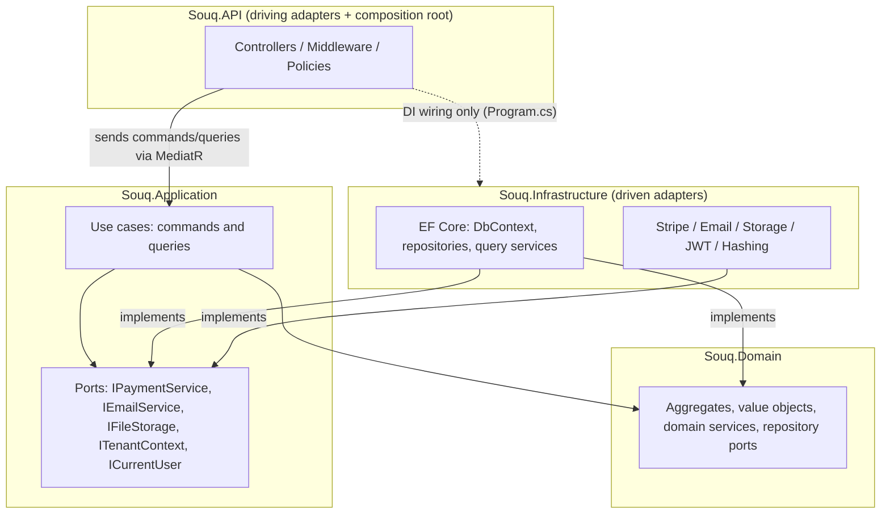

# Souq: Target Architecture

> **Status:** Adopted 2026-09-11 ([ADR-0001](adr/0001-target-architecture.md)). This document describes the architecture that carries Souq through every remaining phase. Where the current code differs, the "Today" notes say so, along with the phase that closes the gap.
> **Related:** [ArchitectureEvaluation.md](ArchitectureEvaluation.md) (why this and not the alternatives) · [Modules.md](Modules.md) · [MultiTenancy.md](MultiTenancy.md) · [DatabaseDesign.md](DatabaseDesign.md) · [ApiDocumentation.md](ApiDocumentation.md) · [Security.md](Security.md) · [FrontendArchitecture.md](FrontendArchitecture.md) · [WhiteLabel.md](WhiteLabel.md) · [adr/](adr/)

## 1. Decision in one paragraph

Souq is a **modular monolith**: one deployable ASP.NET Core application plus one SQL Server database, split internally into **business modules** that own their data and talk to each other only through explicit contracts. Inside it, source dependencies follow the **Clean Architecture** rule (API → Infrastructure → Application → Domain). External systems sit behind **ports** defined by the core and implemented by **adapters** (hexagonal). Use cases are organized as **vertical slices** grouped by module. **DDD** tactical patterns are used only where invariants are rich. **CQRS** means separate command and query handlers over one database, with read-side projections, and nothing heavier until reporting needs it.

## 2. Seven words, seven different questions

| Concept | Kind of decision | In Souq |
|---|---|---|
| **Monolith vs microservices** | *Deployment/runtime*: how many processes and databases run in production | One process, one database (modular monolith) |
| **Clean Architecture** | *Source dependency direction*: who may reference whom | API → Infrastructure → Application → Domain, enforced by project references + architecture tests |
| **Hexagonal (ports and adapters)** | *Boundary to the outside world*: how the core talks to technology | Ports (interfaces) in Application; adapters in Infrastructure (driven) and API (driving) |
| **Modular architecture** | *Business decomposition*: which capability owns which rules and data | 13 modules: 8 already exist in some form, 5 arrive in later phases ([Modules.md](Modules.md)) |
| **Vertical slices** | *Code organization*: where one use case's code lives | `Features/<Module>/<UseCase>` (command/query + handler + validator + DTO) |
| **DDD** | *Modeling discipline*: how business rules are expressed | Aggregates, value objects, and domain services where invariants justify them |
| **CQRS** | *Read/write separation*: are the read and write models the same? | Separate handlers; writes through aggregates, reads through projections |

They are complementary layers of one design, not rival options. A common beginner mistake is to "choose between Clean Architecture and microservices". One is about arrows in the code, the other is about processes on servers.

## 3. Layers and their responsibilities

```
src/
├── Souq.Domain          business model: entities, value objects, domain services, domain exceptions,
│                        repository ports for aggregates. References NOTHING.
├── Souq.Application     use cases (commands/queries), validation, orchestration, ports for technology
│                        (payment, email, storage, clock, current user, tenant context), DTOs.
│                        References Domain + MediatR + FluentValidation only.
├── Souq.Infrastructure  adapters: EF Core (DbContext, configurations, migrations, repositories, query
│                        services), Stripe, email providers, file storage, JWT, hashing, background jobs.
│                        References Application (and, through it, Domain).
└── Souq.API             driving adapter + composition root: controllers, middleware, auth policies,
                         Program.cs. References Application + Infrastructure (the latter only to wire DI).
```

| Put it in… | If it is… | Never put it there if it is… |
|---|---|---|
| **Domain** | A rule that is true regardless of UI or storage: "a shipped order can't be cancelled", "stock can't go negative", "discount ≤ subtotal", money arithmetic | Anything needing I/O, EF attributes, HTTP types, logging, the current time read directly |
| **Application** | Orchestrating one use case: load aggregates, call domain methods, persist, trigger side effects. Rules that span aggregates and need lookups (slug uniqueness, verified purchase) | SQL/EF queries, HTTP status codes, provider SDKs |
| **Infrastructure** | How something is done with a technology: SQL, EF mapping, Stripe calls, SMTP/HTTP email, disk or blob storage | Business decisions ("should this coupon apply?") |
| **API** | HTTP translation: routes, binding, auth attributes, Result → status code, file-upload shape checks | Business rules, database access, provider SDK calls |

## 4. Physical structure of modules

**Decision ([ADR-0002](adr/0002-modular-monolith-structure.md)):** modules are **namespaces that cut across the four existing layer projects**. They are not separate projects per module.

```
Souq.Domain/<Module>/…                          e.g. Souq.Domain.Ordering.Order
Souq.Application/Features/<Module>/<UseCase>/…  e.g. Features/Ordering/PlaceOrder
Souq.Application/Features/<Module>/Contracts/   the module's public, in-process API for other modules
Souq.Infrastructure/<Area>/<Module>/…           e.g. Persistence/Configurations/Ordering
Souq.API/Controllers/<Area>/…                   Storefront, Account, Admin, Platform, Auth, Webhooks
```

- **Why:**
  - Zero churn for working code.
  - The compiler keeps enforcing the *layer* rule, which is the rule a learning team breaks most often.
  - Architecture tests enforce the *module* rule.
  - With ~16 modules, project-per-module would mean 50–60 projects for one developer.
- **Revisit when:**
  - more than 3–4 developers work in parallel;
  - a module becomes a concrete extraction candidate;
  - or the architecture tests keep catching the same boundary violations.

  Moving to `Souq.Modules.<X>` projects is then mechanical, because the namespaces already match.
- **Today:** the existing folders map to modules like this:

  | Existing folder | Module |
  |---|---|
  | `Features/Products`, `Features/Categories` | Catalog |
  | `Features/Inventory` | Inventory |
  | `Features/Orders` | Ordering |
  | `Features/Coupons` | Promotions |
  | `Features/Reviews` | Reviews |
  | `Features/Auth` | Identity |

  Entities still live in `Souq.Domain.Entities`. Each module moves to its own namespace when its roadmap phase touches it (Phase 1B starts with shared building blocks; Phases 2–14 move modules as they are rebuilt). No big-bang rename.

## 5. Dependency rules



### Allowed

| From | May depend on |
|---|---|
| Domain | .NET base library only |
| Application | Domain; MediatR; FluentValidation; `Microsoft.Extensions.*.Abstractions` |
| Infrastructure | Application, Domain, EF Core, provider SDKs (Stripe, MailKit…), `Microsoft.Extensions.*` |
| API | Application (commands, queries, DTOs, ports for auth-related reads); Infrastructure **only in `Program.cs`/composition code** |
| Module A (Application) | Module B's `Contracts` namespace (in-process interfaces + DTOs); Module B's **IDs** |
| Frontend | The HTTP API only |

### Forbidden (each is enforced or planned in architecture tests)

| Rule | Why | Enforced by |
|---|---|---|
| Domain → Application/Infrastructure/API, EF Core, ASP.NET, MediatR | The core must be framework-free and unit-testable | `Souq.ArchitectureTests` ✅ |
| Application → Infrastructure/API, EF Core, ASP.NET Core, Stripe, MailKit | Use cases must not know technology | `Souq.ArchitectureTests` ✅ |
| Infrastructure → API | Adapters must not know the delivery mechanism | `Souq.ArchitectureTests` ✅ |
| Controllers → repositories, `DbContext`, EF Core, provider SDKs | No database access or business logic in controllers | `Souq.ArchitectureTests` ✅ |
| Domain entities in API contracts | Entities are not DTOs: exposing them leaks internals and freezes the model | Code review now; test once DTO namespaces are standardized (1B) |
| Module A → Module B's entities, repositories, or tables | Keeps modules independently changeable and extractable | Architecture tests per module as modules are migrated (Phase 1B onward) |
| React pages → business rules (prices, stock, permissions) | The backend is authoritative; the UI only reflects decisions | Code review; server tests prove enforcement |
| New generic `IRepository<T>`/`IService<T>` abstractions without a demonstrated second use | Pattern cargo-cult | Code review (documented in DevelopmentGuide) |

> **Note on the existing `IRepository<T>`.** It stays (it works and is small), but specialized repositories are the norm. New aggregates get exactly the repository methods they need. Reads go through query services (§8), not through repository methods.

## 6. How modules talk to each other

1. **Synchronous, in-process contracts (the default).**
   - Module B exposes an interface in `Features/B/Contracts`, for example `IInventoryReservations.ReserveAsync(lines)`.
   - Module A calls it. B's implementation touches only B's tables.
2. **The same database transaction is allowed.** Checkout must be atomic: reserve stock, create the order, redeem the coupon.
   - In a modular monolith that is one unit of work spanning several modules' contracts, with each module writing only its own tables.
   - This is the pragmatic advantage over microservices, and it is deliberate. If a module is ever extracted, that call becomes a saga step (§9).
3. **Reference by ID, snapshot what you need.**
   - An order line stores `ProductId` plus a snapshot of name, SKU, and unit price. It never navigates to `Product`.
   - Foreign keys across modules are avoided. The one exception is `TenantId → Tenants` (shared kernel).
4. **Events for side effects, when they appear.**
   - Examples: "OrderPaid" → email, statistics, admin notification.
   - These are published through an **outbox** (Phase 14) so they are never lost and never sent for a rolled-back change.
   - In-process domain events are added only when a second consumer of the same fact exists. Until then a direct call is simpler and easier to follow.
5. **Shared kernel (minimal).** `Money`, `Currency`, `TenantId`, `Entity` base types, error types, paging primitives. Nothing business-specific.

**Today:** `CreateOrderHandler` loads `Product` entities and calls `product.DecreaseStock` directly, so Ordering is mutating Catalog/Inventory. That is acceptable for the current single module set. It becomes an `IInventoryReservations` contract in Phase 6/9, when Inventory is rebuilt around reservations.

## 7. Domain modeling strategy (DDD where it pays)

| Aggregate (root) | Contains | Key invariants | Concurrency |
|---|---|---|---|
| **Tenant** (Platform) | domains, branding settings, module flags | lifecycle Provisioning → Active → Suspended → Archived; exactly one primary domain; modules limited to the plan | `rowversion` |
| **User** (Identity) | refresh tokens | unique normalized email per tenant; lockout; token rotation and reuse detection | `rowversion` |
| **Product** (Catalog) | variants, images, translations | slug unique per tenant; status lifecycle; ≥ 1 variant; price in the tenant currency | `rowversion` |
| **Category** (Catalog) | — (tree by `ParentId`) | no cycles; slug unique per tenant | — |
| **InventoryItem** (Inventory) | — (ledger entries are separate append-only records) | `available = onHand − reserved ≥ 0`; every change writes a ledger entry | `rowversion` (hot row) |
| **Basket** (Shopping) | lines | quantity > 0; one basket per customer or anonymous id | last-write-wins (low value) |
| **Order** (Ordering) | lines, status history | transition table; lines only while Pending; snapshots immutable after placement; discount ≤ subtotal | `rowversion` |
| **Coupon** (Promotions) | — (redemptions are separate records) | value ranges; validity window; usage limits | `rowversion` |
| **Payment** (Payments) | refunds | refunded ≤ captured; idempotency key unique | `rowversion` |
| **Customer** (Customers) | addresses | one profile per user per tenant; blocked customers cannot order | `rowversion` |
| **Review** (Reviews) | — | rating 1–5; verified purchase; one per customer per product | — |

**Why the Order aggregate stays small:**
- It holds its lines and its own status history. Nothing else.
- Payments, shipments, reviews, and the customer are separate aggregates referenced by ID.
- Putting "everything connected to an order" inside it would make every payment webhook and review lock the order row. That is the classic oversized-aggregate mistake.

**Value objects:** `Money` (amount + currency, currency-aware rounding), `Address` (Phase 7), `Slug`, `Email`, `Sku` (as they appear). A value object is justified when it carries rules (validation, arithmetic, normalization), not just to wrap a string.

**Domain services:** only for rules that span aggregates *and* need no I/O, for example a pricing calculator that combines lines, discounts, shipping, and tax (Phase 8). Rules that need a database lookup belong in Application handlers.

**Domain events:** introduced with the outbox (Phase 14) and only for facts with more than one consumer: `OrderPlaced`, `OrderPaid`, `OrderCancelled`, `StockLow`.

**Keep simple (no aggregate ceremony):** Category, Wishlist items, store configuration read models, reviews' moderation flags.

## 8. CQRS strategy

| Operation type | Approach | Why |
|---|---|---|
| **Commands** (checkout, cancel, adjust stock, create product) | MediatR command → handler → aggregate methods → unit of work | Invariants live in aggregates; the validation pipeline runs automatically |
| **Simple queries** (get order, get product) | MediatR query → **query service** in Infrastructure projecting straight into DTOs (`AsNoTracking`, `Select`) | Removes the over-fetching of loading entities and mapping in memory (Phase 0 D3); the Application layer stays EF-free |
| **Search/filter/sort/page listings** | Query service + shared `PageRequest`/`PagedResult<T>`, sort-field allowlists, validators | One reusable mechanism for ~15 listings (Phase 1B) |
| **Dashboards and reports** | Start as query services over indexed tables. Move to **read models** (pre-aggregated daily tables) when queries exceed agreed latency | CQRS level 2 only with evidence (Phase 17/21) |
| **Transactional multi-step flows** (checkout) | One command orchestrating module contracts inside one transaction | Correctness first; no eventual consistency where money and stock are involved |

**MediatR:**
- **Kept**, pinned to 12.x (Apache-2.0; 13+ is commercially licensed).
- It earns its place through the **pipeline**: validation now; tenant/module checks, audit logging, and performance logging later. Also through a uniform shape for ~100 use cases.
- **Not** used for module-to-module calls (those use contracts, §6) or for domain events inside an aggregate.

## 9. Future scaling and service extraction

Scale in this order, stopping as soon as the problem is solved:
1. Better queries and indexes.
2. Caching (tenant config, catalog).
3. More app instances behind a load balancer. The app is stateless: JWT, and data in the database.
4. A bigger database and read replicas for reporting.
5. Dedicated databases for enterprise tenants ([MultiTenancy.md](MultiTenancy.md)).
6. Only then, extracting a module into a service.

| Candidate | Why it might become a service | Required boundary | Contract it would expose | Data it would own | Messages | What keeps it extractable today |
|---|---|---|---|---|---|---|
| **Notifications** | Bursty I/O, provider rate limits, retries; must not slow checkout | Consumes events only; never called synchronously for business decisions | `SendNotification` (tenant, template, recipient, data) | Templates, delivery log, in-app notifications | Consumes `OrderPlaced`, `OrderPaid`, `PasswordResetRequested` … via outbox → broker | `IEmailService` port; outbox planned (Phase 14); no module reads notification tables |
| **Payments** | PCI scope isolation, provider webhooks, separate reliability needs | Owns payment state; Ordering only sees "payment succeeded/failed" | `CreatePaymentIntent`, `Refund`, webhook → `PaymentSucceeded`/`PaymentFailed` | Payments, refunds, provider configuration (encrypted secrets) | Publishes payment events; consumes `OrderPlaced` | `IPaymentService` port; webhook parsing moved behind the port (Phase 1A); no card data anywhere |
| **Search** | Relevance, facets, typo tolerance beyond SQL `LIKE` | Read-only projection of Catalog | `Search(tenant, query, filters)` | A search index (derived, rebuildable) | Consumes `ProductChanged` | Catalog listing already behind a query; would move behind a `ICatalogSearch` port |
| **Media processing** | CPU-heavy resizing and transcoding | Receives uploads, emits variants | `ProcessMedia(upload)` → URLs | Blob storage objects | `MediaUploaded` → `MediaProcessed` | `IFileStorage` port; content validation in Application (Phase 1A) |
| **Reporting** | Heavy aggregate queries competing with OLTP | Read models fed by events or CDC | Report endpoints | Denormalized reporting store | Consumes order/payment events | Reports are query services only; no write logic depends on them |
| **Inventory** | Flash-sale contention, multi-warehouse | Owns stock and reservations; checkout calls a reservation contract | `Reserve`, `Commit`, `Release` | Inventory items, reservations, ledger | Consumes `OrderCancelled`; publishes `StockLow` | `IInventoryReservations` contract planned (Phase 6); reservations are explicit records, not side effects |

**The rule that keeps extraction possible:** a module that other modules call synchronously *today* (Inventory, Promotions) will need a saga when extracted, so its contract is designed as **reserve → commit/release** from the start (Phase 6/10). A module that only reacts (Notifications, Reporting, Search) can be extracted with nothing more than an outbox and a broker.

## 10. Cross-cutting building blocks

| Concern | Mechanism | Phase |
|---|---|---|
| Validation | FluentValidation + `ValidationBehavior` (all commands and queries, including paging) | ✅ (paging validators 1A) |
| Errors | Result → HTTP mapping in one helper (1A); RFC 7807 ProblemDetails + typed errors (1B) | 1A / 1B |
| Concurrency | `rowversion` + `ConcurrencyConflictException` → 409 | 1A |
| Tenant context | `ITenantContext` + EF global query filters + write guard | 2 |
| Current user | `ICurrentUser` (claims → user, roles, tenant) | 1B |
| Time | `TimeProvider` | 1B |
| Logging | Structured logging with scopes (tenant, user, correlation id); redaction rules ([Security.md](Security.md)) | 1A redaction / 1B scopes |
| Audit | `AuditLog` via a MediatR behavior on `IAuditableCommand` | 4 |
| Background work | Hosted services (reservation expiry, outbox dispatch) | 6 / 14 |
| Architecture enforcement | `tests/Souq.ArchitectureTests` (NetArchTest) | 1A |
