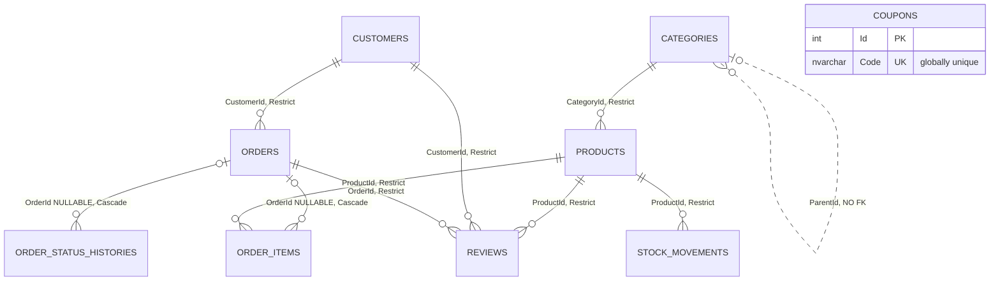
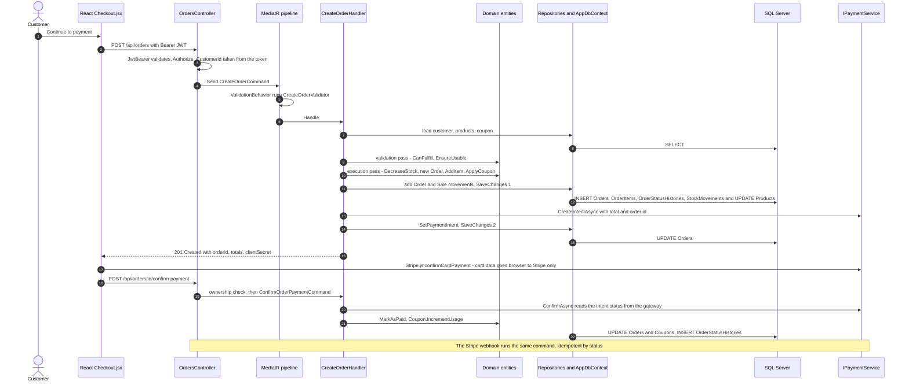
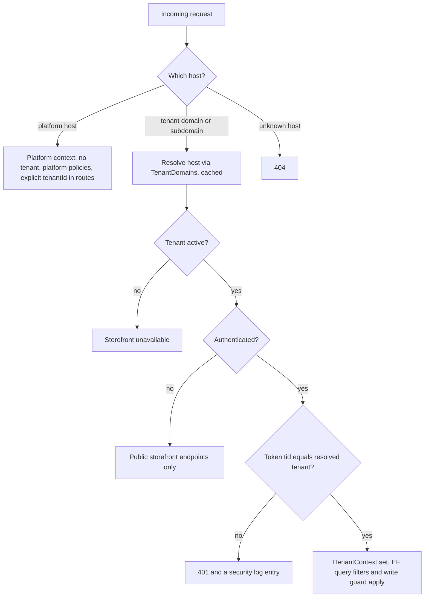
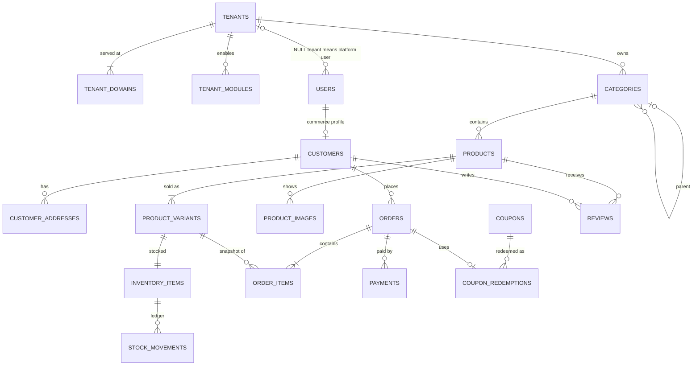

# Souq: Architecture Assessment (Phase 0)

> **Program:** transform Souq from a single-store application into a **white-label, multi-tenant e-commerce platform**.
> **Phase:** 0, complete system audit. Read-only: no production code was changed.
> **Date:** 2026-09-11 · **Audited commit:** `b3eb0d9` (`main`, clean working tree)
> **Companion:** [ProductRoadmap.md](ProductRoadmap.md) holds the phase plan, the decision log, the risks, and the Definition of Done.
> **History:** [AUDIT.md](AUDIT.md) is the Arabic audit of the *earlier* 8-phase program, which made the single store work end-to-end. This document assesses readiness for the *platform* program.

## Deliverables index

| Requested deliverable | Section |
|---|---|
| 1. Architecture assessment | This document |
| 2. Product roadmap | [ProductRoadmap.md](ProductRoadmap.md) |
| 3. Current Feature Map | [§3](#3-current-feature-map) |
| 4. Current Entity Map | [§4](#4-current-entity-map-domain) |
| 5. Current API Map | [§5](#5-current-api-map) |
| 6. Current Database Map | [§6](#6-current-database-map) |
| 7. Current Frontend Map | [§7](#7-current-frontend-map) |
| End-to-end feature trace | [§8](#8-end-to-end-trace-placing-an-order) |
| 8. Architectural problems | [§9](#9-problem-register) |
| Preserve / refactor / replace | [§10](#10-preserve--refactor--replace--remove) |
| 9. Recommended target architecture | [§11](#11-recommended-target-architecture) |
| Migration strategy | [§12](#12-migration-strategy) |
| 10. Recommended implementation order | [§13](#13-recommended-implementation-order) |

Legend: ✅ works · 🟡 partial · ❌ missing · ⚠️ defect. Severities: **Critical / High / Medium / Low / Info**.

---

## 1. Executive summary

**Verdict: evolve, don't rewrite.**

Souq today is a competently built **single-store** e-commerce application, branded **Marka**. Its strengths:
- strict Clean Architecture, with a correct dependency direction in every `.csproj`;
- a rich, encapsulated Domain;
- CQRS use cases with MediatR and a FluentValidation pipeline;
- JWT authentication with BCrypt password hashing;
- Stripe PaymentIntents with idempotent client + webhook confirmation;
- an inventory ledger and order status history;
- a bilingual RTL/LTR React frontend with a reusable component kit;
- Docker Compose deployment;
- **133 passing unit tests**.

It is **not yet a platform**:
- **0 of 9 tables** carry a tenant.
- Admins and customers share one `Customers` table and differ only by a string role.
- The brand ("Marka"), currency (JOD), sender e-mail, and colour themes are hard-coded.
- Slugs, coupon codes, and e-mail addresses are unique *globally*.
- Payments run through one global Stripe account.

Independently of multi-tenancy, the audit found **defects that every new tenant would inherit**:
- overselling under concurrent checkout (no concurrency tokens anywhere);
- cancelled orders never return their stock;
- 3-decimal JOD prices stored in 2-decimal columns;
- a default admin password seeded in *production*;
- password-reset links written to logs;
- an upload path that allows stored XSS.

### Layer scorecard

| Layer | Verdict | Reasoning |
|---|---|---|
| **Domain** | Strong: keep and extend | Encapsulated entities, aggregate boundaries, price/name snapshots, append-only ledgers, guarded state machine. Gaps: tenancy, identity model, `Money` default currency, Arabic-only messages. |
| **Application** | Good: refactor the edges | One handler per use case, a validation pipeline, the Result pattern. Gaps: string error codes, unvalidated paging, read-side over-fetching, ownership checks living in controllers. |
| **Infrastructure** | Adequate: extend | Clean Fluent configurations and DI wiring. Gaps: no concurrency tokens, missing and nullable FKs, money precision, static Stripe configuration, PII in email logs, local-disk storage. |
| **API** | Adequate: refactor | Thin controllers. Gaps: Stripe SDK used in a controller, error mapping duplicated, no ProblemDetails, rate limiting, health checks, or security headers. |
| **Database** | Adequate: migrate | EF migrations are the source of truth. Gaps: tenancy, precision, row versions, nullable aggregate FKs, stale hand-written SQL scripts. |
| **Frontend** | Good components, weak structure | A reusable UI kit, i18n + RTL, URL-driven catalog state. Gaps: type-based folders, one monolithic API object, no tenant or theme runtime, cart not persisted, no TypeScript or tests. |
| **Tests** | Unit-only | 70 Domain + 63 Application tests. No integration, API, or frontend tests. |
| **Security** | Needs work | Good basics: BCrypt, anti-enumeration, ownership checks, and card data kept out of scope by Stripe Elements. But see B1–B6. |
| **Operations** | Basic | Docker Compose works. No CI, health checks, structured logging, or backup story. |

### Two corrections to the brief

1. **The frontend is not "one large page".**
   - It is 78 JS/JSX modules with React Router, separate customer and admin layouts, CSS Modules, i18n, and around 20 reusable components.
   - The work ahead is re-organization plus tenant awareness, not decomposition from scratch.
2. **`Basket` no longer exists in the Domain.**
   - It was removed in commit `b52c889`, and the cart is client-side only.
   - The existing features also go beyond Products, Orders, and Categories: Auth, Coupons, Inventory, Reviews, and Payments are all implemented.

### Top priorities

1. Fix the live defects (Phase **1A**).
2. Shared foundations: error contract, paging, money, concurrency, integration-test harness (**1B**).
3. The tenant isolation model, proven by automated isolation tests (**2**).
4. Splitting identity from customers, plus permission-based authorization (**3**).
5. Platform administration and tenant configuration (**4**), then the commerce features.

---

## 2. Verification performed

| Check | Command | Result |
|---|---|---|
| SDK | `dotnet --version` | 10.0.102 |
| Backend build | `dotnet build` | ✅ 6 projects, **0 warnings, 0 errors** |
| Backend tests | `dotnet test` | ✅ **133 passed** (Domain 70, Application 63), 0 failed, 0 skipped |
| NuGet advisories | `dotnet list package --vulnerable --include-transitive` | ✅ none reported |
| Frontend install | `npm ci` | ✅ 77 packages. `node_modules` was absent and is now installed locally (git-ignored). |
| Frontend build | `npm run build` | ✅ 196 modules → **one** JS chunk of 369.8 kB (116.9 kB gzip) + 52.8 kB CSS. No code splitting. |
| npm advisories | `npm audit` | ⚠️ 8 (4 high, 4 moderate). Only `react-router-dom` is a runtime dependency (moderate, open redirect; a non-breaking fix exists). `vite`/`esbuild` affect the **dev server only** and need a Vite major upgrade. The rest are transitive build tooling with non-breaking fixes. |
| Git | `git status` | Clean; `main` = `origin/main`. 46 commits. |
| Runtime smoke (API + DB) | not run | Souq's SQL Server wasn't running; the running containers belong to another project. Starting Souq's stack creates volumes, so I didn't do it without asking. Items marked *(static analysis)* below come from reading the code. The runtime smoke test becomes part of Phase 1A's exit criteria. |

**Size** (excluding migrations): Domain 940 lines / 27 files · Application 1,918 / 67 · Infrastructure 1,396 / 33 · API 769 / 10 · tests 1,957 / 16 · frontend 4,743 lines JS/JSX in 78 files + 1,279 lines CSS in 47 files.

---

## 3. Current Feature Map

| Capability | Backend | Frontend | Tests | Main gaps vs. the brief |
|---|---|---|---|---|
| Catalog browse: search, multi-category filter, price range, sort (newest, price, best-selling), paging | ✅ `GetProductsQuery` → `ProductRepository.SearchAsync` | ✅ `Catalog` (state in the URL, shareable) | 🟡 2 handler tests; the query itself is untested | No slug/SEO URLs, SKU, brand, attributes, variants, or multiple images. Page size unbounded (C9). |
| Product detail + related products | ✅ | ✅ `ProductDetail` + `ProductZoom` (zoom, lightbox, video) | 🟡 3 | Single image. "Offers" is a placeholder because there is no compare-at price. |
| Product administration | 🟡 create / update / deactivate + image & video upload | 🟡 `admin/Products` + drawer | ✅ 10 | Inactive products can't be listed or re-activated (C7). Category filter broken (C8). Stock edited as an absolute value (C4). |
| Categories | 🟡 CRUD, delete guarded | ✅ admin CRUD, category nav | ✅ 11 | `ParentId` has no FK. No tree UI, ordering, active flag, SEO, or translations. |
| Inventory | 🟡 stock on the product, low-stock threshold, movement ledger (Purchase/Sale/Adjustment) | 🟡 read-only stock screen + history drawer | 🟡 indirect | No reservation model, no adjustment command, cancellation doesn't restock (C2), concurrency (C1). |
| Cart | ❌ nothing server-side | 🟡 in-memory `CartContext`, lost on refresh | ❌ | Server basket, persistence, shipping, tax. |
| Wishlist | ❌ | 🟡 `localStorage` only | ❌ | Server wishlist, tenant isolation. |
| Checkout / order placement | ✅ Pending order + stock reservation + payment intent | ✅ 2-step checkout | ✅ 6 | Structured addresses, billing address, shipping cost, tax, human-readable order number. |
| Payments | ✅ Stripe PaymentIntents + fake gateway. Client confirmation + signed webhook, idempotent. | ✅ Stripe Elements, or a direct fallback | ✅ 4 | Refunds, payment records, per-tenant accounts, Stripe types in the API layer (D1). |
| Order management | ✅ admin list; Ship/Deliver/Cancel with tracking number, carrier, notes; status history | ✅ admin orders + ship drawer | ✅ 7 | Filters and search, customer details, refunds, restock on cancel. |
| Customer orders and tracking | ✅ `/orders/mine`, public tracking | ✅ My orders, tracking timeline | 🟡 | Tracking by sequential id exposes notes (B8). |
| Coupons | ✅ CRUD, preview, applied at order, usage counted on payment | ✅ admin + checkout | ✅ 4 + 11 domain | Codes are global. No per-customer limit or redemption records. Usage race (C1). |
| Reviews | 🟡 create (verified purchase only), list + average | ✅ | ✅ 4 + 4 | No moderation, edit, or delete. N+1 queries (C13). |
| Authentication | 🟡 register, login, forgot, reset; BCrypt; 120-minute JWT | ✅ four auth pages | ✅ 11 | No refresh tokens, revocation, lockout, or email verification. Reset tokens stored in plaintext. |
| Authorization | 🟡 two roles via `[Authorize(Roles)]`; ownership checks in controllers | 🟡 route guards | ❌ none at HTTP level | Platform vs tenant roles, permissions, staff. |
| Customer management | ❌ | ❌ | — | Profiles, addresses, status, admin views. |
| Notifications | 🟡 `IEmailService` for order confirmation and password reset (Resend → Brevo → Gmail → console) | — | ❌ | In-app notifications, per-tenant/per-language templates, asynchronous sending. |
| Dashboards | 🟡 tenant-admin page with product and category counts + low-stock alert | 🟡 | — | No order or revenue KPIs. No platform dashboard. |
| Internationalization | 🟡 UI in ar/en with RTL/LTR. Products have `NameAr`/`NameEn`; categories have one name; server messages are Arabic only. | ✅ | — | Languages chosen per tenant. |
| Theming | 🟡 4 hard-coded palettes, **chosen by the visitor** | ✅ | — | Branding controlled by the tenant. |
| **Multi-tenancy, white-label config, platform admin, feature modules** | ❌ | ❌ | ❌ | **The entire scope of this program.** |
| Logging / auditing | 🟡 default `ILogger`. Domain histories (stock ledger, order status) exist; there is no general audit log. | — | — | Structured logs, correlation ids, audit trail. |
| DevOps | 🟡 Docker Compose (db, api, nginx web); migrations run at startup | | | CI, health checks, backups, production configuration. |

---

## 4. Current Entity Map (Domain)

**Base types:**
- `BaseEntity<TId>` → `Entity` (int Id).
- `CreatedAt`/`UpdatedAt` have `internal` setters, stamped by `AppDbContext.SaveChangesAsync`. This works through `InternalsVisibleTo("Souq.Infrastructure")`.

| Entity | Kind | Key state | Invariants guarded *inside* the entity | Relations |
|---|---|---|---|---|
| **Product** | Aggregate root | `NameAr`, `NameEn`, `Description`, `Price: Money`, `StockQuantity`, `LowStockThreshold`, `ImageUrl`, `VideoUrl?`, `IsActive`, `CategoryId` | `CanFulfill` and `DecreaseStock` (no in-memory oversell); `SetStock ≥ 0`; threshold ≥ 0; image required; soft delete via `Deactivate`/`Activate`. `Name => NameAr` exists for backward compatibility. | → Category |
| **Category** | Aggregate root | `Name`, `Slug`, `ParentId?` | *None.* Slug uniqueness and parent existence are checked in the handlers because they need the database. | self (no FK, see §6) |
| **Customer** | Aggregate root (**identity + role + profile mixed**) | `FullName`, `Email`, `PasswordHash`, `Role: string`, `PasswordResetToken?`, `…Expiry?` | Reset-token expiry; hash required | — |
| **Order** | Aggregate root | `CustomerId`, `Status`, `ShippingAddress: string`, `CouponCode?`, `DiscountAmount: Money?`, `PaymentIntentId?`, `TrackingNumber?`, `ShippingCarrier?`; `Subtotal`/`TotalAmount` *computed* | A state machine: Pending → Paid → Shipped → Delivered; Cancel is allowed unless Shipped/Delivered. Items can only be added while Pending, and duplicate lines merge. Coupon currency and amount are guarded. **Every transition is recorded** (`RecordStatusChange`). | owns OrderItem, OrderStatusHistory |
| **OrderItem** | Child entity | `ProductId`, `ProductName` (snapshot), `UnitPrice: Money` (snapshot), `Quantity` | `internal` constructor, so only an `Order` can create one | → Product |
| **OrderStatusHistory** | Child entity | `Status`, `Note?` | `internal` constructor | — |
| **Coupon** | Aggregate root | `Code` (upper-cased), `Type`, `Value`, `MinOrderAmount?`, `ExpiresAt?`, `MaxUses?`, `UsedCount`, `IsActive` | Value ranges; `EnsureUsable` (active, not expired, uses left, minimum met); discount clamped to the subtotal | — |
| **Review** | Aggregate root | `ProductId`, `CustomerId`, `OrderId`, `Rating`, `Comment` | Rating 1–5; comment required, ≤ 1000 characters. The verified-purchase rule lives in the handler because it spans aggregates. | → Product, Customer, Order |
| **StockMovement** | Append-only ledger entry | `ProductId`, `Type`, `QuantityChange` (signed), `NewQuantity`, `Note?` | Change ≠ 0; immutable after creation | → Product |
| **Money** | Value object (`record`) | `Amount`, `Currency` | Non-negative; currency required; same-currency add/subtract. ⚠️ **Defaults to `"JOD"`**; no rounding or minor-unit rules. | — |

- **Enums:** `OrderStatus`, `DiscountType`, `StockMovementType`, and `ProductSortBy`. `ProductSortBy` is a query concern that lives in Domain only because a repository signature needs it.
- **Exceptions:** `DomainException` + 6 subclasses, all with Arabic messages.
- **Interfaces (Domain-owned):** `IRepository<T>`, 7 specialized repositories, `IUnitOfWork`.
- **Roles:** a static class with `Customer` and `Admin`.

**Assessment:**
- This is the strongest part of the codebase, and it is worth studying.
- The key idea it demonstrates: *make invalid states unrepresentable.* The `Order` item list is read-only, `OrderItem` has an `internal` constructor, and every status change writes its own history row.
- Its weaknesses:
  - it has no notion of tenant;
  - `Customer` conflates *who can log in* with *who buys*;
  - `Money` silently assumes JOD;
  - error text is baked into Domain in one language.

---

## 5. Current API Map

Error shapes differ: handled failures return `{ "error": "...", "code": "..." }`, while the middleware returns `{ "error": "..." }`.
Enums are serialized as strings.
Swagger is enabled in Development only.
There is no versioning.

| # | Method | Route | Access | Use case | Notes |
|---|---|---|---|---|---|
| 1 | POST | `/api/auth/register` | Anonymous | `RegisterCommand` | Returns a JWT. 409 `EmailTaken`. |
| 2 | POST | `/api/auth/login` | Anonymous | `LoginCommand` | 401 `InvalidCredentials`. No lockout or rate limit. |
| 3 | POST | `/api/auth/forgot-password` | Anonymous | `ForgotPasswordCommand` | Always 200 (anti-enumeration ✅). |
| 4 | POST | `/api/auth/reset-password` | Anonymous | `ResetPasswordCommand` | Single-use token, valid for 2 hours. |
| 5 | GET | `/api/products` | Anonymous | `GetProductsQuery` | `keyword`, `categoryIds[]`, `minPrice`, `maxPrice`, `sortBy`, `page`, `pageSize`. **Unvalidated** (C9). |
| 6 | GET | `/api/products/{id}` | Anonymous | `GetProductByIdQuery` | Active products only. |
| 7 | GET | `/api/products/{id}/related` | Anonymous | `GetRelatedProductsQuery` | Same-category best sellers, then newest from other categories. |
| 8 | POST | `/api/products` | Admin | `CreateProductCommand` | Writes a Purchase ledger entry for the initial stock. |
| 9 | PUT | `/api/products/{id}` | Admin | `UpdateProductCommand` | Also sets *absolute* stock (C4). |
| 10 | DELETE | `/api/products/{id}` | Admin | `DeleteProductCommand` | Soft delete. **No reactivate endpoint.** |
| 11 | POST | `/api/products/{id}/image` | Admin | `UploadProductImageCommand` | ≤ 5 MB. Type trusted from the client header (B3). |
| 12 | POST | `/api/products/{id}/video` | Admin | `UploadProductVideoCommand` | ≤ 50 MB, mp4/webm. |
| 13 | GET | `/api/categories` | Anonymous | `GetCategoriesQuery` | All categories, unpaged. |
| 14 | POST | `/api/categories` | Admin | `CreateCategoryCommand` | Slug unique *globally*. |
| 15 | PUT | `/api/categories/{id}` | Admin | `UpdateCategoryCommand` | Self-parent blocked; deeper cycles are not. |
| 16 | DELETE | `/api/categories/{id}` | Admin | `DeleteCategoryCommand` | Blocked while the category has products or children. |
| 17 | GET | `/api/coupons/apply` | Anonymous | `ApplyCouponQuery` | Discount preview. Codes can be enumerated (no rate limit). |
| 18 | GET | `/api/coupons` | Admin | `GetCouponsQuery` | Paged. |
| 19 | POST | `/api/coupons` | Admin | `CreateCouponCommand` | |
| 20 | PUT | `/api/coupons/{id}` | Admin | `UpdateCouponCommand` | The code is immutable. |
| 21 | DELETE | `/api/coupons/{id}` | Admin | `DeleteCouponCommand` | Hard delete; orders keep a text snapshot. |
| 22 | POST | `/api/orders` | Authenticated | `CreateOrderCommand` | `CustomerId` is **taken from the token** ✅. |
| 23 | POST | `/api/orders/{id}/confirm-payment` | Owner or Admin | `ConfirmOrderPaymentCommand` | The ownership check is in the controller (B7). |
| 24 | GET | `/api/orders/{id}` | Owner or Admin | `GetOrderByIdQuery` | 404 for a non-owner (no existence leak ✅). |
| 25 | GET | `/api/orders/mine` | Authenticated | `GetMyOrdersQuery` | Unpaged. |
| 26 | GET | `/api/orders/{id}/tracking` | **Anonymous** | `GetOrderTrackingQuery` | Sequential id; exposes the history *notes* (B8). |
| 27 | GET | `/api/orders` | Admin | `GetOrdersQuery` | Paged; no filters. |
| 28 | PUT | `/api/orders/{id}/status` | Admin | `UpdateOrderStatusCommand` | Ship/Deliver/Cancel. Cancel doesn't restock (C2). |
| 29 | GET | `/api/payments/config` | Anonymous | — | Returns the Stripe publishable key. |
| 30 | POST | `/api/payments/webhook` | Stripe signature | `ConfirmOrderPaymentCommand` | Calls the Stripe SDK directly in the API layer (D1). |
| 31 | GET | `/api/products/{productId}/reviews` | Anonymous | `GetProductReviewsQuery` | Paged + average rating. N+1 (C13). |
| 32 | POST | `/api/products/{productId}/reviews` | Authenticated | `CreateReviewCommand` | Verified purchase required. |
| 33 | GET | `/api/admin/inventory` | Admin | `GetInventoryQuery` | Unpaged. |
| 34 | GET | `/api/admin/inventory/low-stock` | Admin | `GetLowStockQuery` | |
| 35 | GET | `/api/admin/inventory/{productId}/movements` | Admin | `GetStockMovementsQuery` | Unpaged. |
| — | GET | `/uploads/**` | Anonymous | static files | Not tenant-aware. |

**Missing for the brief:**
- tenants, domains, branding, and modules (platform);
- users, staff, and permissions;
- customer profile, addresses, and customer administration;
- a server-side basket and wishlist;
- stock adjustment and reservations;
- listing, reactivating, and archiving inactive products;
- refunds;
- shipping methods and quotes;
- review moderation;
- dashboard KPIs;
- audit log;
- health checks.

---

## 6. Current Database Map

- **Engine:** SQL Server 2022.
- **Source of truth:** EF Core migrations, applied automatically at startup by `DbSeeder.SeedAsync` ([Program.cs:118](../src/Souq.API/Program.cs#L118)). There are 6 migrations:
  1. `InitialCreate`
  2. `AddCouponsReviewsOrderPayment`
  3. `AddProductBilingualNames`
  4. `AddProductVideoUrl`
  5. `AddInventoryTracking`
  6. `AddOrderTracking`

  All six were written 2026-07-11 → 07-13.
- **Seed data:** 3 categories and 8 products. The products' `ImageUrl` values are placeholder keys, not real images. The seed also creates an admin user (see B1).

| Table | Columns | Keys and indexes | Foreign keys |
|---|---|---|---|
| **Categories** | `Id` int identity · `Name` nvarchar(100) · `Slug` nvarchar(100) · `ParentId` int NULL · `CreatedAt` · `UpdatedAt` NULL | PK · **UX `Slug`** (global) | ⚠️ **none**: `ParentId` is unconstrained |
| **Products** | `Id` · `NameAr`, `NameEn` nvarchar(200) · `Description` nvarchar(2000) · `Price` **decimal(18,2)** · `Currency` nvarchar(3) · `StockQuantity` int · `LowStockThreshold` int · `ImageUrl` nvarchar(500) · `VideoUrl` NULL · `IsActive` bit · `CategoryId` · timestamps | PK · IX `CategoryId` | `CategoryId` → Categories (Restrict) |
| **Customers** | `Id` · `FullName` nvarchar(150) · `Email` nvarchar(256) · `PasswordHash` nvarchar(500) · `Role` nvarchar(20) · `PasswordResetToken` nvarchar(64) NULL (**plaintext**) · `…Expiry` NULL · timestamps | PK · **UX `Email`** (global) · IX `PasswordResetToken` | — |
| **Orders** | `Id` · `CustomerId` · `Status` int · `ShippingAddress` nvarchar(500) · `CouponCode` NULL · `DiscountAmount` decimal(18,2) NULL · `DiscountCurrency` NULL · `PaymentIntentId` NULL · `TrackingNumber` NULL · `ShippingCarrier` NULL · timestamps | PK · IX `CustomerId` | `CustomerId` → Customers (Restrict) |
| **OrderItems** | `Id` · `OrderId` int **NULL** ⚠️ · `ProductId` · `ProductName` nvarchar(200) · `UnitPrice` decimal(18,2) · `Currency` · `Quantity` · timestamps | PK · IX `OrderId` · IX `ProductId` | `OrderId` → Orders (Cascade) · `ProductId` → Products (Restrict) |
| **OrderStatusHistories** | `Id` · `OrderId` int **NULL** ⚠️ · `Status` int · `Note` nvarchar(300) NULL · timestamps | PK · IX `OrderId` | `OrderId` → Orders (Cascade) |
| **Coupons** | `Id` · `Code` nvarchar(50) · `Type` int · `Value` decimal(18,2) · `MinOrderAmount` NULL · `MinOrderCurrency` NULL · `ExpiresAt` NULL · `MaxUses` NULL · `UsedCount` · `IsActive` · timestamps | PK · **UX `Code`** (global) | — (orders store the code as text) |
| **Reviews** | `Id` · `ProductId` · `CustomerId` · `OrderId` · `Rating` int · `Comment` nvarchar(1000) · timestamps | PK · UX (`CustomerId`, `ProductId`) · IX `OrderId` · IX `ProductId` | → Products, Customers, Orders (all Restrict) |
| **StockMovements** | `Id` · `ProductId` · `Type` int · `QuantityChange` · `NewQuantity` · `Note` NULL · timestamps | PK · IX (`ProductId`, `CreatedAt`) | `ProductId` → Products (Restrict) |



**Database findings** (details in §9):

1. **No `TenantId` anywhere.** Slug, code, and email are unique globally.
2. **Money precision.** `decimal(18,2)` can't hold the Jordanian dinar's 3 minor units (fils), yet the UI accepts `0.001` steps and prints 3 decimals (C5).
3. **No `rowversion`/concurrency token** on any table, so updates can be lost (C1).
4. **`Categories.ParentId` has no FK.** The EF model never configured the self-relationship; the old hand-written SQL had one.
5. **Aggregate children have nullable `OrderId`s.** Both `OrderItems` and `OrderStatusHistories` can exist without an order.
6. **Order totals are computed, not stored.** That is good for consistency, but a financial record should snapshot `Subtotal`, `Discount`, `Shipping`, `Tax`, and `GrandTotal` when the order is placed. Revenue reports need them.
7. **Addresses are free text** (`nvarchar(500)`).
8. **`database/01_schema.sql` and `02_seed.sql` are stale.** They still describe a single `Name` column, have no Coupons, Reviews, or ledger tables, and seed an admin with the fake hash `HASHED_admin123`. That makes them a second, contradictory source of truth.
9. **Operations:**
   - The app connects as `sa` in Docker ([docker-compose.yml:32](../docker-compose.yml#L32)).
   - Migrations run at startup in every environment, which is risky with more than one replica.

---

## 7. Current Frontend Map

**Stack:**
- React 18.3, Vite 5.4, React Router 6.26, i18next, Stripe.js.
- **JavaScript** (no TypeScript), CSS Modules + global design tokens.
- No test runner, no ESLint config.

**Bootstrapping:** `main.jsx` → `BrowserRouter` → `ToastProvider` → `AuthProvider` → `App`. The i18n and theme modules initialize through side-effect imports.

### Routes

| Path | Screen | Guard | Layout |
|---|---|---|---|
| `/login`, `/register`, `/forgot-password`, `/reset-password` | auth pages | — | `AuthLayout` |
| `/admin` (index), `/admin/products`, `/inventory`, `/categories`, `/coupons`, `/orders` | admin screens | `AdminRoute` (role === `'Admin'`) | `AdminLayout` (sidebar + mobile tab bar) |
| `/` | Store (hero, 3 rows, catalog) | — | `CustomerLayout` (announcement bar, navbar, category nav, footer, cart drawer) |
| `/offers` | Catalog sorted by newest ("offers" is a placeholder) | — | Customer |
| `/products/:id` | Product detail (zoom, video, related, reviews) | — | Customer |
| `/wishlist` | Wishlist (local) | — | Customer |
| `/orders` | My orders | `ProtectedRoute` | Customer |
| `/orders/:id` | Public tracking timeline | — | Customer |
| `/checkout`, `/confirmation` | 2-step checkout, confirmation | `ProtectedRoute` | Customer |
| `*` | → `/` | | |

### Structure today (type-based)

```
frontend/src/
├── main.jsx · App.jsx     providers + every route + CustomerLayout
├── api/client.js          one fetch wrapper + ONE object with all ≈35 endpoints
├── context/               Auth (JWT + user in localStorage), Cart (in-memory), Wishlist (localStorage), Toast
├── hooks/                 useCatalog, useDebouncedValue, useProducts (unused)
├── i18n/                  i18next init, ar.json / en.json (parity, ~465 lines each), date helpers
├── theme/                 4 visitor-selectable palettes via <html data-theme>
├── styles.css             design tokens (brand-named: --petrol, --saffron, --clay …) + reset
├── components/
│   ├── common/            Button, DataTable, Drawer, FormField, Pagination, PasswordInput,
│   │                      RowActionsMenu, Skeleton, Spinner, StateViews, Stepper, ToastContainer
│   ├── layout/            AnnouncementBar, CategoryNav, Footer, MobileMenu, Navbar, SearchBar, ThemeSwitcher
│   ├── product/ catalog/ cart/ reviews/ store/ icons/   feature-ish UI pieces
│   └── ProtectedRoute.jsx ProtectedRoute + AdminRoute
└── pages/                 storefront pages · checkout/ · auth/ · admin/ (screens + form drawers)
```

**Strengths worth keeping:**
- **A reusable UI kit.** `DataTable` supports column widths, logical alignment, skeleton, empty, and error states. `RowActionsMenu` is portal-based and RTL-aware. Also `Drawer`, `FormField`, and `StateViews`.
- Catalog filter, sort, and page state live in the URL, so views are shareable and the back button works.
- Real i18n with RTL/LTR and per-language fonts.
- Accessibility basics: focus rings, reduced motion, `aria-*` attributes.
- Stripe Elements keeps card data out of our servers.

**Gaps:**
- Folders are organized by type, not by feature. There is no platform or account area.
- One API object covers every domain.
- The `useEffect` + `useState` fetch/loading/error boilerplate is repeated in about 10 screens, with no caching.
- The token lives in `localStorage` ([client.js:17](../frontend/src/api/client.js#L17)).
- The cart is lost on refresh ([CartContext.jsx:36](../frontend/src/context/CartContext.jsx#L36)).
- Hard-coded values:
  - the brand, in 17 source references across 9 files plus the e-mail templates;
  - `JOD`, in 11 frontend references;
  - contact details and social links in the Footer;
  - shipping shown as always "Free".
- Deletions use `window.confirm`.
- There is a single 370 kB bundle.
- There is dead code (`useProducts`).

---

## 8. End-to-end trace: placing an order

This is the richest existing flow. It crosses every layer.



| Layer | Where | What happens |
|---|---|---|
| **UI** | `pages/checkout/Checkout.jsx` → `api.createOrder` (`api/client.js`) | Builds `{ shippingAddress, items[{productId, quantity}], couponCode }` from `CartContext`. Adds the `Bearer` token. Vite (dev) or nginx (Docker) proxies `/api`. |
| **API** | `Program.cs` pipeline → `OrdersController.Create` | Exception middleware → CORS → JWT authentication → `[Authorize]`. `command with { CustomerId = CurrentUserId() }` discards any client-supplied customer id. |
| **Application** | `ValidationBehavior` → `CreateOrderHandler` | Two passes. The *validation* pass checks existence, `CanFulfill`, and the coupon's `EnsureUsable` without mutating anything. The *execution* pass decrements stock, builds the order, and writes ledger entries. Then: save → create payment intent → save again. |
| **Domain** | `Product`, `Order`, `Coupon`, `Money` | Guards: no oversell in memory, lines only while Pending, coupon currency and amount checks. The order constructor records the first history row. |
| **Infrastructure** | Repositories + `AppDbContext` | `SaveChangesAsync` stamps timestamps. One implicit transaction per save. `StripePaymentService` (or `FakePaymentService`) creates the intent with `orderReference = order.Id`. |
| **SQL Server** | Tables | Customers (read) · Products (read, update) · Coupons (read) · Orders (insert, update) · OrderItems · OrderStatusHistories · StockMovements (insert) |

**What the trace teaches:**
- ✅ **Rules live in the right places.** The entity guards its own invariants. The handler *orchestrates* across aggregates. The controller only translates HTTP. This is exactly the dependency rule in `CLAUDE.md`.
- ✅ **Payment safety.** The order is saved before any payment attempt. Card data never reaches our server. Confirmation re-checks the gateway instead of trusting the client, and it is idempotent across the client and webhook paths.
- ⚠️ **Concurrency (C1).** Two checkouts for the last unit both pass `CanFulfill` on their own in-memory copies and both save. Nothing in the database catches it.
- ⚠️ **Consistency (C6).** The two `SaveChanges` calls are not atomic together. If `CreateIntentAsync` throws, a Pending order keeps its stock reserved forever.
- ❌ **Tenancy.** Every lookup is global: customer by id, product by id, coupon by code. Stripe uses one account. `orderReference` carries no tenant, so a webhook couldn't be routed to one.

*A shorter trace for reads:*
1. `Catalog.jsx` keeps its state in the URL and calls `useCatalog`.
2. That calls `GET /api/products`, which becomes a `GetProductsQuery`.
3. `ProductRepository.SearchAsync` composes an `IQueryable`: `Include(Category)`, a bilingual keyword match, a price range, and a sort. Best-selling is a correlated `SUM` subquery over delivered orders.
4. The full entities are then mapped to DTOs in memory. That is over-fetching (D3).

---

## 9. Problem register

Every item carries an ID used by the roadmap, the file:line evidence, and the phase planned to fix it.

### A. Multi-tenancy blockers (by design; not bugs today)

| ID | Finding | Evidence | Fix in |
|---|---|---|---|
| A1 | No tenant concept in the Domain, database, API, or UI | 0/9 tables | 2 |
| A2 | Global uniqueness on `Slug`, `Code`, and `Email` | [CategoryConfiguration.cs:15](../src/Souq.Infrastructure/Persistence/Configurations/CategoryConfiguration.cs#L15), Coupon/Customer configurations | 2 |
| A3 | Identity, authorization, and commerce profile mixed in `Customer`; roles are strings | [Customer.cs:15](../src/Souq.Domain/Entities/Customer.cs#L15) | 3 |
| A4 | Brand "Marka" hard-coded in 17 source references (Navbar, Footer, AuthLayout, AdminSidebar, `index.html`, all email services and templates) plus locale strings | grep | 15 (UI), 14 (email) |
| A5 | Currency hard-coded to JOD: the `Money` defaults, `CreateProductHandler`, `CreateCouponHandler`, the controller default, 11 frontend references | [Money.cs:20](../src/Souq.Domain/ValueObjects/Money.cs#L20), [Money.cs:52](../src/Souq.Domain/ValueObjects/Money.cs#L52), [CreateOrderHandler.cs:65](../src/Souq.Application/Features/Orders/Commands/CreateOrderHandler.cs#L65) | 1B / 15 |
| A6 | A single global Stripe account set through a static property | [StripePaymentService.cs:16](../src/Souq.Infrastructure/Services/StripePaymentService.cs#L16) | 11 |
| A7 | The theme is chosen by the *visitor*, and the design tokens are brand-named (`--petrol`, `--saffron`) | [theme/index.js:9](../frontend/src/theme/index.js#L9) | 15 |
| A8 | Global sequential int ids appear in URLs and as order numbers. That leaks platform-wide order volume to each tenant and enables enumeration. | routes `{id:int}` | 2 / 9 |
| A9 | Server-side messages are Arabic string literals in the Domain and Application layers, so English-UI users see Arabic errors | `DomainException` subclasses, handlers | 1B |
| A10 | Catalog localization is fixed at exactly two columns, and `Product.Name => NameAr`. A tenant can't be English-only or add a third language cleanly. | [Product.cs:19](../src/Souq.Domain/Entities/Product.cs#L19) | 5 |
| A11 | File storage, email sender identity, and templates are not tenant-aware | `LocalFileStorage`, `EmailTemplates` | 5 / 14 |

### B. Security

| ID | Sev. | Finding | Evidence | Fix in |
|---|---|---|---|---|
| B1 | **High** | The default admin `admin@souq.com` / `Admin@123` is seeded on every startup in **every environment**, and Docker Compose runs with `ASPNETCORE_ENVIRONMENT=Production` | [DbSeeder.cs:14](../src/Souq.Infrastructure/Persistence/DbSeeder.cs#L14) | 1A |
| B2 | **High** | Password-reset links (bearer secrets) are logged at Information level by `ConsoleEmailService`, which is the *automatic* fallback in any environment with no email key configured. Anyone with log access can take over accounts. The real providers also log recipient emails and full provider response bodies (PII). | [ConsoleEmailService.cs:33](../src/Souq.Infrastructure/Services/ConsoleEmailService.cs#L33) | 1A |
| B3 | **High** in a multi-tenant setting | The upload check trusts the client-sent `Content-Type`, and the stored file keeps the client's extension. An `x.html` labelled `image/png` is then served from our own origin: stored XSS that can read the JWT from `localStorage`. Today only the single trusted admin can do this. Once tenant admins exist, it becomes a cross-tenant or platform attack path. *(static analysis)* | [LocalFileStorage.cs:30](../src/Souq.Infrastructure/Services/LocalFileStorage.cs#L30), [ProductsController.cs:104](../src/Souq.API/Controllers/ProductsController.cs#L104) | 1A |
| B4 | Medium | The JWT sits in `localStorage` and lives 120 minutes, with no refresh or revocation. A role change, password reset, or disabled account does not invalidate existing tokens, and logout is client-side only. | [client.js:17](../frontend/src/api/client.js#L17), [appsettings.json:8](../src/Souq.API/appsettings.json#L8) | 3 |
| B5 | Medium | No rate limiting: login brute force, forgot-password email flooding, and public coupon-code enumeration are all open | Program.cs (none) | 3 |
| B6 | Medium | Reset tokens are stored in plaintext, so read access to the database means account takeover. They should be stored as a hash. | [Customer.cs:45](../src/Souq.Domain/Entities/Customer.cs#L45) | 3 |
| B7 | Medium | Ownership checks live in controllers and authorization is role-only: no permissions, no staff role | [OrdersController.cs:45](../src/Souq.API/Controllers/OrdersController.cs#L45), [OrdersController.cs:64](../src/Souq.API/Controllers/OrdersController.cs#L64) | 1B / 3 |
| B8 | Low | Anonymous tracking works by sequential id, so anyone can enumerate every order's status, tracking number, and **admin notes** (for example cancellation reasons) | [OrdersController.cs:81](../src/Souq.API/Controllers/OrdersController.cs#L81) | 9 |
| B9 | Low | No HSTS, HTTPS redirection, or security headers (CSP, `nosniff`, frame options) in either the app or `nginx.conf`. No account lockout or email verification. | Program.cs, nginx.conf | 3 / 20 |
| B10 | Low | The application connects to the database as `sa` | [docker-compose.yml:32](../docker-compose.yml#L32) | 23 |
| B11 | Low | npm advisories: `react-router-dom` open redirect (runtime; a non-breaking fix exists). The dev-only Vite/esbuild advisories need a major upgrade. | `npm audit` | 1A / 15 |
| B12 | Info | A personal e-mail address is hard-coded as a default in code and config. It isn't a secret, but it is PII in a white-label product. | [appsettings.json:12](../src/Souq.API/appsettings.json#L12), `GmailEmailService`, `BrevoOptions` | 1A / 14 |

### C. Correctness defects (exist today, independent of tenancy)

| ID | Sev. | Finding | Evidence | Fix in |
|---|---|---|---|---|
| C1 | **High** | **Overselling race.** There is no concurrency token, so concurrent checkouts for the last unit both succeed. The same race exists on `Coupon.UsedCount` (exceeding `MaxUses`) and on a simultaneous client + webhook confirmation (double coupon count, double email). *(static analysis)* | no `IsRowVersion` in any configuration | 1B, 6 |
| C2 | **High** | **Cancelling doesn't restock.** Stock is reserved when the order is created, but the admin cancel path never returns it and never writes a `Return` ledger entry. Every cancelled order permanently loses its stock. | [UpdateOrderStatusCommand.cs:43](../src/Souq.Application/Features/Orders/Commands/UpdateOrderStatusCommand.cs#L43) | 1A |
| C3 | Medium | The payment-failure compensation restocks without a ledger entry, so the ledger no longer reconciles with `StockQuantity` | [ConfirmOrderPaymentCommand.cs:58](../src/Souq.Application/Features/Orders/Commands/ConfirmOrderPaymentCommand.cs#L58) | 1A |
| C4 | Medium | **Lost stock update through the edit form.** The form sends back the *absolute* stock seen when it was opened. Sales made in the meantime are overwritten and logged as a fake "Adjustment". | [UpdateProductHandler.cs:55](../src/Souq.Application/Features/Products/Commands/UpdateProductHandler.cs#L55) | 1B (mitigated by rowversion), 6 |
| C5 | Medium | **Money precision.** The `decimal(18,2)` columns can't hold 3-decimal JOD, so `12.345` is stored as `12.35`. The Stripe conversion also assumes 2 decimals. | [ProductConfiguration.cs:28](../src/Souq.Infrastructure/Persistence/Configurations/ProductConfiguration.cs#L28) | 1B |
| C6 | Medium | **Orphaned Pending orders.** The two-save flow, plus the lack of any expiry job, means abandoned or failed checkouts hold stock forever | [CreateOrderHandler.cs:99](../src/Souq.Application/Features/Orders/Commands/CreateOrderHandler.cs#L99) | 6 / 9 |
| C7 | Medium | Deactivated products can't be listed or reactivated by admins. The admin screen uses the active-only public endpoint, and there is no reactivate endpoint even though `Product.Activate()` exists. "Delete" is effectively irreversible. | `admin/Products.jsx` | 5 |
| C8 | Medium | **The admin category filter is silently broken.** The UI sends `categoryId`, but the API binds `categoryIds`. | [Products.jsx:37](../frontend/src/pages/admin/Products.jsx#L37) | 1A |
| C9 | Low | Paging is never validated. `page ≤ 0` or `pageSize ≤ 0` produces a negative OFFSET or zero FETCH, which becomes a SQL error and a 500. An unbounded `pageSize` makes queries heavy. No `Get*` query has a validator. *(static analysis)* | [ProductRepository.cs:63](../src/Souq.Infrastructure/Persistence/Repositories/ProductRepository.cs#L63) | 1B |
| C10 | Low | `Order.Cancel` allows Cancelled → Cancelled (a duplicate history row). Paid → Cancelled has no refund. | [Order.cs:138](../src/Souq.Domain/Entities/Order.cs#L138) | 1A / 11 |
| C11 | Low | `Money`'s `ArgumentException`/`InvalidOperationException` and `DbUpdateException` (unique-constraint races) aren't mapped, so they surface as **500** instead of 400 or 409 | [ExceptionHandlingMiddleware.cs:33](../src/Souq.API/Middleware/ExceptionHandlingMiddleware.cs#L33) | 1B |
| C12 | Low | The cart is lost on refresh, and shipping is always displayed as "Free" because the server has no shipping concept | [CartSummary.jsx:9](../frontend/src/components/cart/CartSummary.jsx#L9) | 8 / 12 |
| C13 | Low | The review list performs N+1 customer lookups | [GetProductReviewsQuery.cs:31](../src/Souq.Application/Features/Reviews/Queries/GetProductReviewsQuery.cs#L31) | 13 |

### D. Design and coupling

| ID | Finding | Why it matters | Fix in |
|---|---|---|---|
| D1 | The Stripe SDK is used in a controller ([PaymentsController.cs:4](../src/Souq.API/Controllers/PaymentsController.cs#L4), [:45](../src/Souq.API/Controllers/PaymentsController.cs#L45)) | Infrastructure leaks into the API. A second gateway would mean editing the controller. Webhook parsing belongs behind the gateway abstraction. | 1B |
| D2 | `StripeConfiguration.ApiKey` is a static global, set in a scoped constructor | Hidden global mutable state that blocks per-tenant keys. Use `StripeClient` instances instead. | 1B / 11 |
| D3 | The read side has **repository method explosion and over-fetching**: `SearchAsync` has 8 parameters, and list queries load full entities with `Include` and then map in memory | About 15 admin listings are coming. This doesn't scale in maintainability or performance. | 1B (pattern), 5+ |
| D4 | `ProductSortBy` lives in the Domain only because of a repository signature | A query concern polluting the Domain | 1B |
| D5 | Error contract: string error codes are matched in 5 controllers, `MapFailure` is copy-pasted 3 times, the shape is non-standard, and there is no `traceId` | Inconsistent client handling; duplicated code | 1B |
| D6 | Mixed error strategies: some handlers catch domain exceptions and return a Result, others let them bubble up | Hard to reason about which failures become which HTTP codes | 1B |
| D7 | `Repository.Update()` is called on entities that are already tracked, so EF writes *every* column | Needless writes that widen the lost-update window | 1B |
| D8 | The email provider is chosen at startup by which secret happens to exist, and emails are sent synchronously inside requests | A slow provider delays checkout confirmation. There is no retry. | 14 |
| D9 | `IJwtTokenGenerator.Generate(Customer)` couples token issuance to one entity | Blocks platform and staff users | 3 |
| D10 | `Program.cs` configures Infrastructure options (storage paths) | Minor; acceptable composition-root work | 1B |
| D11 | The Domain declares `InternalsVisibleTo("Souq.Infrastructure")` | The Domain names an outer assembly. It is a documented, acceptable trade-off; an alternative is EF shadow properties. | keep |
| D12 | `DateTime.UtcNow` is read inside the Domain and handlers | Non-deterministic tests. Use `TimeProvider`. | 1B |

### E. Frontend structure

| ID | Finding | Fix in |
|---|---|---|
| E1 | Folders are organized by type. Admin screens sit in `pages/admin`. There is no platform or account area. | 15 |
| E2 | One monolithic API client object | 15 |
| E3 | Fetch/loading/error boilerplate is repeated in about 10 screens, with no caching or de-duplication | 15 |
| E4 | No types, tests, or lint configuration | 15 / 19 |
| E5 | `window.confirm` is used for destructive actions; there is some physical (not logical) CSS in an RTL/LTR app; the admin "back to store" link does a full page reload | 15 – 17 |
| E6 | No code splitting: admin and storefront ship in one 370 kB bundle | 15 |
| E7 | Dead code: `hooks/useProducts.js` | 1A |

### F. Testing and quality

| ID | Finding | Fix in |
|---|---|---|
| F1 | Only unit tests. **No integration or API tests**, so EF mappings, SQL behaviour (best-selling subquery, uniqueness, future query filters), and authorization attributes are unverified. | 1B → every phase |
| F2 | No frontend tests | 19 |
| F3 | No CI pipeline | 23 (earlier if you want) |
| F4 | The README claims 111 tests (actual: 133), and its API table misses about 12 endpoints | 1A |

### G. Housekeeping and commercial

| ID | Finding | Fix in |
|---|---|---|
| G1 | 4 `.vs/` IDE cache files are tracked despite `.gitignore` | 1A |
| G2 | The hand-written `database/*.sql` scripts are stale (§6) | 1A |
| G3 | The Docker default `FRONTEND_URL` is a LAN IP (`192.168.1.34`) ([docker-compose.yml:55](../docker-compose.yml#L55)) | 1A |
| G4 | Naming: "Souq" (platform) vs "Marka" (brand) is mixed across docs and UI | 2 (P-04) |
| G5 | **Licensing.** FluentAssertions 8.x uses the Xceed license, which requires a paid license for commercial use (7.x is Apache-2.0). MediatR ≥ 13 moved to a commercial license, and the project is on 12.4 (Apache-2.0), so keep it pinned. The repository itself is MIT and has a GitHub remote. *Verify current terms before selling.* | 1A (P-02), 23 (P-03) |

---

## 10. Preserve / refactor / replace / remove

**Preserve.** These are good decisions to build on.
- The Clean Architecture dependency rule and the four-project layout.
- Rich entities with private setters and guarded methods.
- The `Order` aggregate and its state machine.
- The status history and stock ledger.
- Price/name snapshots on order lines.
- `Money` as a value object.
- MediatR CQRS with one handler per use case.
- `ValidationBehavior`.
- The Result pattern.
- Thin controllers.
- Customer id taken from the token.
- 404-for-non-owner.
- Anti-enumeration in forgot-password and login.
- The two-step payment (intent → confirm) with idempotent webhook confirmation.
- The `IEmailService`, `IFileStorage`, and `IPaymentService` seams.
- The Docker Compose stack.
- The i18n infrastructure.
- The frontend UI kit (`common/*`), CSS Modules, and design tokens.
- The URL-state catalog.
- The 133 tests.

**Refactor.** Keep the idea and change the shape.
- `Result` gains a typed `Error` and a ProblemDetails mapping.
- Repositories serve writes; reads move to query services.
- `Money` gains explicit currency and minor units.
- Categories become a tree with a real FK.
- Controllers are split into route areas.
- Email becomes an outbox-driven notification sender.
- The theme becomes tenant-driven semantic tokens.
- The API client is split per feature.
- Catalog, cart, and checkout move into feature folders.

**Replace.**
- `Customer`-as-identity → `User` aggregate + `Customer` profile.
- String role constants → roles + permissions.
- The visitor theme switcher → tenant branding.
- The console-email fallback in production → an explicit provider per environment.
- The client-only cart and wishlist → server-side versions.
- Two-column localization → translation tables (D-10).
- Sequential-id tracking → tracking tokens.
- The static Stripe key → per-tenant gateway configuration.

**Remove.**
- The tracked `.vs/` files.
- The stale `database/*.sql` scripts (replaced by `dotnet ef migrations script --idempotent`).
- The unused `useProducts` hook.
- The hard-coded contact details and personal e-mail defaults.

---

## 11. Recommended target architecture

### 11.1 Principles

1. **One product, many tenants.** Tenants differ only through configuration, data, and modules.
2. **Isolation by default.** It is enforced once, at the data-access layer, and proven by tests. It is never re-implemented per query or per screen.
3. **Keep the dependency rule:** API → Infrastructure → Application → Domain. New seams (tenancy, current user, clock, gateways, storage, notifications) are interfaces in Application, implemented in Infrastructure.
4. **Abstractions only at real variation points.** Examples: payment provider, shipping provider, storage, notification channel, tenant database. There are no generic services "just in case".

### 11.2 Key decisions

The four foundational decisions are argued in full below. The rest are summarized in the table that follows. Items marked 🗳️ need your approval.

#### D-01 Tenant isolation model 🗳️

| Option | Isolation strength | Cost per tenant | Operational load | Cross-tenant reporting |
|---|---|---|---|---|
| **Shared DB + shared schema + `TenantId` column** | Logical, enforced by the app; optional SQL Server RLS later | Lowest | Lowest: one migration run, one backup | Trivial |
| Schema per tenant | Stronger | Medium | High: N schema migrations, one EF model per schema | Harder |
| Database per tenant | Strongest | Highest | Highest: N migrations and backups, connection management | Hard |

- **Recommendation.**
  - Use a shared database with a `TenantId` on every tenant-owned table.
  - Enforce it **centrally**: EF Core global query filters on every `ITenantOwned` entity, plus a `SaveChanges` guard that stamps `TenantId` on inserts and rejects cross-tenant modifications.
  - Keep a seam (`ITenantDatabaseResolver`) so a specific enterprise tenant can later get a dedicated database with no feature code changes.
- **Why.**
  - The business model is *many small tenants*. One deployment and one migration keep the cost per tenant near zero.
  - Platform dashboards need cross-tenant aggregates.
  - The real risk is a forgotten filter. It is removed by making the filter automatic rather than per-query, and by an isolation test suite.
- **Principles demonstrated.** Secure by default; centralizing a cross-cutting policy; Dependency Inversion for a *known* future variation.
- **Reuse elsewhere.** In any SaaS, choose isolation from *tenant count × tenant size × compliance needs*. Then enforce it at the lowest shared layer (data access), never inside each feature.

#### D-02 Tenant resolution 🗳️

- **Options:**
  - host / custom domain;
  - a path prefix (`/t/{tenant}`);
  - a request header;
  - the JWT claim only.
- **Recommendation.**
  - Resolve the tenant from the **Host** header through a cached `TenantDomains` lookup. This covers both custom domains and `{slug}.souq.app`.
  - Authenticated requests must also carry a `tid` claim **equal to** the resolved tenant.
  - Platform administration is served only on the **platform host**, which has no tenant context; platform endpoints take an explicit `tenantId` route value.
  - In Development only, `{slug}.localhost` or an `X-Tenant` header may be used.
  - **Never** read `TenantId` from a request body or query string.
- **Why.**
  - Custom domains are a product requirement.
  - A host can only select *its own* tenant's public data.
  - The claim-equals-host check stops a token from tenant A being replayed on tenant B.
  - A separate platform host means a tenant domain never serves platform endpoints or platform cookies, which shrinks the attack surface.



#### D-04 / D-06 Identity implementation and user model 🗳️

| Option | Pros | Cons |
|---|---|---|
| **Evolve the current custom JWT + BCrypt** | Already integrated and tested. A Domain-owned `User` keeps Clean Architecture intact. Tenant-scoped uniqueness is natural. Maximum learning value. | We own and must test the lockout, rotation, and stamp logic (Phase 20 reviews it) |
| ASP.NET Core Identity | Lockout, 2FA, and token providers built in | Global unique indexes need custom stores for tenancy. Its types must be wrapped to stay out of the Domain. Migrating the existing users is roughly the same effort. |
| External IdP (Auth0, Keycloak, Entra External ID) | SSO and enterprise features | Per-tenant configuration cost, vendor dependency and pricing, harder local development |

- **Recommendation.** Evolve the custom implementation into:
  - one **`Users`** table, where `TenantId NULL` marks a platform user;
  - filtered unique indexes: `(TenantId, NormalizedEmail)` for tenant users and `(NormalizedEmail)` for platform users;
  - a separate **`Customer`** commerce profile (tenant, user, phone, addresses, status).

  Accounts are **per tenant**: one person buying from two stores has two independent accounts, because the stores own their customer relationships.

  Add the missing hardening:
  - 15-minute access tokens;
  - rotating, hashed refresh tokens in an `HttpOnly` cookie, with reuse detection;
  - a security stamp for revocation;
  - lockout and email verification;
  - hashed reset tokens.
- **Why.** An external IdP can still be adopted later, for example when an enterprise client needs SSO, because the claims contract (`sub`, `tid`, roles/permissions) stays the same and the change stays inside Infrastructure and API.
- **Honest trade-off.** If you would rather own less security-critical code, ASP.NET Core Identity is the defensible alternative.

#### D-07 Read-side strategy 🗳️

| Option | Description | Verdict |
|---|---|---|
| A. Status quo | Specialized repository methods for every read | Method explosion and over-fetching (D3) |
| B. `IAppDbContext` in Application | Handlers query `DbSet`s directly | The least code, but Application would reference EF Core, breaking the CLAUDE.md rule "Application depends on Domain only" |
| **C. CQRS-lite** | **Repositories for aggregates (writes). Per-feature query interfaces in Application (e.g. `IProductCatalogQueries`) implemented in Infrastructure with EF *projections* straight into DTOs. Reusable paging, sorting, and filtering helpers live next to `IQueryable` in Infrastructure.** | ✅ Recommended |

- **Why C.** Invariants stay protected on the write path. Reads become fast projections. The Application layer stays EF-free. It is also a natural evolution of the current repository code, not a rewrite.

#### Other decisions

| ID | Decision | Recommendation | Main alternative | Phase |
|---|---|---|---|---|
| D-03 | Identifiers 🗳️ | Keep `int` identity keys (no churn). Add a per-tenant `OrderNumber` (unique `(TenantId, OrderNumber)`), slugs for catalog URLs, and random tokens wherever access is anonymous (tracking). | GUID v7 keys everywhere: non-enumerable, but churn in every FK, route, and test | 2 |
| D-05 | Authorization | Permission-based policies (`[HasPermission(Permissions.Catalog.Write)]`). Built-in roles map to permission sets in code. Ownership checks move into Application. Custom per-tenant roles come later. | Roles only, with checks scattered through controllers | 3 |
| D-08 | Error contract | RFC 7807 ProblemDetails through .NET's `IExceptionHandler`. `Result` carries a typed `Error` (Validation / NotFound / Conflict / Forbidden / Unauthorized / BusinessRule) with a stable `code` the UI translates. One mapping extension replaces every `MapFailure`. | Keep the ad-hoc `{error, code}` | 1B |
| D-09 | Money | No default currency (the tenant currency is passed explicitly). ISO-4217 minor units drive rounding. Columns become `decimal(19,4)`. Orders snapshot their totals. | Keep `decimal(18,2)` + JOD | 1B |
| D-10 | Catalog localization 🗳️ | Translation tables (`ProductTranslations(ProductId, Culture, Name, Description, Slug)`); each tenant picks its languages and default | JSON culture maps (flexible, weaker search); keep two columns (fixed languages, Arabic mandatory) | 5 |
| D-11 | Feature modules | A per-tenant `TenantModules` set, enforced server-side by an endpoint filter plus a MediatR behavior (a disabled module returns 404) and exposed to the UI through the storefront config. Plans map to module sets later. | Frontend-only hiding (insecure) | 4 |
| D-12 | White-label runtime | `GET /api/storefront/config`, resolved from the host, cached, with an ETag, returning branding, theme tokens, locale, currency, modules, SEO, and contact details. A React `TenantProvider` + `ThemeProvider` set semantic CSS variables. A theme *preset* registry covers layout variations. | Build-time theming per client (forks) | 4 / 15 |
| D-13 | Payment tenancy 🗳️ | `IPaymentGateway` (intent, confirm, refund, parse webhook) resolved per tenant, with secrets encrypted at rest. Choose later between tenant-owned keys and Stripe Connect. | One platform account (the merchant-of-record problem) | 11 |
| D-14 | Notifications | An outbox table + a `BackgroundService` dispatcher. `INotificationSender` channels (email, in-app). Per-tenant sender identity and localized templates. | Inline sending (today) | 14 |
| D-15 | Background jobs | .NET hosted services (reservation expiry, outbox). Adopt Hangfire only if scheduling needs grow. | Hangfire or Quartz now (YAGNI) | 6 |
| D-16 | Logging 🗳️ | Built-in structured JSON logging with scopes (`TenantId`, `UserId`, `CorrelationId`). Never log tokens, links, or payload PII. Serilog is optional. | Serilog + sinks | 1B |
| D-17 | Auditing | An `AuditLog` table written by a MediatR behavior for commands marked `IAuditableCommand`: who, tenant, action, target, metadata JSON, IP, time | Database triggers (no user context) | 4 |
| D-18 | File storage | `IFileStorage` with tenant-prefixed keys (`tenants/{id}/products/{guid}.webp`), magic-byte and extension allowlist, `nosniff`. S3 or Azure Blob in production. | Local disk (today) | 1A / 5 |
| D-19 | Frontend stack 🗳️ | Incremental TypeScript + TanStack Query for server state. Both are new dependencies. | Plain JavaScript + hand-written hooks | 15 |
| D-20 | Integration tests 🗳️ | Testcontainers (SQL Server) + `WebApplicationFactory`. Isolation tests *must* run on the real provider, because query filters and unique indexes are provider features. | SQLite in-memory (behaves differently); a shared developer database (flaky) | 1B |
| D-21 | Sellable unit 🗳️ | Every product has ≥ 1 **variant**. SKU, price override, and stock live on the variant, and simple products use a default variant (the Shopify model). This avoids a painful migration when variants are added. | Stock and SKU on the product; variants bolted on later | 5 |

### 11.3 Backend target structure

The four projects are kept, and **no project is added to `src/`**. The new folders are adopted progressively: existing entities move into context folders when their phase touches them, not in one big-bang rename.

```
src/
├── Souq.Domain/
│   ├── Common/          Entity, ITenantOwned, DomainException, error codes
│   ├── ValueObjects/    Money (+ Currency), Address, Slug, Email
│   ├── Platform/        Tenant, TenantDomain, TenantBranding, TenantModule     ← not tenant-owned
│   ├── Identity/        User, RefreshToken, role & permission constants
│   ├── Catalog/         Category, Product, ProductVariant, ProductImage
│   ├── Inventory/       InventoryItem, StockReservation, StockMovement
│   ├── Customers/       Customer, CustomerAddress
│   ├── Shopping/        Basket, WishlistItem
│   ├── Ordering/        Order, OrderItem, OrderStatus (+ transition table)
│   ├── Promotions/      Coupon, CouponRedemption
│   ├── Payments/        Payment, Refund
│   ├── Shipping/        ShippingMethod
│   └── Reviews/         Review
├── Souq.Application/
│   ├── Common/          Behaviors (Validation, Module, Audit, Logging) · Errors/Result · Paging ·
│   │                    ICurrentUser · ITenantContext · gateway/storage/notification interfaces
│   └── Features/<Context>/{Commands,Queries,Dtos}/   (the existing convention, kept)
├── Souq.Infrastructure/
│   ├── Persistence/     AppDbContext (+ tenant filters), Configurations, Interceptors
│   │                    (TenantGuard, Timestamps, Audit), Repositories, QueryServices, Migrations
│   ├── Tenancy/         TenantResolver (cached), TenantContext
│   ├── Identity/        JWT issuing, refresh tokens, password hashing
│   ├── Payments/ · Shipping/ · Notifications/ · Storage/     provider implementations
│   └── BackgroundJobs/  reservation expiry, outbox dispatcher
└── Souq.API/
    ├── Controllers/{Platform,Admin,Storefront,Account,Auth,Webhooks}/
    ├── Middleware/      TenantResolution, CorrelationId
    ├── Authorization/   policies, [HasPermission], [RequiresModule]
    └── Program.cs       composition root only
tests/
├── Souq.Domain.Tests/ · Souq.Application.Tests/          (existing, kept)
└── Souq.IntegrationTests/     real SQL Server + WebApplicationFactory: isolation, authorization matrix,
                               concurrency, EF mappings
```

### 11.4 Bounded contexts

| Context | Aggregates | Tenant-owned? | Key rules |
|---|---|---|---|
| Platform | Tenant, TenantDomain, Plan (later) | No | Tenant lifecycle (Provisioning → Active → Suspended → Archived); domain verification; module sets |
| Identity & Access | User, RefreshToken | Platform users no; tenant users yes | Credentials, lockout, token rotation, roles → permissions |
| Catalog | Category, Product (+ Variant, Image, Translation) | Yes | Slug unique per tenant; status lifecycle; category tree without cycles |
| Inventory | InventoryItem, StockReservation, StockMovement | Yes | available = on-hand − reserved ≥ 0; every change goes to the ledger; reservations expire |
| Customers | Customer, CustomerAddress | Yes | One profile per user per tenant; blocked customers cannot order |
| Shopping | Basket, WishlistItem | Yes | Guest → customer merge; prices re-evaluated |
| Ordering | Order | Yes | Transition table; snapshot immutability; per-tenant order numbers |
| Promotions | Coupon, CouponRedemption | Yes | Validity window, limits (global and per customer), rounding |
| Payments | Payment, Refund | Yes | Idempotency; refund ≤ captured amount; no card data |
| Shipping | ShippingMethod | Yes | Rate strategies; eligibility |
| Reviews | Review | Yes | Verified purchase; moderation |
| Notifications / Audit | OutboxMessage, Notification, AuditLog | Yes (or nullable for platform events) | Append-only; retried delivery |

### 11.5 Target data model (core)



Design rules that carry over into `DatabaseDesign.md` (Phase 1B):

- **Every tenant-owned table** has `TenantId NOT NULL`. Its hot-path indexes **lead with `TenantId`**, for example `Orders(TenantId, CreatedAt DESC)` and `Products(TenantId, Status, CategoryId)`.
- **Uniqueness is per tenant:**
  - `(TenantId, Slug)` for categories and products;
  - `(TenantId, Sku)`;
  - `(TenantId, Code)` for coupons;
  - `(TenantId, NormalizedEmail)` for users;
  - `(TenantId, OrderNumber)`.

  `TenantDomains.Host` is unique globally.
- **`rowversion`** on InventoryItems, Coupons, Orders, Payments, Products, and Tenants.
- **Money** is stored as `decimal(19,4)`. Rounding follows the currency's minor units.
- **Required FKs** for aggregate children, with no nullable `OrderId`.
- **Soft delete only where history matters:** products become Archived. Aggregate children cascade.
- **Optional hardening** (Phase 20): composite FKs `(TenantId, Id)` on key relations, and SQL Server Row-Level Security that uses `SESSION_CONTEXT('TenantId')`.

### 11.6 API surface by area

| Area | Prefix | Tenant context | Authorization |
|---|---|---|---|
| Auth | `/api/auth/*` | Tenant (tenant host) or none (platform host) | Public + token endpoints, rate-limited |
| Storefront | `/api/storefront/*`: config, catalog, categories, reviews (read), basket, coupon preview, shipping quotes | Required | Anonymous or Customer |
| Customer account | `/api/account/*`: profile, addresses, orders, wishlist, reviews (write) | Required | Customer (own data only) |
| Tenant back-office | `/api/admin/*` | Required | TenantAdmin / TenantStaff + permission per endpoint |
| Platform | `/api/platform/*` | None; an explicit `tenantId` in the route when managing a tenant | PlatformOwner / PlatformAdmin, platform host only |
| Webhooks | `/api/webhooks/{provider}` | Resolved from the provider metadata | Signature verification |
| Health | `/health/live`, `/health/ready` | — | Anonymous (restricted at the network edge) |

API conventions:
- ProblemDetails for every error.
- `PagedResult<T>` for every list.
- Sort fields come from an allowlist.
- Enums are strings.
- OpenAPI is grouped by area.
- URL versioning is deferred until an external API consumer exists (YAGNI).

### 11.7 Frontend target

This keeps the folder names from the brief and gives each one a single responsibility.

```
frontend/src/
├── app/            App root, provider composition, error boundary
├── routes/         per-area route modules (lazy-loaded), guards (RequireRole, RequirePermission, RequireModule)
├── layouts/        StorefrontLayout, AccountLayout, TenantAdminLayout, PlatformLayout, AuthLayout
├── features/
│   ├── auth/ catalog/ product/ cart/ checkout/ orders/ account/ wishlist/ reviews/    storefront + customer
│   ├── admin/      dashboard, products, categories, inventory, orders, customers, coupons, reviews, shipping, settings, staff
│   └── platform/   dashboard, tenants (branding, domains, modules, admins), users, settings, audit
│       └─ each feature: api.js · hooks.js · pages/ · components/
├── components/     design-system UI kit (today's common/* moves here, restyled to semantic tokens)
├── contexts/       AuthProvider, TenantProvider, ThemeProvider, ToastProvider
├── api/            http core: base URL, credentials, silent refresh, ProblemDetails → typed errors
├── hooks/ utils/ config/ types/
└── i18n/
```

| Area | Host | Routes | Guard |
|---|---|---|---|
| Storefront | tenant domain | `/`, `/products`, `/products/:slug`, `/categories/:slug`, `/cart`, `/checkout`, `/orders/:number/confirmation`, `/track/:token`, `/wishlist`, `/login`, `/register`, `/forgot-password`, `/reset-password`, `/verify-email` | public (checkout: Customer) |
| Customer | tenant domain | `/account`, `/account/orders`, `/account/orders/:number`, `/account/profile`, `/account/addresses` | Customer |
| Tenant admin | tenant domain | `/admin`, `/admin/products`, `/admin/categories`, `/admin/inventory`, `/admin/orders`, `/admin/customers`, `/admin/coupons`, `/admin/reviews`, `/admin/shipping`, `/admin/settings`, `/admin/staff` | TenantAdmin/Staff + permission |
| Platform | platform host | `/platform`, `/platform/tenants`, `/platform/tenants/:id/*`, `/platform/users`, `/platform/settings`, `/platform/audit` | PlatformOwner/Admin |

**Why the storefront lives at `/` and not `/store`:**
- On a tenant's own domain, the store *is* the website.
- The tenant comes from the host, so a `/store` prefix disambiguates nothing.
- It would only lengthen every URL and weaken SEO.

**Theme tokens become semantic.** The platform owner sets colours, and derived shades are computed with WCAG contrast checks.

| Today (brand-named) | Target (semantic) | Source |
|---|---|---|
| `--petrol` / `--petrol-700` | `--color-primary` / `--color-primary-strong` | `branding.primary` (+ derived) |
| `--saffron` / `--saffron-soft` | `--color-accent` / `--color-accent-soft` | `branding.accent` (+ derived) |
| `--clay` | `--color-secondary` | `branding.secondary` |
| `--paper` / `--surface` | `--color-bg` / `--color-surface` | `branding.background` / preset |
| `--ink` / `--muted` / `--line` | `--color-text` / `--color-text-muted` / `--color-border` | preset (contrast-checked) |
| `--font-display` / `--font-body` | `--font-heading` / `--font-body` | typography preset, per language |

### 11.8 Cross-cutting concerns

| Concern | Target |
|---|---|
| Errors | ProblemDetails, typed errors, `traceId`, no stack traces outside Development |
| Logging | Structured JSON with scopes (tenant, user, correlation id); request logging; secrets and PII redacted |
| Auditing | `AuditLog` written by a behavior on auditable commands; platform actions always audited |
| Security headers | HSTS, CSP, `nosniff`, `frame-ancestors`, `Referrer-Policy`, at the app or reverse proxy |
| Rate limiting | ASP.NET Core rate limiter with per-IP and per-tenant policies (auth, coupon preview, checkout) |
| Caching | Tenant config and domain map in memory (distributed cache later); keys always include the tenant |
| Health | `/health/live` and `/health/ready` (database, storage) |
| Configuration | Platform secrets in user-secrets or environment variables; tenant secrets (gateway keys) encrypted with Data Protection or Key Vault |
| Time | `TimeProvider` injected everywhere |

---

## 12. Migration strategy

**Guiding approach:**
- Incremental, in place, inside the existing four projects. There is no parallel "v2" architecture.
- Every gate leaves `main` buildable, tested, and runnable.

1. **Branching (P-01).**
   - One branch per phase, merged to `main` after your approval. Milestones are tagged.
   - Each phase is one or a few conventional commits, so any phase can be reverted cleanly.
2. **Database migrations** are real EF migrations with hand-written data steps and working `Down()` methods where feasible. Take a backup before phases 2, 3, and 5.
   - **1B:**
     - Widen money columns to `decimal(19,4)`. The conversion is lossless going forward, but fils already rounded away can't be recovered.
     - Add `rowversion` columns.
     - Make the aggregate-child FKs non-nullable.
     - Add the `Categories.ParentId` FK after cleaning any orphans.
   - **2:**
     - Create `Tenants` and `TenantDomains`, and insert the default tenant "Marka Demo".
     - Add `TenantId` as nullable, backfill it with the default tenant's id, then make it `NOT NULL`.
     - Replace the global unique indexes with composite ones.
     - All of this is one migration, in one transaction.
   - **3:**
     - Keep the `Customers` table as the **commerce profile**. Its ids don't change, so the Orders and Reviews FKs stay valid.
     - Create `Users` and move the credentials and role into it.
     - The existing admin becomes the default tenant's TenantAdmin.
     - The platform owner is bootstrapped from secrets.
   - **5:** Create one default variant and one inventory item per product. Move `NameAr`/`NameEn` into translation rows (if D-10 is approved).
3. **API transition.**
   - Route areas are introduced, and the frontend API client changes *in the same commit*.
   - We control the only client, so there are no long-lived compatibility shims.
4. **The frontend stays working** through phases 1–14 with minimal adaptations: the API client, the auth flow, and the dev tenant.
   - The structural move happens in Phase 15, feature by feature, using `git mv` to preserve history.
5. **Branding.**
   - "Marka" stops being the product. It becomes tenant #1: its colours, logo, fonts, and texts become that tenant's configuration (Phase 4 seed).
   - From Phase 15, the frontend reads the configuration instead of literals.
6. **Isolation first.**
   - From Phase 2 onwards, every new tenant-owned table must come with isolation tests before its phase can close.
   - This is in the Definition of Done ([ProductRoadmap §9](ProductRoadmap.md#9-definition-of-done-every-phase)).

---

## 13. Recommended implementation order

This is the brief's 23-phase order with four adjustments, which are justified in [ProductRoadmap §5](ProductRoadmap.md#5-recommended-changes-to-the-original-23-phase-plan):

| Gate | Phase | One-line goal |
|---|---|---|
| 0 | Audit ✅ | This document + the roadmap |
| 1A | **Stabilize** *(new split)* | Fix B1–B3, C2, C3, C8, C10, plus housekeeping, before tenancy multiplies them |
| 1B | **Architecture foundations** | Error contract, `ICurrentUser`, paging, Money v2, rowversion, `TimeProvider`, integration-test harness, ADRs |
| 2 | Multi-tenancy | Tenant aggregate, host resolution, query filters + write guard, backfill, isolation suite |
| 3 | AuthN/AuthZ | User/Customer split, roles → permissions, refresh rotation, lockout, rate limits |
| 4 | Platform administration (API) | Tenants, domains, branding, modules, tenant admins, storefront config, audit log |
| 5 | Catalog | Category tree, product model (slug, status, SKU, variants, images, translations), admin listing |
| 6 | Inventory | Reservations, adjustments, ledger, concurrency |
| 7 | Customers | Profiles, addresses, status, admin views |
| 8 | Basket | Server basket + one pricing pipeline |
| 9 | Orders | Order numbers, snapshots, transition table, tracking tokens, expiry |
| 10 | Coupons | Tenant-scoped rules, redemptions, per-customer limits |
| 11 | Payments | `IPaymentGateway`, payments/refunds, per-tenant config |
| 12 | Shipping | Methods and rate strategies |
| 13 | Reviews and wishlist | Moderation, server wishlist |
| 14 | Notifications | Outbox, per-tenant templates, in-app |
| 15 | **Frontend foundation + white-label runtime** *(was 18)* | Feature folders, areas, TenantProvider/ThemeProvider, semantic tokens |
| 16 | Storefront *(was 15)* | Full tenant-branded shopping experience |
| 17 | Tenant admin UI *(was 16)* | Back-office for Phases 5–14 + KPIs |
| 18 | Platform admin UI *(was 17)* | Provisioning wizard, tenant health, preview |
| 19 – 23 | Testing → Security → Performance → Docs → Production | Hardening to first client |

---

## 14. Decisions needed before we continue

To **start Phase 1A**:
- **P-01** Branch per phase?
- **P-02** Replace FluentAssertions 8 because of its commercial license?
- **Approval of the plan adjustments** (the 1A/1B split, testing as continuous, moving the theme runtime to 15).

To **start Phase 1B**:
- D-07 read-side strategy
- D-08 error contract
- D-09 money
- D-16 logging
- D-20 Testcontainers (new test dependency)

**Early signals welcome now,** because they shape `DatabaseDesign.md` in 1B:
- D-01 isolation model
- D-02 resolution by host
- D-03 identifiers
- D-06 per-tenant accounts

---

## 15. Learning notes: reusing this audit in any project

**The audit method** (works on any codebase):
1. **Inventory:** tracked files, project references, dependencies, and configuration.
2. **Run everything:** build, tests, audits. Distrust documentation until it has been verified. For example, the README's "111 tests" is actually 133.
3. **Read the core first:** Domain, then Application, then Infrastructure, then API, then UI. Inner layers explain outer ones.
4. **Trace one real flow end to end.** It exposes concurrency, consistency, and security gaps that static maps hide (C1 and C6 were found this way).
5. **Map** entities, endpoints, tables, and screens. Gaps become obvious when they sit side by side.
6. **Classify each finding by *cause*:** a design limit for the new goal (A), a vulnerability (B), a bug (C), coupling (D). The cause decides *when* to fix it. Bugs are fixed before they get multiplied. Design limits are fixed in the phase that needs the new design.
7. **Decide preserve / refactor / replace / remove** before proposing any architecture. It prevents rewriting good code out of enthusiasm.
8. **Write down each decision with its alternatives** (ADRs), so that future you, or a teammate, knows *why*.

**Patterns in this codebase worth reusing elsewhere:**
- An aggregate with a read-only collection and an internal child constructor, so invalid states can't be expressed.
- Snapshotting prices and names on order lines.
- Append-only ledgers (stock movements, status history) instead of mutable counters with no history.
- The two-pass "validate, then execute" handler, which fails early with no side effects.
- Taking identity from the token and never from the request body.
- 404 instead of 403 for resources you don't own.
- Anti-enumeration responses.
- A payment intent + server-side confirmation, with idempotency by state.

---

## 16. Status after Phase 1A (2026-09-11)

Every finding closed in Phase 1A has at least one automated test; the column says where. "Unit" means Domain or Application tests, "Integration" means real SQL Server through the API, and "Arch" means architecture tests.

| ID | Finding | Status | Proof |
|---|---|---|---|
| B1 | Default admin seeded in every environment | ✅ Dev-only fallback. Elsewhere only from `Seed:*`, with a strong-password check. | Integration: dev credentials rejected; weak password fails startup |
| B2 | Reset links and PII in logs | ✅ Console adapter logs links only in Development; providers log masked recipients and truncated errors | Integration: token never in logs; console adapter test |
| B3 | Upload stored XSS | ✅ Magic-byte detection, server-chosen extension, locked-down `/uploads` (types allowlist, `nosniff`, CSP sandbox) | Unit + Integration: disguised HTML rejected, planted HTML not served |
| B6 | Plaintext reset tokens | ✅ 256-bit CSPRNG token; only its SHA-256 hash stored; existing tokens cleared by the migration | Unit + Integration |
| B11 | npm advisories | 🟡 Non-breaking fixes applied. React Router 7, Vite 8, and Vitest 5 are majors, deferred to Phase 15 (router exposure is low: navigation targets come from router state) | `npm audit` |
| B12 | Personal email defaults | ✅ Removed from code, `appsettings.json`, compose, and `.env.example` | grep |
| C1 | Oversell / lost updates | ✅ `rowversion` on Products, Coupons, Orders; conflicts become 409 | Integration: two contexts selling the last unit; 8 parallel checkouts never oversell |
| C2 | Cancel doesn't restock | ✅ `OrderStockRelease` + `Cancellation` ledger entries | Unit + Integration |
| C3 | Payment-failure restock unlogged | ✅ Same release service | Unit |
| C4 | Stale stock overwrite from the product form | ✅ Compare-and-set (`expectedStockQuantity`); name/price edits don't touch stock | Unit + Integration + Vitest |
| C5 | Money precision (JOD) | ✅ `decimal(19,4)`; `Money` enforces minor units; `FromCalculation` rounds once | Unit + Integration (12.345 round-trip, 15% coupon = 1.852) |
| C6 | Orphan Pending order when intent creation fails | ✅ Compensation cancels the order and releases stock atomically. Abandoned checkouts still expire in Phase 6/9. | Unit |
| C8 | Admin category filter ignored | ✅ Sends `categoryIds` | Vitest |
| C9 | Unvalidated paging | ✅ Validators on every list query (page ≥ 1, size 1–100) | Unit + Integration (400 not 500) |
| C10 | Cancelled → Cancelled | ✅ Rejected, so stock can't be released twice | Unit + Integration |
| C11 | 500 for money, concurrency, unique errors | ✅ `InvalidMoneyException` is a `DomainException` (400); conflicts and unique violations are 409 | Unit + Integration |
| D1 / D2 | Stripe SDK in controller; static API key | ✅ Webhook parsing and client config behind `IPaymentService`; `StripeClient` instance | Arch: controllers have no Stripe dependency |
| D5 | Duplicated error mapping | 🟡 One Result→HTTP helper; ProblemDetails in 1B | — |
| DB #4 / #5 | No `ParentId` FK; nullable aggregate FKs | ✅ FK added (orphans cleaned); FKs required (orphans removed) | Integration: migrations apply to a fresh database |
| E7, F4, G1, G2, G3 | Dead hook, stale README, tracked `.vs`, stale SQL, LAN-IP default | ✅ | — |
| F1 | No integration or architecture tests | ✅ Harness in place: 29 integration + 7 architecture tests | — |
| G5 | FluentAssertions commercial license | ✅ AwesomeAssertions (Apache-2.0) | — |

**Still open,** with the phase that owns each:
- A1–A11: tenancy and white-label (Phases 2–15).
- B4/B5: token lifetime, revocation, rate limiting (Phase 3).
- B7: ownership checks in controllers (1B).
- B8: tracking by sequential id (9).
- B9: security headers beyond `/uploads` (20).
- B10: `sa` login (23).
- C7: reactivating products (5).
- C12: persisted cart and shipping (8/12).
- C13: review N+1 (13).
- D3/D4/D6/D12: read-side query services, `ProductSortBy`, error strategy, `TimeProvider` (1B).
- E1–E6: frontend structure (15).
- The Stripe JOD multiplier needs verification before live payments (P-05).

## 17. Status after Phase 1B (2026-09-11)

Same conventions as §16. Phase 1B also found and fixed three problems the Phase 0 audit had not listed (marked **New**).

| ID | Finding | Status | Proof |
|---|---|---|---|
| A9 | Arabic server messages shown to English-UI users | 🟡 Stable error codes; the frontend translates them when the UI language differs from the server's. Server-side localization comes with tenant languages (Phase 5). | Vitest: code translation, ar/en key parity |
| B7 | Ownership checks in controllers; role-only authorization | ✅ `ICurrentUser`; ownership in use cases (404 for foreign resources); permission policies; confirm-payment now owner-checked | Unit (handlers) + Integration (authorization matrix, intruder 404) + Arch (controllers can't read claims) |
| C13 | Review list N+1 | ✅ Reviewer name by JOIN: a constant 3 queries | Integration: executed SQL commands counted |
| D3 | Repository method explosion and over-fetching | ✅ One projection query service per module; repositories trimmed to write needs | Integration: paging, filters, sort determinism |
| D4 | `ProductSortBy` in the Domain | ✅ Moved to the catalog read contract | Build |
| D5 | Duplicated, non-standard error mapping | ✅ RFC 7807 ProblemDetails + stable codes + one status table ([ADR-0017](adr/0017-error-contract.md)) | Integration (every error class) + unit (exception mapping) |
| D6 | Mixed error strategies | ✅ Handler-decided outcomes → `Result`; entity rules → `DomainException` (422); handlers never catch domain exceptions | Unit |
| D7 | `Update()` on tracked entities | ✅ Removed from the repository contract | Build + existing tests |
| D10 | `Program.cs` configures Infrastructure options | ✅ Storage options registered and validated in Infrastructure | Integration: startup |
| D12 | `DateTime.UtcNow` in the Domain and handlers | ✅ `TimeProvider`; an interceptor stamps audit fields | Arch (IL scan) + Integration (fixed clock) |
| **New** | The fake payment gateway, which confirms every payment, was selected automatically whenever no Stripe key was set — including in the Production Docker stack | ✅ Implicit only in Development/Testing; elsewhere startup fails unless it is chosen explicitly, and then it is logged at every start ([ADR-0020](adr/0020-configuration-and-secrets.md)) | Unit (selector) + Integration (startup refusal) |
| **New** | Four lists had no paging: my orders, inventory, low stock, stock ledger | ✅ Paged with the shared validator | Integration |
| **New** | Email providers used a static `HttpClient` with a 100 s timeout on the request path | ✅ `IHttpClientFactory` clients with a 15 s timeout | Build |

**Still open,** with the owning phase:
- A1–A8, A10, A11: tenancy and white-label (Phases 2–15).
- B4/B5: token lifetime, revocation, rate limiting (3). B8: tracking by sequential id (9). B9: security headers beyond `/uploads` (20). B10: `sa` login (23).
- C6 residual: abandoned Pending orders expire in Phase 6/9. C7 (5). C12 (8/12).
- D8: email sent inside the request → outbox (14). D9: token issuance tied to `Customer` (3).
- E1–E6: frontend structure (15).
- P-05: the Stripe JOD multiplier.
