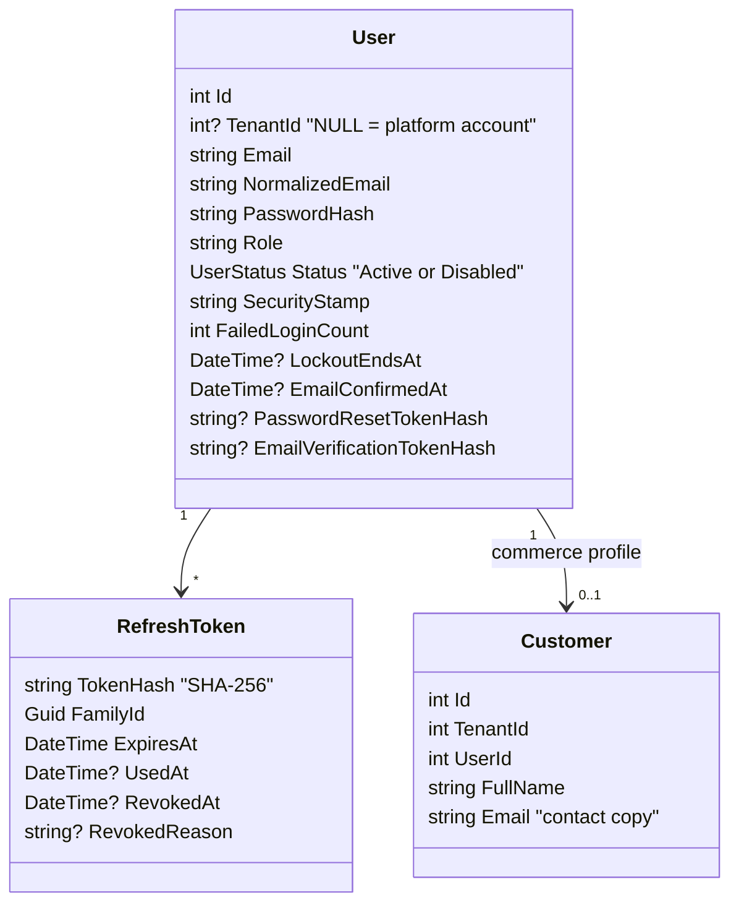

# Souq: Authentication and Authorization

> **Status:** Implemented in **Phase 3**. The decision is [ADR-0010](adr/0010-authentication-authorization.md); the mechanisms are [ADR-0023](adr/0023-sessions-and-credentials.md). Reset-token hashing dates from 1A, and the permission mechanism from 1B ([ADR-0019](adr/0019-authorization-foundation.md)).

## 1. Identity model

- **Accounts are per store.** The same email can hold independent accounts at store A and store B; the unique key is `(TenantId, NormalizedEmail)`.
  - Each store owns its customer relationship.
  - A breach or ban in one store doesn't affect the other.
- **Platform accounts** have `TenantId NULL`, with a unique `NormalizedEmail` among platform accounts.
  - They exist only on platform hosts.
  - The tenant filter shows store accounts in a store scope and platform accounts in the platform scope. Signing in on the wrong host therefore finds no account.
- **The customer profile** (`Customer`) is the commerce side: orders and reviews now, addresses and the basket later.
  - Registration creates the account and the profile in one transaction.
  - Staff accounts have no profile and cannot shop (`403 CustomerAccountRequired`).
- **The `User` aggregate guards its own rules in the Domain:** lockout, stamp rotation, single-use tokens, and no role change across the platform/store line.

## 2. Roles and permissions

| Role | Scope | Permissions |
|---|---|---|
| **PlatformOwner** | Platform | Every platform permission: `platform.tenants.manage`, `platform.users.manage`, `platform.settings.manage`, `platform.reports.view`, `platform.audit.view` |
| **PlatformAdmin** | Platform | `platform.tenants.manage`, `platform.reports.view`, `platform.audit.view` (not users or settings) |
| **TenantAdmin** | One store | Every store permission |
| **TenantStaff** | One store | `catalog.manage`, `inventory.view`, `inventory.manage`, `orders.view`, `orders.manage`, `customers.view`, `reviews.moderate`, `store.reports.view` |
| **Customer** | One store | None. Their own data is reached through ownership checks. |

**Store permissions:**
- `catalog.manage`;
- `inventory.view`, `inventory.manage`;
- `orders.view`, `orders.manage`;
- `customers.view`, `customers.manage`;
- `promotions.manage`;
- `reviews.moderate`;
- `store.settings.manage`, `store.staff.manage`, `store.reports.view`, `store.payments.manage`, `store.shipping.manage`.

Permissions for later phases exist already, so roles don't change shape when those endpoints arrive.

**How permissions are applied:**
- Permissions are constants (`Permissions.Orders.Manage`). Roles map to them in one table (`RolePermissions`).
- Store roles never receive platform permissions, and platform roles never receive store permissions. This is unit-tested.
- Endpoints declare `[HasPermission(...)]`, `[Authorize]` or `[AllowAnonymous]` explicitly. A 1B guard test enforces this.
- The token carries the role, not the permissions. The server resolves permissions on each request, so a change to the table applies at once.
- `/api/auth/me` returns the permission list for the UI.

**Resource rules live in use cases:**
- A customer sees only their own orders (`cid`).
- Staff see the store's orders (`orders.view`).
- Someone else's resource is a 404.

Custom per-store roles are deferred until a client needs them.

## 3. Tokens and sessions

| Token | Lifetime | Browser storage | Properties |
|---|---|---|---|
| Access (HS256 JWT) | 15 min (`Jwt:ExpiryMinutes`, 5–60) | JavaScript memory only | `sub`, `role`, `email`, `name`, `sstamp`, `tid` (store accounts), `cid` (customer profile) |
| Refresh | 30 days, sliding (`Jwt:RefreshTokenDays`, 1–90) | Cookie `souq_refresh`: `HttpOnly`, `Secure`, `SameSite=Strict`, `Path=/api/auth` | 256-bit random; only its SHA-256 hash is stored; rotated on every use; grouped in families for reuse detection |

**Validation on every authenticated request** (`AccessTokenValidation`):
1. signature, issuer, audience, and lifetime, with a 30 s clock skew;
2. **host binding:** on a store host, `tid` must equal the resolved store; on a platform host, there must be no `tid`;
3. `sstamp` must equal the account's current security stamp. The stamp is cached for 30 s per instance, and the instance that changes it drops the cached value at once.

**Refresh** (`POST /api/auth/refresh`, cookie only):
- **Active token:** it is marked used, and a new token in the same family plus a new access token are issued.
- **Token used in the last 10 s:** another token in the family is issued. This covers two tabs refreshing at once.
- **Token used earlier: reuse detected.**
  - The family is revoked.
  - The stamp rotates, so every access token dies.
  - A warning is logged.
  - The answer is `401 RefreshTokenReused`.
- **Expired, revoked or unknown token, or a disabled account:** `401 InvalidRefreshToken`.

**Revocation:**

| Event | Effect |
|---|---|
| Logout | The cookie's family is revoked, and the cookie is deleted |
| Change password | The stamp rotates, all refresh tokens are revoked, and the caller receives a fresh session |
| Reset password | The stamp rotates, all refresh tokens are revoked, and the lockout is cleared |
| Reuse detected | The family is revoked, and the stamp rotates |
| Account disabled | Refresh is refused, and the stamp rotates, so access tokens fail within the cache window |

## 4. Account security

- **Lockout:** 5 consecutive failures lock the account for 15 minutes (`401 AccountLocked`). A successful login resets the counter.
- **Timing:** an unknown email still runs a BCrypt comparison against a decoy hash, so response time doesn't reveal which emails exist. Forgot-password always answers 200.
- **Rate limits:** fixed window per `host|IP`, configured under `RateLimiting:*`.
  - 10/min: register, login, change password, forgot password, reset password, verify email, resend verification.
  - 30/min: refresh.
  - 30/min: coupon preview.
  - Exceeding a limit returns `429 TooManyRequests` with `Retry-After`.
- **Passwords:**
  - BCrypt.
  - 8–128 characters, with at least one letter and one digit.
  - Accounts created from configuration outside Development need at least 12 characters.
- **Password reset:**
  - A 32-byte CSPRNG token. Only its hash is stored.
  - Valid for 2 hours, single use, never logged.
  - Success rotates the stamp and revokes every session.
- **Email verification:**
  - Registration sends a 48-hour, single-use, hashed token.
  - `POST /api/auth/resend-verification` issues a new one.
  - The result is recorded (`EmailConfirmedAt`, and `emailConfirmed` in `/me`) but **not yet required** for checkout. That requirement is a store setting (Phase 4), enforced at checkout (Phase 9).
- **Email links point at the host the request came from.** Store B's customer returns to store B. This is safe because unknown hosts are rejected before any use case runs.
- **Bootstrap:**
  - `Seed:PlatformOwnerEmail`/`Seed:PlatformOwnerPassword` create the first platform owner.
  - `Seed:AdminEmail`/`Seed:AdminPassword` create the default store's admin.
  - Only Development falls back to documented credentials: `owner@souq.com` / `Owner@12345` and `admin@souq.com` / `Admin@123`.
  - An existing account is never overwritten.

## 5. Endpoints

| Endpoint | Authentication | Notes |
|---|---|---|
| `POST /api/auth/register` | Public, rate-limited | Store hosts only. Creates the account and customer profile, sends the verification email, and starts a session |
| `POST /api/auth/login` | Public, rate-limited | Starts a session. The body carries the access token and the user; the cookie carries the refresh token |
| `POST /api/auth/refresh` | Refresh cookie | Rotates the token; the body is the same as login |
| `POST /api/auth/logout` | Refresh cookie | 204; revokes the family |
| `GET /api/auth/me` | Access token | The current user, with permissions and area (`Store` or `Platform`) |
| `POST /api/auth/change-password` | Access token, rate-limited | Revokes the other sessions and returns a fresh one |
| `POST /api/auth/forgot-password` | Public, rate-limited | Always 200 |
| `POST /api/auth/reset-password` | Public, rate-limited | Single-use token |
| `POST /api/auth/verify-email` | Public, rate-limited | 204 |
| `POST /api/auth/resend-verification` | Access token, rate-limited | 204 |

Auth endpoints work on store and platform hosts, and while a store is still provisioning.

## 6. Frontend

- **`api/client.js`** keeps the access token in module memory, never in `localStorage`.
  - On a 401 for a request that carried a token, it refreshes once and retries once. Concurrent requests share one refresh.
  - A rejected refresh emits `session-expired`.
- **`AuthProvider`:**
  - It restores the session with a silent refresh on load, and reports `loading` until the server answers.
  - It exposes `can(permission)` and `canManageStore`.
  - It never stores the user.
- **Route guards and navigation** use the server's permissions.
  - The store dashboard opens to any store account that has a permission.
  - Staff don't see links they can't use.

## 7. Why custom (evolved) instead of ASP.NET Core Identity or an external IdP

Full reasoning is in [ADR-0010](adr/0010-authentication-authorization.md). In short:
- The existing implementation works and is tested.
- A Domain-owned `User` keeps Clean Architecture intact.
- Tenant-scoped uniqueness is natural.
- The missing hardening was a known, bounded list, now delivered.

An external IdP stays possible later without touching business code, because the **claims contract** (`sub`, `tid`, `cid`, role) is the only thing the rest of the system depends on.

## 8. Platform Owner vs Tenant Admin: the separation

| Aspect | Platform Owner/Admin | Tenant Admin |
|---|---|---|
| Account | `TenantId NULL` | `TenantId` = their store |
| Signs in on | Platform host only | Their store's host only |
| Token | No `tid`; rejected on store hosts | `tid` = their store; rejected on other hosts |
| API area | `/api/platform/*` (Phase 4) | `/api/admin/*` and store endpoints |
| Sees | All stores, through audited platform use cases | Their store only (query filters) |
| Configures a store's identity, domain, plan, modules | ✅ | ❌ |
| Edits their store's content, catalog, orders | Only through an explicit, audited "support mode" (Phase 18) | ✅ |
| Edits store name, contact, SEO, theme colours | ✅ at provisioning time | ✅ a limited subset after handover ([WhiteLabel.md](WhiteLabel.md)) |

## 9. Tests

- **Domain:** `UserTests` and `RefreshTokenTests` cover lockout, tokens, stamps and rotation state.
- **Application:** `AuthHandlersTests` covers the handlers, and `RolePermissionsTests` the store/platform split.
- **Integration (real HTTP, real SQL Server):**
  - `AuthSessionTests`:
    - cookie flags;
    - rotation and reuse;
    - logout;
    - a password change ends the other devices' sessions;
    - lockout;
    - the platform owner can sign in only on the platform host;
    - registration on the platform host is a 403;
    - email verification;
    - email links point at the store host;
    - 429 with `Retry-After`.
  - `AuthorizationMatrixTests`: role × endpoint, and staff can't shop.
  - `TenantIsolationTests`: store A's token on B's host is a 401.
  - `AuthorizationBoundaryTests`: every endpoint declares its decision.
  - `MigrationRehearsalTests`: legacy accounts keep their id, role, and password.
