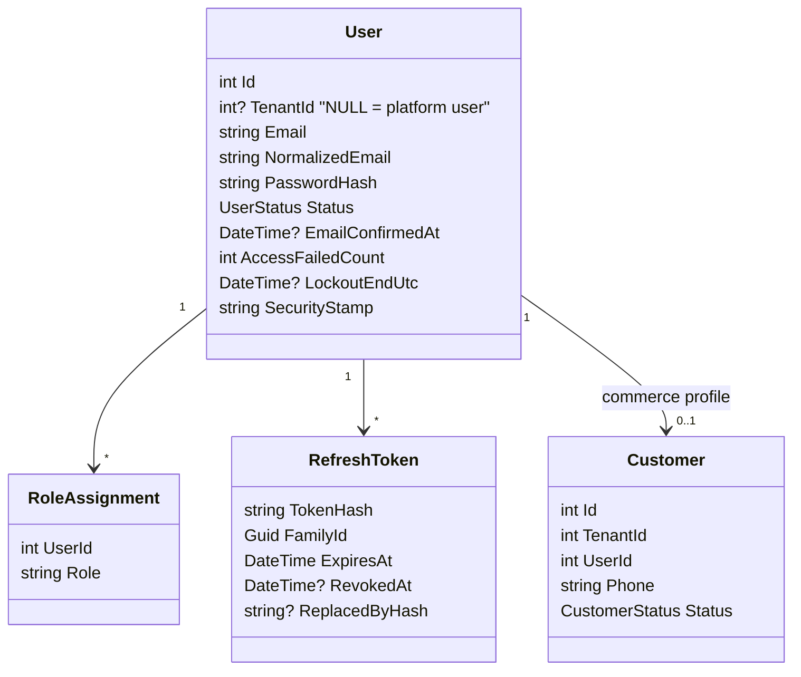

# Souq: Authentication and Authorization

> **Status:** Target adopted 2026-09-11 ([ADR-0010](adr/0010-authentication-authorization.md)). Implementation: **Phase 3** (identity split, tokens, permissions). The 1A hardening is marked ✅.

## 1. Current state (after Phase 1A)

- **Identity model:**
  - One `Customer` entity holds credentials, a `Role` string (`Customer`/`Admin`), and the commerce profile.
  - Register creates a Customer. Admins exist only through seeding (see [Security.md §11](Security.md#11-phase-0-findings-disposition), B1).
- **Passwords:** BCrypt; a minimum length of 8 on register and reset.
- **Access token:**
  - An HS256 JWT with claims `nameidentifier`, `email`, `name`, `role`.
  - Valid for 120 minutes. The client stores it in `localStorage`.
  - No refresh or revocation.
- **Password reset:** ✅ a 32-byte CSPRNG token, only its SHA-256 hash stored, 2-hour lifetime, single-use, never logged.
- **Authorization:**
  - `[Authorize]` and `[Authorize(Roles = "Admin")]` on controllers.
  - Ownership checks for orders happen in `OrdersController` (they move to Application in 1B).
- **Guard test:** ✅ `AuthorizationBoundaryTests` enumerates every admin endpoint and asserts anonymous → 401, customer → 403.

## 2. Target identity model

**Accounts are per tenant.** The same email can register at store A and store B as two independent accounts:
- Each store owns its customer relationship.
- A breach or ban in one store doesn't affect the other.
- Tenant isolation remains trivial.

Platform users (`TenantId NULL`) can sign in only on the platform host.

## 3. Roles and permissions

| Role | Scope | Typical permissions |
|---|---|---|
| **PlatformOwner** | Platform | Everything on the platform, including platform settings, plans, platform users, and owner-only actions (e.g. deleting a tenant) |
| **PlatformAdmin** | Platform | Tenant provisioning and configuration, support views; not owner-only settings |
| **TenantAdmin** | One tenant | All back-office permissions for that tenant, including staff and settings |
| **TenantStaff** | One tenant | A configurable subset: `catalog.write`, `orders.manage`, `inventory.adjust`, `reviews.moderate` … |
| **Customer** | One tenant | Their own account, orders, basket, wishlist, reviews |

**Permissions:**
- They are **constants in code** (`Permissions.Catalog.Write = "catalog.write"`), grouped by module.
- Built-in roles map to permission sets in one static table. Custom per-tenant roles are deferred until a client needs them (YAGNI).
- Endpoints declare `[HasPermission(Permissions.Orders.Manage)]`. A policy provider resolves the permission from the user's roles.
- Hard-coded role checks scattered through controllers are the anti-pattern this replaces.

**Resource-based rules live in Application, not controllers:**
- A customer may see order X only if `order.CustomerId == currentUser.CustomerId`.
- Tenant staff may act only inside the resolved tenant, which the tenant filter guarantees.

## 4. Tokens (Phase 3)

| Token | Lifetime | Storage (browser) | Contents / properties |
|---|---|---|---|
| Access (JWT) | 15 min | JavaScript memory only | `sub`, `tid` (absent for platform), `roles`, `stamp`, `aud` = `platform` or `tenant` |
| Refresh | 14 days sliding, 60 days absolute | `HttpOnly; Secure; SameSite=Strict` cookie scoped to `/api/auth` | Random 256-bit value; **stored hashed**; rotated on every use; reusing an already-rotated token revokes the whole family |

**Validation on every request:**
- signature, issuer, audience, lifetime;
- `tid` equals the tenant resolved from the host;
- the user's security stamp matches, via a cached lookup, so a password change, role change, or disable takes effect within one access-token lifetime at most.

**Logout** revokes the current refresh token family. **"Log out everywhere"** rotates the security stamp.

## 5. Account security

- **Lockout:** 5 failed attempts → 15 minutes, per account. Rate limiting per IP and tenant on auth endpoints.
- **Email verification:** required before placing an order (a tenant setting, default on).
- **Password policy:** length ≥ 10 for staff and platform accounts, ≥ 8 for customers, plus a check against a small list of common passwords. There are no composition rules; length beats complexity.
- **Password reset:** the 1A design, plus revocation of all sessions on success.
- **Platform owner bootstrap:** the first platform owner is created from secrets at first start. No default credentials exist in any environment except local Development.

## 6. Why custom (evolved) instead of ASP.NET Core Identity or an external IdP

Full reasoning is in [ADR-0010](adr/0010-authentication-authorization.md). In short:
- The existing implementation works and is tested.
- A Domain-owned `User` keeps Clean Architecture intact.
- Tenant-scoped uniqueness is natural.
- The missing hardening is a known, bounded list.

An external IdP stays possible later without touching business code, because the **claims contract** (`sub`, `tid`, `roles`) is the only thing the rest of the system depends on.

## 7. Platform Owner vs Tenant Admin: the separation

| Aspect | Platform Owner/Admin | Tenant Admin |
|---|---|---|
| Signs in on | Platform host only | Their tenant's host only |
| Token audience | `platform` | `tenant` + `tid` |
| API area | `/api/platform/*` | `/api/admin/*` |
| Sees | All tenants (through audited platform use cases) | Their tenant only (query filters) |
| Configures a tenant's identity, domain, plan, modules | ✅ | ❌ |
| Edits their store's content, catalog, orders | Only through explicit, audited "support mode" (Phase 18) | ✅ |
| Edits store name, contact, SEO, theme colours | ✅ at provisioning time | ✅ a limited subset after handover ([WhiteLabel.md](WhiteLabel.md)) |
