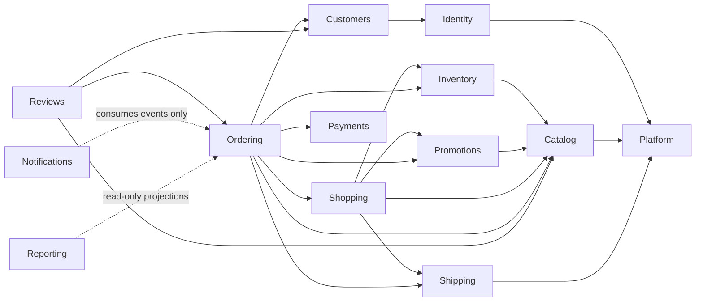

# Souq: Module Boundaries

> **Status:** Adopted 2026-09-11 ([ADR-0004](adr/0004-module-boundaries.md)). A module is a **business capability that owns its rules and its data**. It is not a folder created for appearance.
> **Structure and communication rules:** [Architecture.md §4–§6](Architecture.md#4-physical-structure-of-modules).

## 1. The module map

The brief listed 16 candidate areas. I evaluated each and **merged or reclassified** the ones that are not independent capabilities:

| Candidate from the brief | Decision | Reason |
|---|---|---|
| Identity / Authentication | **Module: Identity** | Owns credentials, tokens, roles. A distinct security boundary. |
| Tenants | **Module: Platform** | The tenant lifecycle, domains, and module flags are one capability |
| Platform Administration | **API/UI area**, not a module | It owns no data of its own. It is the platform owner's *entry point* into Platform, Identity, and Reporting use cases. |
| Storefront / Store Configuration | Configuration → **Platform** (tenant settings). Storefront → **API/UI area** | Branding, SEO, and contact details are tenant settings. "Storefront" is a public *view* composed of Catalog, Platform config, and Shopping. |
| Catalog | **Module: Catalog** | |
| Categories | Merged into **Catalog** | Categories exist only to organize products. They are the same language and the same team of rules. |
| Inventory | **Module: Inventory** | Different invariants (reservations, ledger, concurrency) and a different change rate from product descriptions. It is an extraction candidate. |
| Customers | **Module: Customers** | Commerce profile, addresses, account status. Distinct from login identity. |
| Basket | **Module: Shopping** (with Wishlist) | Both are pre-purchase intent owned by a shopper, with similar lifecycles (guest → merge on login). Two tiny modules would be ceremony. |
| Wishlist | Merged into **Shopping** | As above |
| Orders | **Module: Ordering** | |
| Payments | **Module: Payments** | Provider integration, PCI scope, refunds. A clear extraction candidate. |
| Coupons | **Module: Promotions** | Named for the capability, so that future discount types (automatic promotions, bundles) have a home |
| Reviews | **Module: Reviews** | |
| Notifications | **Module: Notifications** | |
| Shipping | **Module: Shipping** | |
| Reporting | **Module: Reporting** (read-only) | Cross-module read models and dashboards; it never writes business data |
| *(Audit, tenancy enforcement, errors, paging)* | **Building blocks**, not modules | Cross-cutting mechanisms with no business capability of their own |

**Result: 13 modules.**
- **Already present in some form (8):** Identity, Catalog, Inventory, Ordering, Payments (port), Promotions, Reviews, Notifications (port).
- **Introduced later (5):** Platform (Phase 2/4), Customers (7), Shopping (8/13), Shipping (12), Reporting (17).

## 2. Allowed module dependencies

Arrows mean "may call the **Contracts** of". A cycle is never allowed. Everything may use the shared kernel (Money, TenantId, error and paging types).

**Payments → Ordering is forbidden,** because Ordering already depends on Payments. A payment result reaches Ordering in one of two ways:
- *pull*: Ordering calls `IPaymentService.ConfirmAsync`, as today;
- *push*: an event, once the outbox exists.

A webhook is received by an **Ordering** use case, which parses it through the Payments port.

## 3. Module catalog

Each entry lists:
- **Responsibility**
- **Owns** (data)
- **Must not own**
- **Contracts** (public, in-process)
- **Domain** (key rules)
- **Infrastructure** (adapters)
- **Depends on** / **Forbidden**
- **Extraction**
- **Today**

### Platform (introduced Phase 2/4)
- **Responsibility:** the tenant lifecycle and the configuration of each store.
- **Owns:** `Tenants` (including the settings document and the module flags, [ADR-0024](adr/0024-platform-administration.md)), `TenantDomains`, tenant settings (branding, contact, SEO, locale, currency, time zone); plans later.
- **Must not own:** users (Identity); any catalog, order, or customer data.
- **Contracts:**
  - `ITenantDirectory` (resolve a host to a tenant; tenant status);
  - `IStoreConfiguration` (read the settings a storefront needs);
  - `ITenantModules` (is module X enabled?).
- **Domain:**
  - Tenant status transitions.
  - Exactly one primary domain per tenant.
  - A host is unique across the whole platform.
  - The module set is valid for the plan.
- **Infrastructure:** cached domain map; branding asset storage.
- **Depends on:** nothing (root).
- **Forbidden:** reading tenant-owned business tables. Platform statistics come from Reporting.
- **Extraction:** unlikely (small and central). It could become a "control plane" if the platform ever runs per-region stacks.
- **Today (Phase 4):**
  - `Tenant` + `TenantDomain` + `StoreSettings` value objects + `StoreModules` (`Souq.Domain.Platform`).
  - `ITenantDirectory` (a cached snapshot that includes the modules), `ITenantContext`, and `IStoreConfiguration` (the cached storefront config).
  - The resolution and availability middleware; `[RequiresModule]` enforcement.
  - `Features/Platform`: the platform area (stores, domains, settings, modules, invitations, platform accounts, audit log).
  - `Features/Stores`: store-side settings, branding and the public config.

### Identity
- **Responsibility:** who can sign in, and what they are allowed to do.
- **Owns:** `Users` (credentials, status, lockout, security stamp), refresh tokens, role assignments; the permission catalog, which lives in code.
- **Must not own:** commerce profile data (addresses, phone, marketing preferences) → Customers.
- **Contracts:**
  - `IUserDirectory` (look up a user; create a tenant admin);
  - the authentication use cases (register, login, refresh, logout, reset);
  - `ICurrentUser` (Application port, implemented from claims).
- **Domain:**
  - Normalized email unique per tenant.
  - Platform users have no tenant.
  - Lockout after repeated failures.
  - Single-use, hashed reset tokens.
  - Refresh-token rotation with reuse detection.
- **Infrastructure:** BCrypt, JWT issuance, rate limiting.
- **Depends on:** Platform (tenant active).
- **Forbidden:** issuing a token whose tenant differs from the one resolved from the host; storing plaintext secrets.
- **Extraction:** medium. It could be replaced by an external identity provider (the claims contract stays the same).
- **Today:**
  - `User` + `RefreshToken` (`Souq.Domain.Identity`, Phase 3) and `Features/Auth`.
  - `Features/Staff` (Phase 4): invite, list, enable and disable store staff.
  - Account invitations and status rules are shared building blocks with the platform area (`Common/Accounts`).

### Catalog
- **Responsibility:** what the store sells and how it is presented.
- **Owns:** `Categories`, `Products`, variants, images, translations, attributes.
- **Must not own:**
  - stock quantities and reservations → Inventory;
  - prices of past orders → Ordering snapshots;
  - reviews → Reviews.
- **Contracts:**
  - `ICatalogQueries` (storefront listing, search, detail, related);
  - `ISellableItems.GetForCheckout(ids)` → snapshots of name, SKU, unit price, and active flag.
- **Domain:**
  - Slug and SKU unique per tenant.
  - Status lifecycle (Draft / Active / Archived).
  - The category tree has no cycles.
  - A price is `Money` in the tenant currency.
- **Infrastructure:** EF, image storage (via `IFileStorage`), search (SQL now).
- **Depends on:** Platform (tenant currency and languages).
- **Forbidden:** changing stock; reading orders (best-selling rankings come from Reporting or an Ordering query contract).
- **Extraction:** the *search* part could be extracted (see [Architecture.md §9](Architecture.md#9-future-scaling-and-service-extraction)).
- **Today (Phase 5, [ADR-0025](adr/0025-catalog-model.md)):**
  - `Product` (root) owns `ProductTranslation`, `ProductImage` and exactly one default `ProductVariant` (SKU, price, compare-at price).
  - `Category` owns `CategoryTranslation`. `CatalogText` is the per-language value object.
  - Use cases live in `Features/Products` and `Features/Categories`; `ICatalogQueries` serves both the storefront and the admin projections.
  - Stock is not in Catalog (Phase 6): creating a product calls Catalog's own port `IVariantStockInitializer`, which Inventory implements, so the dependency still points Inventory → Catalog.
  - The best-selling sort still reads `Orders` directly. It moves behind an Ordering query contract when Ordering is rebuilt (Phase 9); Phase 5 did not need to touch it.
  - Attributes and the variant option matrix are deferred.

### Inventory
- **Responsibility:** how many units exist, and who is holding them.
- **Owns:** stock levels (on hand, reserved), reservations, the stock ledger (`StockMovements`), low-stock thresholds.
- **Must not own:** product descriptions or prices.
- **Contracts:**
  - `IInventoryReservations` (Reserve, Commit, Release);
  - `IStockAvailability` (read);
  - adjustment use cases.
- **Domain:**
  - `available ≥ 0`.
  - Every change produces exactly one ledger entry.
  - A reservation expires.
  - Releases are idempotent.
- **Infrastructure:** `rowversion` concurrency, the reservation-expiry background service.
- **Depends on:** Catalog (the variant must exist).
- **Forbidden:** creating orders; reading order internals. It knows only reservation references.
- **Extraction:** a candidate (flash sales, multiple warehouses), which is why its contract is reserve → commit/release from the start.
- **Today (Phase 6, [ADR-0026](adr/0026-inventory-reservations.md)):**
  - `InventoryItem` (one per variant; on hand, reserved, `rowversion`), `StockReservation`, and `StockMovement`, which only the item creates.
  - `Features/Inventory/Contracts` holds `IInventoryReservations` and `IStockAvailability`, both used by Ordering.
  - `Features/Inventory/Reservations` holds the implementation, the retrying `InventoryWriter`, and `VariantStockInitializer` (Catalog's port).
  - Adjustment and threshold commands; `InventoryQueries` for the admin screens.
  - The expiry sweep is an Ordering use case (it decides about orders) run by an Infrastructure hosted service.
  - `ModuleAndContractRuleTests` allows only these contract references.

### Customers (introduced Phase 7)
- **Responsibility:** the shopper as a commercial relationship of one tenant.
- **Owns:** `Customers` (profile, phone, status), `CustomerAddresses`.
- **Must not own:** credentials → Identity; orders → Ordering.
- **Contracts:** `ICustomerDirectory` (profile, status, default addresses); profile and address use cases.
- **Domain:** a blocked customer cannot place orders; at most one default shipping address and one default billing address.
- **Depends on:** Identity (UserId).
- **Forbidden:** authentication logic.
- **Extraction:** unlikely.
- **Today (Phase 7, [ADR-0027](adr/0027-customer-profile-and-erasure.md)):**
  - `Customer` (profile, phone, status, erasure) owns its `CustomerAddress`es. `PostalAddress` is the address value object.
  - `Features/Customers/Account` covers the caller's own profile, addresses, export and erasure. `Features/Customers/Admin` covers list, detail, status, export and erasure. `CustomerErasure` is the single erasure path for both.
  - Read projections (`ICustomerQueries`: the list with order count, spend and last order; the detail; the export) live in Infrastructure, so the Application layer has no Customers → Ordering dependency. Order history comes from Ordering (`GET /api/orders?customerId=`).
  - Ordering and Reviews still load the `Customer` aggregate through `ICustomerRepository` (block check, address snapshot). The narrower `ICustomerDirectory` contract above is deferred until a second consumer or an extraction needs it.

### Shopping (Basket Phase 8, Wishlist Phase 13)
- **Responsibility:** what a shopper intends to buy or remember.
- **Owns:** `Baskets` + lines; `WishlistItems`.
- **Must not own:** prices as truth (it re-reads them from Catalog); stock (it asks Inventory).
- **Contracts:** `IBasketReader` (Ordering converts a basket at checkout); basket and wishlist use cases; `IPricing` (subtotal → discounts → shipping → tax → total), shared with checkout.
- **Domain:** quantity > 0; guest-to-customer merge rules; basket expiry.
- **Depends on:** Catalog, Inventory, Promotions, Shipping.
- **Forbidden:** reserving stock (only checkout reserves).
- **Extraction:** unlikely.
- **Today:** client-side only (`CartContext` in memory; wishlist in `localStorage`).

### Ordering
- **Responsibility:** turning a purchase decision into an immutable commercial record and moving it through its lifecycle.
- **Owns:** `Orders`, `OrderItems`, `OrderStatusHistories`; order numbers; tracking tokens.
- **Must not own:** payment provider state → Payments; stock → Inventory; coupon rules → Promotions.
- **Contracts:**
  - `IOrderHistory` (e.g. has this customer received product X? Used by Reviews);
  - order queries;
  - the checkout and status use cases.
- **Domain:**
  - The transition table.
  - Lines only while Pending.
  - Snapshots immutable after placement.
  - Discount ≤ subtotal.
  - Cancelling releases stock exactly once.
- **Depends on:** Catalog, Inventory, Promotions, Payments, Shipping, Customers, Shopping.
- **Forbidden:** mutating other modules' entities directly (the target state; today it calls `Product.DecreaseStock`, fixed in Phase 6/9).
- **Extraction:** unlikely. It is the core, and the other modules are extracted around it.
- **Today:** `Order` aggregate + `Features/Orders`.

### Payments (module from Phase 11)
- **Responsibility:** collecting money through providers without ever touching card data.
- **Owns:** `Payments`, `Refunds`, per-tenant provider configuration (encrypted).
- **Must not own:** order state.
- **Contracts:** `IPaymentService` / `IPaymentGateway` (create intent, confirm, refund, parse webhook, client config).
- **Domain:** refunded ≤ captured; idempotency keys; conversion to the provider's minor units.
- **Infrastructure:** Stripe (and future providers), the fake gateway.
- **Depends on:** Platform (tenant gateway configuration).
- **Forbidden:** calling Ordering; storing a PAN, CVV, or raw card data.
- **Extraction:** a strong candidate (PCI isolation).
- **Today:** the `IPaymentService` port + Stripe/Fake adapters. Webhook parsing moved behind the port in 1A.

### Promotions
- **Responsibility:** discount rules.
- **Owns:** `Coupons`, `CouponRedemptions` (Phase 10).
- **Must not own:** order totals.
- **Contracts:** `ICouponEvaluator` (preview/validate + compute the discount); redemption Reserve / Commit / Release.
- **Domain:** value ranges; validity window; global and per-customer limits; currency-aware rounding.
- **Depends on:** Catalog (for product or category scoped coupons, if added).
- **Forbidden:** reading orders directly (redemptions carry the order reference).
- **Extraction:** unlikely.
- **Today:** `Coupon` + `Features/Coupons`. Usage is counted at payment time, which allows a MaxUses overshoot race (fixed with redemptions in Phase 10).

### Shipping (introduced Phase 12)
- **Responsibility:** how an order gets delivered, and what that costs.
- **Owns:** `ShippingMethods`, rate configuration, carriers.
- **Contracts:** `IShippingRateProvider` (quotes); method queries.
- **Domain:** eligibility (country, threshold); rate strategies.
- **Depends on:** Platform.
- **Forbidden:** order state.
- **Extraction:** carrier integrations sit behind the port. Extraction is unlikely.
- **Today:** only a `TrackingNumber`/carrier text on `Order`. The UI shows "Free".

### Reviews
- **Responsibility:** customer opinions about products.
- **Owns:** `Reviews` and their moderation state.
- **Contracts:** review queries (list, average); create and moderate use cases.
- **Domain:** rating 1–5; verified purchase; one review per customer per product; moderation workflow (Phase 13).
- **Depends on:** Ordering (`IOrderHistory`), Catalog, Customers (display name).
- **Forbidden:** writing to Catalog (aggregates are computed or cached, never pushed into Product).
- **Extraction:** unlikely.
- **Today:** `Review` + `Features/Reviews`. It currently queries orders through `IOrderRepository` (moves to `IOrderHistory`).

### Notifications (module from Phase 14)
- **Responsibility:** telling people what happened, through the right channel, in the tenant's voice.
- **Owns:** templates (per tenant, per language), the delivery log, in-app notifications, the outbox dispatch state.
- **Contracts:** event consumers; `IEmailService` / `INotificationSender` ports.
- **Domain:** idempotent delivery; retries; opt-outs (later).
- **Depends on:** events only. It never calls business modules synchronously.
- **Forbidden:** business decisions; logging secrets or links.
- **Extraction:** the strongest candidate.
- **Today:** `IEmailService` with 4 adapters, sent inline. Link and PII logging were fixed in 1A.

### Reporting (introduced Phase 17)
- **Responsibility:** dashboards and reports for tenants and the platform.
- **Owns:** read models or aggregates only (derived data, rebuildable).
- **Contracts:** dashboard and report queries.
- **Depends on:** read-only access to other modules' tables through dedicated query services. This is a **documented exception**: it only reads, never writes. Event-fed read models replace it when volume demands.
- **Forbidden:** any write to business tables.
- **Extraction:** a candidate (separate reporting store).
- **Today:**
  - `Features/Reporting` (Phase 4): platform statistics (tenants by status, accounts, customers, products, orders), counted across stores by the reviewed `PlatformQueries` and audited.
  - The store dashboard still counts via public endpoints (Phase 17).

## 4. How to add a new module (checklist)

1. Name it after a **capability**, not an entity. Write down what it owns and what it must not own.
2. Create `Souq.Domain/<Module>`, `Souq.Application/Features/<Module>` (including `Contracts/`), and the Infrastructure configurations under the module's folder.
3. Add the module to the dependency graph above. Refuse any cycle.
4. Add an architecture test stating which other modules it may reference.
5. Tenant-owned tables implement `ITenantOwned` (from Phase 2) and get isolation tests.
6. Document its contracts here and in [ApiDocumentation.md](ApiDocumentation.md).
