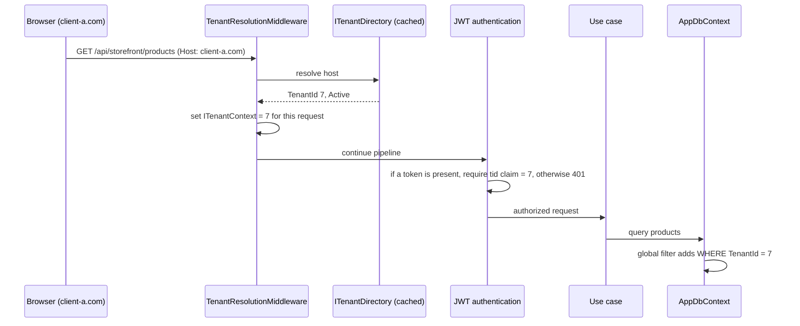

# Souq: Multi-Tenancy Architecture

> **Status:** Design adopted 2026-09-11 ([ADR-0005](adr/0005-multi-tenancy-model.md), [ADR-0006](adr/0006-tenant-resolution.md)). Implementation: **Phase 2**. Today no table carries a tenant.

## 1. Decision

**Shared application + shared database + `TenantId` column**, with isolation enforced **centrally** by the data-access layer and proven by automated tests. There is also a designed seam that lets a specific tenant move to a dedicated database later.

### Re-evaluation: is this still the right start?

| Question | Answer |
|---|---|
| How many tenants, and how big? | Many small stores. Cost per tenant must be near zero, which favours a shared database. |
| Compliance that demands physical separation? | None known today. If an enterprise client needs it, the hybrid path (§6) covers it. |
| Cross-tenant platform dashboards? | Required. In a shared database they are trivial; with one database per tenant they need pipelines. |
| Operational capacity? | One developer: one migration run, one backup, one connection string. |
| Biggest risk? | A forgotten filter leaking data between tenants. It is mitigated by making the filter **automatic** (not per query), plus a write guard, plus tests. |

**Conclusion: yes.** Shared database with `TenantId` remains the right starting architecture.

## 2. Principles

1. **The server decides the tenant.**
   - It is resolved from the request host. An authenticated principal must also carry a matching `tid` claim.
   - A `TenantId` in a body, query string, or header from the browser is **never** trusted. The only exception is a dev-only header, compiled in for Development and ignored elsewhere.
2. **Isolation is the default, not an effort.**
   - Every tenant-owned entity implements `ITenantOwned`.
   - EF Core applies the filter to every query automatically.
   - The unit of work stamps and validates `TenantId` on every write.
3. **Crossing tenants is explicit.** Only platform use cases may do it, through a dedicated, audited path. There are no ad-hoc `IgnoreQueryFilters()` calls.
4. **A resource from another tenant does not exist** from the caller's point of view: the answer is 404, never 403. That avoids leaking its existence.
5. **Tests prove it.** Every tenant-owned endpoint appears in the isolation suite.

## 3. Tenant context resolution

| Host kind | Tenant context | Allowed endpoints |
|---|---|---|
| Platform host (e.g. `admin.souq.app`) | **None** | `/api/platform/*`, platform auth |
| Tenant custom domain or `{slug}.souq.app` | That tenant | storefront, account, admin, tenant auth |
| Unknown host | — | 404 (no fallback tenant in Production) |
| `localhost` in Development | From the `{slug}.localhost` subdomain, or a dev `X-Tenant` header | all (dev convenience only) |

**Additional rules:**
- A suspended or archived tenant's storefront answers "store unavailable". Its admins can still sign in to see a notice. Platform users are unaffected.
- `ITenantContext` (an Application port) is scoped per request, and is also set explicitly for background jobs.
- JWTs are audience-scoped: a platform token is invalid on tenant hosts, and vice versa.

## 4. Enforcement mechanics (Phase 2 implementation)

| Mechanism | What it does | Where |
|---|---|---|
| `ITenantOwned { int TenantId }` | Marks tenant-owned entities; `TenantId` is set once and never changes | Domain |
| **Global query filter** | `e => e.TenantId == _tenant.Id` on every `ITenantOwned` entity, applied by reflection at model build (no per-entity copy-paste) | Infrastructure (`AppDbContext`) |
| **Write guard** (`SaveChanges` interceptor) | Added entity → stamp `TenantId`. Modified or deleted entity whose `TenantId` ≠ current → throw `CrossTenantWriteException` (a 500 **and** a security log entry, since it indicates a bug) | Infrastructure |
| **No tenant context** | Querying an `ITenantOwned` set without a resolved tenant throws. It must not return all rows. | Infrastructure |
| **Platform access** | Platform read use cases run through `IPlatformQueries`, which calls `IgnoreQueryFilters()` in one reviewed place; every call is audited | Infrastructure + Audit |
| **Raw SQL** | Forbidden in feature code. Allowed only inside Infrastructure query services, which must include `TenantId` and be covered by an isolation test | Code review + tests |
| **Uniqueness** | `(TenantId, Slug)`, `(TenantId, Code)`, `(TenantId, NormalizedEmail)`, `(TenantId, Sku)`, `(TenantId, OrderNumber)` | Database |
| **Indexes** | Hot-path indexes lead with `TenantId` | Database |
| **Cache keys** | Always include the tenant: `tenant:{id}:config` | Infrastructure |
| **File storage** | Keys prefixed `tenants/{id}/…`; served only through the tenant's host | Infrastructure |
| **Background jobs** | Iterate tenants explicitly and set `ITenantContext` per iteration | Infrastructure |
| **Logs** | Every log scope carries `TenantId` | API middleware |

### Who can see what

| Actor | Tenant-owned data | Platform data |
|---|---|---|
| Visitor | Public catalog and config of the host's tenant only | none |
| Customer | Their own orders, profile, addresses, basket in that tenant (ownership checks on top of the tenant filter) | none |
| Tenant Staff | Their tenant, limited by permissions | none |
| Tenant Admin | Everything in their tenant | their tenant's settings (the subset a tenant may edit) |
| Platform Admin / Owner | Through platform use cases only (audited): aggregates, support views | all tenants, domains, modules, plans |

## 5. Isolation test suite (Phase 2 onward)

- **Generic endpoint test:**
  - Seed tenants A and B.
  - For every tenant-owned endpoint (discovered from routing metadata), authenticate as tenant B's admin on B's host and request A's resource ids.
  - Expect 404 for reads, updates, and deletes, and expect listings to exclude A's rows.
- **Token/host mismatch:** a token for A used on B's host → 401.
- **Write guard:** attempt to modify an A entity while the context is B → exception, nothing saved.
- **Missing context:** querying tenant-owned data with no tenant resolved → exception.
- **Uniqueness per tenant:** the same slug, coupon code, email, or SKU succeeds in A and B but fails twice in A.
- **Platform bypass:** a platform aggregate query sees both tenants; the same query from a tenant context sees one.
- These tests run against **real SQL Server** (Testcontainers), because query filters and unique indexes are provider behaviour ([ADR-0015](adr/0015-testing-strategy.md)).

The harness exists since Phase 1A. It already proves **user-level** isolation: customer A can't read customer B's orders.

## 6. Migration paths (designed, not built)

| Model | When | How Souq gets there |
|---|---|---|
| **Shared DB** (start) | Default for all tenants | Phase 2 |
| **Hybrid** | An enterprise tenant needs a dedicated database (compliance, noisy neighbour, data residency) | `Tenants.DatabaseMode` = Shared/Dedicated plus a connection reference. `ITenantDatabaseResolver` picks the connection when the `DbContext` is created. The same schema and migrations run against each dedicated database. |
| **Database per tenant** (all) | Only if most tenants need it, which is unlikely for this market | The same resolver. The platform database keeps `Tenants`/`TenantDomains`/`Users`(platform); tenant databases keep the rest. |

**What keeps these paths open (decisions taken now):**
1. `TenantId` is on **every** tenant-owned row, so a tenant's data can be exported with `WHERE TenantId = @id`.
2. No foreign keys between tenant-owned data and other tenants' data.
3. Platform tables (`Tenants`, `TenantDomains`, platform users) are separable from tenant tables.
4. Features never build connection strings. Only the resolver seam does.
5. Moving a tenant keeps its `int` ids (the dedicated database is empty, so `IDENTITY_INSERT` is safe). Merging tenants is *not* supported, and that is intentional ([ADR-0007](adr/0007-database-strategy.md)).

**Revisit conditions:**
- A contract requires physical isolation.
- One tenant uses more than about 30% of database resources.
- Data-residency law requires a region-specific database.

## 7. Failure modes and mitigations

| Failure | Mitigation |
|---|---|
| A new entity forgets `ITenantOwned` | Architecture test: every entity in a tenant-owned module implements it (Phase 2). The isolation suite fails. |
| Someone uses `IgnoreQueryFilters()` in a feature | Architecture/grep test: only allowed inside `IPlatformQueries` |
| A background job runs without a tenant | Querying tenant data without context throws, so the failure is loud |
| A cache entry is served to the wrong tenant | Tenant-prefixed keys; the cache wrapper requires a tenant id |
| A URL to another tenant's upload is shared | Storage keys are unguessable; storefronts reference only their own tenant prefix |
| The platform owner acts inside a tenant | Explicit "support mode" use cases, audited (Phase 18) |
