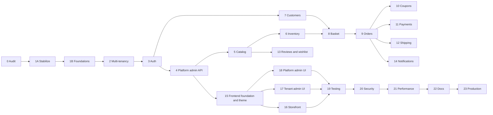

# Souq Platform: Product Roadmap

> **Goal:** turn Souq into one **white-label, multi-tenant e-commerce platform**, sold to many clients (≈ $5,000+ each) and maintainable by a professional team.
> **Status:** Phase 0 ✅ · Target architecture ✅ documented · Phase 1A ✅ (merged to `main`) · Phase 1B ✅ complete on branch `phase/1b-production-foundations` (awaiting your review and merge). Next: Phase 2.
> **Companion document:** [ArchitectureAssessment.md](ArchitectureAssessment.md) covers the current state, the problem register (IDs such as `B1` and `C2`), the target architecture, and the full reasoning behind every decision (`D-xx`).
> **Last updated:** 2026-09-11

---

## 1. Vision

**One codebase, one deployment, many independent stores.**

The platform owner provisions and configures client stores ("tenants") from a central platform administration area.
Each tenant gets its own domain, branding, language, currency, catalog, customers, orders, and enabled modules.
The backend enforces tenant isolation.
A client never sees another client's data, even if the UI or an API call is manipulated.

```
            ┌────────────────────── Souq platform (one codebase, one deployment) ──────────────────────┐
            │                                                                                            │
 admin.souq.app ─► Platform administration (platform owner/admins, no tenant context)                  │
 client-a.com  ─►  Storefront + /account + /admin   ── tenant A: own branding, data, modules            │
 client-b.com  ─►  Storefront + /account + /admin   ── tenant B: own branding, data, modules            │
            │                                                                                            │
            └──────────── shared SQL Server database, every tenant-owned row carries TenantId ───────────┘
```

## 2. Product principles (non-negotiable)

1. **One product.** No per-client forks, no `SouqClientA`, and no `if (tenant == "abc")` in code. Tenants differ only through configuration, data, and modules.
2. **The backend enforces isolation, centrally.** Isolation comes from global query filters, write guards, and automated tests. It never depends on the frontend.
3. **Evolve, don't rewrite.** Keep what works (Assessment §10). There is no second competing architecture.
4. **Every phase ends shippable.** Build green, tests green, app runnable, docs updated, committed.
5. **Secure by default.** Least privilege, no secrets in git, and no tokens or sensitive data in logs.
6. **Every abstraction pays rent.** Interfaces exist only at real variation points: payments, shipping, storage, notifications, tenancy.
7. **Explain the why.** Every phase report states what changed, why, which layer it lives in, the principle behind it, the alternatives, and how to reuse the idea elsewhere.

## 3. Actors and areas

| Actor | Scope | UI area | Served on |
|---|---|---|---|
| **Platform Owner** | Whole platform, including owner-only settings | Platform admin | Platform host (e.g. `admin.souq.app`) |
| **Platform Admin** | Delegated platform operations | Platform admin | Platform host |
| **Tenant Admin** (store owner) | One tenant, full control | Back-office `/admin` | Tenant domain |
| **Tenant Staff** | One tenant, permission subset | Back-office `/admin` | Tenant domain |
| **Customer** | Own account inside one tenant | Storefront + `/account` | Tenant domain |
| **Visitor** | Public storefront | Storefront | Tenant domain |

## 4. Milestones

| Milestone | Phases | Outcome |
|---|---|---|
| **M0 Baseline** | 0 | Audit, target architecture, this plan |
| **M1 Platform core** | 1A · 1B · 2 · 3 · 4 | Stable, multi-tenant, secure identity, tenants manageable through the API |
| **M2 Commerce core** | 5 – 10 | Complete tenant-aware catalog, inventory, customers, basket, orders, coupons |
| **M3 Integrations** | 11 – 14 | Pluggable payments, shipping, reviews/wishlist, notifications |
| **M4 Experience** | 15 – 18 | White-label frontend: storefront, tenant admin, platform admin |
| **M5 Launch** | 19 – 23 | Tested, secured, fast, documented, production-ready → **first client** |



*The graph shows true dependencies. Execution stays sequential, one approved phase at a time (see CLAUDE.md), but the graph shows which reorderings are safe if priorities change.*

## 5. Recommended changes to the original 23-phase plan

The original ordering is sound. I recommend five adjustments:

| # | Change | Why |
|---|---|---|
| 1 | **Split Phase 1** into **1A Stabilize** and **1B Architecture foundations** | The audit found live defects: overselling race, cancelled orders never restock, a default admin password seeded in production, reset links written to logs, and an upload path that allows stored XSS. Multi-tenancy would multiply each of them by N tenants. Two small gates are easier to review than one large one. |
| 2 | **Testing becomes continuous.** The integration-test harness was built in 1A (moved forward from 1B), and Phase 19 becomes gap closure + E2E + load | Tenant-isolation tests must exist from the first day of Phase 2. A tenancy bug found in Phase 19 would mean re-auditing 17 phases of work. |
| 3 | **The white-label/theme runtime moves from 18 to 15** and merges with the frontend foundation. The old 15/16/17 become 16/17/18 | Storefront, tenant admin, and platform admin all build on the theme and tenant-config runtime. Doing it last means restyling every screen twice. |
| 4 | **Security quick wins are pulled forward** into 1A and 3 | Phase 20 becomes verification and hardening, not the first time security is considered. |
| 5 | **The storefront config API lands in Phase 4 (backend)** | Tenant configuration must exist and be testable before the frontend consumes it in Phase 15. |

## 6. Phase plan

Status legend: ✅ done · 🟡 in progress · ⏳ planned · ⏸ awaiting approval

### Phase 0: Complete system audit ✅
- **Goal.** Understand the system completely before changing it.
- **Delivered.** [ArchitectureAssessment.md](ArchitectureAssessment.md), which contains the feature, entity, API, database, and frontend maps, an end-to-end trace, the problem register, the target architecture, and the migration strategy. Also this roadmap.
- **Verified.** `dotnet build` passes with 0 warnings. `dotnet test` passes 133/133. The frontend production build passes. NuGet reports no vulnerable packages.

### Target architecture ✅ (documented before Phase 1A, 2026-09-11)
- **Delivered:**
  - [Architecture.md](Architecture.md) and [ArchitectureEvaluation.md](ArchitectureEvaluation.md) (ten styles evaluated);
  - [Modules.md](Modules.md), [MultiTenancy.md](MultiTenancy.md), [DatabaseDesign.md](DatabaseDesign.md), [ApiDocumentation.md](ApiDocumentation.md);
  - [Security.md](Security.md), [AuthenticationAndAuthorization.md](AuthenticationAndAuthorization.md);
  - [FrontendArchitecture.md](FrontendArchitecture.md), [WhiteLabel.md](WhiteLabel.md), [DevelopmentGuide.md](DevelopmentGuide.md);
  - ADRs 0001–0016 in [adr/](adr/).
- **Decision:** modular monolith + Clean/Hexagonal boundaries + selective DDD + vertical slices + selective CQRS. Modules are namespaces inside the four layer projects, enforced by architecture tests.

### Phase 1A: Stabilize + foundations the fixes depend on ✅ (merged 2026-09-11)
- **Goal.** Fix the confirmed correctness and security defects before tenancy multiplies them. Put in place the minimum foundations those fixes need and every later phase reuses: concurrency, money precision, test harness, architecture tests.
- **Scope change (2026-09-11).** Per the architecture brief, concurrency (C1/C4), JOD precision (C5), the payment-port cleanup (D1/D2), and the integration-test harness moved here from 1B.
- **Scope.**
  - Security:
    - no default admin outside Development (B1);
    - no reset links, tokens, or PII in logs (B2);
    - hashed CSPRNG reset tokens (B6);
    - content-sniffed uploads with server-chosen extensions and a locked-down `/uploads` (B3);
    - personal email defaults removed (B12);
    - non-breaking `npm audit fix` (B11).
  - Correctness:
    - `rowversion` on Products, Coupons, Orders with a 409 on conflict (C1);
    - compare-and-set stock edits (C4);
    - `decimal(19,4)` + `Money` minor-unit enforcement (C5);
    - cancelling restocks with a `Cancellation` ledger entry, and payment failure is logged in the ledger (C2, C3);
    - intent-creation failure cancels the order and releases stock (C6);
    - `Order.Cancel` guarded against Cancelled → Cancelled (C10);
    - admin category filter fixed (C8);
    - paging validated (C9);
    - Money, concurrency, and unique-violation errors → 400/409 instead of 500 (C11).
  - Boundaries:
    - Stripe webhook parsing and client config behind `IPaymentService`, with no static Stripe key (D1, D2);
    - Result→HTTP mapping in one place (D5, partial);
    - a single `IFileStorage` (the duplicate `IVideoStorage` removed).
  - Database integrity: a `Categories.ParentId` FK; non-nullable aggregate-child FKs.
  - Tests:
    - `Souq.IntegrationTests` (Testcontainers SQL Server + `WebApplicationFactory`);
    - `Souq.ArchitectureTests` (NetArchTest);
    - AwesomeAssertions replaces FluentAssertions;
    - Vitest for frontend pure logic.
  - Housekeeping:
    - untrack `.vs/` (G1);
    - delete the stale `database/*.sql` (G2);
    - correct README facts (F4);
    - remove the unused `useProducts` (E7);
    - neutral `FRONTEND_URL` (G3).
- **Out of scope.** Tenancy, identity split, ProblemDetails, query services, new features.
- **Decisions taken (delegated).** P-01 (branch per phase), P-02 (AwesomeAssertions), D-20 (Testcontainers).
- **Result (2026-09-11).** 233 tests green: Domain 87 · Application 102 · Architecture 7 · Integration 29 (real SQL Server via Testcontainers) · Frontend 8. `dotnet build` 0 warnings; `npm run build` clean. Status per finding: [ArchitectureAssessment §16](ArchitectureAssessment.md#16-status-after-phase-1a-2026-09-11).
- **Exit criteria.**
  - Every fix has a unit and/or integration test.
  - `dotnet build` has 0 warnings; the full `dotnet test` suite is green (Docker).
  - `npm test` + `npm run build` are green.
  - Architecture tests pass.

### Phase 1B: Production foundations ✅ (⏸ awaiting review)
- **Goal.** Finish the shared building blocks every later module reuses, before multi-tenancy multiplies them.
- **Scope reconciliation (2026-09-11).** Re-derived from the repository, not from the original bullet list:
  - Already delivered in 1A and not redone: the money model, concurrency tokens and 409s, the Testcontainers SQL Server harness, one Result→HTTP helper, upload validation, the payment port.
  - **Module namespace moves stay per phase.** The old bullet "move existing code into module namespaces" contradicted [ADR-0002](adr/0002-modular-monolith-structure.md) and [Architecture.md §4](Architecture.md#4-physical-structure-of-modules) ("no big-bang rename; each module moves when its phase rebuilds it"). The ADR wins. 1B adds module-isolation architecture tests over today's feature folders instead.
- **Delivered.**
  - **Error contract:** RFC 7807 ProblemDetails with a stable `code` and `traceId`, typed `Error`/`ErrorKind`, one status table, domain exceptions with codes → 422, handlers never catch them (D5, D6); the frontend translates codes (A9). [ADR-0017](adr/0017-error-contract.md).
  - **Clock:** `TimeProvider` everywhere; audit timestamps in a SaveChanges interceptor; an IL-level rule against direct clock reads (D12).
  - **Authorization:** `ICurrentUser`, permission policies (`[HasPermission]`), ownership checks in use cases (B7), payment confirmation split into owner and webhook entry points, an explicit auth decision on every endpoint. [ADR-0019](adr/0019-authorization-foundation.md).
  - **Reads:** one projection query service per module; shared paging (`IPagedQuery`, `PagedQueryValidator`, `ToPageAsync` over an `IOrderedQueryable` plus a projection); id tiebreakers on every sort; `ProductSortBy` out of the Domain (D3, D4); repositories trimmed and `Update()` removed (D7); review N+1 removed (C13); four unbounded lists paged.
  - **Observability:** W3C correlation id header equal to the ProblemDetails `traceId`, one request log line, scopes (`CorrelationId`, `UserId`, `UseCase`), slow-use-case warnings, JSON logs in Production. [ADR-0018](adr/0018-observability.md).
  - **Configuration:** validated typed options, fail-fast before data access, an explicit payment provider outside Development (the fake gateway had been implicit in the Production Docker stack), startup warnings, HTTP client timeouts, storage options out of `Program.cs` (D10). [ADR-0020](adr/0020-configuration-and-secrets.md).
  - **Transactions** documented and standardized. [ADR-0021](adr/0021-transaction-boundaries.md).
  - **Architecture tests:** module isolation, the `TenantId` tripwire, no entities in contracts, no `IQueryable` across boundaries, no direct clock reads, controllers can't read claims.
- **Not in 1B, by design:** `ITenantContext`, `TenantId`, global query filters (Phase 2); identity split and token rotation (3); audit log (4); outbox (14); OpenTelemetry (23). No schema migration was needed.
- **Result (2026-09-11).** 352 tests green: Domain 95 · Application 118 · Architecture 24 · Integration 95 (real SQL Server) · Frontend 20. `dotnet build` 0 warnings; `npm run build` clean. Every commit verified on its own tree. Status per finding: [ArchitectureAssessment §17](ArchitectureAssessment.md#17-status-after-phase-1b-2026-09-11).
- **Exit criteria (met).**
  - Every API error is ProblemDetails.
  - Controllers contain no ownership or claims logic.
  - Module dependency tests pass.
  - The UI is unchanged apart from paging on four lists.

### Phase 2: Multi-tenancy foundation ⏳
- **Goal.** Every tenant-owned row belongs to exactly one tenant, and the backend blocks cross-tenant access by default.
- **Foundations already in place (1B).** `ICurrentUser` ready for a `tid` claim; one request log scope with a `TenantId` slot; the SaveChanges interceptor seam for the write guard; reads only through query services (one place for filters); the `TenantId` tripwire test; explicit endpoint authorization; 404 for foreign resources. Checklist and exact prerequisites: [MultiTenancy.md §8](MultiTenancy.md#8-phase-2-readiness-after-phase-1b).
- **Scope.**
  - Domain: a `Tenant` aggregate (name, slug, status, default culture, currency, time zone), `TenantDomain`, and an `ITenantOwned` marker.
  - Resolution (D-02): Host header → `TenantDomains` (cached).
    - The dev strategy is `*.localhost`, or a dev header that works in Development only.
    - `ITenantContext` is defined in Application.
  - Enforcement (D-01):
    - EF Core global query filters on every `ITenantOwned` entity.
    - A SaveChanges guard that stamps `TenantId` on insert and rejects cross-tenant writes.
    - Platform bypass happens only through explicit, audited platform queries.
  - Data migration: create the default tenant ("Marka Demo", P-04), backfill `TenantId`, then:
    - make the column `NOT NULL`;
    - make the unique indexes composite: `(TenantId, Slug)`, `(TenantId, Code)`, `(TenantId, Email)`;
    - make indexes lead with `TenantId`.
  - Tenant-aware cache keys and storage paths.
  - **Isolation test suite:** for every tenant-owned endpoint, tenant B cannot list, read, update, or delete tenant A's resources (expected: 404).
  - The frontend keeps working through the dev tenant strategy.
- **Decisions needed.** D-01, D-02, D-03, D-06, P-04.
- **Exit criteria.**
  - Every current feature works under the default tenant.
  - A seeded second tenant is fully isolated, proven by automated tests.
- **Docs.** `MultiTenancy.md`.

### Phase 3: Authentication and authorization ⏳
- **Goal.** Secure, tenant-aware identity with a hard separation between platform and tenant.
- **Scope.**
  - Identity split (D-06): a `User` aggregate (tenant-scoped or platform) plus a `Customer` commerce profile, migrated from `Customers`.
  - Roles: PlatformOwner, PlatformAdmin, TenantAdmin, TenantStaff, Customer. Authorization uses a permission catalog, `[HasPermission]` policies, and resource checks in Application (D-05).
  - Tokens (D-04):
    - A 15-minute access JWT carrying `tid`, roles, and a security stamp.
    - Rotating refresh tokens (random, stored hashed, with reuse detection) in a `HttpOnly`/`Secure`/`SameSite` cookie.
    - Revocation on logout and password change.
    - The `tid` claim must match the tenant resolved from the host.
  - Account security:
    - lockout;
    - email verification;
    - hashed reset tokens (B6);
    - a password policy;
    - rate limiting on auth and coupon-preview endpoints (B5);
    - a platform-owner bootstrap from secrets.
  - Frontend: access token held in memory, silent refresh. This is a minimal adaptation.
- **Decisions needed.** D-04, D-05, D-06.
- **Exit criteria.**
  - Authorization-matrix tests (role × endpoint) pass.
  - A token from tenant A is rejected on tenant B's host.
  - Refresh-reuse detection and lockout are tested.
- **Docs.** `AuthenticationAndAuthorization.md`.

### Phase 4: Tenant and platform administration (backend) ⏳
- **Goal.** The platform owner can provision and configure a tenant end-to-end through the API.
- **Scope.**
  - Platform API:
    - tenants: create, edit, activate, suspend, archive;
    - domains: add, verify, set primary;
    - identity and branding: name, logo, favicon, colors, typography preset;
    - store settings: contact, address, social, SEO, currency, language, time zone;
    - modules on and off (D-11);
    - creating or inviting tenant admins;
    - managing platform users.
  - A public **storefront config** endpoint (resolved from the host, cacheable with an ETag) (D-12).
  - Server-side module enforcement, returning 404 when a module is disabled.
  - An **audit log** (D-17) for platform and back-office actions.
  - A basic platform statistics endpoint.
- **Decisions needed.** D-11, D-12, D-17.
- **Exit criteria.**
  - Scripted scenario passes: create tenant → domain + branding → modules → invite admin → the admin logs in on the tenant host.
  - A suspended tenant's storefront reports it is unavailable.
  - Audit entries are written.
  - The UI arrives in Phase 18; until then this is driven through Swagger.

### Phase 5: Products and categories, complete CRUD ⏳
- **Goal.** A professional, tenant-aware catalog model.
- **Scope.**
  - Categories:
    - a tree with a real FK and cycle prevention;
    - sort order, active flag, and SEO fields;
    - translations (D-10);
    - move and reorder.
  - Products:
    - slug, status (Draft/Active/Archived), SKU, and compare-at price, which enables real "offers";
    - brand, sanitized rich description, multiple images, and attributes;
    - variants, with **a default variant for every product** (D-21);
    - translations.
  - An admin listing covering every status, with search, filter, sort, and paging. Archive and restore fix C7.
  - Storefront catalog queries as projections. Search and related products.
  - Tenant-scoped image storage with validation. Resizing is optional (dependency decision).
- **Decisions needed.** D-10, D-18, D-21.
- **Exit criteria.**
  - CRUD and listing tests pass.
  - The isolation suite covers the new tables.
  - List endpoints have no N+1 queries.

### Phase 6: Inventory ⏳
- **Goal.** Correct stock under concurrency, with a complete audit trail.
- **Scope.**
  - An `InventoryItem` per variant tracking on-hand, reserved, and available quantities.
  - Reservations: taken when an order is placed, committed on payment, and released on cancel or expiry. Expiry runs as a background service (D-15).
  - An adjustment command that takes a delta and a reason. It replaces the absolute stock value in the product form, fixing C4.
  - A ledger entry for every change.
  - Low-stock thresholds and alerts.
  - Retry on concurrency conflicts.
- **Exit criteria.**
  - Parallel-checkout test: the last unit is sold exactly once.
  - The ledger reconciles with on-hand stock in every scenario.

### Phase 7: Customers and addresses ⏳
- **Scope.**
  - Self-service profile.
  - Structured address book with default shipping and billing addresses.
  - Account status (active, blocked).
  - Admin customer list and detail pages, with order history.
  - Basic data export and deletion.
- **Exit criteria.**
  - Ownership and isolation tests pass.
  - Admins cannot reach other tenants' customers.

### Phase 8: Basket / cart ⏳
- **Scope.**
  - A server-side basket: guests use an anonymous-id cookie, signed-in customers have their own basket, and the two merge on login.
  - Add, update, remove, and clear. Prices recalculate from the live catalog.
  - **One pricing pipeline**, reused by checkout: subtotal → discounts → shipping estimate → tax → total.
  - Basket expiry.
- **Exit criteria.**
  - Basket totals always equal checkout totals.
  - The cart survives a refresh or a device switch (fixes C12).

### Phase 9: Orders ⏳
- **Scope.**
  - Checkout from the basket.
  - Per-tenant order numbers.
  - Immutable snapshots of items, prices, totals, shipping and billing addresses, and the shipping method.
  - An explicit state model with a transition table.
  - Customer cancellation where valid.
  - Admin search and filters.
  - Status history that records who made each change.
  - A public tracking **token** that replaces sequential-id tracking (fixes B8).
  - Expiry of abandoned orders and reservations (fixes C6).
- **Exit criteria.**
  - Every state transition is tested.
  - Totals are immutable once the order is placed.

### Phase 10: Coupons and discounts ⏳
- **Scope.**
  - Codes scoped to a tenant.
  - Start and end dates.
  - Global and per-customer usage limits.
  - A minimum order amount.
  - Fixed or percentage discounts.
  - Redemption records and concurrency-safe usage counting.
  - Optional category or product scope, if needed.
  - Currency-aware rounding.
- **Exit criteria.**
  - Rule-matrix tests pass.
  - A concurrent-redemption test passes.

### Phase 11: Payments abstraction ⏳
- **Scope.**
  - `IPaymentGateway`: create intent, confirm, refund (full or partial), and parse webhooks.
  - `Payment` and `Refund` entities.
  - **Per-tenant gateway configuration** with encrypted secrets (D-13).
  - Webhooks routed to the right tenant.
  - A mock gateway for development and tests.
  - Admin refunds.
- **Decisions needed.** D-13, which chooses between tenant-owned keys and Stripe Connect.
- **Exit criteria.**
  - Idempotency tests pass.
  - No card data is ever stored.
  - Swapping the gateway needs no Application change.

### Phase 12: Shipping ⏳
- **Scope.**
  - Per-tenant shipping methods: flat rate, free over a threshold, and more.
  - An `IShippingRateProvider` strategy.
  - Delivery estimates.
  - Address validation rules.
  - Carriers and tracking numbers.
- **Exit criteria.** Checkout quotes shipping methods, and the order total includes shipping.

### Phase 13: Reviews and wishlist ⏳
- **Scope.**
  - Review moderation (pending/approved/rejected), with a per-tenant auto-approve setting.
  - Rating aggregates.
  - A moderation API.
  - A server-side wishlist that merges the guest list on login.
  - Both features respect their module flags.
- **Exit criteria.**
  - Moderation workflow tests pass.
  - A disabled module returns 404.

### Phase 14: Notifications ⏳
- **Scope.**
  - An outbox with a background dispatcher (D-14).
  - `INotificationSender` (email), with a per-tenant sender identity and localized, branded templates.
  - In-app notifications: new orders and low stock for admins, order status changes for customers.
  - No silent console fallback in production.
- **Exit criteria.**
  - Retries are tested.
  - No tokens or PII appear in logs.
  - The request path never waits on the email provider.

### Phase 15: Frontend foundation and white-label runtime ⏳ *(was 18)*
- **Scope.**
  - Feature-based folders.
  - Four areas, each with its own layout and route guards.
  - Route-level code splitting.
  - An HTTP client that understands ProblemDetails and silent refresh.
  - Server-state management (D-19).
  - **TenantProvider** (bootstraps from the config endpoint), **ThemeProvider** (semantic design tokens and presets), and **ModuleGate**.
  - Remove the hard-coded brand, currency, and contact details (A4, A5). Replace the visitor theme switcher (A7).
- **Decisions needed.** D-19.
- **Exit criteria.**
  - The same build renders two tenants with different branding, currency, and modules.
  - The source contains no brand or currency literals, enforced by a check.
- **Docs.** `FrontendArchitecture.md`, `WhiteLabel.md`.

### Phase 16: Storefront ⏳ *(was 15)*
- **Scope.**
  - A home page with tenant-configurable sections.
  - Catalog and search.
  - Product detail with gallery, variants, and reviews.
  - Cart.
  - Checkout: addresses, shipping, payment.
  - An `/account` area: orders, profile, addresses.
  - Wishlist and order tracking.
  - Per-tenant SEO.
  - WCAG 2.1 AA target, mobile-first.
- **Exit criteria.** The critical journeys pass for two tenants.

### Phase 17: Tenant admin dashboard ⏳ *(was 16)*
- **Scope.**
  - KPIs: orders, revenue, average order value, low stock, recent activity.
  - Back-office screens for everything built in Phases 5–14.
  - Store settings, staff, and permissions.
  - Confirmation dialogs and server-paged data tables.
- **Exit criteria.** A tenant admin can run a store without ever using Swagger.

### Phase 18: Platform owner dashboard ⏳ *(was 17)*
- **Scope.**
  - Tenant list and tenant health.
  - A **provisioning wizard**: identity → branding → domains → modules → admin → activate.
  - Storefront preview using a preview token.
  - Platform statistics, platform users, and global settings.
  - An audit-log viewer.
- **Exit criteria.** The platform owner can provision a new client store end-to-end in the UI.

### Phase 19: Testing ⏳
- **Scope.**
  - Coverage-gap analysis. Critical rules must be fully covered.
  - An E2E suite per area (tool decision).
  - Frontend unit tests (tool decision).
  - A review of the isolation suite.
  - A load smoke test.
- **Exit criteria.** Test suites are ready for CI, and coverage of critical behavior is documented.

### Phase 20: Security review ⏳
- **Scope.**
  - A STRIDE threat model per area.
  - The OWASP ASVS Level 2 checklist.
  - An authorization-matrix review.
  - Cross-tenant attack tests.
  - Security headers, CSP, and HSTS.
  - Rate limits.
  - Secret and key rotation.
  - A dependency audit.
  - Optionally, SQL Server Row-Level Security as defense in depth.
- **Exit criteria.** Every finding is either fixed or explicitly accepted with a written rationale.

### Phase 21: Performance review ⏳
- **Scope.**
  - Query plans and indexes that lead with `TenantId`.
  - Removing N+1 queries.
  - Caching (tenant config, catalog).
  - Response compression.
  - Image optimization and a CDN.
  - Bundle-size budgets.
  - Load tests against agreed targets.
- **Exit criteria.** The targets agreed at the start of the phase are met, for example p95 catalog latency under 300 ms at the agreed load.

### Phase 22: Documentation ⏳
- **Scope.**
  - Finalize every document in §10.
  - API reference generated from OpenAPI.
  - A tenant onboarding guide.
  - Operational runbooks.
- **Exit criteria.** A new developer can set up, run, and ship a change using only the docs.

### Phase 23: Production readiness review ⏳
- **Scope.**
  - CI/CD and environments.
  - Migrations as a deployment step (a migration bundle) instead of running at app startup.
  - Backups plus a restore drill.
  - Observability: structured logs, metrics, traces, and alerts.
  - Health checks.
  - Automated TLS for custom domains.
  - Per-tenant email-domain authentication (SPF/DKIM).
  - A data-retention policy and an incident runbook.
- **Exit criteria.** The go-live checklist is signed off and the first client can be onboarded.

## 7. Decision log

Each decision is argued in full (options, recommendation, rationale) in ArchitectureAssessment §11.
**Bold** marks the decisions needed before or at the start of the next two phases.

| ID | Decision | Recommendation | Needed by |
|---|---|---|---|
| P-01 | Branching strategy | ✅ **Decided:** one branch per phase (`phase/1a-architecture-stabilization`), merged to `main` after your review | 1A |
| P-02 | Assertion library license | ✅ **Decided:** AwesomeAssertions 9.6 (Apache-2.0) replaces FluentAssertions 8 (commercial license verified on NuGet) — [ADR-0015](adr/0015-testing-strategy.md) | 1A |
| **P-05** | Stripe + JOD minor units | ⚠️ **Verify with Stripe before enabling JOD payments.** Stripe's docs describe non-listed currencies as two-decimal (×100, implemented). If your account treats JOD as three-decimal, the multiplier must be 1000. | before live payments |
| D-07 | Read-side strategy | ✅ **Implemented in 1B:** repositories for writes; one projection query service per module for reads — [ADR-0008](adr/0008-cqrs-strategy.md) | 1B |
| D-08 | Error contract | ✅ **Implemented in 1B:** RFC 7807 ProblemDetails + typed errors + stable codes — [ADR-0017](adr/0017-error-contract.md) | 1B |
| D-09 | Money model | ✅ **Decided and implemented in 1A:** `decimal(19,4)` + minor-unit enforcement — [ADR-0014](adr/0014-money-precision.md). Explicit (non-default) currency arrives with tenants (Phase 2). | 1A / 2 |
| D-16 | Logging | ✅ **Implemented in 1B:** built-in structured logging, W3C correlation id, scopes; redaction rules from 1A — [ADR-0018](adr/0018-observability.md) | 1B |
| D-20 | Integration tests | ✅ **Decided and implemented:** Testcontainers SQL Server + `WebApplicationFactory` — [ADR-0015](adr/0015-testing-strategy.md) | 1A |
| D-01 | Tenant isolation | Shared database + `TenantId` + global query filters + write guard; a seam for a dedicated database per tenant | 2 |
| D-02 | Tenant resolution | By host/custom domain; the token's `tid` claim must match; platform admin lives on its own host | 2 |
| D-03 | Identifier strategy | Keep `int` keys; add per-tenant order numbers, slugs, and random public tokens where access is anonymous | 2 |
| D-06 | User vs customer model | One `Users` table (`TenantId NULL` = platform user) + a `Customer` profile; accounts are per tenant | 2–3 |
| P-04 | Naming | "Souq" is the platform; "Marka" becomes the first (demo) tenant | 2 |
| D-04 | Identity implementation | Evolve the existing custom JWT + BCrypt into a `User` aggregate with refresh-token rotation | 3 |
| D-05 | Authorization model | Permission-based policies; built-in roles mapped to permissions in code. **Mechanism implemented in 1B** ([ADR-0019](adr/0019-authorization-foundation.md)); tenant/staff/platform roles arrive in Phase 3 | 3 |
| D-11 | Feature modules | Per-tenant module flags, enforced server-side and exposed to the UI | 4 |
| D-12 | White-label runtime | Storefront config API + TenantProvider/ThemeProvider with semantic tokens | 4 / 15 |
| D-17 | Auditing | `AuditLog` written by a MediatR behavior for auditable commands | 4 |
| D-10 | Catalog localization | Translation tables (tenant-selected languages) instead of `NameAr`/`NameEn` columns | 5 |
| D-18 | File storage | Tenant-prefixed keys, content validation, cloud blob storage in production | 1A (validation) / 5 |
| D-21 | Sellable unit | Default-variant model: SKU, price override, and stock live on the variant | 5 |
| D-15 | Background jobs | .NET hosted services; adopt Hangfire only when needed | 6 |
| D-13 | Payment tenancy | Per-tenant gateway configuration; choose tenant-owned keys vs Stripe Connect | 11 |
| D-14 | Notifications | Outbox + background dispatcher, per-tenant templates | 14 |
| D-19 | Frontend stack | Incremental TypeScript + TanStack Query | 15 |
| P-03 | Source license and repository visibility | The repo is MIT-licensed and has a GitHub remote. Decide before the first sale. | before 23 |

## 8. Risk register

| # | Risk | Likelihood | Impact | Mitigation |
|---|---|---|---|---|
| R1 | **Cross-tenant data leak** | Medium | Critical | Central query filters + write guard, no raw SQL without a tenant predicate, per-entity isolation tests from Phase 2, a review checklist, optional SQL Server RLS (Phase 20) |
| R2 | Scope and timeline growth (24 gates) | High | High | A first-sellable line (§11), strict phase exit criteria, deferring "nice to have" items |
| R3 | Refactoring breaks the working app | Medium | High | Incremental phases, app runnable at every gate, integration tests since 1A, every commit verified on its own tree |
| R4 | Data-migration errors (TenantId backfill, User split) | Medium | High | Migrations rehearsed on a copy of the dev database, reversible `Down()` where feasible, a backup before each migration phase |
| R5 | **Licensing**: FluentAssertions 8 and MediatR ≥ 13 are commercial; the repo is MIT | High | Medium | P-02 in 1A; pin MediatR at 12.x (Apache-2.0) unless you choose the commercial terms; P-03 before selling |
| R6 | Payment compliance (PCI DSS) | Low | High | Card data never touches our servers (Stripe Elements → SAQ-A scope); decide merchant-of-record via D-13 |
| R7 | Custom-domain TLS/DNS operations | Medium | Medium | Choose a managed approach in Phase 23 (for example on-demand TLS at the edge); design `TenantDomains` with verification from Phase 2 |
| R8 | Noisy neighbour in the shared database | Low (early) | Medium | Indexes that lead with `TenantId`, per-tenant rate limits, the dedicated-database seam (D-01) |
| R9 | Per-tenant email deliverability | Medium | Medium | A provider with per-domain verification; SPF/DKIM checklist in Phase 23 |
| R10 | Knowledge concentrated in one developer | High | Medium | ADRs, per-phase reports, and the DevelopmentGuide |

## 9. Definition of Done (every phase)

1. The current implementation of the area was inspected, and the plan (what and why) was stated before coding.
2. The work is implemented in the correct layer, with no new inward-to-outward dependencies (check the csproj files).
3. `dotnet build` passes with **0 warnings**, and `npm run build` passes when the frontend was touched.
4. `dotnet test` is all green. New business rules have Domain tests. New use cases have Application tests. New tenant-owned data has **isolation tests**.
5. Existing functionality is verified with a smoke run of the affected journeys.
6. Documentation is updated (see §10), including the status of this roadmap and of the Assessment's problem register.
7. A completion report is written: what, why, layer, principle, alternatives, and reuse.
8. There is one conventional commit (or a small series). Then **stop and wait for approval**.

## 10. Documentation plan

| Document | Created in | Kept current in |
|---|---|---|
| `ArchitectureAssessment.md` | 0 ✅ | Problem-register status updated as items are fixed |
| `ProductRoadmap.md` | 0 ✅ | End of every phase |
| `Architecture.md` | 1B | Every phase that changes structure |
| `DatabaseDesign.md` | 1B | 2, 3, 5 – 13 |
| `DevelopmentGuide.md` | 1B | Ongoing |
| `ApiDocumentation.md` | 1B | Every API phase (generated OpenAPI + conventions) |
| `adr/NNNN-*.md` | 1B | One per architectural decision |
| `MultiTenancy.md` | 2 | 3, 4, 20 |
| `AuthenticationAndAuthorization.md` | 3 | 4, 20 |
| `FrontendArchitecture.md` | 15 | 16 – 18 |
| `WhiteLabel.md` | 15 | 16 – 18 |

The earlier `AUDIT.md` (Arabic, 8-phase program) and the engineering-thinking guide stay as history and learning material.

## 11. First sellable release

**Must have for client #1:**
- Phases 1A–18 at their stated scope.
- One live payment gateway plus the mock gateway.
- Flat-rate and free-over-threshold shipping.
- Email notifications.
- The Phase 20 security review.
- The Phase 23 go-live checklist.

**Can follow after launch, without architectural change:**
- Complex variant option-matrix UI (the data model supports variants from Phase 5).
- In-app notifications for customers.
- Shipping zones and carrier APIs.
- Subscription billing for tenants (plans).
- Custom per-tenant roles.
- SQL Server Row-Level Security.
- The dedicated-database-per-tenant option.
- A public API for integrations.

## 12. Change log

| Date | Change |
|---|---|
| 2026-09-11 | Initial roadmap produced in Phase 0 |
| 2026-09-11 | Target architecture documented (ADRs 0001–0016). Phase 1A scope expanded per the brief (concurrency, money precision, payment port, test harness) and completed |
| 2026-09-11 | Phase 1A merged to `main`. Phase 1B scope re-derived from the repository (module namespace moves stay per phase, per ADR-0002) and completed; ADRs 0017–0021 |
